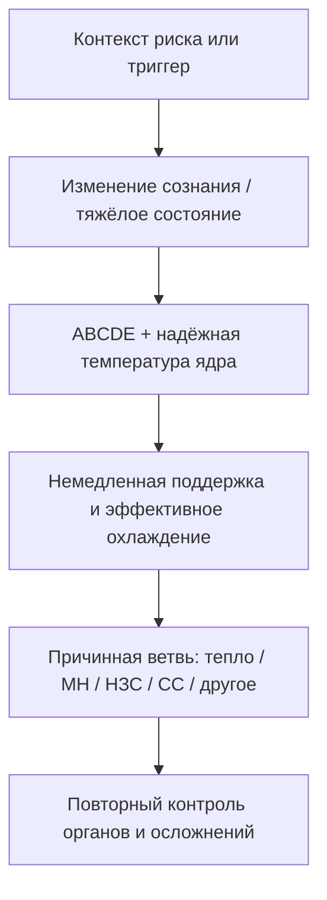

# Гипертермический синдром

> Иллюстрированное методическое пособие по распознаванию, дифференциальной
> диагностике, неотложной помощи и профилактике гипертермических состояний.

[](#оглавление)
[](assets/chapters)
[](#как-пользоваться-пособием)
[](ИСТОЧНИКИ.md)

Материал рассчитан на студентов старших курсов, ординаторов и врачей,
которым нужен последовательный маршрут от физиологии теплообмена до действий
при тепловом ударе, злокачественной гипертермии, нейролептическом злокачественном
и серотониновом синдромах.

> [!CAUTION]
> Это учебное пособие, а не локальный клинический протокол. При реальном
> пациенте действуют актуальные национальные и локальные рекомендации,
> привлекают токсиколога, анестезиолога-реаниматолога и профильных специалистов.
> Дозы всегда сверяют с действующей инструкцией, возрастом, массой тела,
> беременностью, функцией органов и условиями конкретного учреждения.

## Как пользоваться пособием

- **Первое чтение:** главы 1–4 дают общую модель терморегуляции и причин.
- **Клиническое ядро:** главы 5–9 ведут от симптомов к диагностике и лечению.
- **Закрепление:** главы 10–15 посвящены профилактике, исходам, особым группам,
  исследованиям, разбору случаев и контролю знаний.
- **Визуальная навигация:** в каждой главе есть две иллюстрации GPT Image 2,
  точные подписи и проверяемая Mermaid-схема для запоминания.
- **Один файл:** [`polnyy-tekst.md`](polnyy-tekst.md) автоматически собирается
  из тех же глав и не должен редактироваться вручную.

## Оглавление

| № | Глава | Основной вопрос |
|:--:|---|---|
| 1 | [Введение и определения](главы/01-vvedenie-i-opredeleniya.md) | Чем гипертермия отличается от лихорадки? |
| 2 | [Физиология терморегуляции](главы/02-fiziologiya-termoregulyacii.md) | Как организм производит и отдаёт тепло? |
| 3 | [Патофизиология](главы/03-patofiziologiya.md) | Как перегрев превращается в клеточное и органное повреждение? |
| 4 | [Этиология и классификация](главы/04-etiologiya-i-klassifikaciya.md) | Какие причины требуют разных немедленных действий? |
| 5 | [Клиническая картина](главы/05-klinicheskaya-kartina.md) | Какие признаки указывают на угрозу жизни? |
| 6 | [Диагностика](главы/06-diagnostika.md) | Что оценить и измерить в первые минуты? |
| 7 | [Дифференциальная диагностика](главы/07-differencialnaya-diagnostika.md) | Как различить ключевые синдромы, не задерживая помощь? |
| 8 | [Осложнения](главы/08-oslozhneniya.md) | Какие органы нужно контролировать повторно? |
| 9 | [Неотложная помощь и лечение](главы/09-neotlozhnaya-pomoshch-i-lechenie.md) | Как охлаждать и когда нужна специфическая терапия? |
| 10 | [Профилактика](главы/10-profilaktika.md) | Как снизить риск в жару, спорте и клинике? |
| 11 | [Прогноз и исходы](главы/11-prognoz-i-ishody.md) | От чего зависит восстановление? |
| 12 | [Особые категории пациентов](главы/12-osobennosti-u-kategoriy-pacientov.md) | Что меняется у детей, пожилых, беременных и спортсменов? |
| 13 | [Современные исследования](главы/13-sovremennye-issledovaniya.md) | Где заканчивается практика и начинается гипотеза? |
| 14 | [Клинические случаи](главы/14-klinicheskie-sluchai.md) | Как применять знания к сценариям? |
| 15 | [Контроль знаний и заключение](главы/15-kontrol-znaniy-i-zaklyuchenie.md) | Что необходимо вынести в практику? |

## Ключевой маршрут



## Доказательная база

Спорные утверждения проверены по рецензируемой литературе с помощью Scite,
а клинические алгоритмы — по первичным руководствам MHAUS, EMHG, CDC/NIOSH,
Wilderness Medical Society, FDA и профильным консенсусам. Список источников,
границы доказательности и дата аудита: [`ИСТОЧНИКИ.md`](ИСТОЧНИКИ.md).

## Локальная работа

```bash
git clone https://github.com/metalinjector/gipertermicheskiy-sindrom.git
cd gipertermicheskiy-sindrom
python3 scripts/build_full_text.py
python3 scripts/audit_markdown.py
```

Для внесения изменений используйте собственный GitHub-доступ. Не публикуйте
токены в README, URL удалённого репозитория, истории команд или коммитах.

## Устройство репозитория

```text
главы/              исходные главы — единственный источник полного текста
assets/chapters/    иллюстрации по две на каждую главу
scripts/            сборка полного текста и структурный аудит
polnyy-tekst.md     автоматически собранная версия
ИСТОЧНИКИ.md        доказательная база и границы применения
```

## Лицензирование и атрибуция

Перед распространением или печатью пособия добавьте выбранную авторами лицензию,
редакцию, рецензентов и библиографическое описание на титульную страницу.
