<!-- АВТОМАТИЧЕСКИ СОБРАНО scripts/build_full_text.py. НЕ РЕДАКТИРОВАТЬ ВРУЧНУЮ. -->

# ГИПЕРТЕРМИЧЕСКИЙ СИНДРОМ И ТЕПЛОВЫЕ ПОРАЖЕНИЯ
## Руководство и клиническая монография для врачей, ординаторов и исследователей

---

**Академический статус:** Исчерпывающее научно-практическое руководство и справочник по неотложной медицине, интенсивной терапии и педиатрии  
**Нормативно-клиническая база (обновление 2025/2026 гг.):**  
- *European Resuscitation Council (ERC) Guidelines 2025: Special Circumstances in Resuscitation (Hyperthermia & Heat Stroke)*  
- *World Health Organization (WHO) Prehospital Emergency Care: Clinical Protocols (2025/2026 Edition)*  
- *Australian and New Zealand Committee on Resuscitation (ANZCOR) Guideline 9.3.4: Heat Induced Illness*  
- *CDC / NIOSH / ACOEM: Prevention of Occupational Heat-Related Illnesses and Hyperthermia*  
- *Минздрав РФ / Союз педиатров России: Клинические рекомендации «Острая лихорадка и гипертермический синдром у детей»*  
- *Минздрав РФ / ЦОЗиМП: «Тепловой и солнечный удар: симптомы, первая помощь, профилактика»*

---

---

# Глава 1. Введение и определения

<!-- visual-summary:start -->

### Схема для запоминания

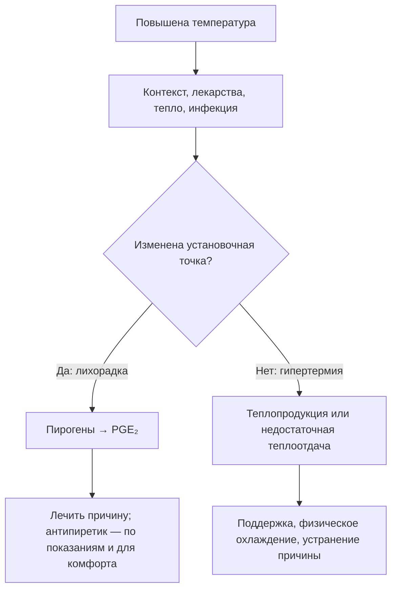

> [!IMPORTANT]
> Ответ на антипиретик не является надёжной диагностической пробой и не должен
> задерживать охлаждение при подозрении на опасную гипертермию.
<!-- visual-summary:end -->
## 1.1. Исторический аспект проблемы гипертермических состояний

Проблема повышенной температуры тела привлекала внимание врачей с древнейших времён, пройдя путь от мистических представлений до современного молекулярно-генетического понимания механизмов терморегуляции. Изучение истории этого вопроса помогает понять главное: различие между лихорадкой как защитной реакцией и гипертермией как патологическим срывом терморегуляции формировалось медленно, на протяжении более двух тысячелетий, и окончательно оформилось лишь во второй половине XX века.

### 1.1.1. Ранние представления: от Гиппократа до Галена

Понятие *febris* (лихорадка) было центральным в медицине со времён Гиппократа (ок. 460–370 гг. до н. э.). Основоположник клинической медицины рассматривал лихорадку не как самостоятельную болезнь, а как проявление борьбы организма с болезнью — своеобразный «очистительный огонь», механизм «сжигания» вредоносных веществ. Гиппократ связывал лихорадку с теорией четырёх гуморов (кровь, флегма, жёлтая и чёрная желчь), полагая, что повышение температуры отражает попытку организма восстановить баланс этих жидкостей. Это интуитивное понимание защитной роли лихорадки, хотя и основанное на ошибочных представлениях о физиологии, сохранялось тысячелетиями — и, как ни парадоксально, в своей сути оказалось верным.

Гален (129–200 гг. н. э.), древнегреческий врач, чьи труды доминировали в европейской медицине вплоть до эпохи Возрождения, развил гуморальную теорию и предложил кровопускание как основной метод лечения лихорадки. Сегодня мы понимаем, что этот подход был не просто бесполезным, но и прямо вредным, особенно при истинной гипертермии, где гиповолемия и без того является ключевым патогенетическим звеном. Тем не менее эти представления отражали первую систематическую попытку врачей понять механизмы развития гипертермии и найти способы её лечения.

### 1.1.2. Становление термометрии: Санторио, Вундерлих, Клод Бернар

Первый переход от субъективных ощущений («больной горячий») к объективным измерениям связан с именем итальянского врача и физиолога **Санторио Санторио** (Santorio Santorio, 1561–1636). В XVI–XVII веках, с развитием экспериментальной физиологии, он провёл первые систематические измерения температуры тела и разработал один из первых медицинских термометров, положив начало количественному изучению гипертермии.

Подлинная революция произошла во второй половине XIX века благодаря работам немецкого врача **Карла Рейнхольда Августа Вундерлиха** (Carl Reinhold August Wunderlich). В 1868 году он опубликовал монументальный труд *«Das Verhalten der Eigenwärme in Krankheiten»* («Поведение собственной температуры тела при болезнях»). Проанализировав более одного миллиона измерений температуры у 25 000 пациентов, Вундерлих установил норму человеческой температуры тела (37 °C, или 98,6 °F) и впервые систематизировал температурные кривые, что позволило объективно классифицировать болезни по характеру лихорадки. Он описал постоянную, ремиттирующую и интермиттирующую лихорадку — типы кривых, которые до сих пор используются в дифференциальной диагностике инфекционных заболеваний. Вундерлих показал, что температура тела — не случайный показатель, а строго регулируемый параметр, изменения которого отражают патологические процессы. Однако чёткого различия между лихорадкой как адаптивной реакцией и гипертермией как срывом регуляции он ещё не проводил.

> [!NOTE]
> **Знаменитые «37,0 °C» — исторический ориентир, а не физиологическая
> константа.** Средняя оральная температура взрослых сегодня ниже канонических
> 37 °C. Анализ трёх когорт общей численностью около 190 000 человек за 157 лет
> показал монотонное снижение примерно на 0,03 °C за каждое десятилетие рождения
> (Protsiv et al., *eLife* 2020; DOI 10.7554/eLife.49555). Нормальная температура
> зависит от места измерения, времени суток, возраста, фазы цикла и активности.
> Практический вывод: не следует трактовать 37,0 °C как жёсткий порог «нормы» —
> ни при оценке лихорадки, ни в определении установочной точки.

В тот же период французский физиолог **Клод Бернар** (Claude Bernard, 1813–1878) сформулировал фундаментальную концепцию «внутренней среды» (*milieu intérieur*) организма и показал, что температура тела поддерживается на постоянном уровне благодаря сложному балансу между теплопродукцией и теплоотдачей. Это было революционным сдвигом: впервые гипертермия рассматривалась не как мистическое явление, а как результат физиологического дисбаланса — количественно описываемого и в принципе управляемого.

### 1.1.3. Современная эра: открытие специфических синдромов

Осознание того, что не всякое повышение температуры является лихорадкой, пришло в XX веке с развитием фармакологии, анестезиологии и молекулярной биологии.

Важным шагом стало исследование механизмов регуляции капиллярного кровообращения, имеющее прямое отношение к пониманию процессов теплоотдачи: датский физиолог **Август Крог** (August Krogh) получил за него Нобелевскую премию по физиологии и медицине в 1920 году «за открытие механизма регуляции капилляров». Крог показал, что капилляры сужаются и расширяются пропорционально потребности ткани в кровотоке, — именно этот механизм лежит в основе вазомоторного компонента теплоотдачи.

Ключевые открытия специфических гипертермических синдромов пришлись на вторую половину XX века.

- **Злокачественная гипертермия** (Malignant Hyperthermia, MH). Поворотным событием стала публикация 1960 года в журнале *The Lancet*: **Майкл Денборо** (Michael Denborough) с соавторами описал случай в австралийской семье, где 10 из 24 родственников погибли во время наркоза (статья «Anaesthetic deaths in a family»). Это положило начало изучению MH как фармакогенетического заболевания — наследственной патологии, которая клинически проявляется только в ответ на приём определённых лекарств.
- **Нейролептический злокачественный синдром** (Neuroleptic Malignant Syndrome, NMS/НЗС). Вскоре после введения в практику первых нейролептиков (хлорпромазин, 1950-е годы) французские психиатры **Жан Деле** (Jean Delay) и **Пьер Деникер** (Pierre Deniker), описавшие сам антипсихотический эффект, столкнулись и с его редким, но смертельным осложнением. Термин НЗС был окончательно сформулирован в 1960-х годах для описания синдрома, характеризующегося мышечной ригидностью, гипертермией и вегетативной дисфункцией.
- **Тепловой удар.** Состояние было известно со времён римских легионов, однако его патофизиология и фундаментальное отличие от инфекционной лихорадки были систематически изучены лишь во время Второй мировой войны и последующих военных конфликтов (в частности, войны во Вьетнаме), а также в связи с развитием спортивной медицины.
- **Серотониновый синдром** был выделен как самостоятельная нозологическая единица позже, по мере широкого распространения серотонинергических антидепрессантов.

В конце XX века были идентифицированы гены, ответственные за развитие злокачественной гипертермии: в первую очередь ген рианодинового рецептора **RYR1** на 19-й хромосоме и ген кальциевого канала **CACNA1S** на 1-й хромосоме. Это позволило перейти от фенотипической диагностики (по симптомам и мышечной биопсии) к генотипической и открыло возможности молекулярной профилактики у членов семей пациентов с MH. В XXI веке развитие молекулярной биологии, протеомики и метаболомики позволило глубже понять патофизиологию всех форм гипертермического синдрома.

### 1.1.4. Эволюция подходов к диагностике и лечению

**Диагностика** прошла путь от клинического наблюдения к объективной
термометрии, затем к лабораторным маркерам и молекулярно-генетическому
тестированию. Сегодня эти уровни дополняют друг друга, а не заменяют клинический
контекст.

Ключевым прорывом в диагностике MH стала разработка **галотан-кофеинового контрактурного теста** (Caffeine-Halothane Contracture Test, CHCT). Метод сформировался в Торонто в работах группы У. Калоу и **Беверли А. Бритт** (Beverley A. Britt) — канадского анестезиолога и фармаколога: первое подробное описание кофеинового теста изолированной человеческой мышцы опубликовано ими в 1977 году (Kalow W., Britt B. A., Richter A., *Canadian Anaesthetists' Society Journal*), а к концу 1970-х — началу 1980-х годов тест был доведён до стандартизированного протокола. Требующий биопсии мышечной ткани, CHCT на десятилетия стал «золотым стандартом» диагностики предрасположенности к злокачественной гипертермии и сохраняет статус референсного метода до сих пор.

**Лечение** эволюционировало от откровенно деструктивного (кровопускание, ртуть — как предлагал Гален) к поддерживающему и механизм-ориентированному. Дантролен стал специфической терапией MH. При серотониновом синдроме и НЗС основой остаются отмена триггера и интенсивная поддержка; ципрогептадин, дофаминергические препараты, дантролен и ЭСТ применяют лишь в выбранных ситуациях, поскольку качество сравнительных данных ограничено.

Триумфом понимания патофизиологии стало внедрение **дантролена натрия**
(dantrolene sodium) — специфической терапии злокачественной гипертермии.
Внутривенная форма получила одобрение FDA в 1979 году; вместе с капнографией,
командными протоколами и улучшением интенсивной терапии дантролен резко снизил
смертность от MH.

Экстракорпоральные методы могут влиять на температуру, но ЭКМО или CRRT
начинают по самостоятельным показаниям — например, при рефрактерном шоке,
дыхательной или почечной недостаточности, — а не как стандартный следующий
метод охлаждения.

---

## 1.2. Определение гипертермического синдрома

### 1.2.1. Гипертермический синдром как патологическое состояние

**Гипертермический синдром (ГС)** — это неспецифический патологический синдром, представляющий собой критическое, жизнеугрожающее состояние, которое определяется как неконтролируемое повышение центральной температуры тела («температуры ядра») выше критических значений, возникающее вследствие срыва механизмов терморегуляции, когда скорость теплопродукции превышает способность организма к теплоотдаче.

Пороговые определения различаются. Практически значимы контекст, надёжность
измерения и органная дисфункция: при тепловой экспозиции изменение сознания
требует лечения как возможного теплового удара, даже если после начала
охлаждения температура уже ниже 40 °C. Риск повреждения растёт с тепловой дозой,
но 41–42 °C не являются универсальной границей необратимости.

Гипертермический синдром характеризуется:

- критическим повышением температуры тела (обычно > 39,5 °C, часто > 40–41 °C);
- дисфункцией центра терморегуляции в гипоталамусе либо неспособностью нормально работающего центра справиться с тепловой нагрузкой;
- срывом компенсаторных механизмов организма;
- полиорганными нарушениями вследствие прямого цитотоксического действия высокой температуры;
- высокой летальностью при отсутствии своевременного лечения.

**Ключевой момент:** гипертермический синдром — это не просто высокая цифра на термометре, а срыв механизмов терморегуляции, при котором организм теряет способность контролировать и снижать температуру тела.

### 1.2.2. Гипертермия как нарушение теплового баланса

В основе ГС лежит нарушение фундаментального уравнения теплового баланса организма. В норме организм поддерживает стабильную температуру, балансируя теплопродукцию и теплоотдачу:

$$\Delta E_{body} = (M - W) \pm K \pm C \pm R - E$$

где:

- **ΔE_body** — изменение запаса тепла в организме (в норме стремится к нулю);
- **M** — метаболическая теплопродукция;
- **W** — совершаемая внешняя работа;
- **K, C, R** — теплообмен с окружающей средой (кондукция, конвекция, радиация); эти члены двунаправленны и меняют знак, когда температура среды превышает температуру кожи;
- **E** — теплоотдача за счёт испарения (потоотделение, дыхание).

При гипертермии ΔE_body становится резко положительным. Это происходит по двум основным причинам или их комбинации.

**1. Резкое повышение теплопродукции (M).** Источники теплопродукции в норме: базальный метаболизм (основной источник тепла в покое), специфическое динамическое действие пищи (термический эффект пищи), мышечная активность (произвольная и непроизвольная), дрожательный термогенез (шиверинг) и недрожательный термогенез за счёт бурой жировой ткани, а также экзогенное поступление тепла. Патологические примеры: чрезмерная мышечная ригидность при злокачественной гипертермии и НЗС, неконтролируемый метаболизм при тиреотоксикозе, интенсивная физическая нагрузка (марафон, военные учения в полной выкладке).

**2. Катастрофическое снижение теплоотдачи (E, K, C, R).** В нормальных условиях покоя вклад путей теплоотдачи распределяется примерно так: радиация (излучение) — 40–45 %, конвекция — 30–35 %, испарение (пот, дыхание) — 20–25 %, кондукция (теплопроведение) — 3–5 %. Однако в жару эта иерархия переворачивается: как только температура среды приближается к температуре кожи и превышает её, радиация, конвекция и кондукция не только перестают отводить тепло, но и становятся каналами его притока, и единственным работающим механизмом остаётся испарение. Примеры блокады теплоотдачи: высокая температура в сочетании с высокой влажностью (блокируется E), ношение непроницаемой защитной одежды (блокируются E, C, R), приём антихолинергических препаратов с развитием ангидроза (блокируется E).

При злокачественной гипертермии оба механизма работают одновременно: мышечная ригидность резко повышает теплопродукцию и одновременно ухудшает условия теплоотдачи.

### 1.2.3. Синдром срыва регуляции: дисфункция «термостата»

Ключевое слово в определении ГС — «срыв» (поломка, перегрузка). Гипертермический синдром — это клинический синдром в строгом смысле слова: совокупность симптомов и признаков, объединённых общим патогенетическим механизмом — несостоятельностью терморегуляции.

Центр терморегуляции расположен в гипоталамусе, прежде всего в его преоптической области, и работает как «биологический термостат», удерживая температуру тела на уровне 36,5–37,5 °C. Он получает информацию от двух групп датчиков:

- **центральных терморецепторов** — в самом гипоталамусе, спинном мозге, внутренних органах и крупных сосудах;
- **периферических терморецепторов** — в коже и подкожной клетчатке.

При гипертермическом синдроме установочная точка (set-point) **не сдвигается** — она остаётся на уровне нормы (около 37 °C). Температура тела растёт вопреки попыткам гипоталамуса её снизить. Гипоталамус «видит» перегрев и запускает механизмы теплоотдачи на полную мощность — максимальную кожную вазодилатацию и потоотделение, — но эти попытки либо оказываются неэффективными (пот не испаряется при высокой влажности), либо сами механизмы сломаны (нет потоотделения на фоне атропина), либо истощаются со временем. Результатом становятся:

- потеря способности адекватно реагировать на рост температуры;
- неэффективность компенсаторных механизмов;
- неконтролируемое повышение температуры тела;
- развитие каскада патологических реакций.

Отдельно следует различать две ситуации, которые в клинике объединяются термином «гипертермический синдром»: перегрузку исправного центра (тепловой удар, злокачественная гипертермия) и первичное повреждение самого центра терморегуляции (центральная гипертермия при ЧМТ, инсульте, опухолях мозга). В первом случае «термостат» цел, но система исполнения не справляется; во втором — сломан сам «термостат». Лечебная тактика в обоих случаях строится на физическом охлаждении, но прогноз и обратимость различаются.

---

## 1.3. Отличие гипертермии от лихорадки (fever vs hyperthermia)

Это, без преувеличения, самый важный дифференциально-диагностический пункт всей темы. Ошибка на этом этапе неминуемо ведёт к неверной тактике лечения и может стоить пациенту жизни.

### 1.3.1. Мысленный эксперимент: аналогия с термостатом в доме

**Лихорадка (fever).** Вы находитесь в своём доме (тело) в прохладный день. Вы подходите к термостату (гипоталамус) и вручную выставляете желаемую температуру с 20 °C (норма) на 22 °C (новая установочная точка). Что делает дом? Немедленно включает котёл (теплопродукция: дрожь, вазоконстрикция), чтобы достичь новой, более высокой, *желаемой* температуры. Система работает штатно — просто по новой уставке.

**Гипертермия (hyperthermia).** Термостат по-прежнему стоит на 20 °C. Но либо в доме начался пожар (патологическая теплопродукция — злокачественная гипертермия), либо котёл сломался и не выключается (тиреотоксикоз), либо на улице +50 °C и сломался кондиционер (тепловой удар). Термостат «кричит», что в доме 25, 30, 40 °C, и изо всех сил пытается включить охлаждение (потоотделение), но система не справляется с нагрузкой или разрушена. Температура растёт **вопреки** уставке.

### 1.3.2. Лихорадка как защитно-приспособительная реакция

**Определение.** Лихорадка (лат. *febris*, англ. *fever*) — типовая, филогенетически выработанная защитно-приспособительная реакция организма, характеризующаяся контролируемым повышением температуры тела вследствие перестройки (сдвига вверх) установочной точки центра терморегуляции в гипоталамусе в ответ на действие пирогенов.

**Роль в иммунитете.** Лихорадка — не поломка, а адаптивный механизм, выработанный эволюцией для борьбы с инфекцией. Умеренное повышение температуры:

- угнетает рост и репликацию многих микроорганизмов, особенно вирусов (риновирусы, полиовирусы) и бактерий, оптимум которых лежит около 37 °C;
- усиливает фагоцитарную активность нейтрофилов и макрофагов;
- ускоряет пролиферацию и повышает активность T-лимфоцитов, в том числе цитотоксических;
- усиливает синтез антител B-лимфоцитами (оптимум при 38–39 °C);
- увеличивает продукцию противовирусных интерферонов.

Исследования показывают, что пациенты с умеренной лихорадкой нередко выздоравливают быстрее тех, у кого лихорадка была агрессивно подавлена антипиретиками. Это подтверждает её защитную роль и служит аргументом против рутинного «сбивания» умеренной температуры при инфекциях.

**Пирогены — вещества, вызывающие лихорадку.**

*Экзогенные пирогены* — компоненты микроорганизмов и их продукты: липополисахарид (ЛПС) грамотрицательных бактерий (классический пример), пептидогликаны грамположительных бактерий, вирусные белки, грибковые антигены, бактериальные токсины (например, токсин Шига).

*Эндогенные пирогены (цитокины)* высвобождаются иммунными клетками — макрофагами, моноцитами, дендритными клетками — в ответ на встречу с экзогенными пирогенами: интерлейкин-1 (IL-1) — основной эндогенный пироген, интерлейкин-6 (IL-6), фактор некроза опухоли-α (TNF-α), интерлейкин-8 (IL-8), интерферон-γ (IFN-γ).

**Механизм развития лихорадки — пошагово:**

1. Воздействие экзогенного пирогена (ЛПС, вирусный белок) на клетки иммунной системы через паттерн-распознающие рецепторы.
2. Активация макрофагов, моноцитов и дендритных клеток, развёртывание воспалительного ответа.
3. Синтез и выброс эндогенных пирогенов: IL-1, TNF-α, IL-6, IL-8.
4. Доставка цитокинов током крови к гипоталамусу — точнее, к его циркумвентрикулярным органам, лишённым гематоэнцефалического барьера.
5. Активация в преоптической области гипоталамуса фермента циклооксигеназы-2 (ЦОГ-2), преимущественно под действием IL-1.
6. Синтез простагландина E₂ (PGE₂) из арахидоновой кислоты.
7. Связывание PGE₂ с рецепторами EP3 на термочувствительных нейронах гипоталамуса и сдвиг установочной точки вверх (например, на 39 °C).
8. Гипоталамус начинает «считать» нормальные 37 °C холодом и активирует теплопродукцию (мышечная дрожь, озноб) и теплосбережение (периферическая вазоконстрикция — бледная, холодная, «гусиная» кожа в фазе подъёма). Пациент укрывается одеялом, пытаясь «согреться» до новой уставки.
9. Температура достигает нового установленного уровня, озноб прекращается.

Роли основных цитокинов различаются. **IL-1** — главный эндогенный пироген, синтезируется макрофагами, моноцитами и дендритными клетками, действует на гипоталамус через рецепторы IL-1R, стимулирует синтез PGE₂. **TNF-α** синтезируется активированными макрофагами, усиливает эффект IL-1 и участвует в системном воспалительном ответе. **IL-6** продуцируется макрофагами, фибробластами и эндотелиальными клетками, усиливает синтез острофазных белков в печени и выступает поздним медиатором лихорадочной реакции.

**Антипиретики действуют на пирогенный путь лихорадки.** Ибупрофен и другие НПВС, а также парацетамол уменьшают центральный синтез PGE₂ и снижают повышенную установочную точку. Эффект бывает неполным и зависит от времени, дозы, всасывания и причины лихорадки. Поэтому клинический ответ может поддержать гипотезу, но **не является диагностическим тестом** и не исключает опасную гипертермию.

### 1.3.3. Механизмы развития гипертермии

**Определение.** Гипертермия — неконтролируемое повышение температуры тела, при котором установочная точка гипоталамуса остаётся нормальной (около 37 °C), но механизмы терморегуляции не справляются с избыточной тепловой нагрузкой — вследствие дисфункции самого центра, неэффективности теплоотдачи или чрезмерной теплопродукции.

**Нарушение теплоотдачи** — ситуация, когда «кондиционер» сломан или перегружен. Механизмы: ангидроз (отсутствие потоотделения), парадоксальная вазоконстрикция периферических сосудов, нарушение периферического кровообращения, спазм кожных сосудов.

- *Пример 1 (тепловой удар).* Жаркий и влажный день. Температура среды выше температуры кожи, поэтому теплоотдача путём радиации, конвекции и кондукции невозможна — наоборот, тело получает тепло извне; высокая влажность блокирует испарение. Потовые железы работают на полную, но пот не испаряется, а просто стекает, не охлаждая.
- *Пример 2 (фармакологический).* Приём антихолинергических препаратов — атропина, трициклических антидепрессантов, некоторых антигистаминных и нейролептиков. Они блокируют мускариновые рецепторы потовых желёз; гипоталамус «кричит» о перегреве, но потоотделение физически не может включиться. Развивается «сухая», или «белая», гипертермия.

**Повышение теплопродукции** — ситуация, когда в доме «пожар» или «сломанный котёл». Механизмы: мышечная ригидность (неконтролируемое сокращение мышц), рост метаболической активности, неконтролируемый метаболизм мышечных клеток.

- *Пример 1 (физическая нагрузка).* Интенсивная работа мышц при марафоне или военных учениях генерирует огромное количество метаболического тепла. Если это происходит в жару, теплоотдача не успевает за теплопродукцией — развивается тепловой удар при нагрузке (exertional heat stroke).
- *Пример 2 (патологический).* Злокачественная гипертермия. Анестетик-триггер воздействует на генетически дефектный рианодиновый рецептор (RYR1) саркоплазматического ретикулума мышечной клетки. Происходит массивное, лавинообразное высвобождение Ca²⁺ в цитоплазму. Мышца впадает в ригидное сокращение; клетка тратит всю АТФ на попытки закачать Ca²⁺ обратно в депо. Этот неконтролируемый гиперметаболизм генерирует колоссальное количество тепла.

**Комбинация обоих факторов** — типичная ситуация для злокачественной гипертермии и НЗС, где повышенная теплопродукция сочетается с нарушенной теплоотдачей.

**При непирогенной гипертермии антипиретики не устраняют механизм перегрева.** Они не заменяют физическое охлаждение и устранение причины. Ненужные НПВС или парацетамол способны добавить почечный, печёночный или гемостатический риск, особенно при органной дисфункции, но степень риска зависит от конкретного препарата и пациента.

### 1.3.4. Сводное сравнение

| Параметр | Лихорадка (fever) | Гипертермия (hyperthermia) |
|---|---|---|
| Установочная точка (set-point) | Сдвинута вверх (например, на 39 °C) | Нормальная (около 37 °C) или центр повреждён |
| Механизм | Контролируемое повышение до новой точки | Неконтролируемое повышение вопреки точке |
| Озноб, дрожь | Есть в фазе подъёма (организм «считает» себя холодным) | Отсутствует либо представлен патологическим тремором или ригидностью |
| Потоотделение | Вариабельно; часто появляется при снижении точки | Может сохраняться, быть чрезмерным или отсутствовать — зависит от причины |
| Эффект антипиретиков (НПВС, парацетамол) | Возможен, но не является диагностической пробой | Не устраняет непирогенный механизм и не заменяет охлаждение |
| Физическое охлаждение | Субъективно неприятно пациенту, обычно не требуется | Необходимо, является основой лечения |
| Максимальная температура | Обычно < 40 °C | Часто > 40 °C |
| Скорость развития | Медленная (часы—дни) | Быстрая (минуты—часы) |
| Летальность | Низкая (сама по себе) | Высокая (10–80 % в зависимости от формы) |

### 1.3.5. Практический пример у постели больного

**Пациент с лихорадкой 39 °C.** Он ощущает озноб, дрожит, кутается в одеяло, просит согреть — потому что его «уставка» сдвинута на 39 °C, а текущая температура ещё ниже, и организм стремится «догреться». Кожа в фазе подъёма бледная, «мраморная», холодная на ощупь на периферии. Когда температура достигает 39 °C, озноб прекращается. Если дать парацетамол, установочная точка вернётся к 37 °C: пациент немедленно почувствует жар, сбросит одеяло, кожа покраснеет, начнётся обильное потоотделение.

**Пациент с гипертермией 41 °C (тепловой удар).** Озноба он не ощущает или ощущает минимально. Кожа горячая, может быть сухой (ангидроз) или парадоксально влажной, но потоотделение неэффективно. Пациент дезориентирован, возможны делирий, судороги, кома. Парацетамол не даст ничего — температура продолжит расти. Требуется немедленное агрессивное физическое охлаждение: лёд, холодные инфузионные растворы, обдувание, погружение в холодную воду.

---

## 1.4. Актуальность проблемы в современной клинической практике

Гипертермический синдром — не казуистика, а реальная угроза, с которой сталкиваются врачи множества специальностей.

### 1.4.1. Распространённость в различных областях медицины

**Реаниматология и интенсивная терапия.** Высокая температура в ОРИТ имеет
много причин: инфекцию, лекарственные реакции, повреждение ЦНС и средовой
перегрев. Единой достоверной доли «гипертермического синдрома среди всех
пациентов ОРИТ» нет из-за различий определений.

**Анестезиология.** Злокачественная гипертермия — редкое, но фатальное без лечения осложнение наркоза. Приводимые в исходных материалах оценки частоты различаются: от 1:10 000 – 1:15 000 анестезий до 1:50 000. Обе оценки укладываются в диапазон, который приводят современные обзоры MH, — от 1:5 000 до 1:100 000 и реже, в зависимости от популяции, возраста пациентов и методики учёта (клинические эпизоды регистрируются существенно реже, чем встречается генетическая предрасположенность, распространённость которой оценивается примерно в 1:2 000–1:3 000). Практический вывод от разброса цифр не зависит: готовность к MH в операционной должна быть стопроцентной, а дантролен — доступен везде, где проводится общая анестезия.

**Психиатрия и неврология.** НЗС редок, а его наблюдаемая частота зависит от
критериев, популяции и препаратов. Частоту серотонинового синдрома оценить ещё
сложнее из-за широкого спектра тяжести и неполного распознавания. Для практики
важнее знать триггеры и фенотип, чем переносить один процент между учреждениями.

**Педиатрия.** Дети крайне уязвимы к гипертермии из-за незрелости систем терморегуляции. Фебрильные судороги встречаются у 3–5 % детей в возрасте от 6 месяцев до 6 лет. Гипертермический синдром у детей раннего возраста способен быстро привести к полиорганной недостаточности.

**Спортивная медицина.** Тепловой удар при физической нагрузке — одна из ведущих причин внезапной смерти молодых здоровых спортсменов.

**Инфекционные болезни.** Инфекция часто вызывает лихорадку, но у пожилых,
иммунокомпрометированных и новорождённых возможна нормотермия или гипотермия.
Прогноз сепсиса определяется источником, шоком и органной дисфункцией, а не
одной цифрой температуры.

### 1.4.2. Эпидемиологические и социально-медицинские аспекты

**Глобальная статистика.** ВОЗ оценивает среднее число смертей, связанных с жарой, примерно в 489 000 в год за 2000–2019 годы. Это оценка всей связанной с жарой смертности, а не числа клинически подтверждённых тепловых ударов. Сопоставимые глобальные данные по заболеваемости тепловым ударом ограничены из-за различий определений и учёта.

**Глобальное потепление.** Частота и интенсивность волн жары (heat waves) неуклонно растёт. Аномальная жара в Европе в 2003 году привела к избыточной смертности, превысившей 70 000 человек, — в основном за счёт декомпенсации хронических заболеваний и классического теплового удара у пожилых.

**Младенцы в закрытых автомобилях.** Трагическая и полностью предотвратимая
причина фатальной гипертермии: салон быстро нагревается, а приоткрытое окно не
делает его безопасным.

**Волны жары и нагрузка на систему помощи.** По сводкам ВОЗ и материалам ERC
частота и интенсивность экстремальных тепловых событий растут, а вместе с ними —
число критических тепловых поражений, поступающих в скорую помощь и ОРИТ. Это
эпидемиологический, а не индивидуально-прогностический факт: он обосновывает
готовность службы (протоколы, оборудование для охлаждения, обучение), но не
позволяет предсказать исход у конкретного пациента.

**Региональные особенности.** Риск меняют климат, урбанизация, доступ к
охлаждению, характер труда, лекарства и качество учёта. Нельзя сводить страны с
жарким климатом только к классическому тепловому удару, а умеренный климат —
к лекарственным причинам.

**Социально-экономические аспекты.** ГС ведёт к значительным экономическим потерям — прямым затратам на интенсивное лечение и потере трудоспособности. Он требует специальной подготовки персонала и наличия оборудования (в первую очередь запаса дантролена и средств активного охлаждения). Профилактика — от информирования населения в период жары до протоколов предоперационного скрининга — способна существенно снизить эти затраты.

### 1.4.3. Группы риска

Гипертермический синдром может развиться у любого, однако существуют группы повышенного риска.

**Дети раннего возраста.**
- *Младенцы, особенно до 3 месяцев:* большее отношение поверхности тела к
  массе, зависимость от взрослых и высокий риск серьёзной инфекции. Ректальная
  температура 38,0 °C и выше требует срочной медицинской оценки; объём
  обследования определяется возрастом, видом ребёнка и протоколом.
- *Дети до 6 лет:* склонность к фебрильным судорогам (3–5 %) — формально это осложнение лихорадки, а не гипертермии, но оно отражает общую лабильность ЦНС; быстрое развитие дегидратации; высокий риск осложнений.

**Пожилые пациенты.** Снижена эффективность потоотделения и кожной вазодилатации; притуплено чувство жажды, что ведёт к скрытой дегидратации; высокая коморбидность (сердечная недостаточность, диабет, болезни почек); полипрагмазия с приёмом препаратов, нарушающих терморегуляцию (диуретики, бета-блокаторы, антихолинергические средства). Итог — сниженные адаптационные возможности и повышенный риск летального исхода.

**Пациенты с заболеваниями ЦНС.** Черепно-мозговая травма, инсульты, опухоли мозга, эпилепсия, болезнь Паркинсона (в том числе как фактор риска НЗС, особенно при резкой отмене дофаминергической терапии). Повышен риск нейрогенной, «центральной» гипертермии.

**Пациенты с сердечно-сосудистыми заболеваниями.** Сердечная недостаточность, кардиомиопатии, врождённые пороки сердца ограничивают способность увеличить сердечный выброс, необходимый для адекватной кожной вазодилатации, — то есть прямо подрывают главный механизм теплоотдачи.

**Пациенты с психическими расстройствами**, принимающие нейролептики и антидепрессанты, — как из-за фармакологического риска (НЗС, серотониновый синдром, антихолинергический ангидроз), так и из-за сниженной способности к самопомощи в жару.

**Пациенты с ожирением.** Жировая ткань — мощный теплоизолятор, резко затрудняющий теплоотдачу; кроме того, при ожирении выше теплопродукция при любой нагрузке.

**Пациенты с наследственными нарушениями.** Носители мутаций генов RYR1 и CACNA1S, предрасположенные к злокачественной гипертермии; пациенты с наследственными нарушениями обмена веществ. Эта группа требует генетического консультирования и семейного скрининга.

### 1.4.4. Потенциальная опасность: от цитотоксичности до полиорганной недостаточности

Необходимо понимать: гипертермия — не просто «высокая температура», а агрессивный цитотоксический агент. При температуре ядра выше 41–42 °C запускается каскад, быстро становящийся необратимым.

**Прямое клеточное повреждение:**
- денатурация белков — ферменты, структурные белки и рецепторы «сворачиваются» и перестают работать;
- повреждение мембран — повышается текучесть липидного бислоя, мембраны «текут», нарушаются проницаемость и работа ионных каналов;
- апоптоз и некроз клеток, в первую очередь нейронов головного мозга, гепатоцитов и клеток почечных канальцев.

**Системный каскад (цитокиновый шторм):** повреждённые клетки высвобождают медиаторы воспаления, запуская системный воспалительный ответ (SIRS), во многом идентичный тяжёлому сепсису; шторм усугубляет повреждение эндотелия сосудов и нарушает микроциркуляцию.

**Полиорганная недостаточность:**
- рабдомиолиз — массивный распад мышечной ткани (особенно при MH, НЗС, тепловом ударе);
- острая почечная недостаточность — миоглобин забивает почечные канальцы, к чему добавляется прямое ишемическое повреждение;
- ДВС-синдром вследствие повреждения эндотелия и массивного выброса тканевого фактора;
- отёк мозга и энцефалопатия — делирий, судороги, кома;
- острый респираторный дистресс-синдром (ОРДС) из-за повреждения лёгочных капилляров;
- печёночная недостаточность, кардиогенный шок;
- летальный исход.

Спектр осложнений удобно ранжировать по тяжести: **лёгкие** — головная боль, слабость, тошнота; **средней тяжести** — фебрильные судороги у детей, делирий, нарушение сознания; **тяжёлые** — отёк мозга, энцефалопатия, кома; **критические** — полиорганная недостаточность, ДВС-синдром, рабдомиолиз с ОПН, ОРДС, кардиогенный шок, смерть.

Обобщённая последовательность событий выглядит так:

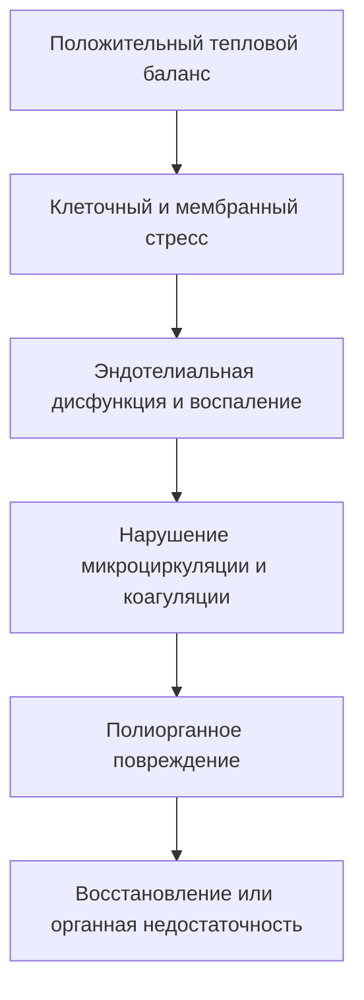

### 1.4.5. Клиническая значимость и сравнение риска

Опубликованная летальность несопоставима между периодами наблюдения,
определениями случая и популяциями: за прошедшие десятилетия менялись и
лечение, и распознавание. Поэтому единая таблица процентов создаёт ложную
точность.

| Состояние | Главные изменяемые факторы исхода |
|---|---|
| Тепловой удар | быстрое распознавание дисфункции ЦНС и эффективное охлаждение |
| Злокачественная гипертермия | прекращение триггера, 100 % O₂, ранний дантролен и командный протокол |
| Нейролептический злокачественный синдром | отмена триггера, контроль мышечной активности и органная поддержка |
| Серотониновый синдром | отмена триггера, бензодиазепины, контроль гипертермии и осложнений |
| Сепсис с высокой температурой | своевременная антимикробная терапия/контроль источника, гемодинамика и органы |

**Факторы, определяющие летальность:**

- максимальная достигнутая температура: выше 42 °C — крайне неблагоприятный прогноз;
- длительность гипертермии и задержка эффективного охлаждения;
- время до начала и скорость эффективного охлаждения: задержка повышает риск осложнений, но универсальной прибавки летальности «на каждый час» для всех форм не установлено;
- наличие осложнений: ДВС-синдром, рабдомиолиз, ОРДС;
- возраст: дети до 3 месяцев и пациенты старше 65 лет;
- сопутствующие заболевания.

**Гипотензия как маркёр тяжести.** В сводках по тепловому удару (в том числе в
материалах ERC) приводится ориентировочное различие: летальность около **10 %**
при тепловом ударе без артериальной гипотензии и до **примерно 33 %** при
сочетании гипертермии с гипотензией (систолическое АД < 90 мм рт. ст.). Эти
цифры взяты из наблюдательных данных и зависят от определения случая и
популяции, поэтому их не следует переносить на отдельного пациента как
индивидуальный прогноз. Клинически значим сам вывод: **гипотензия при тяжёлой
гипертермии — признак высокой тяжести**, требующий немедленной оценки шока и
параллельной поддержки перфузии, а не только продолжения охлаждения.

Практический вывод: тяжёлая гипертермия — неотложное состояние; отсутствие
универсального процента не оправдывает задержку.

---

## 1.5. Структура и цели курса

### 1.5.1. Обзор основных разделов

Материал построен по логике: норма, механизм нарушения, клинические следствия
и действия.

1. Введение и определения — сущность гипертермического синдрома и его отличие от лихорадки.
2. Физиология терморегуляции — фундамент: как система работает в норме.
3. Патофизиология ГС — что именно и как в ней ломается.
4. Этиология и классификация — виновники: от теплового удара до редких синдромов.
5. Клиническая картина — как это выглядит у постели больного.
6. Диагностика — инструменты подтверждения диагноза.
7. Дифференциальная диагностика — как отличить одно состояние от другого.
8. Осложнения — чем это грозит.
9. Неотложная помощь и лечение — главный практический раздел.
10. Профилактика — первичная и вторичная.
11. Прогноз и исходы.
12. Особенности у различных категорий пациентов — дети, пожилые, беременные.
13. Современные направления исследований.
14. Клинические случаи — разбор конкретных примеров.
15. Контроль знаний и заключение.

### 1.5.2. Образовательные задачи

**Знать:**
- определение гипертермического синдрома и его фундаментальное отличие от лихорадки;
- основные механизмы нормальной терморегуляции и точки их «поломки»;
- этиологию, классификацию и патофизиологию основных форм ГС;
- клинические проявления различных форм;
- методы диагностики и дифференциальной диагностики;
- осложнения гипертермического синдрома;
- принципы неотложной терапии, профилактики и прогнозирования.

**Уметь:**
- мгновенно дифференцировать лихорадку и гипертермию у постели больного;
- распознавать «большую четвёрку» гипертермических синдромов: тепловой удар, злокачественную гипертермию, НЗС и серотониновый синдром;
- проводить дифференциальную диагностику между этими состояниями;
- оказывать неотложную помощь, включая методы физического охлаждения;
- отличать доказанную специфическую терапию MH от вспомогательных препаратов с ограниченной доказательной базой при НЗС и серотониновом синдроме;
- приоритизировать действия: когда давать парацетамол (лихорадка), когда — лёд и дантролен (MH), а когда — лёд, бензодиазепины и отмену препаратов (НЗС, серотониновый синдром);
- применять дантролен при MH и обосновывать индивидуальный выбор вспомогательной терапии при других синдромах;
- мониторировать пациента с ГС и предотвращать осложнения.

**Владеть:**
- навыками клинического обследования пациента с подозрением на ГС;
- интерпретацией лабораторных и инструментальных данных;
- алгоритмами оказания неотложной помощи;
- методами физического охлаждения;
- навыками работы в команде при лечении пациента в критическом состоянии.

---

### 1.4.6. Современная эпидемиология и летальность (Данные ВОЗ и ERC 2025)
По данным Всемирной организации здравоохранения (ВОЗ) и Европейского совета по реанимации (ERC 2025), глобальные тепловые волны и климатические экстремумы сопровождаются резким ростом частоты критических тепловых поражений. 
- **Показатели летальности:** При тепловом ударе летальность составляет около **10%** в отсутствие гипотензии, однако при сочетании гипертермии с артериальной гипотензией смертность достигает **33%** [ERC 2025].
- **Критический температурный порог:** Устойчивое сохранение температуры ядра тела **> 40,5 °C** и задержка начала активного охлаждения **более чем на 30 минут** являются независимыми факторами развития полиорганной недостаточности (ОПН, рабдомиолиз, ДВС) и фатального исхода.

## Выводы по главе 1

**Ключевое различие.** Лихорадка (fever) — контролируемая, адаптивная реакция со сдвигом установочной точки гипоталамуса вверх, опосредованная PGE₂. Гипертермия (hyperthermia) — неконтролируемый патологический процесс срыва терморегуляции при нормальной (или повреждённой, но не сдвинутой сознательно) установочной точке, развивающийся вследствие дисбаланса между теплопродукцией и теплоотдачей.

**Практическое следствие.** Это различие определяет приоритеты. При лихорадке антипиретик может уменьшить дискомфорт, но лечение направляют на причину. При опасной непирогенной гипертермии основу составляют немедленная поддержка, эффективное физическое охлаждение и устранение триггера; при MH безотлагательно вводят дантролен.

**Значимость.** Гипертермический синдром — не симптом, а цитотоксический каскад, ведущий через денатурацию белков и системное воспаление к полиорганной недостаточности и смерти. Тяжесть форм различается принципиально: серотониновый синдром при адекватном лечении заканчивается летально редко, тогда как злокачественная гипертермия без лечения исторически убивала 70–80 % пациентов — и именно капнография, прекращение триггера и дантролен снизили этот показатель до единиц процентов. Сопоставлять цифры, полученные до и после появления такого лечения, а также при разных определениях случая, некорректно (см. § 1.4.5). Особенно уязвимы дети раннего возраста, пожилые, пациенты с патологией ЦНС и сердечно-сосудистой системы, с ожирением, психическими расстройствами и наследственной предрасположенностью. Актуальность проблемы растёт в связи с климатическими изменениями и широким применением психотропных препаратов.

**Переход.** Чтобы понять, как система терморегуляции ломается, необходимо сначала детально разобрать, как она работает в норме. Этому посвящена следующая глава.

---

# Глава 2. Физиология терморегуляции (рефрешер-курс)

<!-- visual-summary:start -->

### Схема для запоминания

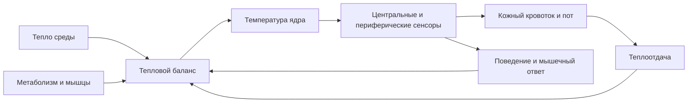
<!-- visual-summary:end -->
Для понимания патофизиологии гипертермического синдрома необходимо восстановить в памяти механизмы нормальной терморегуляции. Это не «базовый» материал, который можно пропустить: практически каждая форма ГС представляет собой поломку конкретного звена этой системы, и без знания исправной схемы невозможно понять, что именно и где именно вышло из строя.

## 2.1. Нормальная терморегуляция организма

Человек — **гомойотермный эндотерм**: мы поддерживаем постоянную температуру «ядра» (T_core) на уровне приблизительно 36,5–37,5 °C независимо от температуры окружающей среды (T_amb), за счёт внутренней генерации тепла. Эта стабильность критически важна для оптимальной работы ферментативных систем: белки функционируют в узком температурном коридоре, и выход за его пределы означает потерю каталитической активности.

Система терморегуляции — классическая система с обратной связью, состоящая из трёх компонентов:

1. **Сенсоры** — терморецепторы в центре и на периферии;
2. **Интегратор** — центральный контроллер в гипоталамусе;
3. **Эффекторы** — механизмы изменения теплопродукции и теплоотдачи.

### 2.1.1. Центральные механизмы

#### Роль гипоталамуса

Главный «термостат» и интеграционный центр — гипоталамус, небольшая структура массой около 4 граммов, расположенная под таламусом и над гипофизом. Несмотря на скромный размер, он контролирует множество жизненно важных функций: терморегуляцию, голод, жажду, сон, половое поведение, гормональную регуляцию.

Ключевая структура для терморегуляции — **преоптическая область** (Preoptic Area, POA) и передний гипоталамус. Именно POA содержит большинство термочувствительных нейронов:

- **медиальная преоптическая область (mPOA)** — преимущественно теплочувствительные нейроны;
- **латеральная преоптическая область (lPOA)** — преимущественно холодочувствительные нейроны.

Функции POA: интеграция информации о температуре, сравнение текущей температуры с установочной точкой, активация теплопродукции при её снижении и теплоотдачи при повышении.

#### Термочувствительные нейроны и «установочная точка»

В POA выделяют три типа нейронов, совместно формирующих «термостат»:

- **Теплочувствительные нейроны (W-SN, ~30 %)** — увеличивают частоту разрядов при повышении их собственной температуры, то есть температуры притекающей крови. Это первичные сенсоры T_core. Молекулярная основа чувствительности — каналы семейства TRPV.
- **Холодочувствительные нейроны (C-SN, ~10 %)** — увеличивают частоту разрядов при снижении температуры; в норме их активность подавлена тоническим тормозным влиянием W-SN. Связаны с каналами TRPM8.
- **Температурно-нечувствительные нейроны (T-insensitive, ~60 %)** — задают ту самую установочную точку (set-point) около 37 °C, с которой сравнивается текущая температура.

**Механизм работы термостата:**

- *Если T_core > 37 °C (перегрев).* Кровь, омывающая гипоталамус, нагревает W-SN, их активность растёт. Они активируют эфферентные пути теплоотдачи (потоотделение, кожная вазодилатация) и тормозят C-SN вместе с путями теплопродукции (дрожь, термогенез).
- *Если T_core < 37 °C (переохлаждение).* Активность W-SN падает, что растормаживает C-SN. Активируются пути теплопродукции (дрожь, недрожательный термогенез) и теплосбережения (вазоконстрикция кожи).

При лихорадке установочная точка смещается вверх (например, на 39 °C), и вся система начинает работать штатно, но относительно новой уставки. При гипертермии уставка остаётся прежней — меняется способность системы её удерживать.

#### Нейромедиаторные системы

Работа термостата модулируется несколькими нейромедиаторными системами, и это объясняет, почему препараты, влияющие на их баланс, способны вызвать жизнеугрожающие гипертермические синдромы.

- **Дофамин (DA).** Критически важен для терморегуляции. Блокада D₂-рецепторов в гипоталамусе и полосатом теле (приём нейролептиков) либо резкая отмена дофаминергической терапии нарушают способность гипоталамуса регулировать температуру и одновременно вызывают мышечную ригидность — патогенетическая основа нейролептического злокачественного синдрома.
- **Серотонин (5-HT).** Участвует в регуляции температуры; избыток серотонина в синапсах (антидепрессанты, ингибиторы МАО, трамадол) нарушает работу термостата и вызывает мышечный тремор — основа серотонинового синдрома.
- **Простагландины (PGE₂).** Медиатор сдвига установочной точки вверх при лихорадке; синтез стимулируется цитокинами IL-1 и TNF-α, ингибируется антипиретиками.
- **Прочие медиаторы:** норадреналин, ГАМК, глутамат — участвуют в модуляции терморегуляторных путей.

### 2.1.2. Периферические механизмы

#### Термочувствительные рецепторы

Гипоталамус получает информацию не только о температуре «ядра», но и о температуре «оболочки» и окружающей среды.

**Кожа** — основное место расположения периферических терморецепторов, измеряющих T_amb. Кожные рецепторы обеспечивают **антиципаторную (упреждающую) регуляцию**: при входе в холодную комнату кожа сигнализирует гипоталамусу о холоде ещё до того, как T_core успеет снизиться, и вазоконстрикция запускается превентивно.

- **Холодовые рецепторы:** в коже их примерно в 10 раз больше, чем тепловых; активируются при 10–35 °C с максимумом около 25 °C; молекулярная основа — каналы TRPM8.
- **Тепловые рецепторы:** активируются при 30–45 °C с максимумом около 40 °C; каналы семейства TRPV (TRPV1–TRPV4).

**TRP-каналы (Transient Receptor Potential)** — молекулярная основа термочувствительности, и два примера объясняют бытовые ощущения:
- *TRPV1 (ванилоидный)* активируется при T > 43 °C, а также капсаицином — поэтому жгучий перец ощущается «горячим»;
- *TRPM8 (ментоловый)* активируется при T < 25 °C, а также ментолом — поэтому мята ощущается «холодной».

**Другие локализации терморецепторов:** слизистые оболочки (рот, нос, пищевод), внутренние органы (печень, почки, спинной мозг), крупные кровеносные сосуды — все они постоянно мониторят T_core.

#### Афферентные и эфферентные пути

**Афферентные (восходящие).** Сигналы от периферических и центральных терморецепторов идут по **спиноталамическому тракту** в гипоталамус (для рефлекторных ответов) и в соматосенсорную кору (где формируется осознанное ощущение температуры). Информация от кожи передаётся спинальными нервами, от внутренних органов — в том числе блуждающим нервом (CN X).

**Эфферентные (нисходящие).** Гипоталамус посылает команды через:
- **соматическую нервную систему** — к скелетным мышцам (произвольная активность и непроизвольная дрожь);
- **вегетативную нервную систему** — к сосудам кожи (вазоконстрикция/вазодилатация), потовым железам, бурой жировой ткани, а также к мышцам, поднимающим волос (пилоэрекция); симпатический отдел здесь основной, парасимпатический играет вспомогательную роль;
- **эндокринную систему** — оси «гипоталамус — гипофиз — щитовидная железа» (контроль метаболизма) и «гипоталамус — гипофиз — надпочечники» (адреналин, кортизол).

---

## 2.2. Механизмы теплопродукции (термогенез)

Тепло — неизбежный побочный продукт метаболизма (экзергонических реакций). Организм генерирует его непрерывно.

### 2.2.1. Базальный метаболизм

**Базальный метаболизм (Basal Metabolic Rate, BMR)** — расход энергии в состоянии полного покоя на поддержание жизненно важных функций: дыхание, кровообращение, синтез белков. Это «холостой ход» организма; тепло выделяется при работе внутренних органов (печень, мозг, сердце — самые «горячие») и поддержании ионных градиентов, прежде всего непрерывной работой Na⁺/K⁺-АТФазы.

*Источники тепла:* окисление углеводов, жиров и белков; синтез АТФ; принципиальная неполнота сопряжения окислительного фосфорилирования — часть энергии всегда рассеивается в виде тепла.

*Вклад:* в полном покое базальный метаболизм обеспечивает около 60–70 % общей теплопродукции; остальные 30–40 % дают мышечная активность и прочие механизмы.

*Регуляция и факторы влияния:* тиреоидные гормоны (Т3/Т4) и катехоламины (адреналин, норадреналин) действуют как «педаль газа» клеточного метаболизма — именно здесь ключ к пониманию гипертермии при тиреотоксическом кризе и феохромоцитоме. На BMR также влияют возраст (снижается с годами), пол (у мужчин выше), масса тела и кортизол.

### 2.2.2. Специфическое динамическое действие пищи

**Специфическое динамическое действие пищи (SDA), или термический эффект пищи (TEF)** — прирост расхода энергии после еды, связанный с перевариванием, абсорбцией, синтезом белков из аминокислот и активацией симпатической нервной системы.

Вклад в общую теплопродукцию — около 10 %, и он резко зависит от состава пищи: белки — 20–30 % от их калорийности уходит в тепло, углеводы — 5–10 %, жиры — 0–3 %.

### 2.2.3. Мышечная активность

Самый мощный и наиболее регулируемый источник тепла.

**Произвольная мышечная активность.** КПД мышечного сокращения составляет всего ~20–25 %; остальные 75–80 % энергии АТФ рассеиваются в виде тепла. При интенсивной физической нагрузке мышцы могут обеспечивать до 90 % общей теплопродукции. У элитного марафонца теплопродукция возрастает в 15–20 раз по сравнению с BMR — этого достаточно, чтобы «вскипятить» тело за 30–40 минут, если бы не работала теплоотдача. Даже при обычном беге температура работающих мышц повышается на 1–2 °C.

**Шиверинг (дрожательный термогенез).** Непроизвольное, быстрое, ритмичное сокращение скелетных мышц с частотой порядка 10–20 сокращений в секунду. Запускается из заднего гипоталамуса в ответ на сигнал «холодно» (низкая T_core или T_skin): гипоталамус активирует моторные нейроны спинного мозга, при этом полезная механическая работа отсутствует и практически вся энергия переходит в тепло. Способ эффективный, но энергозатратный, увеличивающий теплопродукцию в 2–5 раз.

**Нешиверинговый термогенез (НШТ)** — генерация тепла без мышечных сокращений.
- *Источник:* бурая жировая ткань (brown adipose tissue, BAT), богатая митохондриями и капиллярами; у новорождённых располагается между лопатками и вокруг почек.
- *Механизм:* норадреналин из симпатических окончаний действует на β3-адренорецепторы адипоцитов, активируя липазу; триглицериды расщепляются, жирные кислоты окисляются в митохондриях. Уникальный белок **термогенин (UCP1, Uncoupling Protein 1)** «разобщает» окислительное фосфорилирование, создавая протонную «дырку» во внутренней мембране митохондрий: протоны обходят АТФ-синтазу, и вся энергия протонного градиента рассеивается в виде тепла вместо синтеза АТФ.
- *Значение по возрастам:* у новорождённых и младенцев НШТ — основной механизм теплопродукции на холоде, поскольку эффективно дрожать они не могут; именно поэтому новорождённые так чувствительны к охлаждению. У взрослых вклад меньше, но сохраняется и возрастает при хронической адаптации к холоду.
- *Токсикологическая параллель:* синтетические разобщители, прежде всего **2,4-динитрофенол (DNP)**, нелегально применяемый для «сжигания жира», вызывают тот же эффект во всех клетках организма, а не только в буром жире, приводя к неконтролируемому гиперметаболизму и фатальной гипертермии.

**Мышечная ригидность и тремор — патологическая теплопродукция.** Ригидность представляет собой стойко повышенный мышечный тонус, при котором мышцы напряжены даже в покое; постоянное напряжение требует непрерывного расхода АТФ и генерирует тепло. Классические примеры — «свинцовая» ригидность при НЗС и генерализованная ригидность при злокачественной гипертермии. Тремор — ритмичные непроизвольные движения — также даёт значительную теплопродукцию и характерен для серотонинового синдрома и гипертиреоза.

**Неконтролируемый метаболизм мышечных клеток.** При MH триггерные
ингаляционные анестетики или сукцинилхолин запускают патологическое
высвобождение Ca²⁺ из саркоплазматического ретикулума, стойкую мышечную
активацию, расход АТФ и резкий гиперметаболизм. Температура может расти быстро,
но нередко повышается позже, чем EtCO₂, ацидоз и ригидность.

### 2.2.4. Экзогенные источники тепла

Не следует забывать и о тепле, поступающем извне. При нахождении в горячей среде (сауна, жаркая погода, горячий цех) и при T_amb > T_skin тело не отдаёт, а **поглощает** тепло путём радиации, конвекции и кондукции. Физическая нагрузка формально относится к эндогенной теплопродукции, но её триггер и условия часто внешние — сочетание нагрузки с жарой является самым опасным.

---

## 2.3. Механизмы теплоотдачи

Организм должен эффективно сбрасывать излишки метаболического тепла. Существует четыре физических пути и два регуляторных механизма.

### 2.3.1. Физические механизмы

**Радиация (излучение).** Передача тепла инфракрасным электромагнитным излучением; излучают все объекты с температурой выше абсолютного нуля. Если T_skin > T_amb — тело теряет тепло; если T_amb > T_skin (например, на солнце) — получает. Оценки вклада в покое при комфортной температуре в источниках различаются: 40–45 % по одним данным, до 60 % по другим; итоговый диапазон разумно принять как 40–60 % в зависимости от условий измерения и одежды.

**Конвекция.** Потеря тепла при движении воздуха или воды у поверхности тела: нагретый у кожи слой уходит, его место занимает холодный. Вклад в норме — около 30–35 %, но он сильно зависит от скорости движения среды. Ветер (wind chill) резко увеличивает конвекцию; вода обладает теплопроводностью примерно в 25 раз выше воздуха, поэтому погружение в холодную воду ведёт к быстрой потере тепла — свойство, которое клинически используется при активном охлаждении.

**Кондукция (теплопроведение).** Прямая передача тепла при контакте с более холодным объектом за счёт передачи молекулярных колебаний. В обычных условиях вклад невелик — 3–5 %, зависит от площади контакта и теплопроводности материала.

**Испарение.** Единственный эффективный механизм теплоотдачи, когда T_amb > T_skin. Фазовый переход воды в пар требует энергии — скрытая теплота парообразования составляет около 0,58 ккал на 1 г воды, то есть примерно 580 ккал на литр; эта энергия забирается у кожи, охлаждая её. Вклад в норме — 20–25 %, но при высокой температуре среды он возрастает до 80–90 %, а при T_amb выше температуры тела становится единственным работающим механизмом.
- *Источники:* неощутимые потери (испарение при дыхании, трансэпидермальная диффузия воды через кожу) и ощутимые потери (потоотделение).
- *Критическое ограничение:* эффективность испарения снижается при высокой
  влажности, слабом движении воздуха и непроницаемой одежде. Стекающий пот
  почти не отдаёт скрытую теплоту испарения, поэтому видимое потоотделение не
  гарантирует достаточного охлаждения.

### 2.3.2. Вазомоторная регуляция

Главный механизм управления теплоотдачей через радиацию, конвекцию и кондукцию: тело использует кожу как радиатор с регулируемым потоком теплоносителя.

**Вазодилатация.** При перегреве по сигналу гипоталамуса снижается симпатический тонус периферических артериол, открываются артериовенозные анастомозы, кровь устремляется к поверхности кожи. Кожа краснеет и становится горячей, градиент температуры между кожей и средой растёт, теплоотдача максимизируется. Кожный кровоток при этом способен увеличиться в 10–20 раз.

**Вазоконстрикция.** При переохлаждении растёт симпатический тонус: норадреналин действует на α-адренорецепторы гладких мышц артериол, сосуды кожи сужаются, кровь шунтируется в «ядро», а теплоотдача уменьшается. При тяжёлом перегреве бледные, мраморные или холодные конечности чаще означают гипоперфузию, шок, действие лекарств или индивидуальную сосудистую реакцию. Это важный признак тяжести, но не отдельный общепринятый тип гипертермии и не основание откладывать охлаждение при тепловом ударе.

### 2.3.3. Потоотделение

**Типы потовых желёз.**
- *Эккриновые* — 2–4 миллиона желёз по всему телу, выделяют водянистый пот, активируются при повышении температуры тела; именно они обеспечивают терморегуляторное потоотделение.
- *Апокриновые* — сосредоточены в подмышечных впадинах, паховой области, на лице; выделяют вязкий пот с белками и липидами; активируются при эмоциональном стрессе и физической нагрузке, в терморегуляции существенной роли не играют.

**Механизм активации.** Гипоталамус в ответ на рост T_core активирует симпатические нейроны, иннервирующие эккриновые железы. Это уникальный случай в вегетативной нервной системе: волокна симпатические, но медиатором служит **ацетилхолин**, действующий на **мускариновые рецепторы** желёз, а не норадреналин, как в сосудах.

**Клиническое значение этой особенности исключительно велико:** именно она объясняет, почему антихолинергические (атропиноподобные) препараты вызывают гипертермию — они блокируют потоотделение на уровне рецептора, вызывая ангидроз при полностью сохранном центральном сигнале.

**Состав пота:** вода (~99 %), электролиты (натрий, калий, хлориды, магний), мочевина, молочная кислота, следовые количества белков. Пот гипотоничен по отношению к плазме — важное обстоятельство, объясняющее развитие гипернатриемии при массивных потерях.

**Производительность и пределы.** При интенсивной нагрузке выделение 1–2 литров пота в час является нормой, что теоретически соответствует отводу 580–1160 ккал тепла в час. Но повторим главное: **пот не охлаждает, если он не испаряется**. Без испарения обильное потоотделение — лишь путь к дегидратации и электролитным потерям, а не к охлаждению.

---

## 2.4. Клиническое следствие: что именно мы измеряем термометром

Из физиологии «ядра» и «оболочки» вытекает практическое правило: клинические
решения при подозрении на гипертермический синдром принимают по **температуре
ядра (core body temperature)**, а не по температуре поверхности.

**Почему аксиллярная и кожная термометрия ненадёжна.** Подмышечная впадина, лоб и
кожа отражают температуру оболочки. При периферической вазоконстрикции —
централизации кровообращения, шоке, действии лекарств — они могут показывать
ложно нормальные или даже сниженные цифры, тогда как температура внутренних
органов критически высока. Потоотделение, движение воздуха и активное охлаждение
искажают результат дополнительно.

**Методы, отражающие температуру ядра:**

1. **Ректальная термометрия** — метод выбора при подозрении на тепловой удар на
   догоспитальном этапе и в приёмном отделении, в том числе при нагрузочной
   форме; глубину введения и фиксацию определяют устройство и локальный протокол.
2. **Пищеводный датчик** — предпочтителен у интубированного пациента в
   операционной и ОРИТ при корректном положении датчика.
3. **Термодатчик мочевого катетера** — удобен для непрерывного мониторинга в
   интенсивной терапии, но может запаздывать при низком диурезе и быстром
   изменении температуры.
4. **Контактная тимпаническая термометрия** — приемлема только при правильной
   технике и **не равнозначна** бытовому инфракрасному «ушному» термометру.

Подробный разбор выбора метода, ловушек измерения и мониторинга приведён в
§ 6.2.1 и § 6.7.

---

## Выводы по главе 2

**Интегративная система.** Терморегуляция — многоуровневая система с обратной связью, управляемая из преоптической области гипоталамуса, где ~30 % теплочувствительных, ~10 % холодочувствительных и ~60 % температурно-нечувствительных нейронов совместно формируют «термостат» с уставкой около 37 °C. В норме она удерживает температуру тела в диапазоне 36,5–37,5 °C.

**Два рычага управления.** Теплопродукция (базальный метаболизм 60–70 %, термический эффект пищи ~10 %, мышечная активность вплоть до 90 % при нагрузке, шиверинг, НШТ) и теплоотдача (радиация 40–60 %, конвекция 30–35 %, испарение 20–25 % в покое и до 80–90 % в жару, кондукция 3–5 %), регулируемые вазомоторным тонусом и потоотделением.

**Ключевые точки уязвимости**, которые станут центральными в следующих главах:
- **гипоталамус** — работа зависит от тонкого баланса дофамина и серотонина, отсюда НЗС и серотониновый синдром;
- **мышцы** — мощный физиологический источник тепла и потенциальная «тепловая бомба» при MH и НЗС;
- **разобщение окислительного фосфорилирования (UCP1)** — физиологический
  механизм НШТ и одновременно мишень для химических разобщителей (DNP,
  токсические дозы салицилатов). Тиреотоксикоз повышает теплопродукцию иначе —
  через общий рост метаболизма, оборота ионных насосов и субстратных циклов, а
  не через прямое UCP1-подобное разобщение во всех клетках;
- **потоотделение** — зависит от ацетилхолина (уязвимость к антихолинергикам) и от влажности воздуха (внешний, непреодолимый физический лимит).

**Переход.** Зная, как работает эта машина в исправном состоянии, мы готовы разобрать её поломки. Что именно происходит, когда баланс нарушается, — тема следующей главы.

---

# Глава 3. Патофизиология гипертермического синдрома

<!-- visual-summary:start -->

### Схема для запоминания

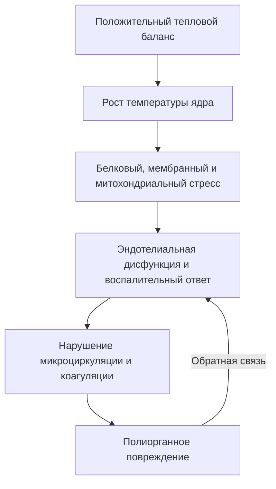
<!-- visual-summary:end -->
Патофизиологическая суть ГС — **положительный тепловой баланс (ΔE_body ≫ 0)**, который система терморегуляции не может скомпенсировать. Это реализуется по двум основным сценариям, которые часто сочетаются и усиливают друг друга: внутренний «пожар» (гиперпродукция тепла) и «сломанный радиатор» (срыв теплоотдачи). К ним примыкает третий, самостоятельный вариант — «сломанный термостат», то есть первичное повреждение центра терморегуляции.

## 3.1. Нарушение баланса теплопродукции и теплоотдачи

### 3.1.1. Повышение теплопродукции («внутренний пожар»)

#### Мышечная ригидность и неконтролируемый метаболизм

Наиболее драматичный механизм, лежащий в основе самых «злокачественных» форм ГС, когда тело само генерирует несовместимое с жизнью количество тепла.

**Механизм на примере злокачественной гипертермии (MH):**

1. Триггер — ингаляционный анестетик или сукцинилхолин — попадает в организм пациента с мутацией рианодинового рецептора (RYR1) в саркоплазматическом ретикулуме (СР) мышечной клетки.
2. RYR1 — канал, высвобождающий Ca²⁺ для сокращения. Дефектный рецептор «заклинивает» в открытом состоянии.
3. Происходит массивное, лавинообразное высвобождение Ca²⁺ в цитоплазму.
4. Избыток Ca²⁺ вызывает стойкое непрекращающееся сокращение — **контрактуру**.
   Это принципиально не тетанус: тетанус представляет собой нормальный ответ на
   частую нервную стимуляцию, реализуется через нервно-мышечный синапс и
   прекращается вместе со стимуляцией. Контрактура при MH возникает внутри самой
   мышечной клетки и не зависит от нервного импульса, поэтому недеполяризующие
   миорелаксанты, действующие на синапс, патологический выброс Ca²⁺ не
   останавливают. Их применяют как вспомогательное средство для интубации и
   контроля тонуса, но **проверять ими диагноз нельзя**: MH не подтверждается и
   не исключается ответом на миорелаксант, а прекращение триггера и введение
   дантролена начинают по клиническим признакам, не дожидаясь никаких проб.
5. Клетка пытается выжить и активирует все Ca²⁺-АТФазы (насосы SERCA), чтобы закачать Ca²⁺ обратно в СР.
6. Этот процесс требует колоссального количества АТФ.
7. Для ресинтеза АТФ митохондрии переходят в режим максимального аэробного метаболизма: поглощается весь доступный O₂ (гипоксемия) и выделяется огромное количество CO₂ — **тяжёлая гиперкапния, которая часто становится самым первым признаком катастрофы**, опережая рост температуры.
8. Тепло — побочный продукт этого гиперметаболизма. Температура способна расти очень быстро, но её скорость непостоянна; гипертермия при MH нередко является поздним признаком по сравнению с ростом EtCO₂, ацидозом и ригидностью.

**Нейролептический злокачественный синдром (НЗС).** Механизм менее ясен, но считается, что блокада D₂-дофаминовых рецепторов в ЦНС (базальные ганглии, гипоталамус) приводит к дизрегуляции мышечного тонуса — экстрапирамидной «свинцовой» ригидности — и вегетативной дисфункции, что раскручивает гиперметаболизм. Стойкое тоническое напряжение мышц требует непрерывного расхода АТФ и генерирует тепло.

**Серотониновый синдром (СС).** Избыток серотонина в ЦНС и на периферии вызывает мышечную гиперактивность: миоклонус, гиперрефлексию, тремор, умеренную ригидность. Ритмичные непроизвольные сокращения сами по себе служат мощным источником тепла.

#### Повышение общей метаболической активности

- **Тиреотоксический криз.** Избыток тиреоидных гормонов резко повышает общий
  обмен: растут потребление кислорода, митохондриальный биогенез и активность,
  оборот Na⁺/K⁺-АТФазы и Ca²⁺-АТФазы (SERCA), субстратные («холостые») циклы и
  чувствительность тканей к катехоламинам. Часть энергии этих процессов
  неизбежно рассеивается в виде тепла. Ключевые «холостые» механизмы — утечка
  ионов с усиленной работой Na⁺/K⁺-АТФазы и SERCA, а также субстратные циклы
  (гликолиз/глюконеогенез, липолиз/липогенез, оборот белка).

  Распространённую формулировку «тиреоидные гормоны действуют подобно UCP1»
  следует считать неточной. Тиреоидные гормоны действительно регулируют
  экспрессию UCP1 и работают синергично с симпатической стимуляцией бурого жира,
  однако прирост теплопродукции при системном тиреотоксикозе в значительной мере
  **UCP1-независим**, а сама динамика UCP1 и активности бурого жира вариабельна и
  зависит от контекста. Главное отличие сохраняется: это не прямое химическое
  разобщение окислительного фосфорилирования во всех клетках — такой механизм
  остаётся за DNP и токсическими дозами салицилатов.
- **Феохромоцитома.** Избыток катехоламинов резко ускоряет основной обмен.
- **Отравления.** Прямое химическое разобщение окислительного фосфорилирования: 2,4-динитрофенол (DNP), токсические дозы салицилатов.

### 3.1.2. Снижение теплоотдачи («сломанный радиатор»)

#### Ангидроз

Испарение пота — главный механизм охлаждения в жару, и его «выключение» фатально.

- *Классический тепловой удар.* У пожилых, истощённых пациентов на фоне дегидратации и перегрева механизм потоотделения истощается или ломается на центральном уровне. Кожа становится горячей и сухой — классический, хотя и не обязательный, признак крайне неблагоприятного течения.
- *Антихолинергический синдром.* Атропин, трициклические антидепрессанты, антигистаминные препараты 1-го поколения, ряд нейролептиков фармакологически блокируют M-холинорецепторы потовых желёз. Тело «хочет» потеть, но физически не может.

#### Нарушение периферического кровообращения (исторически — «белая» гипертермия)

При шоке симпатическая активация и норадреналин вызывают периферическую
вазоконстрикцию через α-адренорецепторы. Это признак нарушенной перфузии, а не
самостоятельный «тип» гипертермии.

*Патофизиология:* кожа-«радиатор» выключается, кровь не поступает на периферию, тепло не сбрасывается, развивается централизация кровообращения.

*Клинический парадокс:* T_core (ректальная) растёт выше 40 °C, а кожа конечностей, носа и ушей парадоксально бледная, «мраморная» и холодная на ощупь. Это признак тяжести и нарушенной перфузии, который требует немедленной оценки и лечения шока.

> [!CAUTION]
> Из этого механизма **не следует**, что охлаждение нужно отложить до «снятия
> спазма». При подозрении на тепловой удар эффективное охлаждение и поддержку
> перфузии проводят параллельно; спазмолитики (дротаверин, папаверин),
> растирание и согревание конечностей не входят в доказательные алгоритмы
> теплового удара (см. § 4.3.5, § 7.2 и § 9.4). Отдельная национальная
> педиатрическая практика при «белой» **лихорадке инфекционного генеза**
> разобрана в § 12.1.6 и на непирогенную гипертермию не распространяется.

*Последствия:* снижение теплоотдачи, ишемия периферических тканей, вплоть до некроза и — в крайних случаях — гангрены.

#### Внешние факторы

- **Высокая влажность** — блокирует испарение (E).
- **Высокая T_amb (> 37 °C)** — блокирует радиацию, конвекцию и кондукцию и превращает их в каналы притока тепла.
- **Непроницаемая одежда** — костюмы химзащиты, военная амуниция, спортивная экипировка — создаёт жаркий влажный микроклимат и резко ограничивает испарение.

### 3.1.3. Обобщённая схема патогенеза

Триггер увеличивает теплопродукцию и/или ограничивает теплоотдачу. Дальнейшую
связь между тепловым балансом, клеточным стрессом, микроциркуляцией и органным
повреждением показывает Mermaid-схема в начале главы.

---

## 3.2. Нарушение центральной терморегуляции («сломанный термостат»)

Ситуации, когда поломка происходит в самом центре управления.

**Прямое повреждение гипоталамуса:** черепно-мозговая травма, инсульт (особенно в бассейне передней мозговой артерии), субарахноидальное кровоизлияние, опухоль (в частности краниофарингиома), энцефалит, менингит. Повреждение нейронов POA приводит к утрате контроля над эфферентными путями; развивается **«центральная», или нейрогенная, гипертермия**, часто рефрактерная к любому лечению, кроме агрессивного физического охлаждения.

**Нейромедиаторный дисбаланс:** блокада дофаминовых рецепторов (НЗС), избыток серотонина (СС), нарушение синтеза нейромедиаторов — всё это расстраивает тонкую настройку нейронов «термостата».

**Воспаление гипоталамуса** при менингите и энцефалите нарушает его функцию непосредственно.

**Варианты расстройства уставки.** Возможны три сценария: чрезмерный и неконтролируемый сдвиг установочной точки вверх (при инфекционных состояниях, пограничных с лихорадкой); полная потеря контроля над установочной точкой при тяжёлой гипертермии; нарушение восприятия текущей температуры, когда гипоталамус перестаёт адекватно «видеть» перегрев и не активирует теплоотдачу.

**Нарушение окислительного фосфорилирования в ЦНС.** Высокая температура денатурирует ферменты дыхательной цепи в митохондриях нейронов; нарушается целостность внутренней мембраны митохондрий, протоны «утекают», градиент падает, синтез АТФ снижается. Нейроны теряют способность поддерживать ионные градиенты, что ведёт к их дисфункции, активации апоптоза и гибели — «центральный хаос» усугубляется.

---

## 3.3. Каскад патологических реакций: эффект домино

Ядро патофизиологии: **избыточное тепло способно повреждать ткани напрямую**. Риск резко возрастает по мере увеличения температуры и длительности воздействия, но универсального порога, после которого повреждение обязательно и необратимо у каждого пациента, не существует.

**Как описывают порог современные сводки.** В обзорах и руководствах (в том числе
в материалах ERC и CDC) устойчивая температура ядра порядка **40,5 °C и выше**
приводится как зона, в которой денатурация белков и эндотелиальное повреждение
становятся клинически значимыми, а вероятность полиорганного поражения быстро
растёт. Эту цифру корректно понимать как ориентир высокого риска, а не как
момент, после которого повреждение у каждого пациента обязательно и необратимо:
индивидуальная переносимость, точность измерения и длительность экспозиции
различаются. Типичная последовательность органного поражения при тяжёлом
перегреве выглядит так:

> тепловая цитотоксичность → системная активация эндотелия и коагуляции (ДВС) →
> рабдомиолиз с разрушением сарколеммы миоцитов → обструкция почечных канальцев
> миоглобином и ОПП, параллельно — центрилобулярное повреждение печени.

Практический вывод: значение имеет не преодоление конкретной цифры, а суммарная
тепловая доза, поэтому снижение температуры до безопасного диапазона начинают
без ожидания лабораторного подтверждения.

### 3.3.1. Цитотоксичность и клеточные повреждения

#### Денатурация белков

*Аналогия:* яичный белок на горячей сковороде необратимо меняет структуру — «сворачивается».

*Механизм:* трёхмерная структура белка поддерживается водородными связями, ионными и гидрофобными взаимодействиями, дисульфидными мостиками. При нагревании молекулы получают избыточную энергию, слабые связи рвутся, белок разворачивается и теряет функцию. Большинство белков начинают денатурировать при 40–45 °C, причём порог у разных белков различается; критическая граница для клинически значимых процессов — около 41 °C.

*Что страдает:* ферменты (останавливаются метаболические процессы), структурные белки и белки цитоскелета (нарушается форма и целостность клетки), рецепторы, ионные каналы и насосы мембран (нарушается проницаемость и ионный транспорт).

*Результат:* клеточный метаболизм останавливается, клетка погибает.

#### Повреждение клеточных мембран

При высокой температуре липиды мембран становятся «слишком жидкими» — повышается текучесть бислоя. Мембрана теряет структурную целостность, становится «дырявой»: исчезают ионные градиенты Na⁺, K⁺, Ca²⁺, нарушается работа встроенных белков. Особенно уязвимы **эндотелиальные клетки сосудов** — и это определяет системный характер катастрофы.

#### Перекисное окисление липидов и окислительный стресс

Гипертермия и гиперметаболизм запускают массовое производство активных форм кислорода (АФК). Причины: нарушение окислительного фосфорилирования, при котором электроны «утекают» из дыхательной цепи и образуют супероксид-анион (O₂⁻), и одновременное снижение активности антиоксидантных ферментов — супероксиддисмутазы, каталазы, глутатионпероксидазы.

*Механизм ПОЛ:* гидроксильный радикал атакует ненасыщенные жирные кислоты,
возникают липидные радикалы и пероксиды. Их распад создаёт реактивные продукты,
а цепная реакция распространяется на соседние молекулы.

*Последствия:* рост проницаемости мембран, нарушение мембранных белков,
повреждение ДНК и активация гибели клеток. Воспаление и активные формы кислорода
взаимно усиливают повреждение.

#### Нарушение проницаемости сосудов: синдром утечки

Прямое термическое повреждение в сочетании с медиаторами воспаления (гистамин, брадикинин, лейкотриены, цитокины) разрушает эндотелиальный барьер и межклеточные плотные контакты (tight junctions), прежде всего в капиллярах.

*Результат:* **синдром «протекающей» капиллярной стенки (Capillary Leak Syndrome)** — плазма, альбумин и вода массивно уходят из сосудов в интерстиций.

*Двойной удар:* внутри сосудов — гиповолемия и гипотензия; вне сосудов — массивный интерстициальный отёк, прежде всего отёк лёгких и отёк мозга.

### 3.3.2. Активация системного воспалительного ответа

#### Цитокиновый шторм

*Механизм:* массовая гибель клеток по механизму некроза высвобождает **DAMPs** (Damage-Associated Molecular Patterns) — «сигналы опасности» из внутриклеточного пространства. Врождённый иммунитет реагирует на них так же, как на инвазию патогена: макрофаги, моноциты и дендритные клетки выбрасывают провоспалительные цитокины, каждый из которых активирует новые клетки, — развивается каскадное, самоусиливающееся высвобождение медиаторов.

*Ключевые медиаторы:* IL-1 (основной пироген, активирует воспаление), TNF-α (активирует воспаление, способен вызвать шок), IL-6 (стимулирует синтез острофазных белков), IL-8 (привлекает нейтрофилы в ткани), IFN-γ (активирует макрофаги).

*Результат:* системный воспалительный и эндотелиальный ответ может напоминать
сепсис, активировать коагуляцию, нарушать микроциркуляцию и способствовать шоку
и полиорганному повреждению. Сходство не отменяет параллельного поиска инфекции.

### 3.3.3. Нарушения гемодинамики и микроциркуляции

**Фаза 1 — компенсация (гипердинамическая).** Гипоталамус запускает максимальную кожную вазодилатацию и тахикардию. Сердечный выброс резко растёт, периферическое сосудистое сопротивление падает. Кожа горячая, красная, влажная. В старой литературе эту картину называли «красной» гипертермией.

**Фаза 2 — декомпенсация (шок).** На фоне дегидратации от потоотделения и синдрома утечки объём циркулирующей крови катастрофически падает. Развивается шок — гиповолемический, распределительный или их сочетание; сердечный выброс и артериальное давление снижаются, кожа бледнеет и холодеет («белая» гипертермия старых классификаций).

> [!NOTE]
> Термины «красная» и «белая» гипертермия описывают **две гемодинамические фазы
> одного процесса**, а не два самостоятельных заболевания с противоположным
> лечением. Переход к «белой» картине означает шок и требует поддержки перфузии
> **одновременно** с продолжающимся охлаждением (§ 4.3.5).

**Централизация кровообращения.** В ответ на шок вегетативная нервная система запускает компенсаторную вазоконстрикцию в «неприоритетных» бассейнах — кожа, почки, кишечник, мышцы — чтобы сохранить перфузию мозга и сердца. Ценой становится дальнейшая блокада теплоотдачи (переход в «белую» гипертермию) и усугубление ишемии органов. Это один из ключевых порочных кругов ГС.

**Расстройства микроциркуляции.** Воспаление, повреждение эндотелия и стаз крови приводят к замедлению кровотока в капиллярах, агрегации («сладжированию») эритроцитов, активации коагуляции и микротромбозам. Итог — тканевая гипоксия при формально сохранном сердечном выбросе.

### 3.3.4. Водно-электролитный баланс и КОС

**Дегидратация и гиповолемия.** Потоотделение до 1–2 л/час при тепловом ударе быстро приводит к потере воды и электролитов. Дополнительные пути потерь: испарение при тахипноэ, диарея (характерна для серотонинового синдрома). Следствия — гиповолемия, гипотензия, шок, преренальное повреждение почек, нарушение функции мозга.

**Натрий может изменяться в обе стороны.** Гипернатриемия возможна при потере свободной воды, а гипонатриемия — при избыточном питье гипотонической жидкости или значительных потерях натрия. Поэтому состав и скорость жидкости определяют по клинической картине и повторным анализам, а не по одному предполагаемому механизму.

**Гипокалиемия** (K⁺ < 3,5 мЭкв/л) обусловлена потерями калия с потом, его перемещением внутрь клеток и почечными потерями. Проявляется аритмиями, мышечной слабостью, нарушением функции почек.

**Парадокс — гиперкалиемия** (K⁺ > 5,5 мЭкв/л). При массивном рабдомиолизе калий выходит из миллионов разрушенных мышечных клеток, а поражённые почки не могут его вывести. Развивается жизнеугрожающая гиперкалиемия с опасными аритмиями вплоть до фибрилляции желудочков, мышечной слабостью и параличами. Клинически важно: на разных этапах одного и того же случая ГС возможны противоположные калиевые нарушения, поэтому калий требует повторного контроля.

**Кислотно-основное состояние.**
- *Ранняя фаза:* респираторный алкалоз — тахипноэ «вымывает» CO₂.
- *Поздняя фаза:* тяжёлый, обычно смешанный метаболический ацидоз. Компоненты: лактат-ацидоз (гиперметаболизм при MH и гипоперфузия при шоке вынуждают ткани перейти на анаэробный гликолиз); кетоацидоз вследствие истощения гликогена; почечный компонент — ишемизированные почки не выводят H⁺ и не регенерируют бикарбонат; накопление мочевой и фосфорной кислот.
- *Последствия ацидоза:* угнетение ферментных систем, аритмии, энцефалопатия, дальнейшее ухудшение функции почек, снижение чувствительности сосудов к катехоламинам.

### 3.3.5. Система гемостаза

**Механизм — классическая триада Вирхова:** повреждение эндотелия (термическое и цитокиновое), стаз крови (шок и гиповолемия), гиперкоагуляция (выброс DAMPs и тканевого фактора).

**Результат — ДВС-синдром**, протекающий в две фазы:
- *Фаза гиперкоагуляции:* по всему организму в микроциркуляции образуются тысячи микротромбов, «забивающих» почки, лёгкие, мозг, что ведёт к ишемии органов.
- *Фаза гипокоагуляции (потребления):* факторы свёртывания и тромбоциты израсходованы на тромбообразование, параллельно активируется фибринолиз с образованием продуктов деградации фибрина. Кровь перестаёт сворачиваться, начинается фатальное кровотечение — из мест инъекций, ЖКТ, слизистых, в ткани.

Дополнительный вклад вносит печёночная недостаточность: печень перестаёт синтезировать факторы свёртывания.

### 3.3.6. Полиорганная дисфункция и поражение органов-мишеней

#### Центральная нервная система

*Причины:* прямая термическая цитотоксичность для нейронов (особенно уязвимы клетки Пуркинье мозжечка — отсюда частая стойкая атаксия у выживших); отёк мозга; ишемия из-за шока и микротромбозов; воспаление с локальной продукцией цитокинов; нарушение синтеза и высвобождения нейромедиаторов.

*Отёк мозга* развивается по трём механизмам: цитотоксический (отказ ионных насосов, вода входит в клетки, клетки набухают), вазогенный (повреждение ГЭБ, выход жидкости из сосудов в ткань) и интерстициальный. Последствия — рост внутричерепного давления, ухудшение мозгового кровотока, вторичная ишемия, дислокация структур мозга, смерть.

*Клиническая динамика энцефалопатии* вариабельна: возможны возбуждение,
делирий, атаксия, сонливость, судороги и кома. Эти признаки не обязаны
возникать в фиксированной последовательности. Судороги могут быть связаны с
гипоксией, электролитными нарушениями и поражением ЦНС.

#### Сердечно-сосудистая система

*Причины:* прямое повреждение миокарда с денатурацией белков; электролитные нарушения, прежде всего гиперкалиемия; ишемия миокарда на фоне шока и запредельной тахикардии; воспалительное поражение (миокардит); резкий рост потребности миокарда в кислороде в гипердинамическую фазу.

*Проявления:* тахикардия (> 100 уд/мин) как самый ранний признак; артериальная гипотензия — при «красной» гипертермии за счёт вазодилатации и падения периферического сопротивления, при «белой» и в фазе шока за счёт падения сердечного выброса; аритмии — синусовая тахикардия, фибрилляция предсердий, желудочковые нарушения ритма вплоть до фибрилляции желудочков; острая сердечная недостаточность с одышкой, отёком лёгких и падением выброса.

*Типы шока при ГС:* распределительный (вазодилатация, «красная» фаза), гиповолемический (потери с потом, диареей, утечка в интерстиций), кардиогенный (прямое повреждение миокарда). На практике шок обычно смешанный.

#### Дыхательная система

*Тахипноэ* (> 20 в минуту) возникает как компенсация: активация дыхательного центра гипоксией, ацидозом и симпатической стимуляцией. Приводит к гипервентиляции, вымыванию CO₂ и раннему респираторному алкалозу, а затем — к утомлению дыхательной мускулатуры.

*Отёк лёгких* — сначала некардиогенный (синдром утечки в альвеолах, повреждение эндотелия лёгочных капилляров), затем к нему может присоединиться кардиогенный (рост давления в лёгочных капиллярах при сердечной недостаточности). Проявления: одышка, кашель, пенистая мокрота, хрипы, гипоксемия.

*ОРДС* формируется вследствие повреждения альвеолярного эпителия и эндотелия
капилляров, воспаления и микроциркуляторных нарушений. Клиника: острая
гипоксемическая дыхательная недостаточность, двусторонние затемнения и снижение
растяжимости лёгких. Тяжёлые формы требуют протективной ИВЛ; прогноз зависит от
тяжести ОРДС и основного заболевания.

#### Почки

*Рабдомиолиз* — разрушение мышечной ткани вследствие прямого термического повреждения миоцитов, длительной ригидности и нарушения клеточного метаболизма. В кровь выходят миоглобин, калий, фосфаты, креатинфосфокиназа (КФК), актин и миозин.

*Миоглобинурия:* миоглобин может окрашивать мочу в тёмно-бурый цвет, однако этот признак непостоянен и неспецифичен. Рабдомиолиз подтверждают по клинике, КФК, электролитам, функции почек и анализу мочи; отрицательная визуальная оценка мочи его не исключает.

*Механизмы ОПП при рабдомиолизе:*
- **преренальный** — шок и гиповолемия (функциональная почечная недостаточность: активация РААС, вазоконстрикция почечных сосудов, падение СКФ; потенциально обратима при восстановлении перфузии);
- **ренальный (внутрипочечный)** — острый тубулярный некроз от ишемии и
  термического повреждения, прямое токсическое действие миоглобина,
  окислительный стресс, внутрипочечная вазоконстрикция и **внутриканальцевая
  преципитация миоглобина с образованием цилиндров**.

> [!NOTE]
> Обструкцию **внутри** почечных канальцев относят к внутрипочечному, а не к
> постренальному механизму. Термин «постренальное ОПП» зарезервирован за
> нарушением оттока мочи ниже почки — на уровне мочеточника, мочевого пузыря или
> уретры. При рабдомиолизе такой обструкции нет.

*Проявления:* олигурия (< 400 мл/сут) или анурия, рост креатинина и мочевины, гиперкалиемия, метаболический ацидоз, отёки. Часто требуется заместительная почечная терапия; возможен исход в хроническую болезнь почек.

#### Печень

Печень — «горячий» метаболический орган, крайне чувствительный и к гипоперфузии, и к прямому термическому повреждению; добавляются локальное воспаление и нарушение микроциркуляции. Проявления: резкий цитолитический скачок АСТ и АЛТ (при тяжёлом тепловом ударе нередко > 10 000 Ед/л), рост билирубина и желтуха, снижение синтеза альбумина и факторов свёртывания с коагулопатией, гипогликемия, нарушение детоксикации, печёночная энцефалопатия, асцит. В тяжёлых случаях развивается острая печёночная недостаточность, при которой может обсуждаться трансплантация.

#### Желудочно-кишечный тракт

Ишемия кишечной стенки на фоне централизации кровообращения ведёт к повреждению слизистой, кровотечениям, в тяжёлых случаях — к перфорации, а также к транслокации кишечной флоры, что дополнительно подпитывает системное воспаление.

#### Синдром полиорганной недостаточности

СПОН — одновременное нарушение функции двух и более органов — становится непосредственной причиной смерти большинства пациентов с ГС. Типично поражаются мозг, сердце, лёгкие, почки, печень, ЖКТ и система гемостаза.

Прогноз при СПОН ухудшается с числом и тяжестью органных дисфункций, возрастом, причиной синдрома и задержкой эффективного лечения. Универсальная прибавка летальности «за каждый орган» неприменима к разным популяциям и шкалам.

---

## 3.4. Компенсаторные реакции организма

Организм отчаянно пытается спастись, и понимание этих реакций важно, поскольку каждая из них имеет цену.

**Учащение дыхания.** Попытка увеличить оксигенацию, «выдохнуть» тепло и компенсировать метаболический ацидоз. Плата: респираторный алкалоз в ранней фазе, дополнительные потери воды, быстрое утомление дыхательной мускулатуры.

**Усиление потоотделения.** Главный механизм теплоотдачи, когда температура
среды приближается к температуре кожи. Плата — потеря жидкости и натрия.
Высокая влажность, непроницаемая одежда и отсутствие движения воздуха снижают
испарение, но не образуют единой «точки невозврата».

**Кожная вазодилатация.** Максимизирует теплоотдачу, но снижает периферическое сопротивление и вносит вклад в гипотензию, а при развитии шока сменяется контрпродуктивной вазоконстрикцией.

**Клеточный ответ: белки теплового шока (Heat Shock Proteins, HSP).** Синтезируются в ответ на тепловой стресс и пытаются «починить» (рефолдировать) денатурированные белки, а также защитить клетку от апоптоза. Параллельно активируются антиоксидантные системы. Однако при истинном ГС этот механизм быстро перегружается, и защита сменяется управляемой гибелью клеток.

**Переход на анаэробный гликолиз.** Отчаянная попытка клетки получить энергию без кислорода в условиях шока и гиперметаболизма; ценой становится усугубление лактат-ацидоза.

## Выводы по главе 3

**Два пути к катастрофе.** ГС запускается либо «тепловой бомбой» (гиперпродукция тепла, как при MH), либо «сломанным радиатором» (срыв теплоотдачи, как при тепловом ударе), либо их комбинацией; отдельным вариантом стоит «сломанный термостат» — первичное повреждение гипоталамуса.

**Тепло как токсин.** Ключевая идея главы — прямая цитотоксичность гипертермии. При T_core > 41–42 °C белки денатурируют, мембраны «текут», клетки гибнут.

**Патофизиологический каскад.** Клеточный и эндотелиальный стресс, воспаление,
гипоперфузия, коагулопатия и рабдомиолиз могут взаимно усиливаться и приводить
к полиорганной недостаточности. Схема в начале главы показывает эти связи без
ложной линейности.

**Ключевые патофизиологические механизмы**, которые нужно удерживать в голове у постели больного: цитотоксичность (денатурация, повреждение мембран, окислительный стресс), воспаление (цитокиновый шторм), гемодинамика (шок, микротромбозы, централизация), метаболизм (ацидоз, электролитные расстройства, дегидратация), коагулопатия (ДВС), полиорганная дисфункция.

**Значимость.** Понимание каскада диктует срочность лечения: мы боремся не с «цифрой на градуснике», а с растущей тепловой дозой и системным повреждением. Чем выше температура и дольше воздействие, тем больше риск; поэтому при опасной непирогенной гипертермии физическое охлаждение начинают немедленно и не подменяют антипиретиками.

**Переход.** Мы увидели, *как* развивается ГС. Теперь необходимо систематизировать, *почему* он начинается: какие конкретные болезни, лекарства и ситуации запускают этот каскад.

---

# Глава 4. Этиология и классификация гипертермических состояний

<!-- visual-summary:start -->

### Схема для запоминания

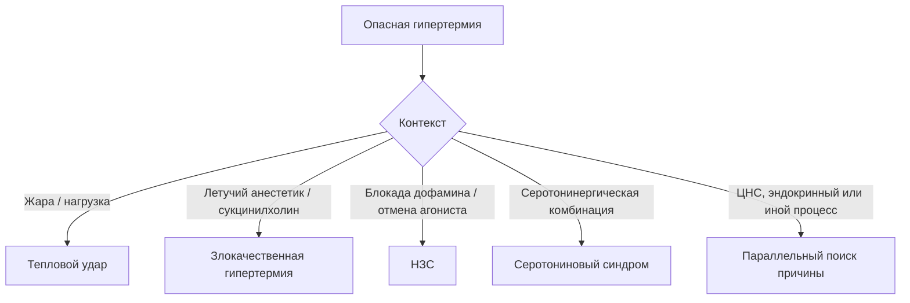
<!-- visual-summary:end -->
Мы рассмотрели норму и поломку. Теперь нужно научиться узнавать врага в лицо. Это «детективная» часть курса: увидев пациента с T > 40 °C, врач должен немедленно запустить алгоритм, начинающийся с вопроса «**почему?**». Ответ на него — этиология — полностью определяет тактику, потому что для нескольких форм ГС существует специфический антидот, а для остальных единственным работающим средством остаётся охлаждение.

Все причины условно делятся на две большие группы: жар приходит **извне** (экзогенные причины) или рождается **внутри** (эндогенные).

## 4.1. Экзогенные (внешние) причины

Здесь первопричина — высокая температура окружающей среды, с которой система теплоотдачи не справляется.

### 4.1.1. Воздействие высокой температуры окружающей среды

Общий термин для ситуаций, когда T_amb высока: «волна жары», работа в горячем цеху, раскалённый автомобиль, помещение без вентиляции и кондиционирования, пустынный климат.

*Механизм:* при T_amb выше температуры тела организм не может отдавать тепло радиацией и конвекцией — остаётся только испарение; при T_amb выше ~35 °C в сочетании с высокой влажностью и испарение становится неэффективным, и температура тела начинает расти.

*Факторы риска:* T_amb > 35 °C, высокая влажность, отсутствие вентиляции, отсутствие доступа к воде, физическая активность, крайние возрасты, сопутствующие заболевания.

### 4.1.2. Тепловой удар (heat stroke)

Клинический синдром, развивающийся в результате перегрева и характеризующийся
дисфункцией ЦНС — от спутанности до комы — обычно при высокой температуре ядра.
После начатого охлаждения температура может быть ниже 40 °C. Различают два
основных клинических контекста.

**Классический (non-exertional) тепловой удар.**
- *Механизм:* пассивная гипертермия — система теплоотдачи перегружена длительным воздействием жары и высокой влажности, блокирующей испарение.
- *Группы риска:* классическая жертва — пожилой пациент старше 65 лет, живущий один в городской квартире без кондиционера во время волны жары; также младенцы, оставленные в машине или душном помещении, лица с хроническими заболеваниями.
- *Особенности:* часто развивается в течение часов или дней жары. Кожа может
  быть сухой или влажной; потоотделение не исключает диагноз.

**Тепловой удар при физическом напряжении (exertional heat stroke).**
- *Механизм:* фатальное сочетание внешней жары и колоссальной внутренней теплопродукции работающих мышц.
- *Группы риска:* молодые здоровые люди — марафонцы, футболисты, солдаты в полной выкладке на марше, пожарные, рабочие горячих цехов.
- *Особенности:* развивается очень быстро, иногда за 30–60 минут интенсивной нагрузки. **Потоотделение часто сохранено и даже профузно** — и это ловушка для врача, ожидающего «сухую кожу»: в условиях жары, влажности и непроницаемой экипировки пот просто не испаряется. Пациенты буквально «варятся» в собственном тепле. Характерны тяжелейший рабдомиолиз и острая почечная недостаточность.

*Клинические проявления обоих типов:* T > 40 °C, нарушение сознания (спутанность, делирий, кома), судороги, гиперемия или бледность кожи, тахикардия, гипотензия, тахипноэ.

### 4.1.3. Солнечный удар (инсоляция)

«Солнечный удар» — бытовой и исторический термин для тепловой болезни после прямой инсоляции. Надёжных оснований выделять отдельный механизм «локального перегрева мозговых оболочек» нет: пациента оценивают по общей тепловой нагрузке, температуре ядра, гидратации и, главное, функции ЦНС. При изменении сознания состояние ведут как возможный тепловой удар независимо от того, была ли голова покрыта.

*Симптомы:* доминируют церебральные проявления — резкая головная боль, головокружение, тошнота, рвота, менингеальные знаки, быстрая потеря сознания, судороги — на фоне общего перегрева.

### 4.1.4. Ятрогенные экзогенные факторы

- **Чрезмерное укутывание младенцев.** Избыточная одежда, высокая температура
  помещения и отсутствие возможности изменить среду повышают риск перегрева;
  точную влажность внутри одежды по внешнему виду определить нельзя.
- **Неправильное использование согревающих устройств** — электрических одеял, тепловых ламп, согревающих матрасов у пациента с уже повышенной температурой.
- **Небезопасная организация охлаждения.** Риск создают задержка начала, отсутствие контроля дыхательных путей и температуры ядра, недостаточная площадь охлаждения или прекращение слишком поздно. При тепловом ударе на нагрузке погружение в холодную воду, напротив, является предпочтительным быстрым методом при правильно организованном наблюдении.

---

## 4.2. Эндогенные (патологические) причины

Здесь пожар начинается внутри организма — из-за болезни или химического вещества, даже при нормальной температуре среды.

### 4.2.1. Фармакологически индуцированные синдромы

Одна из важнейших и сложнейших групп для дифференциальной диагностики.

#### Злокачественная гипертермия (Malignant Hyperthermia, MH)

*Природа.* Редкое, но высоколетальное фармакогенетическое заболевание. Оценки частоты: 1:15 000 педиатрических и 1:50 000 взрослых анестезий по одним источникам, 1:10 000 – 1:15 000 анестезий по другим (см. обсуждение расхождения в § 1.4.1).

*Генетика.* Предрасположенность чаще наследуется аутосомно-доминантно с неполной и вариабельной пенетрантностью. По GeneReviews патогенные варианты выявляют в **RYR1** примерно у 60–70 % лиц с подтверждённой предрасположенностью, в **CACNA1S** — примерно у 1 %, в **STAC3** — менее чем у 1 %. Отрицательная генетическая панель не исключает предрасположенность; референсным фенотипическим методом остаётся контрактурный тест.

*Механизм.* Гиперметаболический криз в скелетной мышце связан с нарушением кальциевой регуляции (подробно разобран в главе 3). Температура способна расти быстро, но часто повышается позже, чем EtCO₂, ацидоз и ригидность.

*Триггеры:*
- **все ингаляционные галогенсодержащие анестетики** — галотан (исторически), севофлуран, десфлуран, изофлуран, энфлуран;
- **деполяризующий миорелаксант сукцинилхолин** (суксаметоний, дитилин), часто выступающий «запалом».

**Важно запомнить: закись азота (N₂O) и ксенон триггерами не являются.**

Сукцинилхолин способен запустить криз **самостоятельно**, без летучего
анестетика. Практическое следствие организационное: дантролен должен быть в
быстром доступе везде, где применяется сукцинилхолин, — включая отделения, где
ингаляционную анестезию не проводят вовсе.

*Безопасные препараты:* внутривенные анестетики (пропофол, тиопентал, кетамин, этомидат), опиоиды (морфин, фентанил), недеполяризующие миорелаксанты (рокуроний, атракурий, цисатракурий, панкуроний), местные анестетики (лидокаин, бупивакаин), кислород.

*Клиника.* Развивается на фоне анестезии или сразу после неё. Триада: гипертермия, тахикардия, мышечная ригидность — особенно **тризм** (спазм жевательных мышц) после сукцинилхолина. **Самый ранний признак — необъяснимый рост EtCO₂ на капнографе**, опережающий подъём температуры. Далее — гиперкапния, аритмии, нестабильная гемодинамика, быстрое прогрессирование.

*Диагностика:* клинические критерии, резкий рост КФК (нередко > 10 000 Ед/л), гиперкалиемия, миоглобинурия, галотан-кофеиновый контрактурный тест (CHCT) как референсный метод, генетическое тестирование.

*Лечение:* немедленное прекращение триггеров, гипервентиляция 100 % кислородом и **дантролен натрия** по актуальному алгоритму MHAUS/EMHG; дозы повторяют до клинического ответа, а при персистирующем кризе суммарная доза может превысить 10 мг/кг. При гипертермии проводят активное охлаждение, корректируют угрожающие нарушения и продолжают мониторинг из-за риска рецидива.

*Исход:* исторически смертность была высокой; раннее распознавание, прекращение
триггера, дантролен и современная интенсивная терапия резко улучшают исход.

*Профилактика:* генетическое консультирование и семейный скрининг, документирование риска, выбор безопасной методики анестезии.

#### Нейролептический злокачественный синдром (НЗС, NMS)

*Природа.* Редкая и непредсказуемая реакция на резкое снижение дофаминергической передачи. Риск увеличивают высокие дозы, быстрое титрование, парентеральное введение, ажитация, обезвоживание и сочетание препаратов, поэтому называть синдром полностью «недозозависимым» неточно.

*Причины:*
- **приём** — чаще «сильные» нейролептики 1-го поколения (галоперидол, хлорпромазин), реже атипичные 2-го поколения (оланзапин, рисперидон, кветиапин); риск выше при высоких дозах, быстром титровании, внутримышечном введении;
- **отмена** — резкое прекращение дофаминергической терапии болезни Паркинсона (леводопа, бромокриптин); механизм тот же — резкое падение дофаминовой активности.

*Механизм.* Генерализованная блокада D₂-рецепторов в гипоталамусе (нарушение центральной терморегуляции) и в нигростриатном пути (экстрапирамидная «свинцовая» ригидность → гиперпродукция тепла).

*Клиника — тетрада:* гипертермия (часто > 40 °C); мышечная ригидность типа «свинцовой трубы»; изменение сознания (делирий, спутанность, кома); вегетативная дисфункция — тахикардия, лабильное АД, профузное потоотделение, иногда ангидроз. Дополнительно: тремор, брадикинезия.

*Особенность:* обычно развивается в течение нескольких дней после начала или изменения терапии, тогда как серотониновая токсичность чаще проявляется в течение часов. Возможны исключения, поэтому темп — подсказка, а не самостоятельный критерий.

*Диагностика:* клинические критерии, резко повышенная КФК, гиперкалиемия, миоглобинурия, исключение иных причин.

*Лечение:* немедленная отмена причинного препарата, интенсивная поддержка, контроль температуры, осложнений и жидкости; бензодиазепины полезны при ажитации и кататонических признаках. Бромокриптин, амантадин, дантролен или ЭСТ рассматривают индивидуально совместно с реаниматологом, токсикологом, неврологом и психиатром. Сравнительные данные преимущественно наблюдательные, поэтому эти препараты не являются универсальными антидотами.

*Летальность:* по современным сводкам сохраняется на уровне около **10 %**
несмотря на улучшение распознавания и интенсивной терапии; в более старых сериях
приводились цифры до 20 % и выше. Показатель зависит от критериев включения,
тяжести органного поражения и возраста.

> [!IMPORTANT]
> **Данные 2026 года по дантролену при НЗС.** В крупнейшем на сегодня
> исследовании (общенациональная база Японии, 2234 пациента ОРИТ) раннее
> введение дантролена при НЗС оказалось связано с **более высокой**
> внутрибольничной летальностью (скорректированное ОШ около 1,9–2,0) и большей
> длительностью пребывания в ОРИТ и стационаре; авторы делают вывод о
> необходимости пересмотра рутинного применения дантролена при НЗС
> ([DOI 10.1111/acps.70073](https://doi.org/10.1111/acps.70073)). Это
> ретроспективное наблюдение с вероятным смещением по тяжести, а не доказательство
> вреда, но оно окончательно снимает основания рассматривать дантролен как
> «антидот НЗС» по аналогии с MH. Подробнее — § 13.2.4.

#### Серотониновый синдром (СС)

*Природа.* Токсическая, **дозозависимая** реакция, вызванная избытком серотонина (5-HT) в синапсах ЦНС и на периферии.

*Причины.* Часто — комбинация серотонинергических препаратов, взаимодействие,
передозировка или повышение дозы; возможен эпизод и при одном препарате.
- *Классический пример:* пациент принимает СИОЗС (флуоксетин), и ему назначают ингибитор МАО — фатальная комбинация.
- *Другие опасные сочетания:* СИОЗС + трамадол; СИОЗС + декстрометорфан (в сиропе от кашля); СИОЗСН + линезолид (антибиотик с МАО-ингибирующей активностью); литий; трициклические антидепрессанты; кокаин; MDMA («экстази»); метиленовый синий.

*Механизм.* Гиперстимуляция рецепторов 5-HT₂A и 5-HT₁A → когнитивные нарушения, вегетативная дисфункция, нервно-мышечная гиперактивность.

*Клиника — триада:*
- **нервно-мышечная гиперактивность** (ключ к диагнозу): миоклонус, гиперрефлексия, особенно в ногах, клонус стоп, тремор, умеренная ригидность;
- **вегетативная дисфункция:** тахикардия, диарея, мидриаз, профузное потоотделение;
- **изменение сознания:** возбуждение, делирий.

*Особенность:* развивается **быстро**, за часы после приёма или изменения дозы.

*Диагностика:* Хантеровские критерии (Hunter Serotonin Toxicity Criteria), исключение иных причин.

*Лечение:* немедленная отмена серотонинергических препаратов, поддержка, бензодиазепины и физическое охлаждение при гипертермии. При тяжёлой гипертермии из-за мышечной активности могут потребоваться интубация и недеполяризующая нейромышечная блокада. **Ципрогептадин** — энтеральный вспомогательный вариант с ограниченными данными; его не следует представлять как доказанный антидот, заменяющий поддержку.

*Летальность:* менее 1 % при адекватном лечении; тяжёлые формы могут быть фатальны.

#### Антихолинергический синдром

*Природа.* Отравление веществами, блокирующими M-холинорецепторы.

*Причины:* передозировка атропина, скополамина, трициклических антидепрессантов (амитриптилин), антигистаминных 1-го поколения (дифенгидрамин), ряда нейролептиков; отравление растениями — дурманом, беленой, красавкой (белладонной).

*Механизм:* центральный компонент — делирий; периферический — блокада потоотделения с развитием ангидроза и гипертермии.

*Мнемоника:* «слепой как летучая мышь (мидриаз), сухой как кость (ангидроз), красный как свёкла (кожная вазодилатация), горячий как печь (гипертермия), безумный как шляпник (делирий)». К этому добавляются тахикардия и задержка мочи.

*Лечение:* отмена препарата, агрессивное охлаждение, поддерживающая терапия,
бензодиазепины при возбуждении.

**Физостигмин** обсуждают при выраженном центральном антихолинергическом
делирии, не отвечающем на нелекарственные меры. Современные данные поддерживают
**низкие титрованные дозы 0,5–1 мг внутривенно** у взрослых (0,01–0,02 мг/кг у
детей) с интервалом не менее 10–15 минут перед повторным введением — такой режим
даёт сопоставимую эффективность при меньшей частоте холинергических осложнений,
чем исторические высокие дозы. Судороги регистрируют примерно у 2,5 % пациентов
(Dawson & Buckley, 2015).

> [!WARNING]
> **Ограничения физостигмина.** Область его применения — **изолированная
> антимускариновая** интоксикация с делирием, рефрактерным к бензодиазепинам.
> Его избегают при признаках кардиотоксичности (прежде всего расширении QRS),
> при высоком риске судорог, а также при известном или предполагаемом приёме
> трициклических антидепрессантов — в этом случае решение принимают только
> совместно с токсикологическим центром.
> Классические сообщения об асистолии касались пациентов с тяжёлым отравлением
> ТЦА; при последующем разборе фатальный исход связывали скорее с самой
> ТЦА-интоксикацией, чем с физостигмином (Arens et al., 2017). Однако нормальный
> QRS исключает лишь блокаду натриевых каналов **на момент измерения** и не
> доказывает, что токсидром чисто антимускариновый: при продолжающемся всасывании
> QRS может расшириться позже, поэтому нормальная ширина комплекса сама по себе
> разрешением на введение препарата не является. При
> ТЦА-отравлении с расширением QRS основой остаются натрия бикарбонат,
> охлаждение, седация и ЭКГ-мониторинг.

#### Психостимуляторы

Амфетамины, метамфетамин, кокаин, MDMA («экстази») вызывают гипертермию по механизму **тройного удара**:
1. резко повышают теплопродукцию — психомоторное возбуждение и прямая стимуляция метаболизма;
2. нарушают центральную терморегуляцию через дофаминовые и серотониновые системы;
3. вызывают периферическую вазоконстрикцию, блокируя теплоотдачу.

*Контекст:* риск многократно возрастает при сочетании с внешними факторами — танцы в душном клубе без доступа к воде, физическая нагрузка в жару. Именно поэтому «клубная» гипертермия часто достигает крайних значений.

#### Злокачественная кататония

Редкое жизнеугрожающее психиатрическое состояние (подтип кататонии), протекающее с гипертермией, ригидностью и вегетативной нестабильностью. Возникает на фоне шизофрении, биполярного расстройства, тяжёлой депрессии; может провоцироваться как приёмом, так и отменой нейролептиков.

*Клиника:* кататония (мутизм, негативизм, восковая гибкость, эхолалия, эхопраксия), гипертермия, мышечная ригидность, вегетативная дисфункция.

*Ключевая трудность:* клинически почти неотличима от НЗС, что создаёт серьёзные диагностические сложности — тем более что нейролептики, назначаемые при психозе, могут быть и причиной, и «маскировкой» состояния.

*Лечение:* отмена нейролептиков, **бензодиазепины** (лоразепам, диазепам) в качестве терапии первой линии, электросудорожная терапия (ЭСТ) при неэффективности, дантролен при выраженной ригидности.

#### Лекарственная лихорадка (drug fever)

Лекарственная лихорадка может быть иммунной или неиммунной; сыпь и эозинофилия
возможны, но не обязательны. Временная связь варьирует, а диагноз требует
исключения инфекции и других причин. После отмены причинного препарата
температура часто снижается в течение нескольких суток. Это лихорадка, а не
истинная гипертермия, но она входит в дифференциальный ряд.

#### Сводный атлас лекарственно-индуцированных гипертермий

| Класс / вещество | Основной механизм | Характерный фенотип | Ключевые действия |
|---|---|---|---|
| **Антипсихотики (нейролептики)** | блокада D₂-рецепторов в гипоталамусе и стриатуме | НЗС: «свинцовая» ригидность, гипо- или нормальные рефлексы, дисавтономия | отмена препарата, интенсивная поддержка, охлаждение, инфузия; бромокриптин/амантадин/ЭСТ — индивидуально |
| **Серотонинергические (СИОЗС, ИМАО, MDMA, трамадол)** | гиперстимуляция 5-HT₂A и 5-HT₁A | серотониновый синдром: клонус, гиперрефлексия, профузный пот, мидриаз, диарея | отмена триггеров, бензодиазепины, охлаждение; ципрогептадин — энтеральное дополнение |
| **Симпатомиметики (кокаин, амфетамины)** | усиление выброса норадреналина и дофамина, мышечная гиперактивность | возбуждение, профузный пот, тахикардия, гипертензия, мидриаз | бензодиазепины внутривенно, физическое охлаждение, поддержка |
| **Антихолинергические (атропин, ТЦА, антигистаминные 1-го поколения)** | блокада M-холинорецепторов, ангидроз | «сухой, красный, горячий, безумный»: ангидроз, делирий, задержка мочи | охлаждение, седация; физостигмин низкими дозами строго по показаниям |
| **Салицилаты** | разобщение окислительного фосфорилирования | гипервентиляция, смешанные нарушения КОС (респираторный алкалоз + метаболический ацидоз), гипертермия при тяжёлом отравлении | уголь при раннем обращении, коррекция гликемии и электролитов, ощелачивание сыворотки и мочи по токсикологическим показаниям, гемодиализ при тяжёлом отравлении |
| **2,4-динитрофенол (DNP)** | прямое митохондриальное разобщение | быстро нарастающая фатальная гипертермия, профузный пот, тахикардия, ацидоз | **антидота нет**; ранняя деконтаминация, агрессивное физическое охлаждение, седация и контроль мышечной активности, органная поддержка в ОРИТ. Ощелачивание причинной терапией **не является** |

Таблица служит для быстрой ориентации: ни одна строка не заменяет оценку
контекста, темпа развития и нервно-мышечного фенотипа (глава 7).

### 4.2.2. Центральные (нейрогенные) поражения ЦНС

*Причины:* прямое повреждение гипоталамуса или ствола мозга.
- **Травмы:** тяжёлая ЧМТ, нейрохирургические вмешательства.
- **Инсульты:** геморрагические (субарахноидальное кровоизлияние, внутрижелудочковое, внутримозговое, эпи- и субдуральные гематомы) и ишемические (в частности, инфаркт в бассейне передней соединительной/передней мозговой артерии, питающей преоптическую область).
- **Опухоли:** краниофарингиома, глиома гипоталамуса, менингиома.
- **Инфекции ЦНС:** энцефалит (особенно герпетический), менингит, абсцесс мозга.

*Особенности:* развивается «центральная», или нейрогенная, гипертермия, которая часто **рефрактерна к антипиретикам** и требует агрессивного физического охлаждения. Дополнительный вклад вносят отёк мозга и нарушение мозгового кровообращения.

### 4.2.3. Эндокринные нарушения и метаболические кризы

**Тиреотоксический криз.**
- *Причина:* декомпенсированный тиреотоксикоз — болезнь Грейвса (диффузный токсический зоб), токсическая аденома, многоузловой токсический зоб, тиреоидит, передозировка тиреоидных гормонов.
- *Механизм:* избыток тиреоидных гормонов усиливает метаболизм и теплопродукцию.
- *Клиника:* гипертермия (обычно 38–40 °C, может быть выше), выраженная тахикардия (часто > 140 уд/мин), аритмии, гипертензия, возбуждение и делирий, профузное потоотделение, тошнота, рвота, диарея; фоновые признаки тиреотоксикоза — зоб, офтальмопатия, тремор.
- *Диагностика:* повышение Т3 и Т4, подавленный ТТГ.
- *Лечение:* тиреостатики (пропилтиоурацил, тиамазол), бета-блокаторы (пропранолол), глюкокортикоиды, йодиды — обязательно не ранее чем через час после тиреостатиков, агрессивное охлаждение.
- *Летальность:* 10–20 % без лечения, менее 5 % при адекватной терапии.

**Феохромоцитома.**
- *Причина:* опухоль надпочечников (или вненадпочечниковая параганглиома), секретирующая катехоламины.
- *Механизм:* пароксизмальный выброс адреналина и норадреналина → резкая вазоконстрикция (падение теплоотдачи) + стимуляция метаболизма (рост теплопродукции).
- *Клиника:* кризовая пароксизмальная гипертензия, головная боль, профузный пот, тахикардия, тревога, гипертермия во время криза.
- *Диагностика:* повышение метанефринов и катехоламинов в крови и моче, визуализация опухоли (КТ, МРТ).
- *Лечение:* альфа-адреноблокаторы (фентоламин, феноксибензамин), **только затем** бета-блокаторы (обратный порядок опасен), охлаждение, в плановом порядке — хирургическое удаление опухоли.

### 4.2.4. Инфекционные заболевания

Инфекции чаще вызывают пирогенную лихорадку, но фиксированные проценты здесь ненадёжны: часть пациентов, особенно пожилых и иммунокомпрометированных, может быть нормо- или гипотермичной, а сепсис способен сосуществовать с тепловым ударом. Ответ на антипиретик не исключает инфекцию и не служит тестом на механизм.

*Когда инфекция всё же вызывает истинную гипертермию:*
- **Сепсис и септический шок.** Пирогенная лихорадка может сочетаться с органной дисфункцией, нарушением перфузии и лекарственными или внешними факторами перегрева. Холодные конечности означают гипоперфузию, но не отдельный «белый» тип. Диагноз сепсиса требует предполагаемой инфекции и органной дисфункции; его оценивают параллельно с другими причинами.
- **Тяжёлые инфекции ЦНС:** менингит, энцефалит — за счёт прямого поражения центра терморегуляции.
- **Тяжёлые тропические лихорадки:** прежде всего тропическая малярия (*Plasmodium falciparum*), где T > 41 °C служит маркером тяжёлого течения.
- **Инфекционно-токсические состояния:** синдром токсического шока, вызванный токсинами *Staphylococcus aureus* или *Streptococcus pyogenes*.

Прочие инфекции — бактериальные (пневмония, абсцессы), вирусные (грипп, ОРВИ, корь, краснуха, ветряная оспа), грибковые (кандидоз, аспергиллёз) и паразитарные — вызывают классическую лихорадку и в контексте ГС значимы в основном как объект дифференциальной диагностики.

### 4.2.5. Прочие причины

- **Тяжёлые травмы и ожоги:** массивный выброс медиаторов воспаления, рабдомиолиз.
- **Воспалительные и аутоиммунные заболевания:** тяжёлые васкулиты, ревматоидные кризы, болезнь Стилла взрослых, системная красная волчанка.
- **Онкологические процессы:** «опухолевая лихорадка» при лимфомах и лейкозах (обусловлена продукцией цитокинов и чаще является именно лихорадкой), но синдром массивного лизиса опухоли может сопровождаться истинной гипертермией.
- **Послеоперационная гипертермия (исторический термин — синдром Омбредана).** Сегодня рассматривается как форма нераспознанной интраоперационно MH, как НЗС либо как проявление инфекции.
- **Анафилаксия** может сопровождаться повышением температуры.

### 4.2.6. Наследственные и генетические формы

Ярчайший пример — злокачественная гипертермия (мутации RYR1, CACNA1S). Описаны и другие семейные дефекты терморегуляции и наследственные метаболические нарушения, но они казуистически редки.

### 4.2.7. Предрасполагающие факторы

Это не причины, а условия, повышающие вероятность развития ГС при воздействии триггера — они снижают «запас прочности» системы:

- **Возраст:** младенцы (незрелость ЦНС и терморегуляции) и пожилые (дегенеративные изменения ЦНС, коморбидность).
- **Патология ЦНС** (ДЦП, последствия ЧМТ) — снижает резерв гипоталамуса.
- **Врождённые пороки сердца и сердечная недостаточность** — ограничивают прирост сердечного выброса, необходимый для кожной вазодилатации.
- **Судорожная готовность (эпилепсия)** — образует порочный круг: гипертермия снижает судорожный порог, а судороги сами служат мощным источником тепла.
- **Ожирение** — жировая ткань как теплоизолятор.
- **Дегидратация** — снижает ОЦК и способность к потоотделению.
- **Алкоголизм** — нарушает центральную регуляцию, вызывает дегидратацию и часто сочетается с социальной изоляцией.
- **Генетическая предрасположенность** (RYR1, CACNA1S), эндокринные нарушения, полипрагмазия.

---

## 4.3. Классификация гипертермических состояний

Классификация нужна не ради систематики, а чтобы структурировать мышление у постели больного.

### 4.3.1. По этиологии (ключевая)

- **Экзогенная:** тепловой удар, солнечный удар, перегрев в жаркой среде.
- **Эндогенная:** MH, НЗС, СС, тиреотоксический криз, феохромоцитома, поражения ЦНС, сепсис, воспалительные и онкологические процессы.
- **Смешанная:** тепловой удар при нагрузке, гипертермия на фоне приёма кокаина в жару, ГС у пожилого пациента на антихолинергиках во время волны жары.

### 4.3.2. По патогенетическому механизму (фундаментальная)

- **Лихорадка (fever):** пирогенный сдвиг установочной точки через PGE₂; антипиретики могут снижать точку, но клинический ответ вариабелен.
- **Непирогенная гипертермия (hyperthermia):** накопление тепла без такого сдвига; антипиретики механизм не устраняют. Теплопродукция и нарушение теплоотдачи часто сочетаются.

### 4.3.3. По уровню температуры

Классификация условна и в источниках различается; ниже приведена обобщённая клиническая шкала:

| Уровень | Температура |
|---|---|
| Субфебрильная | 37,1–38,0 °C |
| Фебрильная (умеренная) | 38,1–39,0 °C |
| Пиретическая (высокая) | 39,1–40,9 °C |
| Гиперпиретическая | ≥ 41,0 °C |

В части источников границы смещены: фебрильная 38–38,5 °C, пиретическая 38,5–39,5 °C, гиперпиретическая > 39,5 °C. Расхождение отражает отсутствие единого стандарта и не влияет на тактику.

**Клиническое правило:** чем выше температура и дольше воздействие, тем больше риск повреждения, однако одна цифра не устанавливает механизм и не задаёт универсальный порог необратимости. При подозрении на тепловой удар ключевым признаком служит дисфункция ЦНС; после начатого охлаждения температура может быть ниже 40 °C.

### 4.3.4. По степени тяжести: стадии тепловых поражений

В руководствах ВОЗ и ERC тепловые заболевания описывают как последовательность
стадий возрастающей тяжести. Границы температуры в них ориентировочные;
разделяющим признаком служит состояние ЦНС.

| Стадия | Температура ядра | Ключевой признак |
|---|---|---|
| **Тепловой обморок** (heat syncope) | обычно < 38,0 °C | транзиторная потеря сознания от периферической вазодилатации и ортостатического депонирования крови; сознание восстанавливается сразу в горизонтальном положении |
| **Тепловое истощение** (heat exhaustion) | ориентировочно 38,5–40,0 °C | слабость, тошнота, головная боль, тахикардия, профузный пот при **сохранной функции ЦНС** — нет делирия, судорог, комы |
| **Тепловой удар** (heat stroke) | обычно > 40,0 °C | **дисфункция ЦНС** — спутанность, делирий, атаксия, судороги, кома — на фоне тепловой экспозиции |

Для теплового удара классически описывают сочетание тепловой экспозиции, высокой
температуры ядра и дисфункции ЦНС. Важные оговорки, которые отличают учебную
схему от реальности:

- **дисфункция ЦНС — обязательный элемент, температура — нет.** После начатого
  охлаждения измеренная температура может быть уже ниже 40 °C, и это диагноз не
  снимает;
- **состояние потоотделения не разделяет формы:** ангидроз чаще при классическом
  тепловом ударе, профузный пот — при нагрузочном (EHS), но обе картины
  возможны в любой форме;
- **стадии не обязаны проходить последовательно:** нагрузочный тепловой удар
  способен развиться без предшествующего «истощения».

Дополнительно выделяют условную **среднюю степень** — промежуточный термин для
состояния с начальными признаками декомпенсации без развёрнутой дисфункции ЦНС,
и **крайне тяжёлую** — манифестную полиорганную недостаточность.

Именно наличие неврологической симптоматики, а не цифра на термометре, переводит состояние в категорию тяжёлых.

### 4.3.5. По состоянию кожи и перфузии

Цвет, влажность и температура кожи полезны как часть осмотра, но деление на
«красную» и «белую» гипертермию не является универсальной клинической
классификацией и не должно определять охлаждение.

- горячая влажная кожа возможна при тепловом ударе на нагрузке и
  серотониновом синдроме;
- горячая сухая кожа заставляет думать об ангидрозе, антихолинергическом
  токсидроме или истощении потоотделения, но не подтверждает диагноз;
- бледные, мраморные или холодные конечности требуют немедленной оценки шока,
  перфузии, лекарственных эффектов и сосудистого доступа.

При подозрении на тепловой удар эффективное охлаждение **не откладывают** ради
спазмолитиков, растирания или согревания конечностей. ABCDE, поддержка перфузии
и охлаждение идут параллельно; метод выбирают так, чтобы сохранить контроль
дыхательных путей и возможность реанимации.

### 4.3.6. По типу температурной кривой

Классификация исторически важна для диагностики инфекций; при ГС она малоинформативна, поскольку температура обычно остаётся стойко высокой до начала лечения.

- **Febris continua (постоянная):** суточные колебания < 1 °C — пневмония, брюшной тиф.
- **Febris remittens (послабляющая):** колебания > 1 °C, но температура не снижается до нормы — туберкулёз, абсцессы.
- **Febris intermittens (перемежающаяся):** эпизоды высокой температуры чередуются с нормальной — малярия, сепсис.
- **Febris hectica (гектическая, истощающая):** суточные колебания 3–5 °C с ознобами и проливными потами — сепсис, туберкулёз.
- **Febris recurrens (волнообразная):** многодневные периоды лихорадки чередуются с периодами нормы — возвратный тиф.
- **Неправильная:** без определённой закономерности.

### 4.3.7. По длительности эпизода

- **Острая (часы):** тепловой удар, MH, серотониновый синдром.
- **Подострая/хроническая (дни–недели):** НЗС, центральная гипертермия, опухолевая лихорадка.

### 4.3.8. По характеру течения

- **Компенсированная:** организм справляется, органной дисфункции нет.
- **Декомпенсированная:** компенсаторные механизмы исчерпаны, развивается полиорганная дисфункция.

---

## Выводы по главе 4

**Многообразие причин.** Гипертермический синдром — не одна болезнь, а финал множества различных состояний: от внешнего перегрева (тепловой удар) до редких генетических дефектов (MH) и ятрогенных катастроф (НЗС, серотониновый синдром).

**Ключевые синдромы.** Для практики необходимо знать тепловой удар, MH, НЗС, серотониновый синдром и эндокринные кризы. Только при MH дантролен является доказанной специфической терапией; при остальных состояниях решающими остаются отмена триггера, поддержка, охлаждение и лечение основной причины.

**Кожа — признак, не алгоритм.** Мраморность и холодные конечности заставляют искать гипоперфузию, но при тепловом ударе не отменяют и не задерживают охлаждение.

**Инфекцию оценивают параллельно.** Сепсис и перегрев могут имитировать друг друга и сосуществовать; решение не строят на одном антипиретическом ответе или маркёре.

**Факторы риска.** Дети, пожилые, пациенты с коморбидностью, ожирением, дегидратацией и полипрагмазией теряют запас прочности терморегуляции и декомпенсируются значительно быстрее.

**Переход.** Мы знаем, *почему* (этиология) и *как* (патофизиология). Теперь нужно научиться видеть это глазами: как именно выглядит пациент, у которого «плавятся» белки и «текут» мембраны.

---

# Глава 5. Клиническая картина

<!-- visual-summary:start -->

### Схема для запоминания

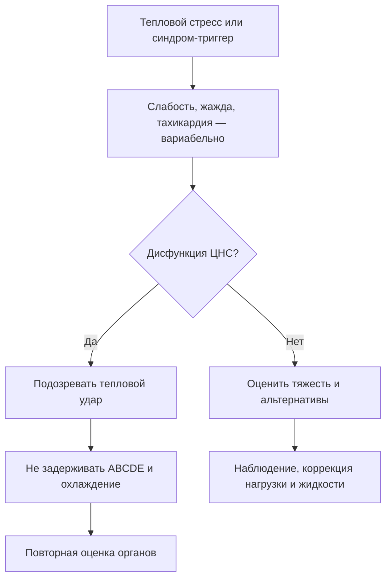

> [!NOTE]
> Горячая сухая кожа не обязательна: при тепловом ударе пациент может обильно
> потеть. Холодные или мраморные конечности указывают на гипоперфузию, а не на
> запрет охлаждения.
<!-- visual-summary:end -->
Клиническая картина гипертермического синдрома всегда складывается из двух компонентов:

1. **Общие, неспецифические проявления самого перегрева** — прямого токсического действия тепла на органы;
2. **Специфические симптомы-«ключи»**, указывающие на конкретную причину.

Задача врача у постели больного — быстро отделить одно от другого: первое говорит, насколько тяжёл пациент, второе — что именно с ним делать.

## 5.1. Общие проявления

### 5.1.1. Температурные изменения

**Критическое повышение температуры.** T_core (измеренная ректально) выше 40,0 °C; часто достигает 41–42 °C и выше. Часть источников отсчитывает критический уровень от 39,5 °C.

**Пороговые значения:**
- **> 41 °C** — крайне высокий риск клеточного и органного повреждения, особенно при длительном воздействии;
- **> 42–43 °C** — часто несовместимо с жизнью либо приводит к необратимому повреждению ЦНС вплоть до декортикации.

**Динамика.** Может быть быстрой — при злокачественной гипертермии описывают
подъём порядка 1 °C каждые 5–10 минут, при тепловом ударе на нагрузке счёт идёт
на десятки минут — или постепенной (классический тепловой удар, НЗС). Скорость
подъёма служит подсказкой: стремительный рост указывает на срыв терморегуляции и
требует немедленного охлаждения. При этом темп непостоянен, а при MH температура
нередко повышается **позже**, чем EtCO₂, ацидоз и ригидность, поэтому ожидание
«характерной скорости» — диагностическая ошибка (см. § 5.4.2).

**Температурная кривая.** При ГС это, как правило, *febris continua* — температура держится на запредельных цифрах до начала агрессивного охлаждения; при септических состояниях возможна гектическая кривая с резкими колебаниями.

### 5.1.2. Общее состояние

**Ранние признаки (предвестники, тепловое истощение) — «жёлтый свет», последняя возможность предотвратить катастрофу:**
- астения: выраженная слабость, вялость, адинамия, головокружение;
- интенсивная пульсирующая головная боль;
- тошнота, рвота, отказ от еды и питья;
- мышечные спазмы (cramps), особенно при нагрузке в жару. Их традиционно
  объясняли потерей Na⁺ и K⁺ с потом, однако одним дефицитом электролитов они не
  исчерпываются: вклад вносят утомление и нарушенный нейромышечный контроль.
  Тактика — прекратить нагрузку, увести в прохладу, мягко растянуть мышцу,
  оценить гидратацию, натрий и признаки теплового истощения или удара.

**Ключевой момент этой стадии: сознание ещё ясное.**

**Развёрнутая картина.** Состояние стремительно утяжеляется до крайне тяжёлого. Поведение меняется: неадекватность, отказ от еды и питья. Характерна двухфазность психического статуса — вначале психомоторное возбуждение и делирий (пациент «буйный», агрессивный, сопротивляется помощи), которое по мере истощения ЦНС и нарастания отёка мозга сменяется глубоким угнетением сознания вплоть до сопора и комы. Слабость и адинамия обусловлены нарушением метаболизма мышечных клеток, истощением энергетических ресурсов и расстройством нервно-мышечной передачи.

### 5.1.3. Вегетативная дисфункция

**Дрожь — важный парадокс.** При опасной гипертермии она может отражать мышечную гиперактивность, судороги, серотониновую токсичность, действие лекарств или реакцию на охлаждение. Её механизм выясняют, поскольку мышечная работа увеличивает теплопродукцию.

**Озноб при охлаждении — клинически критичное явление.** Если начать слишком агрессивное физическое охлаждение, кожные рецепторы сигнализируют «холодно» нормально работающему гипоталамусу, и тот, защищаясь от переохлаждения, запускает дрожь. Дрожь — это мышечная работа, генерирующая **дополнительное** тепло и прямо противодействующая усилиям врача.

> [!IMPORTANT]
> **Практический вывод:** выраженная дрожь снижает эффективность охлаждения.
> Сначала оптимизируют метод и комфорт, а седацию или нейромышечную блокаду
> применяют только по клиническим показаниям с контролем дыхательных путей.

**Вегетативная лабильность:** колебания артериального давления, частоты сердечных сокращений, интенсивности потоотделения, нестабильность дыхания.

### 5.1.4. Кожные проявления

Ключевой дифференциально-диагностический признак у постели больного, оцениваемый за секунды.

Описывают три независимых свойства: **цвет, влажность и перфузию**. Горячая
влажная кожа возможна при тепловом ударе на нагрузке и серотониновом синдроме;
горячая сухая — при ангидрозе или антихолинергическом токсидроме. Бледность,
мраморность и холодные конечности требуют оценки шока и гипоперфузии. Ни одна
комбинация не подтверждает и не исключает тепловой удар, а потливость
вариабельна как при классической, так и при нагрузочной форме.

**Цианоз ногтевых лож и губ** отражает гипоксемию и нарушение оксигенации тканей, свидетельствуя о декомпенсации.

---

## 5.2. Системные и органные проявления

Прямое отражение патофизиологического каскада из главы 3.

### 5.2.1. Центральная нервная система

**Энцефалопатия — кардинальный, определяющий признак ГС.** Именно она, а не цифра на термометре, переводит состояние в разряд критических.

> [!IMPORTANT]
> **Клиническое правило — работает в контексте тепловой экспозиции или нагрузки:**
> T_core < 40 °C + ясное сознание = **тепловое истощение**;
> T_core > 40 °C + нарушенное сознание = **тепловой удар до доказательства обратного**.
>
> Два ограничения. После начатого охлаждения температура может быть ниже 40 °C —
> это диагноз не исключает. И наоборот: если теплового контекста нет, та же
> связка означает лишь «опасная гипертермия с энцефалопатией», а причину ищут
> параллельно — сепсис, нейроинфекция, инсульт, интоксикация, MH, НЗС,
> серотониновый синдром, тиреотоксический криз.

**Спектр нарушений сознания:**
- *возбуждение* — агрессия, делирий с бредом и галлюцинациями (зрительными, слуховыми, тактильными);
- *спутанность и дезориентация* — невнятная речь (дизартрия), нарушения памяти и внимания, пациент не ориентируется в месте и времени;
- *угнетение* — от сомнолентности и сопора до комы с утратой защитных реакций.

**Судорожный синдром.** Тонико-клонические судороги (Grand Mal) — частое явление. Тоническая фаза длится 10–20 секунд (напряжение мышц, вытягивание тела, возможное апноэ), клоническая — 30–60 секунд (ритмичные сокращения, прикусывание языка, непроизвольное мочеиспускание и дефекация). Судороги могут быть как **причиной** гипертермии (эпилептический статус сам генерирует тепло), так и её **следствием** (отёк мозга, гипоксия, гипонатриемия). Возможны генерализованные, парциальные судороги и переход в эпилептический статус.

> [!IMPORTANT]
> **«Красные флаги» ЦНС, переводящие тепловое истощение в тепловой удар.**
> Атаксия (ранний признак поражения мозжечка), делириозное возбуждение,
> галлюцинации, судороги или угнетение сознания до ступора и комы. Появление
> любого из них на фоне тепловой экспозиции требует немедленного охлаждения и
> ведения как теплового удара — независимо от того, какую цифру показал
> термометр.

**Неврологический дефицит:**
- *мозжечковые симптомы* — атаксия, шаткая походка, нистагм — вследствие высокой уязвимости клеток Пуркинье к перегреву; у выживших нередко сохраняются надолго;
- *очаговые симптомы* — парезы, параличи, нарушения чувствительности;
- *менингеальные знаки* — ригидность затылочных мышц может быть положительной из-за отёка мозга даже без нейроинфекции;
- нарушения координации, равновесия, речи, зрения, слуха.

### 5.2.2. Сердечно-сосудистая система

Сердце работает на пределе: одновременно «прокачивает» кровь через расширенный кожный «радиатор» и страдает от гиповолемии, гипоксии и токсинов.

**Тахикардия часта, но не обязательна.** Её выраженность зависит от причины, лекарств, возраста, объёма циркулирующей крови и проводящей системы сердца. Брадикардия или нормальная ЧСС не делают тяжёлую гипертермию безопасной.

**Артериальное давление:**
- *ранняя фаза* — нормальное или повышенное (гипердинамический сердечный выброс, возбуждение);
- *поздняя фаза* — артериальная гипотензия, прогрессирующая в шок вследствие гиповолемии, вазодилатации и синдрома утечки.

**Аритмии.** Причины: прямое термическое повреждение миокарда, ишемия, активация симпатической системы и — что особенно важно — электролитные нарушения, прежде всего гиперкалиемия при рабдомиолизе. Типы: синусовая тахикардия, фибрилляция предсердий, желудочковая экстрасистолия, желудочковая тахикардия, фибрилляция желудочков.

**ЭКГ-признаки:** депрессия ST при ишемии, высокие остроконечные зубцы T при гиперкалиемии. У пациента с ГС ЭКГ — не формальность, а способ вовремя увидеть жизнеугрожающую гиперкалиемию.

### 5.2.3. Дыхательная система

Лёгкие — орган-мишень для SIRS и синдрома утечки.

**Тахипноэ и одышка часты.** Они могут отражать ацидоз, симпатическую активацию, гипоксемию или ОРДС. Частота дыхания и газовый состав оцениваются в динамике; отсутствие тахипноэ не исключает тяжёлого состояния, особенно после седативных препаратов.

**Признаки развивающегося ОРДС:** влажные хрипы, пенистая мокрота (отёк лёгких), падение SpO₂ несмотря на ингаляцию кислорода — рефрактерная гипоксемия.

### 5.2.4. Желудочно-кишечный тракт

Кишечник крайне чувствителен к ишемии на фоне централизации кровообращения.

- **Тошнота и рвота** — ранний и постоянный симптом; генез центральный (воздействие на рвотный центр) и ишемический.
- **Диарея** — часто водянистая, возможна с примесью крови. Механизм — ишемический колит с некрозом слизистой. Особенно характерна для серотонинового синдрома, где имеет иной, рецепторный, механизм.
- **Последствия поражения кишечника:** усугубление гиповолемии и — что особенно опасно — **бактериальная транслокация**: «дырявая» кишечная стенка пропускает микрофлору в кровоток, подпитывая SIRS и вторичный сепсис.
- **Абдоминальный болевой синдром** — признак ишемии органов брюшной полости.
- **Непроизвольная дефекация** — маркер глубокого поражения ЦНС.

### 5.2.5. Мочевыделительная система

- **Олигурия/анурия** — снижение диуреза (< 400 мл/сут) вплоть до полного отсутствия мочи. Механизмы преренальные (шок, дегидратация, активация РААС) и ренальные (острый тубулярный некроз).
- **Цвет мочи.** Тёмно-бурая моча может указывать на миоглобин, гемоглобин, кровь или другие причины. Это красный флаг для немедленного контроля КФК, калия, креатинина, анализа мочи и объёмного статуса, но не показание к автоматическому «форсированному диурезу».
- **Непроизвольное мочеиспускание** — утрата контроля тазовых органов при коме.

---

## 5.3. Стадии развития гипертермического синдрома

Процесс редко бывает одномоментным — исключение составляет злокачественная гипертермия.

**Стадия 1. Компенсаторная (тепловое истощение).**
- T_core < 40 °C; сознание **ясное**.
- Клиника: слабость, тошнота, головная боль, тахикардия, тахипноэ, профузный пот, мышечные спазмы, озноб.
- Патофизиология: система справляется — сердечный выброс высокий, вазодилатация и потоотделение работают на максимуме.
- Длительность: от нескольких минут до нескольких часов.

**Стадия 2. Относительной компенсации («серая зона»).**
- T_core около 40 °C.
- Начальные изменения ЦНС: лёгкая спутанность, иррациональное поведение — спортсмен пытается продолжать бег, пациент срывает с себя одежду. Возможны нарушения координации и речи, единичные судороги.
- Патофизиология: компенсаторные резервы (объём жидкости, насосная функция сердца) истощаются, начинается синдром утечки.
- Длительность: от нескольких часов до суток.

**Стадия 3. Декомпенсации (развёрнутый ГС).**
- T_core > 40–41 °C.
- Глубокая дисфункция ЦНС: кома, судороги; нарушения дыхания и кровообращения.
- Патофизиология: тепловая нагрузка превышает теплоотдачу; могут присоединиться
  обезвоживание, шок и системное воспалительно-эндотелиальное повреждение с
  ДВС, ОПП и ОРДС. Влажность и цвет кожи варьируют и не задают стадию.
- Длительность: развивается в течение часов.

**Крайне тяжёлая стадия** выделяется отдельно как состояние манифестной полиорганной недостаточности с непосредственной угрозой жизни, требующее полного объёма реанимационной помощи.

---

## 5.4. Особенности клиники при различных формах — ключ к дифференциальному диагнозу

Самый важный для клинициста раздел: контекст и уникальные симптомы определяют выбор антидота.

### 5.4.1. Тепловой удар

| Признак | Классический (non-exertional) | При нагрузке (exertional) |
|---|---|---|
| Пациент | Пожилой, с ХСН, на диуретиках, в «волну жары» | Молодой здоровый спортсмен, солдат, рабочий |
| Кожа | Может быть сухой или влажной; осмотр неспецифичен | Часто влажная, но потливость вариабельна |
| ЦНС | Медленное развитие (1–2 дня) спутанности, комы | Быстрое (минуты–часы), часто коллапс и судороги на финише |
| Рабдомиолиз | Возможен, особенно при тяжёлом течении | Встречается чаще; выраженность и ОПП вариабельны |
| Прочее | Дегидратация, фон коморбидности | Часто ДВС-синдром |

В классическом варианте традиционно выделяли две фазы: продромальную («предугар» — слабость, головная боль, тошнота, головокружение) и развёрнутую («угар» — нарушение сознания, судороги, кома).

### 5.4.2. Злокачественная гипертермия (MH)

*Контекст:* обычно во время анестезии или вскоре после неё; триггер —
ингаляционный анестетик или сукцинилхолин. Редкие поздние проявления требуют
сопоставления с экспозицией и исключения других причин.

*Ранние признаки (наиболее ценны для диагноза):*
1. **необъяснимая тахикардия** — первый и самый частый признак;
2. **гиперкапния (рост EtCO₂)** — важный ранний признак при неизменной вентиляции; он высоко подозрителен в подходящем контексте, но требует исключить проблемы контура, вентиляции и другие причины;
3. **ригидность жевательных мышц (тризм)** — «челюсть свело» после введения сукцинилхолина.

*Поздние признаки:*
4. генерализованная мышечная ригидность («как доска»);
5. **гипертермия — поздний признак!** Температура растёт последней, но очень быстро — примерно на 1 °C каждые 5–10 минут;
6. аритмии на фоне гиперкалиемии, тёмная моча, гипотензия, шок.

> [!TIP]
> **Триада для запоминания: тахикардия + гиперкапния + ригидность на фоне анестезии.** Ждать подъёма температуры для постановки диагноза — врачебная ошибка.

### 5.4.3. Нейролептический злокачественный синдром (НЗС)

*Контекст:* пациент, часто психиатрического профиля, принимает нейролептики (галоперидол) либо резко отменил леводопу.

*Развитие:* **медленное** — дни, иногда недели.

*Тетрада симптомов:*
1. гипертермия 38–42 °C, нередко с бледной, мраморной кожей и холодными
   конечностями — это признак нарушенной перфузии, а не отдельный «белый тип»
   гипертермии (§ 4.3.5);
2. мышечная ригидность типа **«свинцовой трубы»** — пластическая, постоянная;
3. изменение сознания: делирий, ступор, кома;
4. вегетативная дисфункция (дисавтономия): лабильное АД, тахикардия, профузное потоотделение, гиперсаливация.

*Дополнительно:* тремор, брадикинезия, маскообразное лицо.

*Лаборатория:* КФК очень высокая вследствие непрерывной ригидности.

### 5.4.4. Серотониновый синдром (СС)

*Контекст:* приём комбинации серотонинергических препаратов (СИОЗС + ингибитор МАО, СИОЗС + трамадол, СИОЗС + декстрометорфан).

*Развитие:* **быстрое** — часы, обычно менее 24 часов от приёма или изменения дозы.

*Триада симптомов:*
1. **когнитивные изменения:** возбуждение, спутанность, делирий;
2. **вегетативная дисфункция:** тахикардия, гипертермия, профузный пот, мидриаз, тошнота, **диарея** — очень характерна;
3. **нервно-мышечная гиперактивность (ключ к диагнозу):** миоклонус — внезапные подёргивания, особенно в ногах; гиперрефлексия (рефлексы «взлетают», 3+ и выше); клонус стоп и надколенника; тремор; умеренная ригидность с преобладанием в ногах.

> [!TIP]
> **Флаги серотонинового синдрома: миоклонус + гиперрефлексия + диарея.**

### 5.4.5. Антихолинергический синдром

*Контекст:* передозировка ТЦА, дифенгидрамина, атропина, отравление дурманом или беленой.

*Классическая мнемоника:*
- *Hot as a hare* — горячий: гипертермия;
- *Dry as a bone* — сухой: ангидроз, сухость слизистых;
- *Blind as a bat* — слепой: мидриаз с нарушением аккомодации;
- *Red as a beet* — красный: «атропиновый румянец» от кожной вазодилатации;
- *Mad as a hatter* — безумный: делирий, галлюцинации.

*Дополнительно:* тахикардия, задержка мочи, атония кишечника и запор.

### 5.4.6. Сводка ключей быстрой дифференциации

| Связка признаков | Диагноз |
|---|---|
| Анестезия + рост EtCO₂ + тризм/ригидность | Злокачественная гипертермия |
| Нейролептик (или отмена леводопы) + медленное развитие + «свинцовая» ригидность | НЗС |
| Антидепрессанты + быстрое развитие + миоклонус, гиперрефлексия, диарея | Серотониновый синдром |
| Жара + ангидроз + кома у пожилого | Классический тепловой удар |
| Нагрузка + профузный пот + коллапс у молодого | Тепловой удар при нагрузке |
| Сухая кожа + мидриаз + задержка мочи + делирий | Антихолинергический синдром |
| Зоб, тахикардия > 140, диарея, тремор | Тиреотоксический криз |

---

## 5.5. Критерии тяжести

Тяжесть оценивается по совокупности температуры и — что важнее — по наличию органной дисфункции.

- **Лёгкая (тепловое истощение):** T < 40 °C, сознание ясное, минимальные системные проявления, судорог и органной дисфункции нет.
- **Средняя:** T около 40–41 °C, лёгкая спутанность, умеренные системные нарушения, явной органной дисфункции нет.
- **Тяжёлая:** T > 41 °C (по ряду классификаций — выше 39,5 °C с органной дисфункцией), кома или судороги, гипотензия и шок, нарушения дыхания, признаки полиорганной дисфункции — ОПП, ОРДС, ДВС.
- **Крайне тяжёлая:** манифестная полиорганная недостаточность, непосредственная угроза жизни, необходимость реанимационных мероприятий в полном объёме.

---

## 5.6. Особенности клиники у детей первого года жизни

- **Неспецифичность.** Клиника «смазана»: ребёнок не жалуется. Он либо вял и сонлив («как тряпочка»), либо, напротив, пронзительно кричит — так называемый «мозговой крик», признак отёка мозга.
- **Быстрое развитие.** Декомпенсация наступает молниеносно из-за малых резервов жидкости, незрелости ЦНС и большого отношения поверхности тела к массе.
- **Судороги.** Фебрильные судороги — очень частый дебют. Важное правило: при T > 40 °C любые судороги следует расценивать как признак ГС, а не «простой» лихорадки.
- **Эксикоз.** Обезвоживание развивается быстро; оценивается по запавшему родничку, сухим слизистым, отсутствию слёз, снижению тургора кожи и диуреза. Незрелость почек усугубляет водно-электролитные нарушения.

---

## 5.7. Гипертермия в условиях интенсивной терапии

Особая диагностическая ситуация: пациент ОРИТ часто интубирован и седирован.

**Проблема:** невозможно оценить ключевой признак — изменение сознания; мышечная ригидность может быть замаскирована миорелаксантами; жалоб нет.

**На что смотреть:**
- **монитор:** необъяснимая тахикардия, лабильность АД;
- **капнограф:** рост EtCO₂ при неизменных параметрах ИВЛ;
- **температурный датчик** (ректальный, пищеводный, катетер в мочевом пузыре) — единственный надёжный источник данных о T_core; аксиллярная термометрия здесь непригодна;
- **лаборатория:** необъяснимый рост КФК, метаболический ацидоз, гиперкалиемия, миоглобин в моче.

## Выводы по главе 5

**Кардинальные признаки.** Клиническая картина тяжёлого ГС — триада: T_core > 40 °C, энцефалопатия (от спутанности до комы) и полиорганная дисфункция. Именно неврологический статус, а не показания термометра, определяет тяжесть.

**Оценка кожи за пять секунд.** Цвет, влажность и температура помогают распознать ангидроз или гипоперфузию, но не задают отдельный алгоритм. При тепловом ударе охлаждение не откладывают из-за мраморности или холодных конечностей; одновременно лечат шок и сохраняют доступ к пациенту.

**Ключи к дифференциации** (см. сводную таблицу § 5.4.6) позволяют быстро выбрать причинную ветвь. При MH немедленно нужен дантролен; при серотониновом синдроме исход определяют отмена триггера, поддержка, бензодиазепины и контроль мышечной гиперактивности, а ципрогептадин остаётся вспомогательным энтеральным вариантом.

**Ловушки.** Гипертермия при MH — поздний признак; профузный пот не исключает теплового удара; дрожь при охлаждении вредна и требует купирования; у детей и седированных пациентов ОРИТ классическая картина отсутствует.

**Переход.** Мы увидели пациента и сформулировали 2–3 ведущие гипотезы. Чтобы подтвердить одну и исключить остальные, нужны объективные данные — этому посвящена следующая глава.

---

# Глава 6. Диагностика

<!-- visual-summary:start -->

### Схема для запоминания

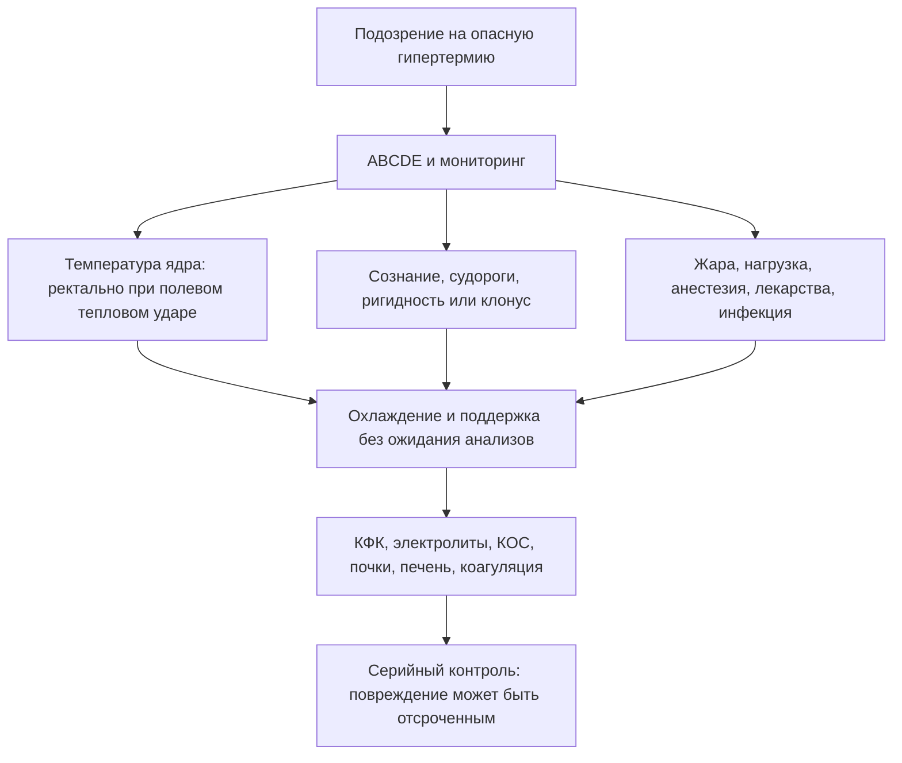
<!-- visual-summary:end -->
При T_core = 41 °C у врача нет дней — у него есть минуты. Диагностика ГС не является неспешным академическим процессом: это алгоритм неотложной помощи, работающий **параллельно** с первыми реанимационными мероприятиями.

**Цель диагностики тройная:**
1. подтвердить опасное повышение температуры ядра, не сводя диагноз к одному порогу;
2. немедленно начать дифференциальную диагностику этиологии — тепловой удар, MH, НЗС, серотониновый синдром, сепсис?
3. оценить степень полиорганной недостаточности — ОПП, ОРДС, ДВС, рабдомиолиз.

## 6.1. Сбор анамнеза и факторы риска

При ГС анамнез чаще собирается **не у пациента** (он в коме или делирии), а у родственников, очевидцев, бригады скорой помощи, а в случае MH и НЗС — у лечащего врача или анестезиолога.

### 6.1.1. Анамнез заболевания

**Скорость развития — первый разделяющий вопрос:**
- *молниеносно (минуты):* MH в операционной, тепловой удар при нагрузке (коллапс на марафоне), судорожный статус;
- *быстро (часы):* серотониновый синдром после приёма или смены дозы препаратов, отравления кокаином и «экстази»;
- *медленно (дни–недели):* НЗС с постепенным утяжелением, классический тепловой удар (третий день волны жары), тиреотоксический криз, сепсис.

Клиническое значение: темп помогает выбрать причины, но **ни медленное, ни быстрое развитие не даёт права откладывать поддержку и охлаждение**, если есть дисфункция ЦНС или иные признаки угрозы жизни.

**Предшествующие симптомы как подсказка к этиологии:**
- озноб и потоотделение — инфекционные заболевания;
- мышечная ригидность — MH, НЗС;
- миоклонус — серотониновый синдром;
- головная боль, боль в спине, менингеальные жалобы — менингит;
- кашель, боль в горле, дизурия — очаг инфекции, сепсис;
- рвота, диарея — эксикоз;
- контакт с инфекционными больными, эпидемиологическая обстановка.

### 6.1.2. Фармакологический анамнез — ключевой пункт

Это самый информативный раздел анамнеза при ГС.

**Вопросы по «большой тройке»:**
- **НЗС:** «Принимает ли пациент нейролептики — галоперидол, аминазин, оланзапин, рисперидон? Страдает ли болезнью Паркинсона, не пропускал ли приём леводопы?» Уточнить дозы, сроки начала, недавнее повышение дозы, внутримышечные введения.
- **Серотониновый синдром:** «Какие антидепрессанты принимает — флуоксетин, пароксетин, сертралин? Принимает ли ингибиторы МАО? Пьёт ли трамадол или сироп от кашля с декстрометорфаном? Не назначали ли линезолид?»
- **MH (вопрос анестезиолога к себе):** «Какие препараты я вводил? Были ли севофлуран, десфлуран, изофлуран, галотан или сукцинилхолин?»

**Другие «подозреваемые»:** антихолинергические средства (атропин, дифенгидрамин, амитриптилин); психостимуляторы (кокаин, амфетамины, MDMA); диуретики (обезвоживание и предрасположенность к тепловому удару); литий.

**Полипрагмазия** — одновременный приём пяти и более препаратов — сама по себе резко повышает риск. Обязательно уточнять любые недавние изменения терапии: новый препарат, повышение дозы, отмену, новую комбинацию.

### 6.1.3. Условия окружающей среды

- *Классический тепловой удар:* «В душной квартире без кондиционера», «в закрытой машине на солнце» (ребёнок), температура и длительность воздействия, наличие вентиляции и доступа к воде.
- *Тепловой удар при нагрузке:* «Бежал марафон», «тренировался в полной выкладке», «работал в литейном цеху»; интенсивность и продолжительность нагрузки, характер одежды и экипировки.
- *Влажность* — ключевой фактор, блокирующий испарение, и его нужно выяснять специально.
- *Профессиональные вредности:* работа в горячих цехах, у источников тепла, в защитных костюмах.

### 6.1.4. Наследственный анамнез

**Ключевой вопрос при подозрении на MH:** «Были ли у пациента или его кровных родственников проблемы с наркозом? Умирал ли кто-то из родственников во время операции или сразу после неё? Говорили ли ему, что у него или у семьи злокачественная гипертермия?»

Положительный ответ — **абсолютный красный флаг** для анестезиолога, требующий полностью безтриггерной методики анестезии. Также выясняется наличие подтверждённых мутаций RYR1 и CACNA1S у родственников.

### 6.1.5. Преморбидный фон

- **Психиатрический:** антипсихотики и резкая отмена дофаминергических средств
  повышают вероятность НЗС; серотонинергические препараты и взаимодействия —
  серотонинового синдрома.
- **Эндокринный:** тиреотоксикоз, болезнь Грейвса → риск криза; феохромоцитома.
- **ЦНС:** ДЦП, ЧМТ в анамнезе, инсульты, опухоли, эпилепсия и судорожная готовность.
- **Сердечно-сосудистый:** ХСН, врождённые пороки сердца, приём диуретиков — ограниченный резерв компенсации.
- **Прочее:** заболевания почек и печени (влияют на элиминацию препаратов), алкоголизм, наркомания, ожирение.

---

## 6.2. Физикальное обследование

Проводится немедленно и параллельно с обеспечением витальных функций.

### 6.2.1. Термометрия

**Золотой стандарт — измерение T_core (температуры ядра).**

**При подозрении на тепловой удар в полевых и приёмных условиях метод выбора — ректальная термометрия.** Она лучше периферических методов отражает температуру ядра во время нагрузки и быстрого охлаждения. Технику, глубину введения, фиксацию и противопоказания определяют локальный протокол и устройство датчика.

> [!WARNING]
> **Практическая ловушка:** обычный ртутный градусник для диагностики ГС непригоден — его шкала не показывает температуру выше 42 °C. Необходим электронный термометр с расширенным диапазоном.

**Другие методы выбирают по контексту:**
- пищеводный датчик — для интубированного/анестезированного пациента при корректном положении;
- датчик мочевого пузыря — может запаздывать при низком диурезе и быстром изменении температуры;
- катетер в лёгочной артерии — точен, но не устанавливается только ради термометрии;
- контактное тимпаническое измерение требует правильной техники и не равно бытовому инфракрасному «ушному» термометру.

Аксиллярные, кожные, лобные и бесконтактные методы могут существенно ошибаться
при нагрузке, потоотделении, гипоперфузии и активном охлаждении. Если
ректальное измерение временно недоступно, помощь не задерживают: используют
лучший доступный метод, интерпретируют его осторожно и переходят к подходящему
датчику как можно раньше. Кожно-ядерный градиент может отражать перфузию, но
пороговые значения не делят пациентов на отдельные «красный» и «белый» типы.

### 6.2.2. Оценка витальных функций (ABC)

- **A (Airway):** проходимость дыхательных путей — рвота, аспирация, тризм при MH.
- **B (Breathing):** ЧДД (тахипноэ > 20, часто 30–40 в минуту), SpO₂ (норма > 95 %, при ГС нередко снижена), аускультация — влажные хрипы как признак ОРДС.
- **C (Circulation):** ЧСС (тахикардия > 100, часто > 140 уд/мин), АД (в ранней фазе нормальное или повышенное, в поздней — гипотензия и шок), оценка периферической перфузии и времени капиллярного наполнения.

### 6.2.3. Оценка кожи — три вопроса за пять секунд

| Комбинация | Наиболее вероятная причина |
|---|---|
| Горячая и **сухая** | Ангидроз/антихолинергический синдром; тепловой удар возможен |
| Горячая и **влажная** | Тепловой удар, серотониновый синдром, тиреотоксический криз |
| **Холодная и бледная/мраморная** | Гипоперфузия или шок; причина гипертермии определяется отдельно |

Оцениваются цвет (гиперемия, бледность, мраморность, цианоз ногтевых лож и губ), температура кожи и её влажность.

### 6.2.4. Неврологический статус

- **Уровень сознания — шкала комы Глазго (GCS):** открывание глаз (1–4), вербальный ответ (1–5), моторный ответ (1–6); суммарно 3–15 баллов. Низкая оценка повышает вероятность нарушения защиты дыхательных путей, но решение об интубации принимают по защитным рефлексам, вентиляции, оксигенации, динамике и ожидаемому течению, а не автоматически по одному числу.
- **Зрачки:** мидриаз — серотониновый синдром, антихолинергический синдром, отравление стимуляторами, гипоксия; миоз — редко, возможен при НЗС; асимметрия — повод искать внутричерепную катастрофу.
- **Судороги:** генерализованные, парциальные, эпилептический статус.
- **Менингеальные знаки** (ригидность затылочных мышц, симптомы Кернига и Брудзинского) могут быть положительны из-за отёка мозга без нейроинфекции; важно не путать их с генерализованной мышечной ригидностью.
- **Очаговая симптоматика:** парезы, параличи, нарушения чувствительности и координации, атаксия, нистагм.

### 6.2.5. Оценка мышечного тонуса — ключ к дифференциации MH / НЗС / СС

**Ригидность:**
- **«свинцовая труба»** — пластическая, воскоподобная, пациент «застыл» → НЗС;
- **«деревянная»** — крайняя степень, пациент «как доска» → MH;
- **тризм** — спазм жевательных мышц, ранний признак MH после сукцинилхолина.

**Гиперактивность:**
- **миоклонус** — внезапные подёргивания, чаще в ногах → серотониновый синдром;
- **гиперрефлексия** — «взлетающие» сухожильные рефлексы, клонус → серотониновый синдром;
- **тремор** — крупноразмашистый → серотониновый синдром, тиреотоксикоз.

**Рефлексы как различитель:** гипорефлексия или норма характерны для НЗС и помогают отличить его от серотонинового синдрома с его гиперрефлексией.

**Отсутствие ригидности** с дряблыми (flaccid) мышцами типично для теплового удара — важный негативный признак.

### 6.2.6. Общий осмотр

Признаки дегидратации: сухость слизистых, снижение тургора кожи, запавшие глаза (у младенцев — запавший родничок, отсутствие слёз), олигурия, гипотензия. Запахи: алкоголь, ацетон (кетоацидоз). Следы инъекций как указание на употребление наркотиков. Оценка степени тяжести состояния в целом.

---

## 6.3. Лабораторная диагностика

Пациенту с ГС немедленно берётся целевая панель — **«гипертермический профиль»**. Все пробирки маркируются как STAT / Cito.

### 6.3.1. Общий анализ крови

- **Гематокрит и гемоглобин** — повышены (гемоконцентрация) как признак тяжёлой дегидратации.
- **Тромбоциты** — тромбоцитопения (< 150 000/мкл) — грозный признак ДВС.
- **Лейкоциты** — лейкоцитоз, часто 15–20 тыс./мкл, — неспецифическая стрессовая реакция в рамках SIRS. **Сам по себе не доказывает инфекцию.** Сдвиг лейкоформулы влево повышает вероятность бактериального процесса.
- **СОЭ** — повышена неспецифически.

### 6.3.2. Биохимический анализ крови

**Маркёры повреждения тканей:**

| Показатель | Норма | При ГС |
|---|---|---|
| **КФК** (ключевой анализ) | < 200 Ед/л | Резко повышена: > 10 000, часто 50 000–100 000 Ед/л при MH, НЗС, тепловом ударе при нагрузке; умеренное повышение при СС |
| Миоглобин | < 100 нг/мл | > 1000 нг/мл; появляется в крови **раньше** КФК |
| КФК-МВ | < 25 Ед/л | Повышение — повреждение миокарда |
| ЛДГ | 140–280 Ед/л | Всегда повышена (неспецифический маркёр лизиса клеток и гипоксии) |
| АСТ, АЛТ | < 40 Ед/л | Резко повышены; АСТ обычно выше АЛТ, поскольку АСТ содержится и в мышцах |

**Электролиты:**
- **Калий — критический анализ.** Гиперкалиемия (> 5,5 мЭкв/л) — жизнеугрожающее осложнение рабдомиолиза, требует немедленной коррекции; гипокалиемия (< 3,5 мЭкв/л) возможна на ранних стадиях за счёт потерь с потом и рвотой. Норма 3,5–5,5 мЭкв/л.
- **Натрий** (норма 135–145 мЭкв/л): чаще гипернатриемия (> 145) вследствие преобладания потери воды над потерей соли; возможна и гипонатриемия, если пациент восполнял потери чистой водой — классическая ситуация у марафонцев.
- **Кальций** (норма 8,5–10,5 мг/дл): часто гипокальциемия из-за связывания с фосфатами разрушенных мышц.
- **Магний** (норма 1,7–2,2 мг/дл): возможны нарушения.

**Функция почек:** креатинин (норма 0,7–1,3 мг/дл) и мочевина (7–20 мг/дл) повышены — признак ОПП.

**Функция печени:** билирубин (норма 0,1–1,2 мг/дл) повышен, щелочная фосфатаза и ГГТ, диспротеинемия и снижение альбумина как маркёр печёночной недостаточности.

**Метаболические показатели:** глюкоза может быть как повышена (стресс-гипергликемия), так и снижена (истощение гликогена, печёночная недостаточность); **лактат** (норма < 2 ммоль/л) повышен — маркёр тканевой гипоперфузии и анаэробного метаболизма, важный индикатор тяжести.

### 6.3.3. Газы крови и КОС

- **pH** (норма 7,35–7,45): < 7,35 — ацидоз.
- **Метаболический ацидоз:** HCO₃⁻ < 22 мЭкв/л, дефицит оснований — за счёт лактата и ОПП.
- **Респираторный ацидоз:** PaCO₂ > 45 мм рт. ст. — **очень характерно для MH** вследствие гиперпродукции CO₂, а также при угнетении дыхания.
- **Смешанный ацидоз** — низкий pH при низком HCO₃⁻ и высоком PaCO₂ — наиболее тяжёлый вариант.
- **Гипоксемия:** PaO₂ < 80 мм рт. ст., при ОРДС — рефрактерная.
- В ранней фазе возможен респираторный алкалоз вследствие тахипноэ.

### 6.3.4. Коагулограмма (панель ДВС)

АЧТВ и ПВ/МНО удлинены (факторы свёртывания израсходованы), фибриноген снижен, D-димер и ПДФ резко повышены, тромбоцитопения по данным ОАК. Совокупность этих изменений подтверждает ДВС-синдром.

### 6.3.5. Общий анализ мочи

- **Цвет:** бурый, «цвета кока-колы» или «мясных помоев».
- **Тест-полоска на кровь:** резко положительная — реактив реагирует на гем, не различая гемоглобин и миоглобин.
- **Микроскопия осадка:** эритроциты отсутствуют или единичные.

> [!IMPORTANT]
> **Диагностическая подсказка:** «гем-положительная тест-полоска + мало или нет
> эритроцитов в осадке» указывает на пигмент (миоглобин или свободный
> гемоглобин), но не различает их. Результат сопоставляют с КФК, гемолизом и
> клиническим контекстом.

Дополнительно: протеинурия, цилиндрурия, гематурия как признаки повреждения почек; обязателен контроль почасового диуреза.

### 6.3.6. Маркёры воспаления

**С-реактивный белок и прокальцитонин** могут входить в общую оценку инфекции,
но при тепловом ударе повышаются и без бактериального процесса. Даже очень
высокий прокальцитонин способен отражать тяжесть стерильного воспаления.
Сепсис подтверждают совокупностью очага, посевов/ПЦР, визуализации,
гемодинамики и динамики, не одиночным порогом маркёра.

### 6.3.7. Специфические тесты

- **Гормоны щитовидной железы** (Т3, Т4, ТТГ) — при подозрении на тиреотоксический криз.
- **Бакпосевы** крови, мочи, ликвора, мокроты — при подозрении на сепсис или менингит.
- **Серологические и ПЦР-тесты** для идентификации возбудителя.
- **Токсикологический скрининг** крови и мочи — кокаин, амфетамины, антидепрессанты; определение концентраций препаратов (например, лития, нейролептиков).
- **Катехоламины и метанефрины** — при подозрении на феохромоцитому.

---

## 6.4. Инструментальная диагностика

**ЭКГ — обязательно и немедленно.** Что ищем:
- **признаки гиперкалиемии** (важнейшее): ранние — высокие заострённые симметричные зубцы T («палатки»); поздние — расширение QRS, удлинение PR, уплощение и исчезновение зубца P, синусоидальная кривая, переходящая в фибрилляцию желудочков;
- синусовая тахикардия — присутствует практически всегда;
- признаки ишемии — депрессия ST, инверсия T;
- аритмии — фибрилляция предсердий, желудочковые нарушения ритма.

**Рентгенография органов грудной клетки — обязательно** (допустимо портативным аппаратом): диффузное двустороннее затемнение по типу «бабочки» — ОРДС и отёк лёгких, линии Керли; очаговые тени — пневмония как возможная причина сепсиса; признаки аспирации при бывшей рвоте.

**Эхокардиография** — по показаниям при шоке и аритмиях, у постели больного: фракция выброса (норма > 50 %), зоны гипокинеза, дилатация камер, выпот в перикард, признаки тампонады.

**КТ/МРТ головного мозга.** Основное показание — **пациент не приходит в сознание после нормализации T_core**, а также очаговая симптоматика, судороги, подозрение на травму. Цель: исключить центральные причины (инсульт, кровоизлияние, опухоль, ЧМТ, энцефалит, абсцесс) и оценить осложнения — диффузный отёк мозга, ишемию.

**УЗИ внутренних органов** — при болях в животе (подозрение на ишемию кишечника), оценка размеров и структуры печени и почек, поиск свободной жидкости.

**ЭЭГ** — при сохраняющихся судорогах или необъяснимой коме; главная задача — диагностика бессудорожного эпилептического статуса. Находки: эпилептиформная активность, спайки, острые волны, замедление фонового ритма.

---

## 6.5. Патогенетические и генетические тесты

**Важно: эти тесты не применяются в неотложной ситуации.** Они выполняются после стабилизации — для подтверждения диагноза и планирования будущего пациента и его семьи.

**Галотан-кофеиновый контрактурный тест (CHCT) — референсный метод диагностики MH.** Инвазивный: требуется биопсия мышечной ткани, обычно из четырёхглавой мышцы бедра. Изолированные мышечные волокна in vitro подвергаются воздействию галотана и кофеина; у восприимчивых к MH пациентов мышца отвечает аномально сильной контрактурой. Ограничение: тест выполняется лишь в нескольких специализированных центрах мира.

**Генетическое тестирование.** Пациента после вероятного криза и его родственников направляют в специализированный центр. Панели включают прежде всего RYR1, CACNA1S и STAC3; интерпретация варианта требует генетического консультирования. Отрицательный результат не исключает предрасположенность, поэтому необходимость контрактурного теста решают отдельно.

---

## 6.6. Алгоритм первичного осмотра

1. **Оценить угрозу жизни (ABCDE)** и SpO₂. Обеспечить дыхательные пути по клиническим показаниям, мониторинг и сосудистый доступ.
2. **Измерить T_core подходящим методом.** При тепловом ударе предпочтительна ректальная температура; нормализовавшаяся после предварительного охлаждения цифра диагноз не исключает.
3. **Немедленно начать эффективное охлаждение**, если контекст и дисфункция ЦНС указывают на тепловой удар; цвет кожи не является условием.
4. **Определить глюкозу крови глюкометром.** Гипогликемия — частая и полностью обратимая причина делирия и судорог, особенно после физической нагрузки, алкоголя и у детей. Её выявляют и корректируют немедленно, не списывая нарушение сознания на одну гипертермию.
5. **Быстрый осмотр по мнемонике 5S:** Skin (кожа и перфузия), Stiffness (ригидность/клонус), Size (зрачки), Substances (препараты), Situation (жара, нагрузка, операционная).
6. **Взять кровь и мочу** на «гипертермический профиль».
7. **ЭКГ** — с прицельным поиском гиперкалиемии.
8. **Титровать инфузию** по перфузии, электролитам и риску перегрузки; охлаждённый раствор может быть дополнением, но не заменяет эффективного охлаждения всего тела.
9. **Сформулировать причинную ветвь** и без промедления применить доказанную специфическую терапию там, где она существует (дантролен при MH).

> [!IMPORTANT]
> **Диагностический минимум первых минут** (согласуется с догоспитальными
> протоколами ВОЗ и ERC): ABCDE и SpO₂ → температура ядра → глюкометрия →
> ЭКГ → «панель тревоги»: КФК и анализ мочи на пигмент, калий, натрий,
> креатинин и мочевина, КОС с артериальным лактатом, коагулограмма с
> фибриногеном, D-димером и тромбоцитами. Ожидание результатов **не** отсрочивает
> охлаждение и поддержку.

---

## 6.7. Мониторинг

**Непрерывный мониторинг обязателен:**
- **температура ядра** — постоянный ректальный или пищеводный датчик, контроль каждые 15–30 минут; при активном охлаждении — непрерывно, чтобы не «проскочить» в гипотермию;
- **ЭКГ** — непрерывно;
- **артериальное давление** — при шоке предпочтителен инвазивный мониторинг через артериальную линию;
- **SpO₂ и EtCO₂** — капнография критически важна при MH, где рост EtCO₂ служит и ранним диагностическим признаком, и маркёром эффективности лечения;
- **диурез** — почасовой через катетер Фолея, с обязательной оценкой цвета мочи;
- **лабораторные показатели в динамике** — КОС, калий, КФК, коагулограмма каждые 2–4 часа в острой фазе.

## Выводы по главе 6

**Диагностика = терапия.** При ГС диагностика не предшествует лечению, а идёт параллельно с ним: ABCDE, подходящая температура ядра, эффективное охлаждение при подозрении на тепловой удар и поиск причины распределяются между членами команды.

**Скорость решает.** Ключевые неотложные исследования: T_core, ЭКГ (калий!), КОС (ацидоз, CO₂), КФК (рабдомиолиз), миоглобин в моче.

**Термометрия имеет решающее значение.** Периферические методы могут существенно ошибаться при нагрузке, поте, гипоперфузии и охлаждении; метод выбирают по контексту и не откладывают помощь ради измерения.

**Анамнез и осмотр важнее лаборатории** для дифференциации «большой четвёрки»:
- **MH:** тризм + рост EtCO₂ + анестезия;
- **НЗС:** «свинцовая» ригидность + нейролептики + медленное развитие;
- **СС:** миоклонус и гиперрефлексия + СИОЗС + быстрое развитие;
- **тепловой удар:** жара + отсутствие ригидности (дряблые мышцы) + сухая или влажная кожа.

**Переход.** Диагноз ГС поставлен, причина предположена. Но нередко — особенно у пациента в коме — несколько диагнозов выглядят одинаково вероятными. Как принять решение, когда на кону жизнь, а информация неполна? Об этом следующая глава.

---

# Глава 7. Дифференциальная диагностика

<!-- visual-summary:start -->

### Схема для запоминания

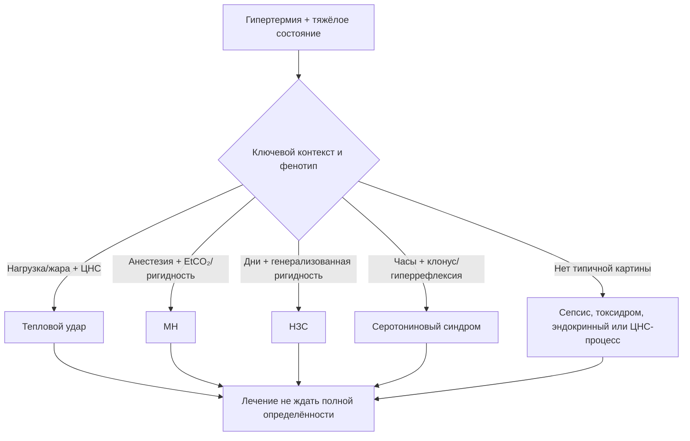
<!-- visual-summary:end -->
Это, возможно, самая интеллектуально сложная часть темы. Пациент с высокой температурой ядра и нарушенным сознанием — «чёрный ящик», а времени на раздумья нет. Ошибка здесь означает неверный приоритет и упущенное время. Задача — быстро сортировать контекст и признаки, одновременно продолжая безопасную поддержку.

## 7.1. Фундаментальный шаг: гипертермия или лихорадка?

### 7.1.1. Ключевой вопрос: «Сломан ли термостат?»

- **Лихорадка (fever):** термостат не сломан, он *переставлен вверх*. Гипоталамус активно защищает новую установочную точку, например 39,5 °C.
- **Гипертермия (hyperthermia):** термостат в норме (уставка 37 °C) или разрушен, но система перегружена. T_core растёт **вопреки** усилиям гипоталамуса.

### 7.1.2. Почему «проба с антипиретиком» ненадёжна

Антипиретики уменьшают PGE₂-зависимый сдвиг установочной точки при лихорадке,
но клинический ответ зависит от всасывания, времени, дозы, тяжести и причины.
Параллельное физическое охлаждение, инфузия и естественная динамика ещё больше
мешают интерпретации. Поэтому наличие или отсутствие снижения температуры
**не подтверждает и не исключает** механизм.

> [!CAUTION]
> Не назначайте и не ожидайте антипиретик как диагностическую пробу. При
> подозрении на опасную гипертермию немедленно обеспечивают поддержку,
> охлаждение и поиск причины. Ненужные НПВС/парацетамол способны добавить риск
> при почечной, печёночной или гемостатической дисфункции.

### 7.1.3. Сводное сравнение

| Параметр | Лихорадка (fever) | Гипертермия (hyperthermia) |
|---|---|---|
| Установочная точка | Сдвинута вверх | Нормальная или сломана |
| Механизм | Контролируемое повышение | Неконтролируемое повышение |
| Озноб | Есть на подъёме температуры | Отсутствует или патологический тремор |
| Кожа | Вариабельна по фазе и перфузии | Также вариабельна; не определяет механизм |
| Максимальная температура | Обычно < 40–41 °C | Часто > 41 °C |
| Ответ на антипиретики | Возможен, но не диагностичен | Механизм не устраняет |
| Физическое охлаждение | Неприятно пациенту, вызывает дрожь | Жизненно необходимо |

### 7.1.4. Лихорадка инфекционного генеза против ГС

Тяжёлый сепсис — «великий имитатор»: он способен вызвать и лихорадку (через цитокины и PGE₂), и картину, неотличимую от гипертермического синдрома — SIRS, шок, гипоперфузию с бледной мраморной кожей. Это одна из самых частых и сложных дилемм ОРИТ.

**Как отличить сепсис от, например, теплового удара:**

- **Анамнез:** условия среды (жара, нагрузка) против наличия очага инфекции — пневмония, ИМВП, рана, кашель, боль в горле, дизурия, контакт с больными.
- **Прокальцитонин и СРБ:** могут быть высокими при тепловом ударе без инфекции; интерпретируются только вместе с очагом, микробиологией, визуализацией и динамикой.
- **КФК:** выраженное повышение поддерживает мышечное повреждение, но не исключает одновременный сепсис и не различает MH, НЗС и тепловой удар.
- **Ответ на терапию:** полезен для повторной оценки, но слишком запаздывает для первичного решения и не является доказательством одного диагноза.
- **Прочие маркёры:** лейкоцитоз со сдвигом влево, повышение СРБ и СОЭ поддерживают инфекционную версию, но неспецифичны — при ГС они тоже растут.

Дифференциация инфекционной и неинфекционной лихорадки строится на наличии очага, характере маркёров воспаления и ответе на антибиотики; неинфекционная лихорадка встречается при воспалительных, аутоиммунных и онкологических заболеваниях.

---

## 7.2. Кожа и перфузия: как не сделать ложную развилку

Горячая/холодная, сухая/влажная и гиперемированная/мраморная кожа — три
отдельных наблюдения. Они помогают распознать ангидроз, вазодилатацию или шок,
но не создают два синдрома с противоположным лечением.

При бледных или холодных конечностях оценивают капиллярное наполнение,
артериальное давление, лактат, диурез и признаки гипоперфузии. Поддержку
перфузии проводят параллельно с охлаждением. Дротаверин, папаверин, растирание
или предварительное согревание конечностей не входят в стандарт лечения
теплового удара и не должны задерживать эффективное охлаждение.

---

## 7.3. Алгоритм дифференциальной диагностики «большой четвёрки»

Типичная задача: пациент в ОРИТ (не в операционной), T = 41 °C, ригидность, спутанность, «принимает какие-то таблетки». Что это — НЗС или серотониновый синдром?

### 7.3.1. НЗС против серотонинового синдрома

Два частых «мимика», которые важно различать по темпу, лекарственному контексту
и нервно-мышечным признакам. У них нет пары равноценных доказанных
«антидотов»: лечение обоих начинается с отмены триггера и поддержки.

| Признак | Нейролептический злокачественный синдром (НЗС) | Серотониновый синдром (СС) |
|---|---|---|
| **Анамнез** | Приём нейролептиков (галоперидол, хлорпромазин, оланзапин, рисперидон) **или** отмена L-DOPA | Приём серотонинергических препаратов: СИОЗС + ингибитор МАО, СИОЗС + трамадол, + декстрометорфан, + линезолид |
| **Начало** | Медленное: дни–недели | Быстрое: часы, обычно < 24 ч |
| **Мышечный тонус** | «Свинцовая труба»: генерализованная, пластическая, экстремальная ригидность | Миоклонус, тремор; ригидность есть, но в ногах > рук и менее выражена |
| **Рефлексы** | Гипорефлексия или норма | **Гиперрефлексия** (3+/4+), клонус стоп и надколенника |
| **Кожа** | Чаще бледность и мраморность (признак гипоперфузии, не отдельный «тип»); потоотделение лабильное | Чаще гиперемия; профузное потоотделение |
| **Зрачки** | Норма или миоз | **Мидриаз** |
| **ЖКТ** | Замедление моторики, запор, слюнотечение | Гиперактивность: диарея, тошнота, рвота |
| **КФК** | Часто повышена, иногда резко; нормальный ранний результат не исключает НЗС | Может повышаться при тяжёлом течении и мышечной активности |
| **Время разрешения** | Дни–недели | 24–72 часа |
| **Основа лечения** | Отмена триггера и поддержка; препараты/ЭСТ индивидуально | Отмена триггера, бензодиазепины и поддержка; ципрогептадин как возможное дополнение |

> [!TIP]
> **Мнемоника.**
> **НЗС** — пациент **медленный** (days), **сухой** (гипорефлексия, парез кишечника), **«свинцовый»** (ригидность), на **нейролептиках**.
> **СС** — пациент **быстрый** (hours), **мокрый** (пот, диарея), **«дёрганый»** (миоклонус, гиперрефлексия), на **серотониновых** препаратах.

### 7.3.2. Дифференциация злокачественной гипертермии

**MH против теплового удара в операционной.**
*Проблема:* в операционной жарко, пациента (особенно ребёнка) могли банально перегреть.
*Ключи:*
- **контекст** — при MH был триггер (севофлуран, десфлуран, изофлуран, сукцинилхолин);
- **капнография** — главный различитель: при MH EtCO₂ **резко растёт** вследствие гиперметаболизма; при перегреве EtCO₂ низкий (гипервентиляция) или нормальный;
- **тонус** — при MH генерализованная ригидность и тризм; при тепловом ударе мышцы, наоборот, дряблые (flaccid).

**MH против НЗС.**
*Проблема:* оба дают ригидность и гипертермию.
*Ключ — контекст и время:* MH возникает только в связи с анестезией и развивается молниеносно (минуты); НЗС — только в связи с нейролептиками и развивается медленно (дни). Во времени эти сценарии практически не пересекаются. Также следует помнить: НЗС может проявиться в послеоперационном периоде, но не во время подачи анестетика.

**MH против прочих форм:** серотониновый синдром требует серотонинергической
экспозиции, а тепловой удар — тепловой нагрузки. При MH типичен необъяснимый
рост EtCO₂, но КФК, калий, температура и миоглобин могут изменяться позже;
отрицательный семейный анамнез восприимчивость не исключает.

### 7.3.3. Тепловой удар против центральной гипертермии

*Проблема:* пациент с ЧМТ лежит в ОРИТ без кондиционера, на третий день жары T = 41 °C. Что это — повреждение гипоталамуса или тепловой удар?

*Ключи:*
- **анамнез:** предшествовала ли тепловая экспозиция подъёму температуры;
- **нейровизуализация:** центральная лихорадка/гипертермия — диагноз исключения
  после острого повреждения ЦНС. Поражение не обязано ограничиваться видимым
  очагом в гипоталамусе; визуализация помогает оценить основное заболевание и
  альтернативы, но не подтверждает механизм сама по себе;
- **лаборатория:** при тепловом ударе присутствует весь спектр полиорганной дисфункции — ДВС, ОПП, рабдомиолиз, печёночная недостаточность; при «чистой» центральной гипертермии органная дисфункция развивается значительно медленнее и вторично;
- **неврологический контекст:** очаговая симптоматика и неврологический анамнез поддерживают центральный генез, их отсутствие — экзогенный.

---

## 7.4. Дифференциация от эндокринных кризов

### 7.4.1. Тиреотоксический криз

*Проблема:* даёт тахикардию, гипертермию, делирий — то есть имитирует любой ГС.

*Ключи:*
- **анамнез:** болезнь Грейвса или узловой токсический зоб, часто — самовольное прекращение приёма тиреостатиков;
- **клиника:** зоб; офтальмопатия (экзофтальм, симптом Грефе, отёк век); мелкоразмашистый постоянный тремор; **фибрилляция предсердий** (очень характерна); тахикардия часто > 140 уд/мин; кожа тёплая, бархатистая, профузный пот; диарея, потеря веса, раздражительность в анамнезе;
- **лаборатория:** ТТГ подавлен (< 0,01 мМЕ/л), свободные Т4 (> 20 мкг/дл) и Т3 (> 200 пг/мл) резко повышены.

**Шкала Burch — Wartofsky (BWPS)** помогает формализовать подозрение, когда
гипертермия, тахикардия и делирий выглядят одинаково при тепловом ударе и
тиреотоксическом кризе. Баллы начисляют по пяти доменам:

| Домен | Диапазон баллов |
|---|---|
| Температура тела | 5 (37,2–37,7 °C) → 30 (≥ 40,0 °C) |
| Дисфункция ЦНС | 10 (умеренное возбуждение) → 20 (делирий, психоз, выраженная заторможенность) → 30 (судороги, кома) |
| ЖКТ и печень | 10 (тошнота, рвота, диарея, боль в животе) → 20 (желтуха) |
| Сердечно-сосудистая система | тахикардия 5 (99–109) → 25 (≥ 140/мин); сердечная недостаточность до 15; фибрилляция предсердий +10 |
| Провоцирующее событие | 0 (нет) → 10 (есть) |

*Интерпретация:* **< 25** — криз маловероятен; **25–44** — «назревающий» криз,
требующий высокой настороженности; **≥ 45** — криз весьма вероятен.

> [!NOTE]
> BWPS — инструмент клинической настороженности, а не лабораторный критерий: шкала
> разрабатывалась на небольшой серии, не валидирована как решающий тест и не
> отменяет оценку гормонов и поиск альтернативных причин. Лечение при высокой
> вероятности криза начинают, не дожидаясь результатов ТТГ и Т4 (§ 9.6.5,
> принцип «блокада 4 в 1»).

### 7.4.2. Феохромоцитома (криз)

*Проблема:* гипертермия, тахикардия, головная боль, профузный пот.

*Ключевой различитель:* **пароксизмальная неконтролируемая артериальная гипертензия** (АД > 220/120 мм рт. ст.). При большинстве других форм ГС — тепловом ударе, НЗС, СС — давление либо нормальное, либо сниженное вследствие шока. Характерна кризовая динамика: периоды нормального давления чередуются с резкими подъёмами.

*Подтверждение (не экстренное):* метанефрины в суточной моче, катехоламины крови; визуализация опухоли надпочечника при КТ, МРТ или УЗИ.

---

## 7.5. Дифференциация от отравлений: токсидромы

Типичная ситуация: пациент на вечеринке принял «что-то» и доставлен с T = 41 °C.

**Симпатомиметический токсидром** (кокаин, амфетамины, метамфетамин, MDMA): высокая температура, психомоторное возбуждение, мидриаз, профузный пот, тахикардия, артериальная гипертензия. Выраженный двусторонний клонус и гиперрефлексия больше поддерживают серотониновый синдром, но смешанные интоксикации и перекрытие признаков возможны.

**Антихолинергический токсидром** (амитриптилин и другие ТЦА, дифенгидрамин, атропин, дурман, белладонна): высокая температура, делирий, мидриаз, **сухая кожа**, задержка мочи, атония кишечника.

> [!TIP]
> **Ключ к дифференциации токсидромов — потоотделение.** Симпатомиметики и серотониновый синдром — пациент «мокрый». Антихолинергики — «сухой».

*Дополнительные инструменты:* токсикологический анамнез (контакт с веществами, приём неизвестных препаратов, отравление растениями), токсикологический скрининг крови и мочи, определение концентраций препаратов. Наличие специфических антидотов (физостигмин при антихолинергическом отравлении, налоксон при опиоидном) делает точную идентификацию токсидрома практически значимой.

---

## 7.6. Дифференциация от сепсиса и септического шока

- **Поиск очага инфекции:** рентгенография органов грудной клетки, анализ и посев мочи, осмотр кожи и ран, посевы крови, при показаниях — люмбальная пункция.
- **Критерии:** qSOFA (изменение психического статуса, систолическое АД ≤ 100 мм рт. ст., ЧДД ≥ 22 в минуту) для быстрого скрининга; SOFA (0–24 балла) — для формальной оценки органной дисфункции по критериям Сепсис-3.
- **Прокальцитонин** не специфичен: при тепловом ударе он может быть очень высоким без бактериальной инфекции.
- **КФК** показывает мышечное повреждение, но не исключает сопутствующую инфекцию и не устанавливает причину.
- **Ответ на терапию** служит ретроспективным подтверждением.

Важно помнить: сепсис и ГС **не исключают друг друга** — тепловой удар с транслокацией кишечной флоры может осложниться истинным сепсисом, а сепсис — спровоцировать срыв терморегуляции.

---

## 7.7. Дифференциация при особых клинических ситуациях

**Лихорадка у младенцев до 3 месяцев.**
*Правило:* любой младенец младше 3 месяцев с T > 38 °C — это сепсис или менингит, пока не доказано обратное.
*Дифференциальный ряд:* серьёзная бактериальная инфекция (ИМВП, пневмония, сепсис, менингит), вирусная инфекция, экзогенная гипертермия от укутывания.
*Тактика:* полный септический скрининг (ОАК, ОАМ, посевы, люмбальная пункция), госпитализация, эмпирическая антибиотикотерапия.

**Лихорадка и сыпь.**
- *менингококцемия* — геморрагическая «звёздчатая» сыпь, T > 40 °C, шок; смертельно опасна и требует немедленной терапии;
- *синдром токсического шока* (стафилококковый, стрептококковый) — T > 39 °C, гипотензия, диффузная эритема по типу «солнечного ожога» с последующим шелушением;
- *вирусные экзантемы* — корь, краснуха, ветряная оспа;
- *лекарственная лихорадка и аллергические реакции*, включая синдром Стивенса — Джонсона.

**Лихорадка, боль в животе и рвота:** острая хирургическая патология (аппендицит, холецистит, перфорация, перитонит), кишечные инфекции, панкреатит, диабетический кетоацидоз (чаще с нормальной или низкой температурой), нижнедолевая пневмония с иррадиацией боли в живот.

**Лихорадка и головная боль или боль в шее:** бактериальный менингит (требуется немедленная люмбальная пункция), энцефалит, субарахноидальное кровоизлияние («самая сильная головная боль в жизни», менингеальные знаки, T может превышать 39 °C за счёт центрального механизма — КТ головы обязательна), солнечный удар при соответствующем анамнезе.

**Лихорадка и боли в суставах:** септический артрит, ревматические заболевания, вирусные инфекции.

**Периодическая лихорадка:** синдром PFAPA, наследственные периодические лихорадки — семейная средиземноморская лихорадка, синдром гипер-IgD. Как правило, это не предмет экстренной дифференциальной диагностики с ГС.

---

## 7.8. Диагностические критерии и шкалы

### 7.8.1. Критерии НЗС

**DSM-5:** воздействие нейролептика + гипертермия (> 38,5 °C) + мышечная ригидность + три и более признака из следующих: потоотделение или слюнотечение, тремор, недержание мочи, изменение сознания, тахикардия, аномальное или лабильное АД, тахипноэ, повышение КФК.

**Шкала Levenson:** большие критерии (все три) — гипертермия, «свинцовая» ригидность, рост КФК; малые критерии — тахикардия, лабильность АД, изменение сознания, тахипноэ, лейкоцитоз. Обязательное условие — анамнез приёма нейролептиков.

### 7.8.2. Критерии Hunter для серотонинового синдрома

*Обязательное условие:* приём серотонинергического препарата.
*Диагноз ставится при наличии одного из следующих:*
- спонтанный клонус;
- индуцируемый клонус + возбуждение или потоотделение (в ряде формулировок — или диарея);
- окулярный клонус + возбуждение или потоотделение;
- тремор + гиперрефлексия;
- гипертонус + температура > 38 °C (в части источников — > 38,5 °C) + индуцируемый или окулярный клонус.

### 7.8.3. Клинические стандарты для злокачественной гипертермии

**Шкала клинической градации MHAUS (Clinical Grading Scale):** баллы начисляются за 12 признаков — генерализованная ригидность, рост EtCO₂ (наиболее весомый признак), тахикардия, температура > 38,8 °C, ацидоз, гиперкалиемия, рост КФК, миоглобинурия, семейный анамнез и др. Сумма баллов свыше 50 соответствует оценке «MH почти несомненна».

Клинически диагноз опирается на триаду (гипертермия, тахикардия, ригидность) в сочетании с гиперкапнией, миоглобинурией, ростом КФК и гиперкалиемией на фоне применения триггерных препаратов.

---

## 7.9. Лабораторные маркёры: сводка

| Находка | Наиболее вероятный диагноз |
|---|---|
| Экстремально высокая КФК (> 50 000 Ед/л) | MH, НЗС, рабдомиолиз (тепловой удар при нагрузке, судорожный статус) |
| Высокий прокальцитонин | Неспецифичен: оценить инфекцию и тяжесть в контексте |
| Высокий EtCO₂ + ацидоз в операционной | MH |
| Подавленный ТТГ + высокий свободный Т4 | Тиреотоксический криз |
| Миоклонус + гиперрефлексия (клинически) | Серотониновый синдром |
| Сухая кожа + мидриаз + задержка мочи | Антихолинергический синдром |
| Положительный токсикологический скрининг | Отравление стимуляторами |
| Очаговая неврология + соответствующий очаг на КТ/МРТ после исключения иных причин | Центральная гипертермия возможна |

---

## 7.10. Сводная матрица «большой четвёрки»

Таблица собирает разобранные выше признаки в один экран. Она предназначена для
быстрой ориентации и **не заменяет** оценку контекста: отдельные строки
перекрываются, а смешанные картины (например, серотонинергический препарат плюс
нейролептик, или нагрузка в жару на фоне психотропной терапии) встречаются
регулярно.

| Признак | Тепловой удар | Злокачественная гипертермия | НЗС | Серотониновый синдром |
|---|---|---|---|---|
| **Триггер** | жара, влажность, физическая нагрузка | галогенсодержащие анестетики, сукцинилхолин | антипсихотики; резкая отмена дофаминергических средств | серотонинергические препараты и их комбинации (СИОЗС, ИМАО, трамадол, линезолид, MDMA) |
| **Темп** | минуты–часы (EHS) или часы–дни (классический) | минуты–часы от контакта с триггером | дни–недели | часы, обычно < 24 ч |
| **Мышечный тонус** | обычно дряблые мышцы; при EHS возможны судороги | генерализованная «деревянная» ригидность, тризм | «свинцовая труба» — пластическая генерализованная ригидность | клонус, миоклонус, умеренная ригидность с преобладанием в ногах |
| **Рефлексы** | норма или снижены | норма или снижены | **гипорефлексия** или норма | **гиперрефлексия**, клонус стоп и надколенника |
| **Зрачки** | обычно норма | норма | норма или миоз | **мидриаз** |
| **Установочная точка** | нормальная — во всех четырёх случаях механизм непирогенный | | | |
| **Антипиретики** | механизм не устраняют; не показаны — во всех четырёх случаях | | | |
| **Основа лечения** | немедленное эффективное охлаждение (при EHS — погружение в холодную воду), поддержка органов | прекращение триггера, 100 % O₂, **дантролен 2,5 мг/кг с повторами** | отмена триггера, интенсивная поддержка, охлаждение | отмена триггеров, бензодиазепины, охлаждение, контроль мышечной активности |
| **Дополнительная фармакотерапия** | специфического препарата нет | дантролен — единственная доказанная специфическая терапия среди всех четырёх | бромокриптин, амантадин, ЭСТ — индивидуально; дантролен рутинно **не** рекомендуется (§ 4.2.1) | ципрогептадин — энтеральное дополнение с ограниченной доказательной базой |

> [!CAUTION]
> Строку «дополнительная фармакотерапия» часто ошибочно читают как список
> антидотов. Доказанным специфическим препаратом располагает только MH. При НЗС и
> серотониновом синдроме исход определяют отмена триггера, поддержка и контроль
> мышечной активности; ципрогептадин, бромокриптин и амантадин их не заменяют.

**О триптанах.** Их регулярно включают в перечни серотонинергических триггеров.
Совместное применение триптанов с СИОЗС/СИОЗСН действительно требует осведомлённости,
однако клинически значимая серотониновая токсичность в этой комбинации встречается
крайне редко и её причинная связь именно с триптаном оспаривается; польза адекватного
лечения мигрени и депрессии, как правило, перевешивает этот риск. Триптан в анамнезе
не должен становиться главным аргументом в пользу диагноза серотонинового синдрома
при наличии более вероятного триггера.

---

## Выводы по главе 7

**Дифференциальный диагноз — это действие,** а не академическое размышление: быстрый алгоритм, запускаемый параллельно с реанимационными мероприятиями.

**Антипиретики не являются диагностическим тестом.** Механизм определяют по контексту, температуре ядра, функции ЦНС, нервно-мышечному фенотипу и данным обследования.

**НЗС против СС** различаются по типичному темпу, тонусу и рефлексам (устойчивая ригидность против клонуса/гиперрефлексии), лекарственному контексту и ЖКТ-проявлениям; отдельные признаки перекрываются.

**Контекст решает всё:**
- операционная + триггер + рост CO₂ = **MH**;
- жара или нагрузка + условия среды = **тепловой удар**;
- очаг инфекции + органная дисфункция + микробиологические/визуализационные данные = **сепсис**;
- нейролептики + медленное развитие + ригидность = **НЗС**;
- СИОЗС или ИМАО + быстрое развитие + миоклонус = **серотониновый синдром**;
- зоб + экзофтальм + подавленный ТТГ = **тиреотоксический криз**;
- сухая кожа + мидриаз + задержка мочи = **антихолинергический синдром**;
- очаг в гипоталамусе на КТ/МРТ при отсутствии иных причин = **центральная гипертермия**.

**Переход.** Мы диагностировали и дифференцировали состояние. Но пока это делалось, патофизиологический каскад уже нанёс удар по органам. Прежде чем перейти к лечению, необходимо оценить масштаб ущерба.

---

# Глава 8. Осложнения гипертермического синдрома

<!-- visual-summary:start -->

### Схема для запоминания

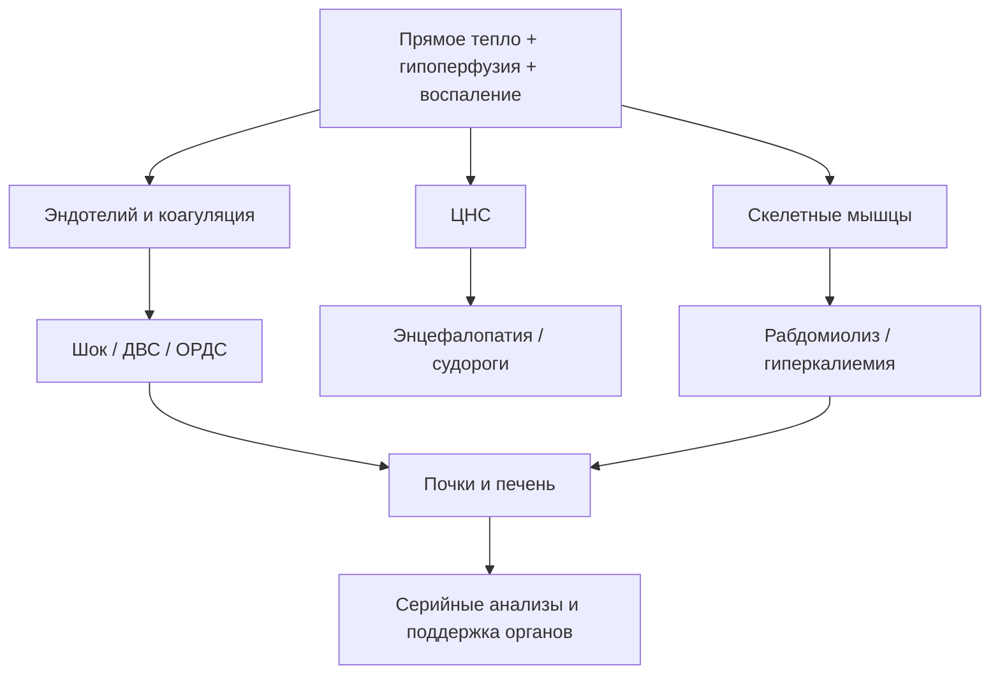
<!-- visual-summary:end -->
Гипертермический синдром — «быстрый» убийца. Эта глава посвящена оценке ущерба.
При T_core около 41 °C и выше риск неврологических, почечных, печёночных,
коагуляционных и кардиореспираторных осложнений резко возрастает — особенно при
длительном воздействии, шоке, судорогах и рабдомиолизе. Но перечисленные ниже
осложнения не являются неизбежными у каждого пациента: их нужно активно и
повторно **искать**, а не считать состоявшимися. Задача врача в ОРИТ — не только
«сбить температуру», но и вести серийный контроль по всему этому списку.

По сути, осложнения ГС — это клиническое проявление полиорганной недостаточности, вызванной прямым термическим повреждением, системным воспалением (SIRS), шоком и ДВС-синдромом.

## 8.1. Неврологические осложнения — орган-мишень № 1

Мозг наиболее чувствителен к гипертермии, отёку и гипоксии.

### 8.1.1. Судорожный синдром

**Механизм.** Судороги при ГС — следствие энцефалопатии. Причины: прямое термическое раздражение нейронов; отёк мозга с повышением ВЧД; электролитные нарушения (гипонатриемия, гипокальциемия); гипоксия; микротромбозы при ДВС; истощение ГАМК-ергического торможения при усилении глутаматергического возбуждения.

**Формы:**
- **Фебрильные судороги у детей.** Возникают у части детей примерно от
  6 месяцев до 5 лет. Простые — генерализованные, менее 15 минут и без повтора
  в течение 24 часов. Высокая цифра температуры сама по себе не переводит
  приступ в «сложный»; очаговость, длительность, повторение и неполное
  восстановление требуют срочной оценки.
  **Определённого температурного порога фебрильных судорог не существует** —
  приступ возможен при любой лихорадке, и представление о «критической цифре»
  ошибочно.
  Отдельный вопрос — профилактика жаропонижающими, и здесь данные расходятся.
  Плацебо-контролируемые исследования (ибупрофен, van Stuijvenberg 1998;
  Strengell 2009) **не показали** снижения частоты повторных фебрильных судорог
  при последующих эпизодах лихорадки. Позднее рандомизированное исследование
  ректального парацетамола (Murata et al., *Pediatrics* 2018) обнаружило меньшую
  частоту рецидива **в пределах того же лихорадочного эпизода** (9,1 % против
  23,5 %), однако систематические обзоры считают вопрос нерешённым.
  Практический вывод: назначать антипиретик **исключительно** ради профилактики
  судорог не следует, но применять его для комфорта ребёнка правомерно.
- **Генерализованные тонико-клонические судороги (Grand Mal):** потеря сознания, тоническая фаза, затем клоническая, прикус языка, непроизвольное мочеиспускание.
- **Эпилептический статус:** судороги длительностью более 5 минут либо серия приступов без восстановления сознания между ними.

> **Порочный круг:** гипертермия повышает риск судорог, а продолжающаяся
> мышечная активность увеличивает теплопродукцию и ацидоз.
> **Тактика:** продолжающийся приступ немедленно лечат по алгоритму
> эпилептического статуса, начиная с бензодиазепина.

### 8.1.2. Отёк головного мозга

**Механизмы:**
- *цитотоксический отёк* — энергетическая недостаточность нарушает работу
  Na⁺/K⁺-АТФазы, и вода накапливается внутри клеток;
- *вазогенный отёк* — повышение проницаемости гематоэнцефалического барьера
  приводит к выходу жидкости и белка в интерстиций;
- *интерстициальный отёк* как дополнительный компонент.

**Клинические проявления:** повышение внутричерепного давления — головная боль, рвота «фонтаном», отёк дисков зрительных нервов при офтальмоскопии; прогрессирующее угнетение сознания вплоть до комы; ухудшение мозгового кровотока и вторичная ишемия.

**Дислокационный синдром** — терминальное осложнение: отёчный мозг вклинивается в естественные отверстия черепа (вырезку намёта мозжечка, большое затылочное отверстие). Клинически: анизокория, брадикардия, арефлексия, нарушение и затем остановка дыхания. Исход — смерть.

### 8.1.3. Энцефалопатия

Дисфункция ЦНС — определяющий признак **теплового удара** и ключевой маркёр
тяжести опасной гипертермии в целом. Она складывается из прямого термического
повреждения, отёка и судорожной активности. Спектр нарушений сознания
простирается от лёгкой спутанности и делирия до сопора и глубокой комы (GCS = 3).
**Уровень угнетения сознания — прямой маркёр тяжести повреждения ЦНС.**
Проявления включают дезориентацию, нарушения памяти, внимания, координации, речи.

Однако для всех причин ГС энцефалопатия не обязательна в каждый момент времени:
при MH пациент обычно находится под анестезией, при раннем лекарственном
токсидроме сознание может быть ещё сохранено, а у седированного пациента ОРИТ
оценка попросту недоступна. Поэтому отсутствие явной энцефалопатии не должно
задерживать лечение при опасном контексте, гипертермии, гиперкапнии, ригидности,
клонусе, шоке или лабораторных признаках органного повреждения.

### 8.1.4. Необратимые поражения ЦНС у выживших

- **Мозжечковая атаксия — самое частое отдалённое последствие.** Клетки Пуркинье чрезвычайно чувствительны к гипертермии; пациент выживает, но остаётся «пьяная» походка, нарушение координации, нистагм.
- **Дизартрия** — стойкое нарушение речи.
- **Парезы и параличи** — реже, вследствие ишемических микроинсультов.
- **Когнитивные нарушения:** снижение памяти и внимания, «туман в голове», изменения личности, эмоциональная лабильность.
- **В тяжёлых случаях** — вегетативное состояние, апаллический синдром (декортикация), симптоматическая эпилепсия.

---

## 8.2. Кардиоваскулярные осложнения

Сердце работает в режиме «форсаж», одновременно пытаясь прокачать кровь через расширенный кожный «радиатор», компенсировать гиповолемию и функционировать в «токсичном бульоне» ацидоза, гиперкалиемии и цитокинов.

### 8.2.1. Аритмии

**Причины:**
- **гиперкалиемия вследствие рабдомиолиза — причина № 1 фатальных желудочковых аритмий**; также гипокалиемия и гипокальциемия;
- прямое термическое повреждение с нарушением работы ионных каналов кардиомиоцитов;
- ишемия миокарда на фоне шока или коронарного микротромбоза при ДВС;
- избыточная симпатическая стимуляция.

**Типы:** синусовая тахикардия (практически всегда); фибрилляция предсердий (часто, особенно при тиреотоксическом кризе), способная привести к тромбоэмболии; желудочковая экстрасистолия, желудочковая тахикардия, фибрилляция желудочков с исходом в клиническую смерть.

### 8.2.2. Острая сердечная недостаточность

**Систолическая дисфункция.** Механизм — «оглушение» миокарда (myocardial stunning): токсическое (гипертермия, цитокины) и ишемическое повреждение снижает сократимость левого желудочка, падает фракция выброса. Результат — кардиогенный шок или отёк лёгких с застоем в малом круге.

**Парадокс ОСН с высоким сердечным выбросом.** В ранней гипердинамической фазе, особенно при «красной» гипертермии, сердце качает очень много крови, но АД всё равно низкое из-за катастрофической периферической вазодилатации. Это дистрибутивный шок, и попытка «поднять давление» инотропами без волемической нагрузки здесь неэффективна.

### 8.2.3. Шок

При ГС шок носит **смешанный характер**:
- *гиповолемический* — потери с потом, рвотой, диареей;
- *дистрибутивный* — вазодилатация и синдром утечки;
- *кардиогенный* — прямое повреждение миокарда.

Клинически — гемодинамическая нестабильность, колебания АД и ЧСС, рефрактерная гипотензия, ишемия органов, прогрессирование ПОН.

---

## 8.3. Почечные осложнения — орган-мишень № 2

Почки принимают «тройной удар».

### 8.3.1. Острое повреждение почек (ОПП)

**Преренальное ОПП.** Гипоперфузия из-за гиповолемии, шока и централизации кровообращения; резко падает СКФ, развивается олигурия. Носит функциональный характер и потенциально обратимо при своевременном восстановлении перфузии.

**Ренальное ОПП (острый тубулярный некроз).** Три механизма: длительная ишемия с гибелью клеток канальцев; прямое термическое цитотоксическое повреждение эпителия; миоглобинурическое поражение (см. ниже). Возможен и гемоглобинурийный вариант при гемолизе.

**Внутриканальцевая обструкция** миоглобиновыми цилиндрами и кристаллами — это
часть ренального (внутрипочечного) механизма. Постренальным ОПП называют
нарушение оттока мочи ниже почки (мочеточник, мочевой пузырь, уретра); при
рабдомиолизе оно не возникает и в этом контексте термин неприменим.

### 8.3.2. Рабдомиолиз — ключевое осложнение

Массивное разрушение мышечной ткани при MH, НЗС и тепловом ударе при нагрузке. При MH и НЗС это сама суть болезни (непрерывная ригидность), при тепловом ударе — прямое термическое и ишемическое повреждение мышц.

**Что выходит в кровь из разрушенных миоцитов:** миоглобин, калий (гиперкалиемия), КФК (диагностический маркёр), фосфаты, мочевая кислота, актин и миозин, ЛДГ.

**Механизм повреждения почек:**
1. миоглобин фильтруется в клубочках и попадает в канальцы;
2. **в кислой среде — а у пациента метаболический ацидоз — миоглобин преципитирует** и забивает просвет канальцев, «как грязь трубу»;
3. параллельно он оказывает прямое токсическое действие на эпителий канальцев;
4. развивается острый тубулярный некроз, быстро прогрессирующий до анурии и требующий гемодиализа.

**Клинические маркёры:** тёмно-бурая моча цвета «кока-колы», экстремально высокая КФК (нередко > 100 000 Ед/л), гиперкалиемия, гипокальциемия, гиперфосфатемия.

**Практический ориентир нефропротекции.** Эта цепочка обосновывает раннюю оценку
объёмного статуса и **титрованное введение изотонического кристаллоида** (0,9 %
NaCl или сбалансированный раствор). Распространённый целевой ориентир — темп
диуреза около **1–2 мл/кг/ч** до снижения КФК и разрешения пигментурии.

Важные оговорки, без которых ориентир становится опасным:

- это **цель, достигаемая титрованием**, а не предписание вводить фиксированный
  большой объём: скорость и суммарный объём подбирают по гемодинамике,
  электролитам, сердечной и почечной функции и признакам перегрузки;
- у пожилых пациентов, при ХСН и уже развившейся олигурической ОПП стремление
  «додавить» диурез объёмом приводит к отёку лёгких;
- **рутинное ощелачивание мочи, маннитол и петлевые диуретики не показали
  доказанной пользы** для профилактики ОПП и могут навредить; их применяют только
  при отдельных самостоятельных показаниях (например, диуретики — для лечения
  подтверждённой перегрузки объёмом, а не для «вымывания» миоглобина).

---

## 8.4. Респираторные осложнения — орган-мишень № 3

**Острая дыхательная недостаточность:** гипоксемия (PaO₂ < 80 мм рт. ст.) и гиперкапния (PaCO₂ > 45 мм рт. ст.) — при MH за счёт гиперпродукции CO₂, при коме за счёт гиповентиляции.

**Отёк лёгких** бывает кардиогенным (следствие ОСН и застоя в малом круге) и некардиогенным (следствие «дырявых» капилляров).

**ОРДС.** Воспалительно-эндотелиальное повреждение повышает проницаемость
альвеолярно-капиллярного барьера, вызывает некардиогенный отёк и нарушает
газообмен. Дополнительный вклад вносят микроциркуляторные нарушения.

*Клиника:* острая гипоксемия, двусторонние затемнения, не полностью объяснимые
сердечной недостаточностью/перегрузкой, и снижение растяжимости лёгких.
Отношение PaO₂/FiO₂ интерпретируют вместе с уровнем PEEP по действующим
критериям. Тяжёлые формы требуют протективной ИВЛ; прогноз зависит от тяжести
ОРДС и основного заболевания.

---

## 8.5. Гематологические осложнения

### 8.5.1. ДВС-синдром

Классическое осложнение теплового удара, сепсиса и тяжёлого рабдомиолиза.

**Патофизиология — триада Вирхова:** повреждение эндотелия (термическое и цитокиновое) с активацией свёртывания; стаз крови при шоке; гиперкоагуляция вследствие массивного выброса DAMPs и тканевого фактора.

**Фаза 1 — микротромбозы.** По всему организму — в почках, лёгких, мозге, печени — образуются тысячи микротромбов, усугубляющих ПОН за счёт ишемии.

**Фаза 2 — коагулопатия потребления.** Тромбоциты и факторы свёртывания, прежде всего фибриноген, израсходованы на тромбообразование; параллельно активируется фибринолиз. Кровь теряет способность сворачиваться, начинаются фатальные кровотечения: желудочно-кишечные, из мест инъекций и послеоперационной раны, из слизистых, петехии и экхимозы, геморрагический инсульт.

**Лабораторная картина:** тромбоцитопения, снижение фибриногена, удлинение АЧТВ и ПВ/МНО, резкий рост D-димера и ПДФ.

### 8.5.2. Тромбоцитопения

Обусловлена потреблением тромбоцитов в ходе ДВС. Снижение тромбоцитов ниже 150 000/мкл в динамике — грозный ранний признак развивающегося ДВС, требующий немедленного внимания даже при отсутствии клинической кровоточивости.

---

## 8.6. Печёночные осложнения

Печень — «горячий цех» метаболизма, страдающий одновременно от гипоперфузии при шоке и от прямого термического некроза гепатоцитов.

**Дисфункция печени.** Маркёры: резкий «взлёт» АСТ и АЛТ — нередко до 10 000–20 000 Ед/л и выше, что отражает массивный цитолиз; рост билирубина; снижение синтеза альбумина; диспротеинемия.

**Острая печёночная недостаточность:**
- *желтуха* вследствие роста билирубина;
- *гипогликемия* — печень не способна синтезировать глюкозу;
- *коагулопатия* — не синтезируются новые факторы свёртывания, что усугубляет ДВС;
- *печёночная энцефалопатия* из-за накопления аммиака, наслаивающаяся на термическую энцефалопатию;
- *асцит*, нарушение детоксикации.

В крайних случаях обсуждается вопрос о трансплантации печени.

---

## 8.7. Метаболические нарушения

**Дегидратация и гиповолемия.** Потери с потом и дыханием, рвота, диарея и
перераспределение жидкости могут снизить перфузию и способствовать
преренальному ОПП.

**Электролитные расстройства:**
- **гиперкалиемия** — самое опасное нарушение (рабдомиолиз, ОПП);
- гипокалиемия — потери с потом и рвотой на ранних этапах;
- гипернатриемия (потеря воды преобладает над потерей соли) или гипонатриемия (при восполнении потерь чистой водой);
- гипокальциемия — связывание кальция с фосфатами при рабдомиолизе.

**Метаболический ацидоз:** лактат-ацидоз из-за гипоперфузии и гиперметаболизма; кетоацидоз при истощении гликогена; почечный компонент — ОПП не позволяет выводить H⁺ и регенерировать бикарбонат. Итог — падение pH ниже 7,35 и HCO₃⁻ ниже 22 мЭкв/л с угнетением функции ферментов, сердца, мозга и почек.

---

## 8.8. Полиорганная недостаточность

**СПОН (MODS)** — финальный общий путь для всех тяжёлых форм ГС. Это не отдельное осложнение, а **сумма** всех перечисленных выше.

*Взаимосвязь:* воспаление, шок, коагулопатия и рабдомиолиз могут одновременно
повреждать лёгкие, почки, печень и ЦНС; это отражено в схеме в начале главы.

*Критерий:* дисфункция двух и более систем органов.

*Особенность течения:* при тепловом ударе и MH органные нарушения могут
развиваться быстро, а часть повреждения печени, почек и коагуляции проявляется
отсроченно. Поэтому раннее улучшение температуры не завершает наблюдение.

*Прогноз:* СПОН резко ухудшает исход; риск зависит от причины, тяжести и длительности дисфункций, возраста и резерва. Универсальная прибавка летальности на каждый орган для всех популяций не установлена.

---

## 8.9. Летальный исход

**Причины смерти в остром периоде (первые часы):**
- фатальная аритмия вследствие гиперкалиемии и ишемии;
- отёк мозга с дислокацией и вклинением;
- рефрактерный шок — кардиогенный, дистрибутивный или смешанный.

**Причины смерти в отсроченном периоде (дни–недели):**
- необратимая полиорганная недостаточность;
- ДВС-синдром — фатальное кровотечение либо распространённый тромбоз;
- вторичные инфекции: нозокомиальная пневмония, сепсис на фоне бактериальной транслокации из «дырявого» кишечника;
- острая печёночная недостаточность.

**Факторы, определяющие летальность:**
- **максимальная достигнутая температура** — выше 42 °C крайне неблагоприятно;
- **длительность гипертермии** — чем дольше сохраняется высокая температура,
  тем больше тепловая доза; универсального временного порога необратимости нет;
- **время до эффективного охлаждения** — задержка увеличивает тепловую дозу и риск осложнений, но единый процент на каждый час неприменим ко всем формам;
- наличие осложнений — ДВС, рабдомиолиз, ОРДС;
- возраст — дети младше 3 месяцев и пациенты старше 65 лет;
- преморбидный фон и сопутствующие заболевания.

## Выводы по главе 8

**ГС — это системное отравление.** Гипертермия выше 41 °C представляет собой универсальный цитотоксический яд, запускающий каскад, идентичный тяжелейшему сепсису или политравме.

**Ключевые осложнения = мишени терапии.** «Большая четвёрка», требующая немедленного вмешательства:
- **неврологические** — отёк мозга и судороги;
- **почечные** — рабдомиолиз и ОПП (требуют оценки перфузии, осторожной инфузии и серийного контроля; не рутинного форсированного диуреза);
- **гематологические** — ДВС-синдром (требует коррекции коагулопатии);
- **кардиореспираторные** — шок и ОРДС (требуют гемодинамической и респираторной поддержки).

**Гиперкалиемия — «тихий убийца».** При рабдомиолизе на фоне MH, НЗС и теплового удара при нагрузке она способна убить пациента раньше самой температуры, поэтому ЭКГ-мониторинг и контроль калия обязательны с первых минут.

**Отсроченные последствия существуют.** Даже у выживших мозжечковая атаксия, когнитивные нарушения и хроническая болезнь почек могут остаться на всю жизнь — что делает скорость охлаждения вопросом не только выживания, но и качества жизни.

**Переход.** Мы знаем, почему возникает ГС, как он развивается, что мы видим, как отличить одну форму от другой и чего боимся. Настало время главного вопроса: как спасать этого пациента.

---

# Глава 9. Неотложная помощь и лечение

<!-- visual-summary:start -->

### Схема для запоминания

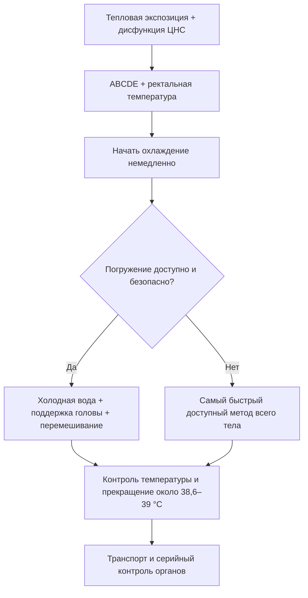

> [!IMPORTANT]
> Мраморность или холодные конечности требуют оценки шока и перфузии, но не
> являются основанием откладывать эффективное охлаждение при тепловом ударе.
<!-- visual-summary:end -->
Тяжёлая гипертермия — неотложное состояние: исход во многом определяется
продолжительностью тепловой нагрузки и скоростью начала эффективного охлаждения.
Однако единого температурного порога необратимости и универсального прироста
летальности «за каждый час» не существует. Действовать нужно немедленно, не
дожидаясь полной лабораторной верификации причины.

**Терапия ГС стоит на трёх китах, которые выполняются ОДНОВРЕМЕННО, а не последовательно:**

1. **поддержка витальных функций** (ABCDE);
2. **немедленное агрессивное охлаждение**;
3. **этиологическая терапия** — устранение причины и, когда существует
   доказанная специфическая терапия, её раннее применение.

---

## 9.1. Общие принципы: алгоритм ABCDE

**A (Airway) — дыхательные пути.**
*Оценка:* проходимы ли? Нет ли рвотных масс, прикуса языка после судорог, тризма при MH?
*Действие:* интубация показана при невозможности защитить дыхательные пути,
недостаточной вентиляции/оксигенации, рефрактерных судорогах или необходимости
контролируемой нейромышечной блокады. Решение не принимают автоматически по
одной оценке GCS.

**B (Breathing) — дыхание.**
*Оценка:* тахипноэ, гипоксемия, влажные хрипы (ОРДС).
*Действие:* кислород и вентиляцию титруют по оксигенации, газам крови и
сопутствующему поражению лёгких. При MH используют высокий поток 100 % O₂ и
увеличивают минутную вентиляцию для контроля резко повышенного CO₂. Рутинная
гипервентиляция остальных пациентов не лечит метаболический ацидоз и может
ухудшить мозговой кровоток.

**C (Circulation) — кровообращение.**
*Оценка:* тахикардия, гипотензия, признаки шока.
*Действие:* немедленный венозный доступ — 2–3 периферических катетера большого диаметра (G14–G16) либо центральный венозный катетер; инфузионная терапия; при рефрактерной гипотензии — вазопрессоры. Непрерывный мониторинг ЭКГ (критически важен из-за риска гиперкалиемии) и инвазивный мониторинг АД при шоке.
*Целевые показатели:* систолическое АД > 90 мм рт. ст., среднее АД > 65 мм рт. ст., диурез > 0,5 мл/кг/ч.

**D (Disability) — неврологический статус.**
*Оценка:* уровень сознания по GCS, зрачки, мышечный тонус, судороги.
*Действие:* немедленное купирование судорог — диазепам 0,1–0,2 мг/кг внутривенно (до 10 мг) или лоразепам 0,05–0,1 мг/кг (до 4 мг), при необходимости повторно через 5–10 минут.

**E (Exposure / Environment) — осмотр и устранение причины.**
1. полностью **раздеть** пациента;
2. немедленно измерить **T_core ректально**;
3. оценить цвет, влажность, перфузию и признаки шока;
4. **немедленно устранить причину:**
   - *тепловой удар* — эвакуация из жаркой среды: вынести с солнца, из машины, остановить забег;
   - *MH* — прекратить подачу **всех** ингаляционных анестетиков, продуть контур 100 % кислородом, по возможности прервать или свернуть операцию;
   - *НЗС, серотониновый синдром, антихолинергический синдром* — отменить все подозреваемые препараты;
   - *судороги* — купировать немедленно, поскольку они сами являются мощным источником тепла.

### Показания к неотложной помощи

**Поводы немедленно начать помощь и экстренную оценку:**
- тепловая экспозиция с изменением сознания — независимо от того, успела ли
  измеренная температура превысить 40 °C;
- высокая температура с признаками гипоперфузии или шока;
- высокая температура с судорогами;
- ректальная температура 38,0 °C и выше у младенца младше 3 месяцев требует
  срочной медицинской оценки по отдельному педиатрическому алгоритму;
- любое подозрение на MH, НЗС или серотониновый синдром;
- любые признаки органной дисфункции.

---

## 9.2. Физическое охлаждение

Камень преткновения всей терапии. Цель — как можно быстрее уменьшить тепловую
дозу и не допустить переохлаждения. В обзорах скорость не менее 0,15 °C/мин
часто используют как ориентир адекватного метода при тепловом ударе на нагрузке,
но реальная эффективность зависит от пациента, условий и техники.

**Общие мероприятия:** раздеть пациента, переместить в прохладное помещение, включить кондиционер, обеспечить движение воздуха.

> [!CAUTION]
> Цвет кожи не является противопоказанием к охлаждению при тепловом ударе.
> При шоке одновременно поддерживают перфузию и выбирают метод, сохраняющий
> доступ к дыхательным путям и реанимации.

### 9.2.1. Наружное охлаждение

**Эвапоративное охлаждение (испарение) — основная альтернатива, когда погружение
недоступно, а также частый метод выбора при классическом тепловом ударе у
пожилых и при нестабильной гемодинамике.**
*Методика «опрыскивание + обдувание»:* тело опрыскивают водой комнатной температуры (20–25 °C) из пульверизатора или накрывают влажной простынёй; направляют на пациента мощный вентилятор.
*Почему работает:* испаряясь, вода забирает огромное количество тепла (скрытая теплота парообразования), а вентилятор сдувает влажный пограничный слой воздуха, ускоряя испарение.
*Температура воды:* для испарительного метода используют мелкодисперсное
смачивание и мощный поток воздуха. Ледяная вода здесь не нужна, но это не
означает, что холодная вода «запирает тепло»: погружение в холодную воду остаётся
самым быстрым методом для теплового удара на нагрузке.
*Эффективность:* около 0,05–0,1 °C в минуту — ниже, чем при погружении, но метод переносится лучше и не мешает реанимационным мероприятиям.

**Применение холода (кондукция).**
*Методика:* пузыри со льдом на проекции магистральных сосудов, где они лежат близко к коже: подмышечные впадины (a. axillaris), паховые складки (a. femoralis), боковые поверхности шеи (a. carotis); дополнительно — лоб, подколенные ямки, локтевые сгибы.
*Цель:* увеличить локальный кондуктивный теплоотвод как дополнение; идея
«охладить кровь в магистральной артерии» чрезмерно упрощает механизм.
*Техника:* лёд обернуть тонкой тканью во избежание локального обморожения, менять компрессы каждые 10–15 минут.
*Эффективность:* отдельные пакеты со льдом обычно охлаждают медленнее, чем
погружение, и не должны быть единственным методом при тепловом ударе.

**Погружение в холодную воду (Cold Water Immersion, CWI).**
*Показание:* **метод выбора при тепловом ударе при физической нагрузке** у молодых пациентов — спортсменов, военнослужащих.
*Методика:* погружение в ванну с холодной водой; в источниках указываются диапазоны 2–15 °C и 4–15 °C, при использовании прохладной воды — 20–25 °C. Современные протоколы спортивной медицины рекомендуют поддерживать температуру воды около 10 °C и погружать тело от шеи вниз.
*Эффективность:* самый быстрый метод наружного охлаждения — 0,2–0,3 °C в минуту и выше (по данным исследований в военных и спортивных популяциях — 0,15–0,35 °C в минуту), поскольку теплопроводность воды примерно в 25 раз выше, чем у воздуха.
*Ограничения:* нужна ёмкость и обученная команда; голову и дыхательные пути
держат над водой, воду перемешивают, температуру контролируют ректально.
Необходимость дефибрилляции или компрессий требует немедленного безопасного
доступа и может изменить метод. Риск переохлаждения снижают своевременной
остановкой.

> [!IMPORTANT]
> **Принцип «cool first, transport second».** Для теплового удара при нагрузке ведущие профильные организации (NATA, NAEMSP, Korey Stringer Institute) рекомендуют начинать охлаждение на месте и продолжать его до достижения безопасной температуры **до** транспортировки, а не наоборот. Целевой ориентир — снижение ректальной температуры ниже 38,6–38,9 °C, в идеале в течение 30 минут от начала эпизода. Это прямо противоположно обычной логике «хватай и вези» и оправдано тем, что исход определяется именно временем, проведённым выше критического порога.

**Охлаждающие одеяла.** Специальные медицинские системы с циркулирующей холодной водой (например, ArcticSun). Преимущество — управляемая, контролируемая гипотермия с обратной связью по температуре пациента. Недостатки: требуют времени на развёртывание, доступны не везде.

### 9.2.2. Внутреннее (инвазивное) охлаждение

Инвазивное охлаждение не является рутинной первой линией при тепловом ударе.
Его обсуждают в ОРИТ при рефрактерном состоянии или когда экстракорпоральная
поддержка нужна по самостоятельным показаниям.

**Охлаждённый изотонический кристаллоид** может дополнять охлаждение, если
пациенту действительно требуется восполнение объёма (и входит в алгоритмы MH).
Объём и скорость титруют по перфузии, электролитам, сердечной/почечной функции;
холодная жидкость не заменяет охлаждение всего тела и не требует центрального
доступа сама по себе.

**Лаваж желудка или мочевого пузыря** имеет небольшую теплообменную поверхность,
добавляет процедурный риск и рутинно не рекомендуется. Перитонеальный или
плевральный лаваж — исключительные спасительные вмешательства, а не следующий
шаг стандартного алгоритма.

**Внутрисосудистые теплообменные катетеры (intravascular TTM).** Многопросветный
баллонный катетер в полой вене обеспечивает точный контроль температуры с
обратной связью и применяется в ОРИТ, когда наружное охлаждение недоступно,
неэффективно или несовместимо с проводимыми вмешательствами.

> [!WARNING]
> Два распространённых заблуждения. Во-первых, внутрисосудистое охлаждение
> **не устраняет дрожь**: как и любое охлаждение, оно провоцирует
> терморегуляторный ответ, и потребность в седации сохраняется. Во-вторых,
> типичная скорость таких систем — порядка 0,5–1,5 °C/ч, что **медленнее**
> погружения в холодную воду. Для догоспитального теплового удара на нагрузке
> они не альтернатива CWI, а инструмент последующего управления температурой.

**Экстракорпоральные методы.** ЭКМО или CRRT могут изменять температуру, но их
начинают из-за рефрактерного шока, дыхательной или почечной недостаточности,
а не по одному температурному порогу. Утверждения о том, что подключение контура
«снижает температуру ядра за 10–15 минут», не следует переносить в клинический
алгоритм: данные об экстракорпоральной поддержке как о самостоятельном методе
охлаждения ограничены сериями случаев, а сама процедура несёт значимые риски.

### 9.2.3. Целевая температура и контроль дрожи

Для теплового удара на нагрузке распространённый ориентир прекращения активного
охлаждения — ректальная температура около **38,6–39,0 °C**; в алгоритмах MH
EMHG прекращает активное охлаждение ниже 38,5 °C. Цель уточняют по причине и
локальному протоколу.

> [!CAUTION]
> **Останавливаются заранее, а не на «нормальной» температуре.** Активное
> охлаждение прекращают в целевом диапазоне (при тепловом ударе — ориентировочно
> 38,6–39,0 °C, при MH — по алгоритму MHAUS/EMHG), а не при 37,0 °C. Причина —
> инерция процесса (overshoot): тело продолжает остывать самостоятельно, и
> пациент «проскакивает» в ятрогенную гипотермию (< 35 °C), которая опасна
> аритмиями, коагулопатией, дрожью и замедлением восстановления.
> Единой цифры «СТОП» для всех форм гипертермии, возрастов и методов нет —
> ориентир выбирают по причине и локальному протоколу при непрерывном контроле
> температуры ядра.

Главная опасность — недостаточно быстрое охлаждение и поздняя остановка, а не
достижение эффективной скорости само по себе.

**Контроль дрожи.** Сначала оптимизируют технику и комфорт. Если дрожь или
мышечная гиперактивность мешает лечению, седацию и при необходимости
недеполяризующую нейромышечную блокаду проводят с полноценным контролем
дыхательных путей; универсальная лекарственная схема здесь неуместна.

---

## 9.3. Единый алгоритм охлаждения при подозрении на тепловой удар

1. **ABCDE, мониторинг, температура ядра.**
2. **Устранить тепловую нагрузку и снять лишнюю одежду/экипировку.**
3. **Начать самый быстрый доступный эффективный метод:** при нагрузочной форме
   предпочтительно погружение в холодную воду; если оно невозможно —
   испарительно-конвективное охлаждение, ледяные полотенца/простыни или иной
   протокольный метод всего тела.
4. **Сохранять доступ к голове и дыхательным путям**, перемешивать воду при
   погружении, непрерывно контролировать ректальную температуру.
5. **Остановить активное охлаждение у целевого диапазона**, продолжить
   транспорт, мониторинг и поиск осложнений.
6. **Титровать жидкость по перфузии и потерям.** Пациент с нарушенным сознанием
   не получает питьё через рот.

Антипиретики не устраняют механизм непирогенного теплового удара.

---

## 9.4. Что делать при мраморности и холодных конечностях

Это признаки возможной гипоперфузии, а не отдельный тип гипертермии.

1. Повторно оценить ABCDE, пульс, капиллярное наполнение, давление, лактат,
   диурез и причины шока.
2. Начать поддержку перфузии по общим принципам и обеспечить надёжный доступ.
3. Продолжать эффективное охлаждение при тепловом ударе, выбирая метод,
   совместимый с реанимацией и мониторингом.
4. Не задерживать охлаждение ради дротаверина, папаверина, «литической смеси»,
   никотиновой кислоты, растирания или согревания конечностей: эти действия не
   входят в доказательные алгоритмы теплового удара.

---

## 9.5. Общая медикаментозная терапия

### 9.5.1. Антипиретики

Парацетамол, ибупрофен и другие НПВС, селективные ингибиторы ЦОГ-2.

*Механизм:* ингибирование циклооксигеназы снижает синтез простагландинов и
возвращает повышенную при лихорадке установочную точку вниз.

*Дозы (при лихорадке):* парацетамол 10–15 мг/кг у детей и 500–1000 мг у взрослых (максимум 4000 мг/сут); ибупрофен 5–10 мг/кг у детей и 200–400 мг у взрослых; напроксен 5–7 мг/кг у детей, 250–500 мг у взрослых. Пути введения: внутрь, ректально, внутривенно (парацетамол).

> [!CAUTION]
> **При истинной гипертермии антипиретики не устраняют механизм перегрева.**
> Они могут добавить риск при поражении печени, почек или нарушении гемостаза,
> поэтому не должны отвлекать от охлаждения и этиологического лечения.
> **Вывод: при тепловом ударе, MH, НЗС и серотониновом синдроме антипиретики не применяются.**

### 9.5.2. Инфузионная терапия

*Цели:* восполнение подтверждённой гиповолемии, поддержка перфузии, коррекция
КОС и электролитов. Охлаждённый кристаллоид может быть дополнением, но не заменой
охлаждения всего тела.

*Объёмы:* изотонические кристаллоиды вводят небольшими повторно оцениваемыми
болюсами при гипоперфузии. Темп и суммарный объём титруют по гемодинамике,
диурезу, электролитам, ультразвуковым/клиническим признакам перегрузки и фоновой
сердечной или почечной патологии.

*Коррекция метаболического ацидоза:* прежде всего устраняют гипоперфузию,
гипоксию, судороги и продолжающуюся теплопродукцию. Бикарбонат не вводят
рутинно по одному уровню лактата или для профилактики ОПП; его применение
обсуждают при отдельных тяжёлых нарушениях КОС/гиперкалиемии с серийным
контролем газов крови и электролитов.

### 9.5.3. Седативная терапия

*Цель:* купирование психомоторного возбуждения и делирия, которые сами генерируют тепло, а также купирование дрожи при охлаждении.

*Препараты выбора:* бензодиазепины внутривенно — диазепам 0,1–0,2 мг/кг (до 10 мг), мидазолам 0,05–0,1 мг/кг, лоразепам 0,05–0,1 мг/кг (до 4 мг). Механизм — потенцирование ГАМК-ергического торможения с седативным и противосудорожным эффектом.

### 9.5.4. Противосудорожная терапия

*Цель:* немедленно прекратить судороги, которые сами увеличивают
теплопродукцию.

- **1-я линия:** бензодиазепины внутривенно болюсно (диазепам, лоразепам).
- **2-я линия:** фенитоин 15–20 мг/кг (максимум 1000 мг), вальпроевая кислота 15–20 мг/кг, леветирацетам 20–60 мг/кг внутривенно.
- **При эпилептическом статусе:** общая анестезия — тиопентал, пропофол, барбитураты.

### 9.5.5. Почему вазодилататоры не входят в стандартный алгоритм охлаждения

Мраморность, холодные конечности и замедленное капиллярное наполнение могут
указывать на гипоперфузию, но не образуют отдельный тип гипертермии, который
нужно сначала лечить спазмолитиком. Для хлорпромазина, доксазозина, дротаверина
или папаверина нет доказанной роли в ускорении безопасного охлаждения при
тепловом ударе. Они способны усугубить гипотензию. Приоритеты — эффективное
охлаждение, оценка шока и титрованная поддержка перфузии.

---

## 9.6. Этиологическая и специфическая терапия

Специфический препарат с доказанной обязательной ролью есть при MH — дантролен.

> [!WARNING]
> **Дантролен не является средством лечения теплового удара.** В
> плацебо-контролируемом исследовании (n = 52) добавление дантролена к
> испарительному охлаждению не увеличило скорость охлаждения. Руководство
> Society of Critical Care Medicine по лечению теплового удара (2025,
> DOI 10.1097/CCM.0000000000006551) формулирует это прямо: доказательств в пользу
> фармакологических вмешательств, влияющих на температуру, при тепловом ударе
> нет, и их следует избегать. Единственное исключение — обоснованное подозрение
> на MH (анестезиологический триггер либо известная предрасположенность, в том
> числе при перекрёсте с тепловым ударом на нагрузке). Введение дантролена
> никогда не заменяет и не откладывает физическое охлаждение.
При других синдромах основой остаются отмена триггера и интенсивная
поддерживающая терапия; фармакологические дополнения выбирают индивидуально.

### 9.6.1. Злокачественная гипертермия — дантролен

**Механизм.** Дантролен — прямой мышечный релаксант, блокирующий рианодиновые рецепторы RYR1 и прекращающий неконтролируемое высвобождение Ca²⁺ из саркоплазматического ретикулума: он «перекрывает кран» с кальцием.

**Дозировка:**
- *начальная:* 2,5 мг/кг внутривенно болюсно, быстро;
- *повторные:* если ригидность и рост EtCO₂ сохраняются — по 1–2,5 мг/кг каждые 5–10 минут до регресса симптомов;
- *максимальная:* до 10 мг/кг; при фульминантном течении рекомендованный максимум **может потребоваться превысить** — по рекомендациям Европейской группы по злокачественной гипертермии (EMHG) и MHAUS доза свыше 10 мг/кг допустима при персистирующей ригидности;
- *после купирования:* поддерживающую дозу или инфузию назначают по актуальному
  протоколу MHAUS/EMHG и клинической динамике из-за риска рецидива.

**Техника:** препарат разводится в стерильной воде (классический флакон содержит 20 мг дантролена, что требует разведения большого числа флаконов — для взрослого пациента может понадобиться 36 и более); современная форма (нанокристаллическая суспензия) готовится значительно быстрее.

**Ответ оценивают** по снижению EtCO₂/PaCO₂ при неизменной вентиляции,
уменьшению ригидности, стабилизации температуры, калия, КОС и гемодинамики.
Если после больших суммарных доз ответа нет, параллельно пересматривают диагноз.

**Побочные эффекты:** мышечная слабость, головокружение, тошнота, рвота, флебит в месте введения.

**Протокол MH (MHAUS):**
1. **СТОП** — прекратить подачу всех галогенсодержащих анестетиков и
   сукцинилхолина, перейти на безтриггерную поддержку (пропофол, опиоиды,
   недеполяризующие миорелаксанты); вентилировать высоким потоком (> 10 л/мин)
   100 % кислорода. Не тратить время на замену наркозного аппарата: по
   современным рекомендациям **активированные угольные фильтры устанавливают на
   оба колена контура — инспираторное и экспираторное**, что позволяет быстро
   снизить концентрацию анестетика на имеющемся аппарате. Высокий поток свежего
   газа поддерживают и дальше, иначе возможен возврат агента из внутренних
   элементов аппарата;
2. **позвать на помощь** — для полноценного ведения криза требуется 5–6 человек;
3. **дантролен 2,5 мг/кг** внутривенно немедленно;
4. **гипервентиляция 100 % кислородом**;
5. **охлаждение** — внутреннее и наружное;
6. **коррекция ацидоза** (бикарбонат) **и гиперкалиемии** (глюкозо-инсулиновая смесь, кальция глюконат);
7. **защита почек** — титрованные кристаллоиды при показаниях, серийный контроль
   калия, креатинина и диуреза; без рутинного маннитола или бикарбоната;
8. непрерывный мониторинг, продолжение наблюдения в ОРИТ не менее 24 часов из-за риска рецидива.

Организационное требование: дантролен должен быть доступен везде, где применяются ингаляционные анестетики или сукцинилхолин, с возможностью введения первой дозы **в течение 10 минут** от появления первых признаков MH.

### 9.6.2. Нейролептический злокачественный синдром

- **Шаг 1:** отмена всех нейролептиков (либо возобновление отменённой дофаминергической терапии, если НЗС спровоцирован отменой леводопы).
- **Шаг 2:** поддерживающая терапия — охлаждение, ИВЛ при показаниях, инфузия, коррекция электролитов.
- **Шаг 3:** при тяжёлом или рефрактерном течении — консультация
  токсиколога/реаниматолога и индивидуальное обсуждение бромокриптина,
  амантадина, дантролена или ЭСТ. Доказательства этих вмешательств основаны
  преимущественно на наблюдательных данных и описаниях случаев; порог КФК сам
  по себе не является показанием к дантролену.
- **Бензодиазепины** особенно полезны, когда в дифференциальном диагнозе остаётся
  злокачественная кататония.

Лечение НЗС длительное — дни и недели; необходим мониторинг КФК, электролитов и функции почек.

### 9.6.3. Серотониновый синдром

- **Шаг 1:** отмена всех серотонинергических препаратов.
- **Шаг 2:** поддерживающая терапия — охлаждение, седация бензодиазепинами (они же купируют миоклонус и ригидность).
- **Шаг 3:** при сохраняющихся проявлениях умеренного/тяжёлого синдрома можно
  рассмотреть энтеральный **ципрогептадин** как дополнение. Он не заменяет
  седацию, контроль температуры, дыхательных путей и прекращение мышечной
  активности; качественных сравнительных испытаний мало.

  *Наиболее цитируемый режим:* начальная доза 12 мг внутрь или через
  назогастральный зонд, далее по 2 мг каждые 2 часа при сохраняющихся симптомах;
  поддерживающая доза 8 мг каждые 6 часов, суммарно не более 32 мг в сутки.
  Внутривенной формы не существует, поэтому у интубированного пациента препарат
  вводят только через зонд. Режим взят из описательных публикаций, а не из
  контролируемых испытаний, — это дополнение к поддержке, а не антидот.

При короткодействующем причинном препарате симптомы часто регрессируют в
пределах суток, но течение зависит от периода полувыведения, активных
метаболитов и осложнений. Неидентифицируемые или искажённые названия препаратов
не должны переноситься в клинический алгоритм.

### 9.6.4. Гипертермия при повреждении ЦНС

*Проблема:* центральная лихорадка/гипертермия — диагноз исключения после
повреждения ЦНС; инфекцию и лекарственные причины оценивают параллельно.
*Лечение:* контролируемое физическое охлаждение при необходимости и лечение
основного заболевания. Инвазивные методы не являются автоматической следующей
ступенью, а «нейропротекция» не обозначает один доказанный препарат.

### 9.6.5. Эндокринные кризы

**Тиреотоксический криз — принцип «блокада 4 в 1»:**
1. **блокада синтеза** — тиреостатики: пропилтиоурацил 100–150 мг 3 раза в сутки внутрь или тиамазол — **первый шаг**;
2. **блокада выхода гормонов** — йодиды (раствор Люголя, калия йодид 50–100 мг 3 раза в сутки) **строго через 1 час после тиреостатиков**, иначе йод станет «топливом» для синтеза гормонов;
3. **блокада симптомов** — бета-блокаторы: пропранолол 40–80 мг 3 раза в сутки внутрь или внутривенно, для купирования тахикардии и аритмий;
4. **блокада периферической конверсии Т4 → Т3** — глюкокортикоиды: дексаметазон 2 мг 4 раза в сутки внутривенно или гидрокортизон.
Плюс агрессивное охлаждение и инфузионная терапия.

**Феохромоцитома (криз):**
1. **альфа-блокада** — фентоламин 5–10 мг внутривенно, феноксибензамин 10 мг 2–3 раза в сутки внутрь;
2. **бета-блокада** — пропранолол **строго после** альфа-блокады: обратный порядок ведёт к неконтролируемой альфа-стимуляции и катастрофическому росту АД;
3. охлаждение, в плановом порядке — хирургическое удаление опухоли.

---

## 9.7. Поддерживающая и симптоматическая терапия

### 9.7.1. Коррекция электролитов и КОС

*Мониторинг:* повторные анализы каждые 2–4 часа в острой фазе — натрий, калий, кальций, магний, КОС.

**Лечение гиперкалиемии** (жизнеугрожающее состояние при рабдомиолизе):
- **кальция глюконат 10 % 10–20 мл внутривенно** — защита миокарда (не снижает калий, но стабилизирует мембрану кардиомиоцита);
- **глюкозо-инсулиновая смесь** — перемещение K⁺ внутрь клетки;
- **натрия бикарбонат** — тот же эффект, особенно на фоне ацидоза;
- при неэффективности — экстренный гемодиализ.

**Гипонатриемия при тепловой болезни — отдельная ловушка.** У выносливостных
спортсменов, военнослужащих и работников в жаре встречается
**связанная с нагрузкой гипонатриемия** (exercise-associated hyponatremia):
она развивается при питье сверх потерь и клинически имитирует тепловой удар —
спутанность, головная боль, рвота, судороги. Отличить её без анализа натрия
невозможно, поэтому натрий определяют рано.

- При **симптомной гипонатриемии** (Na⁺ ≤ 130 ммоль/л с неврологическими
  проявлениями) применяют **гипертонический 3 % NaCl болюсами по 100 мл**,
  до трёх болюсов с интервалом около 10 минут, ориентируясь на регресс
  симптомов, а не на достижение «нормы».
- **Гипотонические растворы (5 % декстроза, 0,45 % NaCl) при этом
  противопоказаны** — они усугубляют отёк мозга.
- Скорость коррекции контролируют: чрезмерно быстрый подъём натрия при
  хронической гипонатриемии несёт риск осмотического демиелинизирующего
  синдрома. При остро развившейся нагрузочной гипонатриемии этот риск
  существенно ниже, а промедление опаснее.

Прочие коррекции: при гипернатриемии — осторожное восполнение свободной воды с контролем скорости снижения натрия; при гипокалиемии — препараты калия; при гипокальциемии — осторожно, поскольку при рабдомиолизе кальций может «отдаться» обратно в фазу восстановления.

*Контроль гликемии:* целевой уровень 140–180 мг/дл, инсулин по потребности.

### 9.7.2. Профилактика и раннее выявление ОПП при рабдомиолизе

1. Устранить причину мышечного повреждения и корректировать гиповолемию
   изотоническими кристаллоидами.
2. Титровать инфузию по возрасту, массе, гемодинамике, диурезу и признакам
   перегрузки; единая скорость для всех пациентов небезопасна.
3. Серийно контролировать калий, креатинин, КОС, КФК, баланс жидкости и ЭКГ.
4. Рутинное применение бикарбоната или маннитола для профилактики ОПП не
   поддерживается имеющимися клиническими данными. Диуретики применяют для
   лечения перегрузки объёмом, а не для «вымывания» миоглобина.
5. Рано консультировать нефролога при нарастающей ОПП, рефрактерной
   гиперкалиемии, ацидозе или перегрузке жидкостью.

### 9.7.3. Антиаритмическая терапия

Амиодарон 300 мг внутривенно болюсно, при необходимости 150 мг повторно через 10–15 минут; лидокаин 1–1,5 мг/кг внутривенно болюсно. **Обязательное условие: параллельная коррекция электролитов** — гиперкалиемии, гипокалиемии, гипомагниемии; без неё антиаритмики неэффективны.

### 9.7.4. Коррекция ДВС-синдрома

- **свежезамороженная плазма** 10–15 мл/кг — восполнение факторов свёртывания;
- **тромбоконцентрат** — из расчёта примерно 1 доза на 10 кг массы тела;
- **криопреципитат** при выраженной гипофибриногенемии;
- антикоагуляцию не назначают автоматически по факту ДВС: решение принимают
  по клиническому фенотипу, кровотечению/тромбозу и отдельным показаниям.

### 9.7.5. Лечение органной недостаточности

Гемодиализ или CRRT при ОПП; протективная ИВЛ при ОРДС; инотропы и вазопрессоры при сердечной недостаточности и шоке; терапия печёночной недостаточности.

---

## 9.8. Интенсивная терапия при тяжёлых формах

**Респираторная поддержка.** Кислородотерапия с целевой SpO₂ > 94 %; неинвазивная вентиляция (CPAP, BiPAP) при умеренной гипоксемии; ИВЛ при коме, судорогах, невозможности защиты дыхательных путей, ОРДС. **Протективная вентиляция при ОРДС:** дыхательный объём 6–8 мл/кг идеальной массы тела, PEEP 5–15 см H₂O, прон-позиция при рефрактерной гипоксемии, седация и при необходимости миоплегия.

**Гемодинамическая поддержка:**
- *1-я линия* — инфузия, «заполнение» расширенного сосудистого русла;
- *2-я линия* — вазопрессоры при рефрактерной гипотензии: норадреналин 0,01–0,5 мкг/кг/мин, при необходимости адреналин 0,01–0,5 мкг/кг/мин, дофамин 2–20 мкг/кг/мин;
- *3-я линия* — инотропы при систолической дисфункции: добутамин 2–20 мкг/кг/мин, милринон 0,25–0,75 мкг/кг/мин.

**Заместительная почечная терапия.** Решение основывают на клинике: рефрактерной
гиперкалиемии, тяжёлом ацидозе, перегрузке жидкостью с органной дисфункцией,
уремических осложнениях и динамике ОПП, а не на одном пороге креатинина или КФК.
При нестабильной гемодинамике обычно выбирают продлённые методики, при стабильной
возможен интермиттирующий гемодиализ.

**Мониторинг:** непрерывно ЭКГ, АД (инвазивно при шоке), SpO₂ и EtCO₂ (капнография критична при MH); T_core ректально или пищеводно каждые 15–30 минут; почасовой диурез с оценкой цвета мочи; при необходимости — ЦВД, катетер в лёгочной артерии.

---

## 9.9. Критерии эффективности терапии

- снижение T_core до целевого диапазона, выбранного по причине (§ 9.2.3), без
  «проскакивания» в гипотермию;
- стабилизация гемодинамики: систолическое АД > 90 мм рт. ст., среднее > 65 мм рт. ст., урежение ЧСС, прекращение аритмий;
- восстановление сознания, прекращение судорог;
- адекватный диурез в клиническом контексте и стабилизация функции почек; цвет
  мочи сам по себе не подтверждает и не исключает миоглобинурию;
- нормализация КОС и EtCO₂ (последнее особенно показательно при MH);
- снижение КФК в динамике через 12–24 часа;
- нормализация электролитов, функции почек и коагулограммы.

---

## 9.10. Показания к госпитализации

**Госпитализация показана при:** подозрении на тепловой удар; судорогах;
нарушении сознания; гипоперфузии; значимой сопутствующей патологии; невозможности
безопасного наблюдения вне стационара; любых признаках органной дисфункции.
Возраст и температура усиливают настороженность, но не заменяют клиническую
оценку.

**Госпитализация в ОРИТ показана при:** коме; судорогах и эпилептическом статусе; дыхательной недостаточности; нарушении кровообращения (гипотензия, шок); полиорганной дисфункции; необходимости ИВЛ или вазопрессорной поддержки; подтверждённом или предполагаемом MH, НЗС, серотониновом синдроме.

---

## 9.11. Специфика терапии у отдельных категорий пациентов

### 9.11.1. Дети

- **Дозировки рассчитывают по массе и сверяют с педиатрическим протоколом;**
  дантролен при MH начинают с 2,5 мг/кг независимо от возраста.
- **Инфузия:** повторно оцениваемые болюсы при гипоперфузии с частой проверкой
  дыхания, гемодинамики, электролитов и диуреза.
- **Судороги:** активный приступ лечат по алгоритму; профилактические
  противосудорожные препараты не назначают только из-за высокой температуры.

### 9.11.2. Беременные

- **Безопасность препаратов:** буквенные категории FDA A/B/C/D/X больше не
  применяются — с 2015 года действует правило маркировки PLLR (Pregnancy and
  Lactation Labeling Rule) с описательными разделами вместо буквы. Риск оценивают
  по сроку беременности, дозе, показанию и актуальной инструкции;
  жизнеугрожающее состояние матери лечат без задержки.
- **Мониторинг матери и плода:** как можно раньше подключают акушера; способ
  мониторинга плода зависит от срока и жизнеспособности беременности.
- **Охлаждение:** эффективную помощь матери не откладывают; одновременно
  предупреждают переохлаждение и продолжают контроль температуры ядра.

### 9.11.3. Пациенты с фоновой патологией

- **Врождённые пороки сердца и ХСН:** осторожная, дозированная инфузионная терапия под контролем гемодинамики; повышенный риск декомпенсации.
- **Судорожная готовность:** более раннее и агрессивное охлаждение, готовность к противосудорожной терапии.
- **Патология ЦНС:** высокий риск судорог и отёка мозга; при необходимости — мониторинг ВЧД.
- **Заболевания дыхательной системы:** тщательный контроль оксигенации, раннее рассмотрение вопроса о респираторной поддержке.

---

## Выводы по главе 9

**Время имеет значение.** Чем дольше сохраняется тяжёлая гипертермия, тем выше
тепловая доза и риск органного повреждения. Универсальной формулы
«летальность за час» нет, но охлаждение начинают немедленно.

**Три кита терапии, выполняемые одновременно:** поддержка витальных функций (ABCDE); агрессивное физическое охлаждение; специфическая этиологическая терапия.

**Перфузия и охлаждение — параллельно.** Цвет и температура конечностей помогают
распознать шок, но не определяют отдельный алгоритм и не являются основанием
для спазмолитика перед охлаждением.

**Антипиретики не работают** при истинной гипертермии и вредны на фоне полиорганной недостаточности.

**Знать специфичность терапии:**
- **MH → дантролен** 2,5 мг/кг с повторами до ответа;
- **НЗС → отмена триггера и интенсивная поддержка;** бромокриптин, амантадин,
  дантролен или ЭСТ — индивидуально при тяжёлом/рефрактерном течении;
- **серотониновый синдром → отмена триггера, бензодиазепины и поддержка;**
  ципрогептадин — возможное энтеральное дополнение;
- **тиреотоксический криз → «блокада 4 в 1»**;
- **феохромоцитома → альфа-блокада, затем бета-блокада**;
- **центральная гипертермия → антидота нет, только охлаждение**.

**Лечим не только температуру:** при рабдомиолизе титруем жидкость и мониторируем
ОПП без рутинного маннитола/бикарбоната; отдельно лечим гиперкалиемию, шок,
кровотечение/коагулопатию и ОРДС.

**Точку остановки охлаждения выбирают по причине и протоколу:** ориентировочно
38,6–39,0 °C при тепловом ударе на нагрузке и ниже 38,5 °C при MH, с непрерывным
контролем температуры ядра.

**Переход.** Пациент спасён. Теперь закономерный вопрос: можно ли было этого избежать?

---

# Глава 10. Профилактика

<!-- visual-summary:start -->

### Схема для запоминания

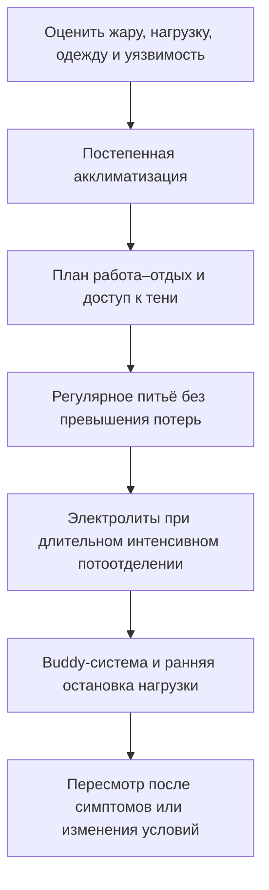
<!-- visual-summary:end -->
Лучшая терапия — та, которая не понадобилась. Гипертермический синдром, особенно в ятрогенных (MH, НЗС, серотониновый синдром) и экзогенных (тепловой удар) формах, во многих случаях представляет собой **предотвратимое** состояние. Профилактика здесь не рекомендация, а профессиональная обязанность врача.

Профилактика делится на первичную (предотвращение первого эпизода) и вторичную (предотвращение рецидива у пациента, уже перенёсшего ГС).

## 10.1. Первичная профилактика

### 10.1.1. Профилактика теплового удара

Зона ответственности врачей общей практики, спортивных врачей и служб общественного здравоохранения.

**Обучение населения:**
- избегать пиковой инсоляции (11:00–16:00);
- носить лёгкую, свободную и воздухопроницаемую одежду и головной убор;
- использовать кондиционирование и вентиляцию помещений;
- знать симптомы теплового удара, методы профилактики и приёмы первой помощи.

> [!WARNING]
> **Критическое правило: никогда не оставлять детей, пожилых людей и животных
> в закрытых автомобилях — даже ненадолго.** Салон быстро нагревается и не
> становится безопасным из-за приоткрытого окна.

**Индивидуальный питьевой план:**
- обеспечить свободный доступ к воде и регулярно предлагать пить; при умеренной
  работе в жаре NIOSH приводит ориентир около 240 мл каждые 15–20 минут, но
  реальная потребность зависит от потоотделения, акклиматизации и нагрузки;
- не пытаться «выпить как можно больше»: приём жидкости сверх потерь повышает
  риск гипонатриемии. Для длительной интенсивной работы с выраженным
  потоотделением нужен план восполнения натрия и углеводов, а не обязательный
  спортивный напиток для каждого;
- избегать алкоголя. Обычные количества кофеина не требуют универсального
  запрета, но энергетики и чрезмерные дозы стимуляторов нежелательны;
- как общий предел NIOSH советует обычно не превышать примерно 1,4 л жидкости
  в час.

**Режим труда и отдыха:**
- ограничение физической активности в жаркое время суток, перенос работы и тренировок на ранние утренние или поздние вечерние часы;
- регулярные перерывы, работа в тени или в помещениях с кондиционированием;
- **акклиматизация** при переезде в жаркий климат или в начале сезона тренировок: постепенное наращивание нагрузки и времени пребывания на жаре; полная адаптация потоотделения занимает 10–14 дней (в части источников — 1–2 недели);
- **отмена массовых мероприятий и тяжёлых работ** при высоком индексе WBGT («температура влажного шарика и чёрного шара»), учитывающем температуру воздуха, влажность и инсоляцию, — именно этот показатель, а не столбик термометра, отражает реальную тепловую нагрузку.

**Почему WBGT, а не термометр.** NIOSH/CDC и ACOEM рекомендуют управлять тепловой
нагрузкой на производстве и в спорте именно по WBGT, поскольку он объединяет
температуру воздуха, влажность, движение воздуха и лучистое тепло. Ключевой вклад
вносит влажность: по мере её роста градиент давления водяного пара между кожей и
воздухом уменьшается, и испарение пота отводит всё меньше тепла. Универсального
порога влажности, за которым испарительное охлаждение «выключается», не
существует: предел зависит от сочетания температуры воздуха, его движения,
лучистого тепла, метаболической нагрузки и одежды — именно поэтому нагрузку
нормируют по WBGT, а не по одному показателю. Физически испарение при
этом не прекращается полностью, но перестаёт компенсировать теплопродукцию — с
практической точки зрения именно это и означает потерю основного механизма
теплоотдачи.

**Что даёт акклиматизация.** За 7–14 дней постепенной адаптации растёт скорость
потоотделения, снижается концентрация натрия в поте, увеличивается объём
циркулирующей плазмы и падает нагрузка на сердечно-сосудистую систему.
Рекомендуемый режим для новых работников: в первый день около 20 % обычной
нагрузки с последующим приростом не более чем на 20 % в сутки. Отсутствие
акклиматизации — один из главных модифицируемых факторов риска: значительная
часть случаев профессионального теплового удара приходится на первые дни работы.

### 10.1.2. Скрининг перед анестезией — профилактика MH

Зона ответственности анестезиолога.

**Сбор семейного анамнеза — ключевой и обязательный пункт.** Вопросы: «Были ли у Вас или Ваших кровных родственников проблемы с наркозом? Была ли необъяснимая смерть во время или сразу после операции? Ставился ли кому-либо в семье диагноз злокачественной гипертермии?»

**При положительном анамнезе:**
- пациент считается **MH-восприимчивым (MHS)** до доказательства обратного;
- **запрещено использовать триггеры** — все ингаляционные галогенсодержащие анестетики и сукцинилхолин;
- **безопасная анестезия:** тотальная внутривенная анестезия (пропофол, кетамин, тиопентал), опиоиды, регионарные методики (спинальная, эпидуральная, проводниковая), закись азота, недеполяризующие миорелаксанты (рокуроний, атракурий);
- **подготовка наркозного аппарата (плановая, в отличие от действий при кризе):**
  снять или заблокировать испарители, заменить контур, дыхательный мешок и
  адсорбент CO₂, продуть аппарат высоким потоком свежего газа, после чего
  установить активированные угольные фильтры на инспираторное и экспираторное
  колена. Далее в течение всей операции поддерживают достаточный поток свежего
  газа, чтобы предотвратить обратное поступление агента из аппарата. Конкретные
  значения потока и времени продувки различаются между моделями аппаратов и
  системами фильтров — их сверяют с инструкцией производителя и локальным
  протоколом. **Во время уже развившегося криза замену аппарата не проводят:**
  ставят фильтры, поднимают поток и не задерживают дантролен;
- **обязательное условие:** наличие в операционной «укладки для MH» — достаточного запаса дантролена, холодных растворов, средств коррекции гиперкалиемии и ацидоза.

**Генетическое тестирование** (RYR1, CACNA1S) проводится у пациентов с MH-анамнезом и их кровных родственников; при невозможности или неинформативности — CHCT в специализированном центре.

**Генетическое консультирование:** информирование пациента и родственников о характере наследования (аутосомно-доминантном), о риске и о необходимости пожизненно сообщать о нём анестезиологам.

### 10.1.3. Рациональная фармакотерапия — профилактика НЗС и серотонинового синдрома

Зона ответственности психиатра, невролога, терапевта.

**Профилактика НЗС:**
- осторожное назначение нейролептиков по принципу «start low, go slow» — начинать с минимальных доз и титровать медленно, особенно у пациентов группы риска (ЧМТ, ДЦП, дегидратация, ажитация);
- назначать только при наличии показаний, использовать минимально эффективные дозы, регулярно пересматривать терапию;
- избегать полипрагмазии — одновременного назначения двух-трёх нейролептиков;
- **не отменять резко леводопу и другие дофаминомиметики** у пациентов с паркинсонизмом;
- регулярный клинический мониторинг, особенно в первые недели терапии и после повышения дозы.

**Профилактика серотонинового синдрома — знать опасные комбинации:**
- **абсолютно противопоказано: СИОЗС + ингибиторы МАО.** При переходе с одного класса на другой требуется «отмывочный» период 2–5 недель (для флуоксетина — максимальный из-за длительного периода полувыведения активного метаболита);
- **высокий риск:** СИОЗС + трамадол; СИОЗС + декстрометорфан (в том числе в безрецептурных сиропах от кашля); СИОЗС + литий; СИОЗС/СИОЗСН + линезолид;
- проверка лекарственных взаимодействий при каждом новом назначении;
- **информирование пациента:** «Если на фоне приёма антидепрессанта появились жар, подёргивания мышц, дрожь, диарея — немедленно прекратите приём и вызовите скорую помощь».

### 10.1.4. Профилактика при эндокринных заболеваниях

- **тиреотоксикоз:** регулярный контроль гормонов, приверженность терапии тиреостатиками, своевременное радикальное лечение (радиойодтерапия, тиреоидэктомия), особая настороженность в периоперационном периоде и при интеркуррентных инфекциях — типичных провокаторах криза;
- **феохромоцитома:** своевременная диагностика, альфа- и затем бета-блокада, плановое хирургическое удаление опухоли.

### 10.1.5. Образование родителей и пациентов

Родителей необходимо обучать правилам измерения температуры и распознаванию
тревожных признаков: нарушению сознания, затруднённому дыханию, судорогам,
признакам обезвоживания, необычной вялости или стойкому отказу от питья.
Мраморность оценивают вместе с капиллярным наполнением и общим состоянием, а не
как самостоятельный «тип» гипертермии. При лихорадке ребёнка не укутывают,
предлагают жидкость и используют жаропонижающее для комфорта в корректной
возрастной дозе; при тревожных признаках требуется срочная медицинская помощь.

### 10.1.6. Обучение медицинского персонала

- внедрение в клиниках чётких письменных протоколов (SOP) по диагностике и лечению всех форм ГС;
- регулярные тренинги и симуляционные учения по ведению криза MH — состояния настолько редкого, что без тренировки алгоритм не воспроизводится;
- обучение персонала, работающего в жарком климате, правилам профилактики теплового удара — как у пациентов, так и у себя.

---

## 10.2. Вторичная профилактика

### 10.2.1. Мониторинг групп риска

Пациенты с ЧМТ, ДЦП, врождёнными пороками сердца, эпилепсией, тяжёлой коморбидностью требуют особого внимания: регулярное наблюдение, раннее выявление признаков гипертермии, своевременная диагностика и адекватное лечение интеркуррентных инфекций.

### 10.2.2. Профилактика рецидивов

**Пациент, перенёсший MH:**
- должен быть чётко информирован о своём диагнозе и его пожизненном характере;
- должен носить **браслет тревоги (MedicAlert)** и иметь при себе информационную карту;
- обязан сообщать о диагнозе каждому анестезиологу перед любым вмешательством, включая стоматологическое;
- диагноз должен быть документирован в медицинской карте на видном месте; кровные родственники подлежат обследованию.

**Пациент, перенёсший НЗС:**
- повторное назначение антипсихотика несёт риск рецидива;
- необходимость, срок и препарат определяет психиатр после полного разрешения
  эпизода. Обычно выдерживают период восстановления, выбирают средство с
  меньшим риском, начинают с низкой дозы, медленно титруют и внимательно
  контролируют гидратацию, температуру, тонус и психический статус.

**Пациент, перенёсший серотониновый синдром:** пожизненное избегание опасных комбинаций, документирование эпизода, информирование всех лечащих врачей.

**Общий принцип:** избегание триггеров — тепловых, нагрузочных и медикаментозных; документирование в истории болезни; использование альтернативных препаратов.

### 10.2.3. Рациональная антипиретическая терапия

При **обычной лихорадке** жаропонижающее используют прежде всего для уменьшения
дискомфорта и поддержки питья, а не для достижения заданной цифры. Оно не
предотвращает надёжно фебрильные судороги и не должно маскировать необходимость
оценки причины. При истинной гипертермии антипиретики механизм не устраняют.

---

## 10.3. Профилактика осложнений в ОРИТ и операционной

- **Мониторинг температуры:** способ и непрерывность выбирают по риску,
  клиническому состоянию и процедуре. При подозрении на тепловой удар нужен
  надёжный показатель температуры ядра; при общей анестезии и в ОРИТ следуют
  профильному протоколу.
- **Ранняя диагностика:** настороженность (high suspicion) при любой необъяснимой тахикардии, ацидозе, гиперкапнии — не дожидаясь подъёма температуры.
- **Наличие протоколов и укладок:** распечатанные алгоритмы по MH, НЗС и серотониновому синдрому в операционной и ОРИТ; «укладка для MH» с дантроленом в быстром доступе, с регулярной проверкой сроков годности и пополнением после каждого использования.
- **Немедленное начало терапии** при клинически обоснованном подозрении:
  прекратить триггер, начать показанные поддерживающие действия и охлаждение;
  при MH — не задерживать дантролен.

---

## 10.4. Вакцинация и контроль инфекций

*Механизм:* плановая иммунизация против гриппа, пневмококковой, менингококковой и других инфекций, соблюдение национального календаря прививок у детей и взрослых.

*Связь с ГС:* снижение вероятности развития сепсиса, пневмонии и менингита — состояний, которые сами по себе способны привести к срыву терморегуляции и гипертермическому синдрому. Это опосредованная, но реальная и недооценённая часть общей профилактики.

---

## Выводы по главе 10

**ГС — во многом предотвратимая катастрофа.** Значительная часть случаев имеет ятрогенную (MH, НЗС, СС) или средовую (тепловой удар) природу, то есть в принципе управляема.

**Роль врача в первичной профилактике распределена по специальностям:**
- **анестезиолог** — золотое правило: сбор анамнеза на MH перед каждым наркозом и наличие дантролена там, где применяются триггеры;
- **психиатр, невролог, терапевт** — рациональная фармакотерапия, знание «смертельных» комбинаций (СИОЗС + ИМАО) и правил титрования нейролептиков, недопустимость резкой отмены леводопы;
- **врач общей практики и спортивный врач** — образование населения: гидратация, акклиматизация, режим нагрузок по WBGT, опасность укутывания детей и оставления их в автомобиле.

**Вторичная профилактика:** пациент, перенёсший MH или НЗС, — «ходячая красная карточка». Он должен быть информирован, документирован и защищён от повторных триггеров браслетом MedicAlert, информационной картой и настороженностью каждого следующего врача.

**Системный уровень:** протоколы, укладки, симуляционные тренинги и мониторинг температуры в ОРИТ превращают индивидуальную бдительность в воспроизводимую практику.

**Переход.** Мы научились спасать пациента и предотвращать катастрофу. Но что ждёт того, кого удалось «вытащить»? Каковы его шансы, что определяет исход и каким будет качество жизни?

---

# Глава 11. Прогноз и исходы

<!-- visual-summary:start -->

### Схема для запоминания

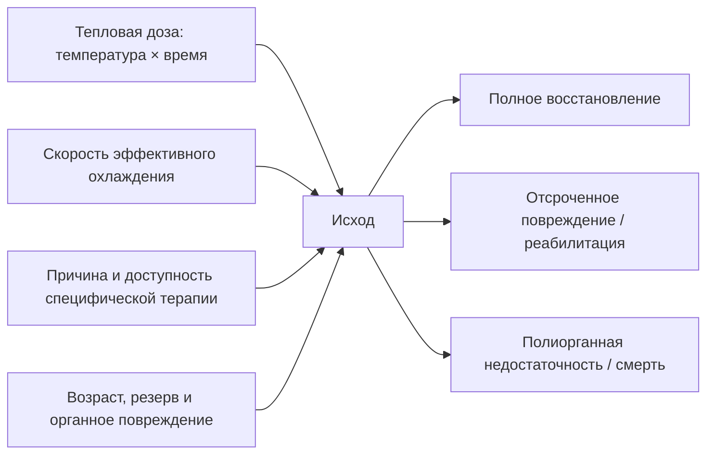
<!-- visual-summary:end -->
Прогноз можно описать вопросом **«как велика тепловая доза и как быстро
устранена причина?»** Температура и время важны, но исход также определяют
этиология, возраст, физиологический резерв, шок, судороги и развившееся органное
повреждение. Ни одна цифра температуры не предсказывает исход изолированно.

## 11.1. Факторы, влияющие на прогноз

### 11.1.1. Своевременность диагностики и начала терапии

- **Ранняя диагностика** — например, распознавание необъяснимого роста EtCO₂ при
  MH до выраженного подъёма температуры — позволяет раньше прекратить триггер и
  ввести дантролен.
- **Поздняя диагностика** увеличивает тепловую дозу и вероятность
  полиорганного повреждения, но не делает неблагоприятный исход неизбежным.
- Для универсального прироста летальности на фиксированный процент за каждый
  час надёжных данных нет; клинический вывод проще: эффективное охлаждение не
  откладывают.

**Скорость охлаждения как изменяемый фактор.** При тепловом ударе на нагрузке
полевые протоколы стремятся начать охлаждение на месте и снизить ректальную
температуру примерно до 38,6–39,0 °C как можно быстрее, часто ориентируясь на
первые 30 минут от распознавания. Это цель процесса, а не гарантированный
прогностический рубеж.

### 11.1.2. Адекватность терапии

При тепловом ударе исход улучшает быстрое эффективное охлаждение; цвет кожи не
служит основанием от него отказаться. При MH критичны прекращение триггера и
ранний дантролен. При НЗС и серотониновом синдроме основа — отмена причинного
препарата, контроль мышечной активности и поддержка органов; бромокриптин и
ципрогептадин не равны дантролену по доказательности и обязательности.

### 11.1.3. Максимальная достигнутая температура

Риск повреждения растёт с температурой и длительностью воздействия, но
индивидуальная переносимость и точность измерения различаются. Пороги 41–43 °C
описывают зоны высокого риска, а не границы, после которых повреждение
обязательно и необратимо.

### 11.1.4. Длительность гипертермии

Продолжительность воздействия нередко важнее одной максимальной цифры:
кратковременный пик и длительный перегрев дают разную суммарную тепловую дозу.
Точное время начала часто неизвестно, поэтому прогноз уточняют по динамике
сознания, гемодинамики, лактата, коагуляции, печени, почек и КФК.

### 11.1.5. Коморбидность и возраст

Неблагоприятны: возраст старше 65 лет (истощение резервов) и младше 3 месяцев; ХСН и ИБС — сердце не выдерживает гипердинамической нагрузки и гиповолемии; хроническая болезнь почек — почки «ломаются» первыми при рабдомиолизе; патология ЦНС, включая инсульт в анамнезе; заболевания лёгких и печени; эндокринные и неврологические заболевания; ожирение.

### 11.1.6. Гемодинамика как прогностический маркёр

Среди отдельных признаков наиболее воспроизводимо связана с исходом
**артериальная гипотензия**. В сводках по тепловому удару приводится
ориентировочное различие: летальность около 10 % при отсутствии гипотензии и
порядка 33 % при систолическом АД ниже 90 мм рт. ст.

Эти цифры получены из наблюдательных данных, зависят от определения случая,
периода наблюдения и доступности интенсивной терапии, и не должны
использоваться как индивидуальный прогноз. Их клинический смысл в другом: гипотензия при тяжёлой
гипертермии — не «сопутствующая деталь», а маркёр перехода в декомпенсацию,
требующий немедленной оценки шока, сосудистого доступа и поддержки перфузии
параллельно с продолжающимся охлаждением.

### 11.1.7. Развитие осложнений

ДВС-синдром, ОПП, ОРДС, шок, тяжёлое поражение печени и стойкое нарушение
сознания связаны с неблагоприятным прогнозом. Риск растёт по мере вовлечения
органов, но прибавлять фиксированный процент «за каждый орган» некорректно.
Рабдомиолиз значим прежде всего как источник гиперкалиемии и ОПП.

---

## 11.2. Ближайшие исходы

**Полное выздоровление возможно**, особенно при раннем устранении причины и
ограничении тепловой дозы. Образцовый пример — MH, распознанная в операционной
по необъяснимому росту EtCO₂, с немедленной отменой триггеров и введением
дантролена. Срок восстановления индивидуален.

**Выздоровление с остаточными явлениями** — частичное восстановление функций со стойким неврологическим дефицитом или сохраняющимся нарушением функции почек, печени, сердца.

**Летальный исход** — вследствие необратимого отёка мозга, рефрактерного шока, фатальной аритмии на фоне гиперкалиемии либо, отсроченно, от полиорганной недостаточности и вторичного сепсиса.

---

## 11.3. Почему одну таблицу летальности применять нельзя

Опубликованные показатели сильно меняются между популяциями, определениями
случая, периодом наблюдения (лечение и распознавание менялись со временем) и
уровнем медицинской помощи. Поэтому диапазон из одной статьи нельзя переносить
на конкретного пациента.

| Состояние | Что сильнее всего меняет исход |
|---|---|
| **Классический тепловой удар** | возраст, коморбидность, одиночное проживание, длительность экспозиции, шок и доступ к охлаждению |
| **Тепловой удар при нагрузке** | распознавание дисфункции ЦНС, ректальное измерение и охлаждение на месте |
| **Злокачественная гипертермия** | раннее распознавание роста CO₂, прекращение триггера, доступность и скорость введения дантролена |
| **НЗС** | тяжесть ригидности и органного повреждения, задержка отмены препарата, качество интенсивной поддержки |
| **Серотониновый синдром** | свойства причинных препаратов, выраженность гипертермии и мышечной активности, осложнения |
| **Сепсис с высокой температурой** | источник инфекции, шок и органная дисфункция; температура сама по себе не задаёт прогноз |

---

## 11.4. Критерии неблагоприятного прогноза

- очень высокая или длительно сохраняющаяся температура ядра;
- значимая задержка эффективного охлаждения;
- стойкое нарушение сознания после охлаждения и стабилизации;
- развитие ДВС-синдрома;
- ОПП, требующее гемодиализа;
- ОРДС, требующий ИВЛ;
- возраст старше 65 лет;
- тяжёлый метаболический ацидоз и высокий лактат при поступлении;
- рабдомиолиз с почечной недостаточностью;
- тяжёлая сопутствующая патология.

Практический смысл перечня — выделить пациентов, которым требуется раннее
ведение в ОРИТ и серийная оценка. Отдельный фактор не заменяет клиническое
решение и не должен быть основанием прекращать лечение.

---

## 11.5. Отдалённые последствия

Это то, с чем пациент уходит из больницы.

### 11.5.1. Неврологические последствия — самые частые и инвалидизирующие

**Мозжечковая атаксия.** Описанное последствие тяжёлого теплового удара,
связанное с уязвимостью мозжечка и клеток Пуркинье. Возможны нарушение походки
и координации, дизартрия, тремор и нистагм; степень восстановления различается.

**Когнитивные нарушения:** снижение памяти, внимания и концентрации, «затуманенность» (brain fog), трудности обучения, изменения личности и эмоциональная лабильность.

**Периферическая полинейропатия:** слабость и онемение в стопах и кистях, нарушение чувствительности.

**Стойкие очаговые дефициты:** парезы и параличи вследствие ишемических микроинсультов, нарушения речи и зрения.

**Эпилепсия** постгипоксического и постишемического генеза, требующая длительной противосудорожной терапии.

### 11.5.2. Нефрологические последствия

**Хроническая болезнь почек.** Причина — острое повреждение почек вследствие рабдомиолиза и шока, оказавшееся настолько тяжёлым, что полного восстановления не произошло. Исход — от снижения СКФ с необходимостью пожизненного наблюдения до диализ-зависимости.

### 11.5.3. Прочие последствия

- **кардиомиопатия** со снижением фракции выброса;
- **хроническая печёночная дисфункция** — относительно редко, поскольку печень хорошо регенерирует, но требует контроля;
- **ПТСР** у пациентов, переживших ОРИТ, — недооценённое последствие, влияющее на качество жизни не меньше физического дефицита.

---

## 11.6. Качество жизни и реабилитация

Качество жизни выживших может быть значительно снижено — прежде всего из-за неврологического дефицита (атаксии, когнитивных нарушений) или необходимости в диализе. Именно поэтому скорость охлаждения — вопрос не только выживания, но и того, каким будет это выживание.

**Реабилитация** должна быть комплексной и длительной:
- **физическая** — ЛФК, восстановление координации и силы;
- **когнитивная** — нейрореабилитация, эрготерапия;
- **психологическая** — работа с тревогой, депрессией, ПТСР;
- **социальная** — возвращение к труду и повседневной активности, при необходимости — оформление инвалидности и адаптация среды.

Отдельная задача — диспансерное наблюдение: контроль функции почек, сердца и печени, а для пациентов с MH и НЗС — пожизненная защита от повторного контакта с триггерами.

---

## Выводы по главе 11

**«Время = весь организм».** По аналогии с инсультом, где «время = мозг», при ГС ключевым детерминантом исхода служит интеграл «температура × время». Именно поэтому охлаждение начинают до постановки окончательного диагноза.

**Риск снижаем.** История MH наглядно показывает, как мониторинг, прекращение
триггеров, доступность дантролена и отработанный командный протокол преобразуют
исход редкого криза.

**Необратимые последствия реальны.** Даже выживший пациент может остаться инвалидом из-за гибели клеток Пуркинье (атаксия) или некроза почечных канальцев (диализ). Успех измеряется не только фактом выписки.

**Прогноз — не только скорость.** Время критично, но на исход также влияют
причина, тяжесть органного повреждения, резерв пациента и доступность
последующего наблюдения.

**Переход.** Мы рассмотрели ГС у «среднестатистического» пациента. Но таких пациентов не бывает: возраст, физиологическое состояние и сопутствующая патология критически меняют картину. Ошибки в лечении ребёнка или пожилого человека часто фатальны — у них нет запаса прочности.

---

# Глава 12. Особенности гипертермического синдрома у различных категорий пациентов

<!-- visual-summary:start -->

### Схема для запоминания

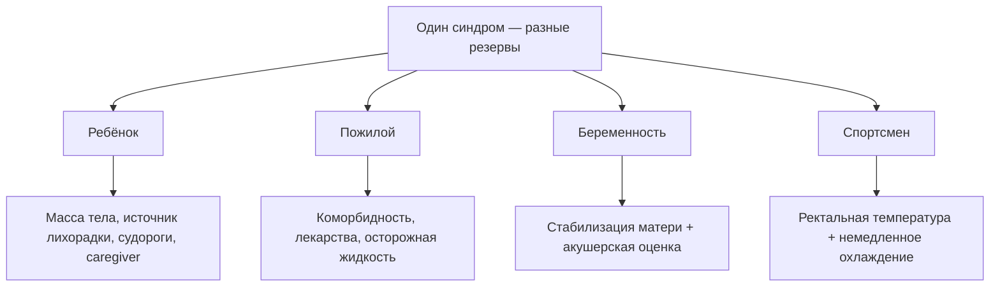
<!-- visual-summary:end -->
«Среднестатистических» пациентов не бывает. Возраст, физиологическое состояние и сопутствующая патология критически меняют картину ГС, и ошибки в лечении ребёнка или пожилого человека часто фатальны — именно потому, что у них нет запаса прочности.

## 12.1. Дети и новорождённые

Ребёнок — не «маленький взрослый»: его физиология терморегуляции принципиально иная.

### 12.1.1. Особенности терморегуляции

**Незрелость центра терморегуляции.** У новорождённых и младенцев преоптическая область гипоталамуса ещё не «настроена»: реакция на пирогены и на перегрев может быть смазанной или парадоксальной. Механизмы теплопродукции (дрожь) и теплоотдачи (потоотделение) развиты слабо.

> [!WARNING]
> **Клинический парадокс:** новорождённый с тяжелейшим сепсисом может дать не гипер-, а **гипотермию (< 36 °C)** — и это ещё более грозный признак, чем лихорадка.

**Большая поверхность тела относительно массы.** У младенца это отношение выше,
чем у взрослого, поэтому теплообмен со средой идёт быстрее. Ребёнок может быстро
как охлаждаться, так и перегреваться в небезопасной среде.

**Меньшие запасы жидкости.** Общий резерв воды мизерный, поэтому потери с тахипноэ, минимальным потоотделением, рвотой или диареей быстро приводят к эксикозу и гиповолемическому шоку. Незрелость почек усугубляет водно-электролитные нарушения.

**Особенности термогенеза.** Основной механизм согревания новорождённого — нешиверинговый термогенез за счёт бурой жировой ткани; при перегреве этот механизм бесполезен, а дрожать эффективно ребёнок не может.

**Неспособность к самопомощи.** Ребёнок не может сказать, что ему жарко, попросить пить, сбросить одеяло или уйти из раскалённого помещения — это делает его полностью зависимым от внимательности взрослых.

### 12.1.2. Специфика клинической картины

**Неспецифичность.** Возможны необычная вялость, раздражительность, отказ от
кормления, сухость слизистых, отсутствие слёз и снижение диуреза. Западение
родничка может сопровождать обезвоживание, а выбухание требует срочной оценки,
но ни один из этих признаков не устанавливает причину самостоятельно.

**Фебрильные судороги.** Возникают у части детей примерно от 6 месяцев до 5 лет
на фоне лихорадочного заболевания. «Простые» фебрильные судороги —
генерализованные, продолжаются менее 15 минут и не повторяются в течение
24 часов; цифра температуры не определяет их тип.

> [!WARNING]
> **Красные флаги:** очаговый приступ, длительность более 15 минут, повторение
> в течение 24 часов, неполное восстановление сознания, менингеальные признаки,
> петехии, дыхательные или гемодинамические нарушения. Они требуют срочной
> оценки причин, включая инфекцию ЦНС; высокая цифра температуры сама по себе
> не доказывает энцефалопатию.

**Перфузия.** Бледность, мраморность, холодные конечности и замедленное
капиллярное наполнение требуют оценки шока. Это не отдельный диагноз «белой
гипертермии» и не основание откладывать показанное охлаждение.

**Декомпенсация может быть быстрой.** Небольшая масса тела и ограниченная
возможность сообщить о симптомах требуют частой повторной оценки, но
универсального интервала «30–60 минут» нет.

### 12.1.3. Специфика лечения

**Дозировки рассчитывают по массе тела (мг/кг) и сверяют с локальным
педиатрическим протоколом.** Нужно учитывать возраст, максимальную суточную дозу,
функцию печени/почек и противопоказания; аспирин при вирусной инфекции у детей
связан с риском синдрома Рея.
- парацетамол 10–15 мг/кг на приём — единственный антипиретик, применимый
  с периода новорождённости;
- ибупрофен 5–10 мг/кг на приём — **не применяется у детей младше 3 месяцев**;
  при обезвоживании (тепловая болезнь, рвота, диарея, ограниченное питьё) его
  избегают из-за риска острого повреждения почек — в контексте перегрева это
  ограничение особенно значимо;
- диазепам 0,1–0,2 мг/кг;
- дантролен при MH 2,5 мг/кг.

**Инфузионная терапия требует повторной оценки.** При шоке кристаллоид вводят
болюсом по педиатрическому протоколу, после каждого этапа оценивают дыхание,
перфузию, диурез и признаки перегрузки.

**Судороги.** Активный приступ лечат по алгоритму. Жаропонижающие улучшают
комфорт, но не предотвращают надёжно рецидив фебрильных судорог; рутинная
профилактическая противосудорожная терапия обычно не рекомендуется.

**Охлаждение** — агрессивное физическое, но с осторожностью в отношении переохлаждения, к которому дети склонны из-за той же большой относительной поверхности тела.

### 12.1.4. Группы риска среди детей

- **младенцы до 3 месяцев** — ректальная температура 38,0 °C и выше требует
  срочной медицинской оценки; объём обследования определяют возраст,
  клинический вид и действующий протокол;
- **дети до 6 лет** — склонность к фебрильным судорогам и быстрой дегидратации;
- **дети с врождёнными пороками сердца:** лихорадка, обезвоживание и тахикардия
  могут снизить компенсаторный резерв;
- **дети с патологией ЦНС** или эпилепсией могут иметь особые риски аспирации,
  нарушения мобильности, лекарственных взаимодействий и судорог; план помощи
  индивидуализируют.

### 12.1.5. Дозировки препаратов в педиатрической практике

Таблица приведена как ориентир и **не заменяет** действующий локальный протокол и
инструкцию к препарату. Все дозы рассчитывают по массе тела и сверяют с возрастом,
функцией печени и почек.

| Препарат | Путь | Разовая доза | Суточный максимум | Примечания |
|---|---|---|---|---|
| **Парацетамол** | внутрь / ректально | 10–15 мг/кг | до 60 мг/кг | интервал 4–6 ч; средство первой линии |
| **Парацетамол** | в/в медленно | 15 мг/кг | до 60 мг/кг | при наличии венозного доступа и невозможности энтерального приёма |
| **Ибупрофен** | внутрь | 5–10 мг/кг | до 30 мг/кг | интервал 6–8 ч; не применяют у детей до 3 месяцев, при дегидратации и почечной дисфункции |
| **Диазепам** | в/в / в/м | 0,3–0,5 мг/кг (в/в 0,1–0,2 мг/кг) | до 10 мг на введение | купирование судорог; контроль дыхания |
| **Дантролен** (при MH) | в/в болюсно | 2,5 мг/кг | повторы до клинического ответа | доза не зависит от возраста |
| **Метамизол натрия** | в/м / в/в | < 1 года 0,01 мл/кг 50 % р-ра; старше — 0,1 мл на год жизни | не более 1 мл на приём | см. предостережение ниже |
| **Папаверин / дротаверин** | в/м / в/в | 0,1 мл на год жизни 2 % р-ра | — | применяется в национальной практике при «белой» лихорадке; см. § 12.1.6 |

> [!WARNING]
> **Метамизол (анальгин)** сохраняется в российских протоколах как средство
> второй линии, но во многих странах отозван с рынка из-за риска агранулоцитоза.
> Его не следует использовать как рутинный жаропонижающий препарат первой линии.
> Комбинация «метамизол + хлоропирамин (± папаверин) в одном шприце»
> («литическая смесь», «тройчатка») — сложившаяся практика, а не вмешательство с
> доказанным преимуществом перед монотерапией парацетамолом или ибупрофеном;
> антигистаминный компонент жаропонижающего эффекта не даёт.

### 12.1.6. «Белая» лихорадка у детей: национальная практика и границы её применения

Это тот раздел, где легче всего допустить опасный перенос правил из одной
клинической ситуации в другую, поэтому границы обозначены явно.

**О чём идёт речь.** В отечественных рекомендациях (Союз педиатров России,
Минздрав РФ) при **инфекционной лихорадке** у ребёнка выделяют «розовый» и
«белый» варианты. «Белая» лихорадка — это лихорадка с выраженной периферической
вазоконстрикцией: бледная кожа с мраморным рисунком, цианоз носогубного
треугольника, холодные кисти и стопы, градиент между аксиллярной и ректальной
температурой порядка 0,7–1,0 °C и выше. Ребёнок при этом плохо отдаёт тепло, а
теплопродукция сохраняется.

**Рекомендуемый национальными протоколами порядок действий:**

1. **согревание конечностей** (растирание, тёплые носки) и **спазмолитик** —
   папаверин или дротаверин 2 % по 0,1 мл на год жизни в/м или в/в медленно —
   для устранения периферического вазоспазма;
2. **антипиретик** — парацетамол 15 мг/кг (в/в инфузия или внутрь), при
   неэффективности — метамизол натрия с учётом предостережения выше;
3. **при судорогах** — диазепам 0,1–0,2 мг/кг внутривенно (максимум 10 мг), как
   в § 9.1; при отсутствии венозного доступа — мидазолам 0,15–0,2 мг/кг
   интраназально, буккально или внутримышечно. Дозы диазепама 0,3–0,5 мг/кг
   внутривенно избыточны и чреваты угнетением дыхания у ребёнка. Одна лишь
   «судорожная готовность» без приступа показанием к бензодиазепину не является;
4. агрессивное наружное охлаждение (обтирание льдом, холодные обёртывания) до
   устранения вазоспазма **не рекомендуется**: оно усиливает дискомфорт, вызывает
   дрожь и не улучшает теплоотдачу при спазмированных сосудах кожи.

> [!CAUTION]
> **Где проходит граница — это главное в разделе.**
>
> Всё вышеизложенное относится к **пирогенной лихорадке инфекционного генеза** у
> ребёнка, у которого установочная точка гипоталамуса сдвинута вверх, а
> температура ядра, как правило, не достигает жизнеугрожающих значений. Здесь
> антипиретик воздействует на механизм, а цель — комфорт ребёнка и возможность
> поить его.
>
> Эти правила **не переносятся** на непирогенную гипертермию — тепловой удар,
> злокачественную гипертермию, НЗС, серотониновый синдром и отравления. В этих
> состояниях:
> - установочная точка нормальна, и антипиретик механизм не устраняет;
> - бледность и холодные конечности означают **шок и гипоперфузию**, которые
>   лечат поддержкой кровообращения, а не спазмолитиком;
> - **эффективное охлаждение не откладывают** ни ради спазмолитика, ни ради
>   согревания конечностей — задержка прямо увеличивает тепловую дозу и риск
>   органного повреждения (§ 3.1.2, § 4.3.5, § 7.2, § 9.4).
>
> Практическое правило: **сначала ответьте на вопрос «это лихорадка или
> гипертермия?»** — и только потом выбирайте алгоритм. Ребёнок, найденный без
> сознания в закрытом автомобиле, и ребёнок с ОРВИ и «белой» лихорадкой требуют
> противоположных действий, хотя кожа у обоих может выглядеть одинаково.

**О доказательной базе.** Деление на «розовую» и «белую» лихорадку и обязательное
назначение спазмолитика — элемент национальной клинической традиции; в
международных педиатрических руководствах (NICE, AAP) такое деление и рутинные
спазмолитики при лихорадке не фигурируют, а акцент делается на оценке признаков
тяжести и самочувствии ребёнка, а не на цифре температуры. Врачу следует
действовать по локальному протоколу, понимая уровень его обоснованности.

---

## 12.2. Пожилые пациенты (старше 65–70 лет)

Уязвимость пожилого пациента связана с уменьшением физиологического резерва,
коморбидностью, лекарствами и социальными факторами.

### 12.2.1. Особенности физиологии

- **нарушение терморегуляции** — «термостат» гипоталамуса работает хуже вследствие дегенерации нейронов;
- **снижение эффективности потоотделения** — атрофия потовых желёз, риск ангидроза;
- **снижение чувства жажды** — пациент не ощущает обезвоживания и не пьёт;
- **снижение способности к вазодилатации** — ригидные, атеросклеротически изменённые сосуды не могут адекватно расшириться для теплоотдачи;
- общее снижение адаптационных возможностей и гомеостатических резервов.

### 12.2.2. Коморбидность

- **ХСН и ИБС** — сердце не способно нарастить выброс, необходимый для кожной вазодилатации;
- **хроническая болезнь почек** — почки не компенсируют ацидоз и электролитные сдвиги, выше риск ОПП;
- **деменция** — пациент не может адекватно реагировать на жару: одеться по погоде, попить, уйти в прохладное место, а также не сообщает о симптомах, что требует более тщательного мониторинга;
- **сахарный диабет** — автономная нейропатия дополнительно нарушает потоотделение и вазомоторную регуляцию;
- артериальная гипертензия, аритмии, хронические заболевания лёгких.

### 12.2.3. Полипрагмазия — самостоятельный фактор риска

- **диуретики** — дегидратация и гипокалиемия;
- **бета-блокаторы** — снижение ЧСС и сердечного выброса, невозможность гемодинамической компенсации;
- **антихолинергические препараты** (от недержания, депрессии, аллергии) — блокада потоотделения;
- **нейролептики**, нередко назначаемые при деменции, — риск НЗС.

### 12.2.4. Особенности лечения

**Инфузионная терапия — «хождение по лезвию».** У пациента с ХСН агрессивный болюс 30 мл/кг способен «затопить» лёгкие. Тактика: меньшие объёмы, медленнее, под постоянным контролем — аускультация лёгких, УЗИ, оценка ЦВД и диуреза.

**Коррекция доз препаратов** с учётом сниженной функции почек и печени; более частый лабораторный мониторинг.

**Контроль функции почек:** креатинин и мочевина на фоне ХБП могут «взлететь» очень быстро; необходима регулярная оценка СКФ.

---

## 12.3. Беременные женщины

Беременная — это **два пациента**.

### 12.3.1. Риск для плода

- **I триместр — тератогенный эффект.** Гипертермия у матери (T > 39 °C, по ряду данных критический порог около 38,9 °C) в первые недели беременности — доказанный фактор риска дефектов нервной трубки (spina bifida) и других пороков развития ЦНС.
- **II и III триместры.** Тяжёлое состояние матери, гипоксемия, гипотензия и
  гипертермия могут ухудшить плацентарную перфузию и вызвать дистресс плода,
  поэтому стабилизация матери и ранняя акушерская оценка идут параллельно.

### 12.3.2. Физиология беременной

Организм уже работает в режиме гипердинамии (высокий сердечный выброс) и гипервентиляции, поэтому резервы компенсации ГС снижены.

> [!WARNING]
> **Аорто-кавальная компрессия.** В III триместре матка сдавливает аорту и нижнюю полую вену. Если уложить пациентку на спину для проведения охлаждения, разовьётся шок.
> **Тактика:** во второй половине беременности избегают длительного положения
> строго на спине; используют смещение матки влево или наклон, если это не
> мешает реанимации и эффективному охлаждению. Жизненно важные вмешательства
> матери имеют приоритет.

### 12.3.3. Специфика терапии

**Безопасность препаратов:**
- буквенные категории FDA A/B/C/D/X больше не применяются: с 2015 года действует
  правило маркировки **PLLR** (Pregnancy and Lactation Labeling Rule), где вместо
  буквы приводят описательные разделы о рисках, клинических данных и влиянии на
  фертильность. Риск оценивают по сроку, дозе, длительности и актуальной
  инструкции;
- парацетамол обычно рассматривают как средство выбора для кратковременного
  лечения лихорадки/боли при беременности, если он действительно нужен;
- НПВС имеют срок-зависимые риски, особенно после 20 недель и позднее;
- при MH дантролен вводят без задержки: стабилизация матери — лучший способ
  защитить плод;
- активные судороги лечат немедленно, учитывая материнские и неонатальные риски
  конкретного препарата.

**Двойной мониторинг:** стабилизация и непрерывная оценка матери; акушерская
команда выбирает метод наблюдения за плодом по сроку беременности и ситуации.

**Особенности охлаждения:** избегать избыточного охлаждения и гипотермии — они вызывают спазм маточных сосудов и ухудшают перфузию плаценты; целевая температура та же — 38,0–38,5 °C.

---

## 12.4. Спортсмены

Особая группа риска в отношении теплового удара при физической нагрузке (Exertional Heat Stroke, EHS).

### 12.4.1. Факторы риска

- **причина:** экстремальная эндогенная теплопродукция работающих мышц плюс экзогенные факторы — жара, влажность, непроницаемая экипировка;
- **психология:** высокая мотивация на соревнованиях заставляет игнорировать ранние признаки (слабость, головокружение, тошноту) и «бежать до коллапса»;
- недостаточная гидратация и отсутствие акклиматизации;
- **ассоциированные состояния:** возможны рабдомиолиз, ОПП, поражение печени,
  коагулопатия и гипонатриемия, особенно при питье сверх потерь.

### 12.4.2. Профилактика

- **акклиматизация** 10–14 дней с постепенным наращиванием нагрузки и времени пребывания на жаре;
- **индивидуальный питьевой план:** ориентируется на потери с потом, длительность
  нагрузки и доступ к натрию; нельзя как недопивать, так и пить сверх потерь.
  Для работников NIOSH приводит ориентир около 240 мл каждые 15–20 минут и
  обычно не более примерно 1,4 л/ч;
- **контроль условий тренировок по индексу WBGT** с отменой или переносом соревнований при высоком риске, обязательные перерывы, тень и охлаждение.

### 12.4.3. Лечение: правило «cool first, transport second»

Золотое правило EHS. Если спортсмен коллапсировал на дистанции с T = 41,5 °C:
1. вызвать экстренную помощь, выполнить ABCDE и измерить ректальную температуру;
2. при сохранённой возможности реанимации начать погружение в холодную воду
   или наиболее быстрый доступный метод всего тела;
3. продолжать охлаждение примерно до 38,6–39,0 °C, контролируя дыхательные пути
   и температуру;
4. координировать транспорт с охлаждением; жизнеугрожающие состояния, которые
   невозможно вести на месте, могут изменить последовательность.

Такой порядок действий спасает жизнь и предотвращает развитие полиорганной недостаточности. Он противоречит привычной логике «хватай и вези», и именно поэтому требует заранее оговорённого протокола и подготовленного персонала на спортивных мероприятиях.

---

## Выводы по главе 12

**«Нет» среднестатистическому пациенту.** Терморегуляция детей (незрелость, большая относительная поверхность тела), пожилых (изношенность, коморбидность, полипрагмазия) и беременных (риск для плода, аорто-кавальная компрессия) имеет критические особенности, меняющие и диагностику, и лечение.

**Дети = частая повторная оценка.** Ректальная температура 38,0 °C и выше у
младенца младше 3 месяцев требует срочной медицинской оценки. Дозы считают по
массе, жидкость вводят с переоценкой.

**Пожилые = сниженный резерв.** Не чувствуют жажды, плохо потеют, сосуды не расширяются, сердце и почки не выдерживают нагрузки, а собственные лекарства работают против них. Инфузия — хождение по лезвию между гиповолемией и отёком лёгких.

**Беременность = стабилизация матери и акушерская оценка.** Избегают
аорто-кавальной компрессии, учитывают срок-зависимые риски препаратов, а при MH
не задерживают дантролен.

**Спортсмены = EHS.** Ключ к спасению — «cool first, transport second»: сначала охладить в ледяной воде на месте, потом везти.

**Переход.** Мы разобрали особенности отдельных групп. Но медицина не стоит на месте: какие новые инструменты и знания появляются в борьбе с ГС?

---

# Глава 13. Современные направления исследований и актуальные вопросы

<!-- visual-summary:start -->

### Схема для запоминания

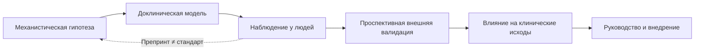
<!-- visual-summary:end -->
Несмотря на многое, что уже известно о гипертермических состояниях, область
остаётся полна «белых пятен». Почему при сопоставимой экспозиции исходы
различаются? Можно ли распознать риск до органного повреждения? Ответы требуют
аккуратного разделения между гипотезой, доклиническим результатом и данными у
людей.

## 13.0. Как читать исследования этой главы

| Уровень | Что он позволяет утверждать | Чего он не доказывает |
|---|---|---|
| Механистическая работа / клетки | возможный путь повреждения | пользу лечения для пациента |
| Животная модель | биологический сигнал в модели | эффективность и безопасность у людей |
| Ретроспективное наблюдение | ассоциацию и формирование гипотезы | причинность |
| Проспективная валидация | воспроизводимость теста или модели | улучшение клинических исходов |
| Сравнительное клиническое исследование | пользу и риски вмешательства | применимость вне изученной популяции |

> [!IMPORTANT]
> Препринт не прошёл полноценное рецензирование, а положительный результат у
> животных не является основанием менять клинический протокол.

## 13.1. Генетические маркеры предрасположенности

### 13.1.1. Гены RYR1 и CACNA1S при злокачественной гипертермии

*Цель:* поиск новых, ранее неизвестных патогенных вариантов, ответственных за MH.

*Проблема:* в гене RYR1 описано более 400 вариантов, но далеко не все они «злокачественные». Требуется **функциональное картирование** — доказательство того, что конкретный вариант действительно вызывает дефект кальциевого канала. Именно поэтому отрицательный генетический тест сегодня не исключает предрасположенности.

*Перспектива:* расширение функционально подтверждённого каталога вариантов.
Сегодня отрицательный результат панели не исключает восприимчивость и не
позволяет повсеместно отказаться от контрактурного теста. По GeneReviews,
патогенные варианты RYR1 объясняют примерно 60–70 % установленной
восприимчивости, CACNA1S — около 1 %, STAC3 — менее 1 %.

### 13.1.2. Геномика НЗС

*Гипотеза:* НЗС — не просто идиосинкразия, а, возможно, тоже фармакогенетическое явление.

*Направление поиска:* полиморфизмы генов дофаминовых рецепторов (DRD2) и ферментов метаболизма лекарств (система цитохрома CYP450), делающие пациента уязвимым к нейролептикам.

*Статус:* ассоциации-кандидаты изучаются, но клинически валидированного теста,
который до назначения антипсихотика надёжно предсказывает НЗС, нет.

### 13.1.3. Геномика теплового удара при нагрузке

*Наблюдение:* после теплового удара при нагрузке некоторые пациенты дольше
сохраняют непереносимость жары или получают повторный эпизод.

*Гипотеза:* варианты генов мышечного кальциевого обмена могут объяснять часть
восприимчивости, но EHS и MH нельзя считать одним заболеванием. Генетический
результат пока не заменяет клиническую оценку восстановления и контролируемый
возврат к нагрузкам.

### 13.1.4. Другие направления

Изучаются полигенные факторы риска и редкие кандидаты. Показательный пример —
препринт 2026 года (Charpentier et al.), сообщивший о вариантах гена
**CACNA2D4**, кодирующего субъединицу α2δ4 потенциал-зависимых кальциевых
каналов. Важно точно передать, о какой популяции идёт речь: варианты найдены при
полноэкзомном секвенировании у **военнослужащих, перенёсших эпизод теплового
удара при нагрузке (EHS)** — 4 человека из 41 неродственного пациента
(около 9,7 %), — а не в семьях с злокачественной гипертермией. Авторы показали
изменение кальциевых токов in vitro, а мышиная модель с вариантом S299R давала
EHS-подобный криз с рабдомиолизом при нагрузочном протоколе
([DOI 10.64898/2026.01.28.702251](https://doi.org/10.64898/2026.01.28.702251)).

Работа иллюстрирует сразу два тезиса главы. Во-первых, EHS и MH имеют
пересекающуюся, но **не тождественную** генетическую основу, и переносить выводы с
одного состояния на другое нельзя. Во-вторых, это **препринт**: до независимой
репликации и функциональной валидации CACNA2D4 не входит в диагностические
панели и не должен использоваться для допуска к нагрузкам.

---

## 13.2. Новые подходы к фармакологическому воздействию на температуру

### 13.2.1. Сенсорные каналы холода и тепла

TRPM8 реагирует на охлаждение и ментол, но его активация не означает
автоматического выключения теплопродукции: холодовой сигнал может, напротив,
усиливать защитный термогенез и вазоконстрикцию. Поэтому TRP-каналы интересны
как механистические мишени, но «агонист TRPM8 против теплового удара» пока не
является клинической стратегией.

### 13.2.2. Цитокин-таргетная терапия

Тепловой удар сопровождается системным воспалительным и эндотелиальным ответом,
но термин «цитокиновый шторм» не превращает его в показание к блокаторам
IL-1, IL-6 или TNF-α. Убедительных клинических данных об улучшении исходов
такими препаратами нет; основной стандарт остаётся прежним — быстрое
охлаждение и поддержка органов.

### 13.2.3. Прочие экспериментальные подходы

Доклинические работы исследуют эндотелиальную защиту, коагуляцию,
ферроптоз/липопероксидацию и кишечный барьер. В 2025 году опубликованы, например,
результаты нафамостата в модели теплового удара у крыс
([DOI 10.3389/fphar.2025.1559181](https://doi.org/10.3389/fphar.2025.1559181))
и роли ALOX15 в животной модели
([DOI 10.1097/SHK.0000000000002625](https://doi.org/10.1097/SHK.0000000000002625)).
Это не разрешённые способы лечения людей и не альтернатива охлаждению.

### 13.2.4. Переоценка привычных вмешательств: дантролен при НЗС

Новое знание не всегда добавляет средство в арсенал — иногда оно его оттуда
убирает. Дантролен десятилетиями переносили с MH на НЗС по аналогии
(«ригидность — значит, дантролен»), хотя механизмы этих состояний различны:
при НЗС ведущей является центральная дофаминергическая дисфункция, а дантролен
действует периферически, на рианодиновый рецептор.

В 2026 году опубликовано крупнейшее на сегодня исследование по этому вопросу:
ретроспективный анализ общенациональной базы стационаров Японии (2010–2023),
2234 пациента с НЗС, госпитализированных в ОРИТ, из них 1475 получали дантролен
в первые двое суток. После поправки на исходные различия двумя независимыми
методами (сопоставление по индексу склонности и обобщённые линейные смешанные
модели) раннее введение дантролена оказалось связано с **более высокой
внутрибольничной летальностью** (скорректированное ОШ 1,92–2,03) и более
длительным пребыванием в ОРИТ и стационаре
([DOI 10.1111/acps.70073](https://doi.org/10.1111/acps.70073)).

*Как это читать по шкале из § 13.0.* Это ретроспективное наблюдение, а не
рандомизированное испытание. Наиболее вероятное объяснение — **смещение по
тяжести**: дантролен чаще получали пациенты с комой и ОПП, то есть заведомо более
тяжёлые, и статистическая поправка устраняет такой перекос лишь частично.
Поэтому корректный вывод — не «дантролен вреден при НЗС», а «данных о пользе
нет, а сигнал о возможном вреде получен на большой выборке».

*Практическое следствие.* Работа подкрепляет позицию, изложенную в § 4.2.1 и
§ 9.6.2: при НЗС исход определяют отмена причинного препарата, интенсивная
поддержка, контроль температуры и осложнений. Дантролен не является «антидотом
НЗС» и не должен назначаться рефлекторно по факту ригидности или высокой КФК;
его обсуждают индивидуально при тяжёлом рефрактерном течении совместно с
токсикологом и реаниматологом.

---

## 13.3. Технологии мониторинга и экспресс-диагностики

### 13.3.1. Телемониторинг и носимые устройства

*Технология:* «умные» часы и фитнес-браслеты, «умные» пластыри, непрерывно измеряющие температуру кожи, ЧСС, SpO₂, с передачей данных на смартфон или в облако.

*Потенциальное применение:* персональные предупреждения о росте тепловой
нагрузки у работников и спортсменов, наблюдение за уязвимыми людьми и оценка
акклиматизации.

*Ограничение:* большинство потребительских устройств измеряет кожу или
оценивает температуру ядра косвенно. Ошибка меняется при потоотделении,
движении, одежде и условиях среды. Алгоритму нужны проспективная внешняя
валидация, заранее заданные пороги и доказательство того, что предупреждение
действительно улучшает исходы. Обзор носимых технологий и оси кишечник–мозг:
[DOI 10.3389/fphys.2025.1700342](https://doi.org/10.3389/fphys.2025.1700342).

### 13.3.2. Point-of-care диагностика

*Цель:* получить критически важные показатели у постели пациента быстрее
центральной лаборатории.

*Технология:* портативные анализаторы с картриджами (например, i-STAT), сразу выдающие лактат, K⁺, креатинин, показатели КОС и газов крови.

*Применение:* немедленная диагностика ацидоза и, что критично, гиперкалиемии — прямо у постели больного, в приёмном отделении и даже в машине скорой помощи.

*Ограничения:* результат требует контроля качества и клинической интерпретации;
отрицательный экспресс-тест не исключает раннее органное повреждение. Дипстик
«кровь» без эритроцитов поддерживает гипотезу пигментурии, но не является
специфичным тестом на миоглобин.

### 13.3.3. Искусственный интеллект

*Перспектива:* алгоритмы могут объединять ЧСС, АД, EtCO₂, температуру и
параметры вентиляции для раннего предупреждения. До внедрения нужны внешняя
валидация, анализ ложных тревог, проверка на смещение между группами и
исследование пользы для исходов. Формулировка «распознаёт раньше врача» без
такой проверки недопустима.

### 13.3.4. Биомаркёры повреждения ЦНС

Поскольку главным инвалидизирующим исходом теплового удара остаётся поражение
ЦНС (прежде всего мозжечка), логично искать сывороточный маркёр, который
объективизировал бы тяжесть повреждения и прогноз. Обсуждают три кандидата:

- **лёгкие цепи нейрофиламентов (NF-L)** — маркёр аксонального повреждения,
  измеряемый ультрачувствительными методами (Simoa);
- **белок S100B** — маркёр активации астроглии и нарушения проницаемости ГЭБ;
- **нейронспецифическая енолаза (NSE)** — маркёр нейронального повреждения.

*Что действительно установлено.* Все три маркёра валидированы как индикаторы
нейроаксонального повреждения при **других** состояниях: NF-L устойчиво связан с
функциональным исходом при ишемическом инсульте (метаанализ 9 исследований,
2302 пациента: скорректированное ОШ неблагоприятного исхода 1,93; 95 % ДИ
1,46–2,55), а также применяется при ЧМТ, рассеянном склерозе и
нейродегенеративных заболеваниях. NSE и S100B используются в прогнозировании
после остановки кровообращения.

> [!CAUTION]
> *Чего установить не удалось.* Утверждения, будто при тепловом ударе уровень
> NF-L «прямо коррелирует со степенью необратимой атрофии мозжечка», а S100B и
> NSE «используются в ОРИТ для оценки эффективности нейропротекции», **не имеют
> подтверждения в доступной литературе**. Специфичных для теплового удара
> проспективных исследований с валидированными порогами нет; нет и вмешательства
> с доказанной нейропротекцией, эффективность которого можно было бы этими
> маркёрами отслеживать.
>
> По шкале из § 13.0 это уровень **механистической гипотезы, заимствованной из
> смежной области**. Направление разумное: если маркёр предсказывает исход при
> инсульте и ЧМТ, он может оказаться полезен и при тепловой энцефалопатии. Но до
> проспективной валидации в популяции теплового удара эти анализы не должны
> влиять на решения — включая решения о продолжении или прекращении лечения.

### 13.3.5. Нанотехнологии

*Идея:* инъекционные наносенсоры, циркулирующие в кровотоке и непрерывно передающие данные о T_core, pH, K⁺, оксигенации на внешний приёмник; в перспективе — нанотехнологические системы адресной доставки лекарств и локального охлаждения.

*Статус:* концептуальное направление; для рутинной помощи таких
валидированных систем нет.

---

## 13.4. Проблемы и ошибки клинической практики

Показательно, что фокус современных исследований смещается с вопроса «что делать?» на вопрос **«почему мы этого не делаем?»**.

**Проблема 1 — диагностическая: ненадёжное измерение температуры ядра.** При
подозрении на тепловой удар периферические измерения могут существенно
занижать температуру и не должны задерживать лечение. Для полевого EHS
ректальная термометрия остаётся эталоном; в операционной и ОРИТ выбор датчика
зависит от ситуации.

**Проблема 2 — терапевтическая: задержка начала охлаждения.** Ожидание «эффекта от парацетамола», использование заведомо неэффективных методов охлаждения, недооценка тяжести состояния и риска осложнений.

**Проблема 3 — логистическая: отсутствие дантролена в операционной.** Мотивировка «он дорогой, а у нас MH не бывает» превращает редкое, но управляемое состояние в фатальное.

**Проблема 4 — тактическая: цвет кожи подменяет оценку перфузии.** Мраморность и
холодные конечности требуют распознавания шока и параллельной поддержки
кровообращения, но не являются основанием откладывать охлаждение ради
спазмолитика.

---

## 13.5. Современные тенденции

**Мультидисциплинарный подход.** Лечением ГС занимается не один врач, а команда — «Hyperthermia Team»: реаниматолог, анестезиолог, невролог, нефролог, психиатр, при необходимости эндокринолог и токсиколог. Разрабатываются комплексные протоколы совместного ведения.

**Протоколы и клинические рекомендации** профильных организаций (MHAUS, Европейская группа по злокачественной гипертермии, ERC, профильные ассоциации спортивной медицины). Смысл жёсткой алгоритмизации (SOP) — убрать человеческий фактор и панику в ситуации, когда думать некогда, а действовать надо правильно с первой попытки.

**Симуляционное обучение** как способ поддерживать готовность к состояниям, которые конкретный врач может встретить один-два раза за карьеру.

---

## 13.6. Кто представлен в исследованиях

Результаты, полученные у молодых подготовленных мужчин, нельзя автоматически
переносить на женщин, пожилых людей или пациентов с коморбидностью. Работа
2024 года подчёркивает необходимость учитывать половые различия в ответе на
тепловую нагрузку, но не даёт основания использовать разные пороги диагностики
без дополнительной валидации:
[DOI 10.1152/japplphysiol.00463.2024](https://doi.org/10.1152/japplphysiol.00463.2024).

Для будущих исследований заранее нужны:

- прозрачное определение теплового удара и способ измерения температуры;
- представительство по полу, возрасту, коморбидности и условиям труда;
- внешняя валидация устройств и моделей;
- клинические исходы, а не только изменение биомаркера;
- регистрация протокола и публикация отрицательных результатов.

## Выводы по главе 13

**Генетика уже полезна при MH, но не всесильна.** Патогенный вариант может
подтвердить восприимчивость, тогда как отрицательная панель её не исключает.
Для НЗС и допуска к тепловым нагрузкам валидированного предиктивного теста нет.

**Технологии требуют проверки.** Носимые устройства, point-of-care-анализаторы
и модели машинного обучения полезны лишь после калибровки, внешней валидации и
доказательства пользы для пациента.

**Новые фармакологические мишени** пока преимущественно доклинические. Нельзя
переносить эффект в клетке или у животного в клинический алгоритм.

**Главный резерв сегодня — исполнение проверенных действий:** надёжно измерить
температуру ядра в нужном контексте, не задерживать эффективное охлаждение и
обеспечить доступность дантролена там, где используются триггеры MH.

**Переход.** Мы обсудили теорию, особенности отдельных групп и перспективы. Теперь — практика: как эти знания работают у постели конкретного больного.

---

# Глава 14. Клинические случаи и разбор ситуаций

<!-- visual-summary:start -->

### Схема для запоминания

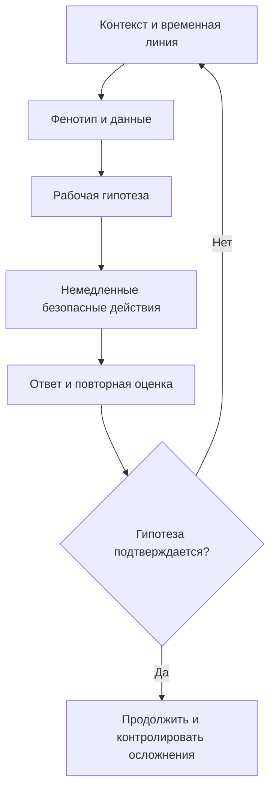
<!-- visual-summary:end -->
Теория мертва без практики. Ниже — четыре сценария; задача читателя мысленно, опираясь на предыдущие главы, ставить диагноз и принимать решения быстрее, чем это сделает текст.

## 14.1. Случай 1. Тепловой удар у марафонца

**Ситуация.** Мужчина 28–35 лет коллапсировал на финише марафона. Погода: +30…35 °C, влажность 70 %. Забег проходил в середине дня. Спортсмен был хорошо тренирован, но **не акклиматизирован**; пил воду, но недостаточно. За несколько километров до финиша ощутил головокружение и слабость, продолжил бег.

**Осмотр на месте.** Лежит, не реагирует на обращение (GCS = 7). Дыхание частое, хриплое. ЧСС 160, АД 90/50 (шок), ЧДД 36, SpO₂ 90 %. Кожа горячая («кипяток») и **профузно влажная**. Мышцы дряблые (flaccid). Зрачки нормальные. На месте развились генерализованные тонико-клонические судороги.

**Температура ректально: 41,5–41,8 °C.**

**Дифференциальный диагноз:**
- MH? — анестезии не было;
- НЗС? — нейролептиков нет, ригидности нет;
- серотониновый синдром? — нет миоклонуса и гиперрефлексии;
- менингит, энцефалит, инсульт? — менингеальных знаков и очаговой симптоматики нет;
- эпилепсия? — судороги явно связаны с гипертермией;
- гипогликемия? — проверяется немедленно и при наличии корректируется; высокая
  температура не отменяет параллельный поиск обратимых причин коллапса.

**Рабочий диагноз: тепловой удар при физической нагрузке (EHS).**

**Неотложная помощь:**
1. Вызвать экстренную помощь, выполнить ABCDE и немедленно начать охлаждение
   на месте.
2. Предпочтительно погружение в холодную воду с поддержкой головы, доступом к
   дыхательным путям, перемешиванием воды и непрерывной ректальной термометрией.
   Если оно невозможно — наиболее быстрый доступный метод всего тела.
3. Подать кислород по показаниям, получить внутривенный/внутрикостный доступ,
   проверить глюкозу.
4. Купировать продолжающиеся судороги бензодиазепином по протоколу.
5. При гипоперфузии вводить изотонический кристаллоид повторно оцениваемыми
   болюсами.
6. Координировать транспорт с охлаждением; жизненно важные вмешательства
   выполняются параллельно.

**В ОРИТ:** решение об интубации принимают по способности защищать дыхательные
пути, вентиляции, оксигенации и судорогам, а не по одной цифре GCS. Продолжают
серийный контроль органов; активное охлаждение при EHS обычно прекращают около
38,6–39,0 °C.

**Диагностика осложнений:** КФК > 100 000 Ед/л, K⁺ 6,0 ммоль/л, моча бурая → **рабдомиолиз, гиперкалиемия, ОПП**.
*Лечение:* титрованные кристаллоиды с контролем перегрузки, серийный калий,
креатинин, КОС, КФК и диурез. Гиперкалиемию лечат по ЭКГ и тяжести; рутинные
маннитол и ощелачивание для профилактики ОПП не показаны.

**Учебный исход.** После быстрого охлаждения судороги прекратились, сознание и
гемодинамика восстановились. Даже при раннем улучшении пациента наблюдают из-за
возможного отсроченного поражения печени, почек и коагуляции.

---

## 14.2. Случай 2. Злокачественная гипертермия в операционной

**Ситуация.** Мальчик 8 лет, масса 25 кг, плановая герниопластика. Отец умер во
время анестезии; этот факт не был передан анестезиологу до индукции и стал
важной системной ошибкой для последующего разбора.

**Анестезия:** индукция пропофолом и севофлураном, сукцинилхолин для интубации.

**Событие через 5–10 минут после интубации:**
- ЧСС выросла с 90 до 150 уд/мин;
- **EtCO₂ на капнографе «взлетел» с 35 до 70 мм рт. ст.** при неизменных параметрах ИВЛ;
- вентиляция затруднена — «мешок тугой»; ригидность жевательных мышц (тризм), затем генерализованная ригидность «как доска»;
- температура в пищеводе последовательно растёт: 36,8; 37,5; 38,0; 38,5 °C;
- аритмии на ЭКГ.

> [!IMPORTANT]
> **Ключевой момент: температура — поздний признак. Диагноз ставится по капнограмме и ригидности.**

**Дифференциальный диагноз:** недостаточная глубина анестезии («проснулся»)? — при этом EtCO₂ не поднимается до 70. Гипоксия? — SpO₂ 99 %. Перегрев в операционной? — при нём EtCO₂ был бы нормальным или низким, а мышцы дряблыми.

**Рабочий диагноз: злокачественная гипертермия.** Триада «тахикардия + гиперкапния + ригидность» на фоне севофлурана и сукцинилхолина, подкреплённая семейным анамнезом.

**Неотложная помощь — протокол MH:**
1. **Звать на помощь** — нужна «укладка MH» и минимум 5–6 человек.
2. **СТОП триггеры:** немедленно выключить севофлуран, вентилировать высоким
   потоком 100 % O₂ и увеличить минутную вентиляцию. Использовать подготовленный
   чистый аппарат или активированные угольные фильтры по локальному протоколу.
3. **Операция:** прекратить или завершить настолько быстро, насколько это
   безопасно; решение зависит от хирургической ситуации.
4. **Дантролен 2,5 мг/кг внутривенно немедленно** — для 25 кг это 62,5 мг.
   Повторять до клинического ответа; суммарная доза может превысить 10 мг/кг,
   одновременно пересматривая диагноз при отсутствии ответа.
5. **Охлаждение при гипертермии:** наружные методы и охлаждённый изотонический
   кристаллоид при показаниях; прекратить активное охлаждение ниже 38,5 °C.
   Лаваж мочевого пузыря не является рутинным методом.
6. **Коррекция осложнений:** серийные газы крови, калий, глюкоза, КФК,
   креатинин и коагуляция. Ацидоз и гиперкалиемию лечить по тяжести и
   педиатрическому протоколу, избегая непроверенных «универсальных» доз.

**Результат.** Температура снизилась с 39 до 38,5 °C за 30 минут, ригидность уменьшилась, гиперкапния разрешилась, гемодинамика стабилизировалась.

**Учебный исход.** После дантролена снижаются EtCO₂ и ригидность,
стабилизируются температура и калий. Пациента наблюдают в ОРИТ не менее 24 часов
по протоколу из-за риска рецидива. После выписки документируют эпизод и
направляют пациента/семью в центр MH для выбора генетического и контрактурного
обследования.

---

## 14.3. Случай 3. НЗС на фоне терапии антипсихотиками

**Ситуация.** Мужчина 35–45 лет с шизофренией доставлен в ОРИТ из психиатрического отделения.

**Анамнез со слов лечащего врача:** 10 дней назад терапия усилена — добавлен галоперидол, доза повышена с 5 до 10 мг дважды в сутки. Последние 3–4 дня пациент «заторможен», «скован», плохо ел, температура субфебрильная. Динамика по дням: 1–2-е сутки — ригидность в ногах и спине; 3–4-е — прогрессирование ригидности, тремор; 5-е — температура 38,5 °C, спутанность; 6-е — 39,5 °C и делирий. Сегодня утром перестал реагировать, T = 40 °C.

**Осмотр.** Выраженное нарушение сознания (GCS = 9). ЧСС 120, АД лабильное
160/100, ЧДД 28. Кожа бледная и мраморная, конечности холодные — требуется
оценка перфузии и шока. Потливость умеренная, гиперсаливация. Зрачки в норме.
При попытке согнуть руку — выраженная генерализованная ригидность типа
**«свинцовой трубы»**. Рефлексы снижены. Брадикинезия, тремор.

**Температура ректально 41,0 °C — при температуре кожи лба 37 °C.**

**Дифференциальный диагноз:**
- инфекция ЦНС или сепсис? — отсутствие менингеальных знаков и один уровень
  прокальцитонина не исключают инфекцию; посевы, визуализацию и люмбальную
  пункцию выполняют по показаниям параллельно с неотложной помощью;
- серотониновый синдром? — нет анамнеза СИОЗС, нет миоклонуса и гиперрефлексии (напротив, гипорефлексия), развитие медленное;
- MH? — анестезии не было, развитие не молниеносное.

**Рабочий диагноз: нейролептический злокачественный синдром.** Тетрада «гипертермия + „свинцовая“ ригидность + изменение сознания + вегетативная дисфункция» на фоне галоперидола при медленном развитии.

**Лаборатория:** КФК 80 000 Ед/л (в более лёгком варианте — 2000 Ед/л), лейкоцитоз 12 000/мкл, АСТ 100 Ед/л, АЛТ 80 Ед/л, моча бурая → рабдомиолиз.

**Неотложная помощь:**
1. **Отмена галоперидола.**
2. Начать контролируемое физическое охлаждение и одновременно оценивать/
   поддерживать перфузию; цвет кожи не является противопоказанием к охлаждению.
3. ABCDE; интубация — если пациент не защищает дыхательные пути, не
   оксигенируется/вентилируется или требуется контролируемая нейромышечная
   блокада. Инвазивные линии устанавливают по клинической необходимости.
4. Корректировать гиповолемию титрованными кристаллоидами; не использовать
   дротаверин как обязательный этап.
5. При тяжёлом/рефрактерном НЗС обсудить с токсикологом и психиатром
   бромокриптин, амантадин, дантролен или ЭСТ. КФК 80 000 Ед/л показывает
   тяжёлое мышечное повреждение, но сама по себе не выбирает препарат.
6. При рабдомиолизе — серийный контроль калия, КОС, КФК, креатинина и диуреза,
   титрованная жидкость без рутинного маннитола/ощелачивания.

**Учебный исход.** После отмены триггера, охлаждения и интенсивной поддержки
температура и ригидность постепенно уменьшаются, но восстановление может занять
дни или недели. Решение о повторном назначении антипсихотика принимает психиатр
после полного разрешения эпизода; начинают позже, с низкой дозы и медленной
титрацией. Эпизод документируют.

---

## 14.4. Случай 4. Серотониновый синдром при полипрагмазии

**Ситуация.** Женщина 45–50 лет; вызов скорой помощи: «неадекватна, трясёт, жар».

**Анамнез со слов мужа:** лечится от депрессии, принимает флуоксетин (в другом варианте — сертралин 100 мг/сут). Накануне «защемило спину», приняла **трамадол** 100 мг. Через 2–4 часа после приёма стала «странной», возбуждённой, пожаловалась на диарею, затем «начало трясти».

**Осмотр.** Выраженное психомоторное возбуждение, дезориентация, тревога. ЧСС 120–140, АД 150/90. Кожа **красная, горячая, профузно влажная**. **Мидриаз.** **Гиперрефлексия** — коленные рефлексы «взлетают». Спонтанный **миоклонус** в ногах, клонус, тремор. Диарея.

**Температура ректально 38,5–40,5 °C.**

**Дифференциальный диагноз:**
- НЗС? — нейролептиков нет, развитие быстрое, вместо гипорефлексии — гиперрефлексия, вместо «свинцовой» ригидности — миоклонус;
- отравление стимуляторами? — картина похожа, но при симпатомиметическом токсидроме нет миоклонуса и гиперрефлексии; выполняется токсикологический скрининг;
- антихолинергический синдром? — исключается по влажной коже и диарее (там «сухой как кость» и атония кишечника).

**Рабочий диагноз: серотониновый синдром** по критериям Hunter —
серотонинергическая экспозиция плюс спонтанный клонус. Возбуждение, потливость,
диарея и гиперрефлексия усиливают клиническую уверенность.

**Неотложная помощь:**
1. **Немедленная отмена флуоксетина/сертралина и трамадола.**
2. Начать наружное охлаждение; тепло создаёт мышечная гиперактивность, поэтому
   её подавление столь же важно.
3. ABCDE и титрованная жидкость при гиповолемии.
4. **Бензодиазепины** — первая линия для возбуждения и мышечной активности.
   При жизнеугрожающей гипертермии и тяжёлой ригидности может потребоваться
   интубация и недеполяризующая нейромышечная блокада; физические фиксаторы
   усиливают мышечную работу.
5. При сохраняющемся умеренном/тяжёлом синдроме можно рассмотреть энтеральный
   **ципрогептадин** как дополнение, а не замену интенсивной поддержки.
6. Мониторировать температуру, гемодинамику, КФК, почки, КОС и электролиты.

**Учебный исход.** После прекращения причинных препаратов и контроля мышечной
активности состояние улучшается. Срок зависит от периода полувыведения и
осложнений. Комбинацию, вызвавшую эпизод, отмечают в документации; будущую
психофармакотерапию пересматривают совместно с лечащим врачом.

---

## 14.5. Случай 5. «Белая» лихорадка у ребёнка 1 года: где проходит граница

**Ситуация.** Ребёнок 1 год 2 месяца, вторые сутки ОРВИ. Мать вызвала бригаду
скорой помощи из-за выраженной вялости и кратковременного судорожного
подёргивания конечностей.

**Осмотр.** Кожа бледная с мраморным рисунком, цианоз носогубного треугольника,
кисти и стопы холодные. ЧСС 180 в минуту, ЧДД 48 в минуту. Аксиллярная
температура 39,6 °C, **ректальная 40,7 °C** (Δt ≈ 1,1 °C — выраженная
периферическая вазоконстрикция). Менингеальных знаков нет, сознание восстановилось,
ребёнок реагирует на мать. Глюкоза крови в норме.

**Первый и главный вопрос: лихорадка или гипертермия?** Здесь — **лихорадка**:
есть инфекционное заболевание, постепенное развитие, отсутствие тепловой
экспозиции и нагрузки. Установочная точка сдвинута вверх, а значит, антипиретик
воздействует на механизм. Это принципиально отличает случай от четырёх
предыдущих.

**Дифференциальный ряд, который нельзя пропустить:** нейроинфекция (менингит,
энцефалит) — оценивают менингеальные знаки, сыпь, динамику сознания; сепсис;
гипогликемия (исключена); перегрев от укутывания как сопутствующий фактор.
Фебрильный приступ не освобождает от поиска причины лихорадки.

**Тактика по национальному протоколу (Союз педиатров России, Минздрав РФ):**

1. прекратить обтирание холодной водой, согреть конечности;
2. **папаверин 2 % — 0,1 мл** (0,1 мл на год жизни) внутримышечно для устранения
   периферического вазоспазма;
3. после потепления конечностей и порозовения кожи — **парацетамол 15 мг/кг**
   внутривенно медленно; при сохраняющейся судорожной готовности —
   **диазепам 0,3 мг/кг**;
4. госпитализация в инфекционный стационар для установления причины лихорадки.

**Исход.** Через 30 минут кожа тёплая и розовая, ректальная температура 38,3 °C,
ребёнок в стабильном состоянии госпитализирован.

> [!CAUTION]
> **Два разбора ошибок — и один из них касается самого объяснения.**
>
> *Ошибка ухода.* Обтирание ледяной водой ребёнку с лихорадкой действительно не
> рекомендуется: оно вызывает выраженный дискомфорт и дрожь, а дрожь —
> это мышечная работа, увеличивающая теплопродукцию. Метод неэффективен и мучителен.
>
> *Ошибка объяснения.* Часто утверждают, что наружное охлаждение «полностью
> прекращает теплоотдачу и потому температура ядра стремительно растёт». Такая
> формулировка **не подтверждена** и вводит в заблуждение: рост температуры здесь
> объясняется естественным течением лихорадки со сдвинутой вверх установочной
> точкой, а не тем, что холод «запер» тепло внутри. Разница существенна, потому
> что из ложной посылки легко сделать смертельно опасный вывод — «холод при
> высокой температуре вреден вообще».
>
> **Правило переноса.** Всё описанное относится к пирогенной лихорадке. У ребёнка,
> извлечённого из закрытого автомобиля или коллапсировавшего на жаре, при той же
> бледной мраморной коже действует **противоположный** алгоритм: немедленное
> эффективное охлаждение, оценка и поддержка перфузии, никаких спазмолитиков и
> антипиретиков «первым шагом» (§ 12.1.6).

## 14.6. Разбор: контрольные вопросы

**Вопрос 1.** Пациент в ОРИТ: T = 40,5 °C, нарушение сознания, кожа бледная и
холодная. Ваши первые действия?
*Ответ:* ABCDE, надёжное измерение температуры ядра, немедленное эффективное
охлаждение и параллельная оценка/поддержка перфузии. Цвет кожи не является
противопоказанием к наружному охлаждению.

**Вопрос 2.** В чём разница между ригидностью при НЗС и мышечной гиперактивностью при СС?
*Ответ:* НЗС — «свинцовая труба», генерализованная пластическая ригидность, гипорефлексия, медленное развитие. СС — «дёрганый» пациент: миоклонус, гиперрефлексия, клонус, быстрое развитие.

**Вопрос 3.** В операционной EtCO₂ = 75 мм рт. ст., температура ещё 37,2 °C. Диагноз и действие?
*Ответ:* ранняя MH. Немедленно прекратить подачу анестетика и вводить дантролен. **Ждать роста температуры нельзя.**

**Вопрос 4.** Как отличить гипертермию от лихорадки?
*Ответ:* при лихорадке уставка сдвинута вверх, при гипертермии тепло накапливается
без такого сдвига. Ответ на антипиретик не является надёжным диагностическим
тестом; при подозрении на тепловой удар не откладывают охлаждение.

**Вопрос 5.** Пациент с T = 39 °C, мышечной ригидностью и делирием: как отличить НЗС от менингита?
*Ответ:* временная связь с антипсихотиком и «свинцовая» ригидность поддерживают
НЗС, но отсутствие менингеальных знаков не исключает инфекцию. Исследования на
инфекцию и неврологические причины проводят по показаниям параллельно; КФК
неспецифична.

**Вопрос 6.** Пациент 35 лет: T = 40,5 °C, нарушение сознания, судороги, накануне участвовал в марафоне в жару. Диагноз и лечение?
*Ответ:* тепловой удар. Немедленное охлаждение (погружение в холодную воду, испарительное охлаждение), инфузионная терапия, диазепам для купирования судорог, далее контроль рабдомиолиза и калия.

---

## Выводы по главе 14

**Алгоритмы работают.** Четыре совершенно разных пациента, у всех — гипертермический синдром, но потребовались четыре принципиально разных лечебных подхода, определённых дифференциальной диагностикой.

**Контекст формирует гипотезу.** Анестезия, антипсихотик, сочетание
серотонинергических препаратов или нагрузка в жару резко меняют вероятность
диагнозов, но не отменяют поиск конкурирующих причин.

**Фенотип проверяет гипотезу.** Ригидность, клонус, рефлексы, влажность кожи,
темп развития и ответ на первые действия полезны в совокупности, но редко
подтверждают диагноз по отдельности.

**Специфичность различается.** Дантролен обязателен при MH; бромокриптин и
ципрогептадин — возможные дополнения при отдельных тяжёлых случаях НЗС и
серотонинового синдрома, но не заменяют поддержку.

**Перфузия не конкурирует с охлаждением.** При тяжёлой гипертермии эффективное
охлаждение и лечение шока выполняют параллельно независимо от цвета кожи.

**Переход.** Пройден весь путь — от определения до прогноза и практики. Остаётся подвести итоги и зафиксировать то, что должно остаться с врачом на всю профессиональную жизнь.

---

# Глава 15. Контроль знаний и заключение

<!-- visual-summary:start -->

### Схема для запоминания

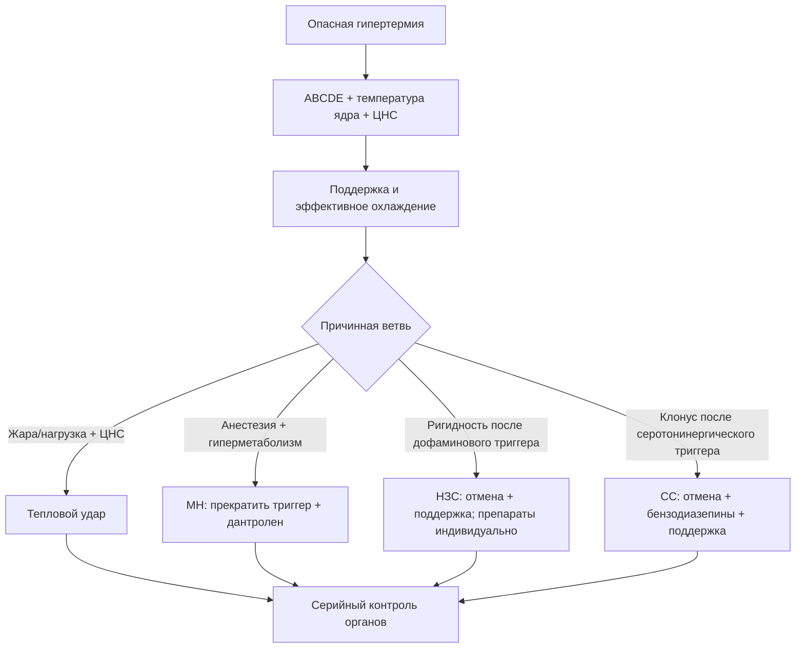
<!-- visual-summary:end -->
## 15.1. Ключевые положения для клинической практики

### 15.1.1. Основные тезисы — то, что нужно запомнить навсегда

1. **Лихорадка ≠ гипертермия.** Лихорадка — контролируемый сдвиг «термостата» гипоталамуса вверх, опосредованный PGE₂. Гипертермия — неконтролируемый срыв терморегуляции при нормальной установочной точке.

2. **Антипиретики не работают при истинной гипертермии** (MH, НЗС, серотониновый синдром, тепловой удар) и могут быть вредны: гепатотоксичность парацетамола, нефротоксичность и усиление коагулопатии от НПВС.

3. **Тяжёлая гипертермия смертельно опасна, но не определяется одной цифрой.**
   При тепловой экспозиции нарушение сознания означает тепловой удар независимо
   от того, успели ли измерить температуру выше 40 °C.

4. **Тепловая доза = температура × время.** Риск органного повреждения растёт
   с интенсивностью и длительностью перегрева, но универсального порога
   необратимости или фиксированного процента летальности за час нет.

5. **Диагностика в первые минуты — клиническая.** Анамнез (контекст!) и физикальный осмотр (ригидность? миоклонус? пот? зрачки?) важнее лаборатории.

6. **Охлаждение и перфузия — параллельно.** Цвет кожи помогает заметить шок, но
   не задаёт отдельный «красный/белый» алгоритм и не является основанием
   откладывать наружное охлаждение ради спазмолитика.

7. **Различать специфичность лечения:** при MH дантролен обязателен; при НЗС
   основа — отмена триггера и интенсивная поддержка, дополнительные препараты
   индивидуальны; при серотониновом синдроме основа — отмена триггера,
   бензодиазепины и контроль мышечной активности, ципрогептадин возможен как
   энтеральное дополнение.

8. **Мультидисциплинарный подход.** Лечение ГС — командная работа реаниматолога, анестезиолога, невролога, нефролога, психиатра, опирающаяся на заранее утверждённые протоколы (SOP) и укладки.

9. **Понимание патофизиологии — инструмент:** оно объясняет, почему при MH
   ранним сигналом служит необъяснимый рост CO₂, при рабдомиолизе важны калий,
   почки и объёмный статус, а при мраморности нужно лечить шок, не задерживая
   охлаждение.

### 15.1.2. Итоговый алгоритм при подозрении на опасную гипертермию

1. **Позвать на помощь** — реанимационная бригада, «Hyperthermia Team».
2. **ABCDE:** обеспечить дыхательные пути/вентиляцию по клиническим показаниям,
   мониторировать ЭКГ, АД и SpO₂; при ИВЛ — EtCO₂.
3. **Надёжно измерить температуру ядра:** при полевом подозрении на тепловой
   удар — ректально; в операционной/ОРИТ — валидированным центральным способом.
4. **Устранить причину:** стоп ингаляционный анестетик, стоп нейролептик или серотонинергический препарат, эвакуация из жаркой среды, купирование судорог.
5. **Начать самый быстрый показанный метод охлаждения,** одновременно оценивая
   и поддерживая перфузию.
6. **Взять кровь и мочу:** электролиты, глюкоза, КОС/лактат, креатинин, КФК,
   печёночные показатели, общий анализ крови и коагуляцию; инфекционные
   исследования — по контексту. Один прокальцитонин не исключает сепсис.
7. **Применить специфическую терапию,** когда она существует: при MH —
   дантролен без задержки.
8. **Лечить осложнения:** гиперкалиемию, шок, судороги, коагулопатию и органную
   недостаточность. При рабдомиолизе — титрованная жидкость и мониторинг без
   рутинного маннитола/ощелачивания.
9. **Остановить активное охлаждение по причинному протоколу:** около
   38,6–39,0 °C при EHS и ниже 38,5 °C при MH.
10. **Госпитализация в ОРИТ** для мониторинга и лечения полиорганной недостаточности.

---

## 15.2. Вопросы для самопроверки

**1. Как отличить лихорадку от гипертермии?**

Показать ответ

По механизму — регулируемый сдвиг установочной точки против накопления тепла
без такого сдвига. Контекст, экспозиция, лекарства и мышечный фенотип важнее
одного симптома. Озноб, пот и цифра температуры перекрываются, а ответ на
антипиретик не является диагностическим тестом.

**2. Ключевые различия НЗС и серотонинового синдрома.**

Показать ответ

Анамнез: блокада дофамина/отмена дофаминергического препарата против
серотонинергической экспозиции. НЗС обычно развивается медленнее и даёт
генерализованную «свинцовую» ригидность; при серотониновом синдроме характернее
гиперрефлексия и клонус, особенно в ногах. КФК и вегетативные симптомы
перекрываются. В обоих случаях сначала отменяют триггер и поддерживают органы;
фармакологические дополнения различаются и не заменяют эти действия.

**3. Почему дантролен эффективен при MH?**

Показать ответ

Он блокирует дефектный рианодиновый рецептор RYR1 в саркоплазматическом ретикулуме, прекращая патологическое высвобождение Ca²⁺ в цитоплазму. Прекращается ригидность, останавливается гиперметаболизм, прекращается теплопродукция — препарат «тушит пожар» непосредственно в мышце.

**4. Какие меры охлаждения наиболее эффективны при тепловом ударе?**

Показать ответ

При тепловом ударе на нагрузке — погружение в холодную воду при сохранённом
доступе к дыхательным путям и мониторингу. Если оно невозможно — наиболее
быстрый доступный метод всего тела, например испарительно-конвективный.
Отдельные пакеты со льдом и охлаждённая жидкость — дополнения, а
экстракорпоральную поддержку начинают по самостоятельным органным показаниям,
не как рутинную следующую ступень охлаждения.

**5. Какие исследования обязательны при подозрении на ГС?**

Показать ответ

*У постели:* при полевом подозрении на тепловой удар — ректальная температура;
ЭКГ, глюкоза, при ИВЛ — EtCO₂, КОС с лактатом.
*Лаборатория:* КФК, электролиты, креатинин, АСТ/АЛТ и билирубин, коагуляция и
общий анализ крови. Анализ мочи помогает заподозрить пигментурию, но не заменяет
клиническую оценку. Посевы и другие исследования инфекции назначают по
контексту; прокальцитонин не разделяет надёжно сепсис и тепловой удар.

---

## 15.3. Тестовые задания

**Вопрос 1.** Какой признак при тепловой экспозиции наиболее важен для
клинического распознавания теплового удара?

A) сухая кожа  B) дисфункция ЦНС  C) КФК > 1000 Ед/л  D) отсутствие озноба

Ответ

**B) дисфункция ЦНС**

*Комментарий:* температура ядра обычно высока, но могла снизиться до измерения;
изменение сознания на фоне тепловой нагрузки требует немедленного охлаждения.

**Вопрос 2.** Какой препарат является специфическим антидотом при злокачественной гипертермии?

A) Парацетамол  B) Дантролен  C) Диазепам  D) Ципрогептадин

Ответ

**B) Дантролен**

**Вопрос 3.** Что означает мраморность и холодные конечности при тяжёлой
гипертермии?

A) запрет наружного охлаждения
B) показание к дротаверину
C) необходимость оценить шок и продолжать показанное охлаждение
D) доказательство НЗС

Ответ

**C) необходимость оценить шок и продолжать показанное охлаждение**

**Вопрос 4.** Какова роль бикарбоната и маннитола при рабдомиолизе?

A) обязательны всем  B) заменяют кристаллоиды
C) рутинно не рекомендуются для профилактики ОПП  D) назначаются по цвету мочи

Ответ

**C) рутинно не рекомендуются для профилактики ОПП**

**Вопрос 5.** Что является первой фармакологической линией для возбуждения и
мышечной гиперактивности при серотониновом синдроме?

A) бензодиазепин  B) бромокриптин  C) парацетамол  D) аспирин

Ответ

**A) бензодиазепин**

**Задание на соответствие.** Сопоставьте синдромы и характеристики:
1. Злокачественная гипертермия — 2. НЗС — 3. Серотониновый синдром
A) быстрое развитие (часы), миоклонус, диарея;
B) развивается при анестезии, гиперкапния, молниеносное течение;
C) постепенное развитие (дни–недели), «свинцовая» ригидность, делирий.

Ответ

**1 — B, 2 — C, 3 — A.**

---

## 15.4. Клинические задачи

**Задача 1.** 70-летняя женщина с ХСН, принимает диуретики. Третий день волны жары. Доставлена в коме: T_рект = 41,2 °C, ЧСС 130, АД 80/40. Кожа красная и сухая, мышцы дряблые.

Показать разбор

*Диагноз:* классический (ненагрузочный) тепловой удар с шоком.

*Первые действия:* ABCDE; немедленное испарительно-конвективное или другое
эффективное охлаждение всего тела; кислород и защита дыхательных путей по
показаниям; небольшие повторно оцениваемые болюсы кристаллоида с учётом ХСН.
Далее — серийный контроль электролитов, почек, печени, КФК и коагуляции.

**Задача 2.** Пациент 40 лет в операционной (севофлуран, сукцинилхолин). Через 15 минут: тахикардия 150 уд/мин, мышечная ригидность, гиперкапния (EtCO₂ 70 мм рт. ст.), T = 39 °C.

Показать разбор

*Диагноз:* злокачественная гипертермия.

*Неотложные мероприятия:* 1) немедленно прекратить триггеры, вентилировать
высоким потоком 100 % кислорода и увеличить минутную вентиляцию; 2) дантролен
2,5 мг/кг внутривенно с повторами до ответа; 3) охлаждать, если температура
повышена, и прекратить активное охлаждение ниже 38,5 °C.

*Исследования:* КФК, калий, креатинин, коагулограмма, газы крови и КОС, миоглобин мочи.

**Задача 3.** Пациент 50 лет: T = 41 °C, нарушение сознания, судороги; принимает галоперидол 10 мг дважды в сутки в течение двух недель. При осмотре — мышечная ригидность, тремор, гиперсаливация.

Показать разбор

*Диагноз:* нейролептический злокачественный синдром.

*Исследования:* КФК, электролиты, функция почек, коагулограмма, общий анализ крови, миоглобин мочи.

*Лечение:* немедленно отменить галоперидол; выполнить ABCDE, начать показанное
физическое охлаждение, контролировать мышечную активность и осложнения,
титровать жидкость по перфузии. При тяжёлом/рефрактерном течении совместно с
токсикологом и психиатром рассматривают бромокриптин, амантадин, дантролен или
ЭСТ; доказательства ограничены. Маннитол и бикарбонат для профилактики ОПП
рутинно не назначают.

---

## 15.5. Аккредитационный блиц-тест

**1. Почему антипиретики не применяют при истинном тепловом ударе?**

Ответ

**Потому что у них отсутствует мишень.** Парацетамол и НПВС снижают температуру,
подавляя синтез PGE₂ и возвращая вниз *смещённую* установочную точку. При
тепловом ударе установочная точка нормальна (около 37 °C), а перегрев вызван
физическим срывом теплоотдачи — воздействовать не на что.

Дополнительный довод — безопасность: на фоне ишемии печени, ОПП и коагулопатии
парацетамол и НПВС добавляют гепато-, нефро- и гемостатический риск. Поэтому их
не назначают, но корректная формулировка — «неэффективны и потенциально вредны,
не заменяют охлаждение», а не «вызывают фульминантную печёночную недостаточность».

**2. Начальная доза дантролена при злокачественной гипертермии?**

Ответ

**2,5 мг/кг внутривенно болюсно**, с повторами по 1–2,5 мг/кг каждые 5–10 минут
до клинического ответа. Ориентир 10 мг/кг — не жёсткий предел: при фульминантном
течении рекомендованный максимум может потребоваться превысить, одновременно
пересматривая диагноз при отсутствии ответа.

**3. При какой температуре ядра прекращают активное охлаждение?**

Ответ

Ориентировочно **38,5–39,0 °C** — около 38,6–39,0 °C при тепловом ударе на
нагрузке и ниже 38,5 °C в алгоритмах MH. Причина остановки — инерция охлаждения:
продолжение до 37 °C ведёт к ятрогенной гипотермии, аритмиям, коагулопатии и дрожи.

**4. Метод выбора при нагрузочном тепловом ударе?**

Ответ

**Погружение в холодную воду (CWI)** по шею, с удержанием головы и дыхательных
путей над водой, перемешиванием воды и непрерывной ректальной термометрией.
Протоколы спортивной медицины ориентируют на воду около 10 °C (описываемые
диапазоны — от ледяной до прохладной). Если погружение невозможно, применяют
самый быстрый доступный метод охлаждения всего тела.

**5. Ребёнок с ОРВИ, лихорадкой, бледной мраморной кожей и холодными
конечностями. Первый шаг по национальному протоколу — и в чём границы этого
правила?**

Ответ

По протоколу Минздрава РФ и Союза педиатров при «белой» лихорадке первым шагом
идут согревание конечностей и **спазмолитик** (папаверин или дротаверин 2 % —
0,1 мл на год жизни), и лишь затем антипиретик.

**Границы правила критически важны.** Оно относится к **пирогенной лихорадке
инфекционного генеза**, где установочная точка сдвинута вверх. Его **нельзя**
переносить на тепловой удар, MH, НЗС, серотониновый синдром и отравления: там
бледность и холодные конечности означают шок, а эффективное охлаждение не
откладывают ради спазмолитика (§ 12.1.6).

---

## 15.6. Ситуационные задачи повышенной сложности

### Задача 4. Клонус после галоперидола у пациента на сертралине

**Условие.** Пациент 42 лет, принимает сертралин 100 мг/сут по поводу депрессии.
В ОРИТ по поводу послеоперационного делирия внутривенно введено 5 мг
галоперидола. Через 6 часов: температура 40,2 °C, ЧСС 135, АД 170/100 мм рт. ст.,
профузный пот. Неврологически — выраженный клонус стоп и надколенника,
гиперрефлексия, ригидность преимущественно в нижних конечностях.

Показать разбор

*Диагноз:* **серотониновый синдром** средней или тяжёлой степени.

*Главный различитель:* **гиперрефлексия и спонтанный клонус** с преобладанием в
ногах. При НЗС рефлексы нормальные или сниженные, ригидность генерализованная,
типа «свинцовой трубы», клонуса нет. Второй аргумент — темп: часы, а не дни.
Ловушка задачи в том, что последним введённым препаратом был нейролептик, и это
подталкивает к диагнозу НЗС.

*Тактика:*
1. немедленная отмена сертралина и галоперидола;
2. **бензодиазепины** титрованием (диазепам 5–10 мг внутривенно) — первая линия
   для возбуждения и мышечной гиперактивности;
3. активное физическое охлаждение, титрованная инфузия, контроль КФК, калия,
   почек и КОС;
4. при сохраняющихся проявлениях — энтеральный **ципрогептадин** как дополнение
   (нагрузочная доза с последующими приёмами). Это вспомогательное средство с
   ограниченной доказательной базой, а не антидот: оно не заменяет отмену
   триггеров, седацию и контроль температуры;
5. при жизнеугрожающей гипертермии и ригидности — интубация с недеполяризующей
   нейромышечной блокадой. Физические фиксаторы противопоказаны: они усиливают
   изометрическую мышечную работу и теплопродукцию.

### Задача 5. Антихолинергический токсидром и вопрос о физостигмине

**Условие.** Девушка 19 лет: температура 39,8 °C, психомоторное возбуждение,
зрительные галлюцинации. Кожа красная, сухая, горячая; зрачки широкие, реакция
вялая. ЧСС 140, АД 110/70. На ЭКГ синусовая тахикардия, QRS 88 мс. Рядом найдены
пустые упаковки амитриптилина и дифенгидрамина.

Показать разбор

*Диагноз:* классический **антихолинергический токсидром** — «сухой как кость,
красный как свёкла, горячий как печь, безумный как шляпник».

*Основа лечения:* физическое охлаждение, седация бензодиазепинами, титрованная
инфузия, непрерывный ЭКГ-мониторинг. При расширении QRS более 100 мс — натрия
бикарбонат.

*О физостигмине — и почему в этой задаче он не показан.* Ключевая ловушка
условия: рядом найдены упаковки **амитриптилина**, то есть экспозиция ТЦА
подтверждена, а токсидром смешанный.

- Нормальный QRS (здесь 88 мс) означает лишь одно: **на момент снятия ЭКГ нет
  блокады натриевых каналов**. Он не превращает отравление в «чисто
  антимускариновое» и не отменяет ТЦА-компонент. Всасывание продолжается, и QRS
  может расшириться позже — поэтому нужен повторный ЭКГ-контроль.
- Физостигмин уместен при **изолированной антимускариновой** интоксикации
  (дифенгидрамин, атропин, дурман, белладонна) с рефрактерным к бензодиазепинам
  делирием. При известном или предполагаемом приёме ТЦА его избегают либо
  применяют только по прямому указанию токсикологического центра.
- При расширенном QRS, брадикардии или судорогах он не применяется однозначно.
- Если препарат всё же используют — **низкие титрованные дозы 0,5–1 мг**
  внутривенно медленно с интервалом не менее 10–15 минут, под контролем ЭКГ, с
  готовностью к холинергическим осложнениям (судороги примерно у 2,5 %) и
  доступным атропином.

*Практический вывод:* при смешанной экспозиции ТЦА + антигистаминное лечение
строят на охлаждении, бензодиазепинах, титрованной инфузии и ЭКГ-мониторинге;
при расширении QRS более 100 мс — натрия бикарбонат. Нормальный QRS сам по себе
разрешением на физостигмин не является.

---

## 15.7. Рекомендуемая литература и ресурсы

### Базовые руководства

*Международные:*
- **Harrison's Principles of Internal Medicine** — глава «Fever and Hyperthermia»;
- **Tintinalli's Emergency Medicine** — глава «Heat Emergencies»;
- **Miller's Anesthesia** — глава «Malignant Hyperthermia».

*Отечественные:* профильные руководства по анестезиологии-реаниматологии и интенсивной терапии (в частности, издания под редакцией А. А. Бунятяна и В. М. Мизикова, Б. Р. Гельфанда). Библиографические данные конкретных изданий следует уточнять по каталогам библиотек: в исходных материалах часть выходных сведений приведена неточно.

### Клинические рекомендации и протоколы

- **MHAUS** — протокол ведения криза MH, подготовка оборудования и доступность
  дантролена;
- **EMHG** — европейские рекомендации по распознаванию и лечению MH;
- рекомендации **ACSM**, **NATA**, **Wilderness Medical Society** по тепловому удару при нагрузке, включая принцип «cool first, transport second»;
- рекомендации **ERC** по реанимации.

Проверенные ссылки, DOI и дата аудита собраны в
[файле источников](ИСТОЧНИКИ.md).

### Онлайн-ресурсы

- **PubMed** и **PubMed Central** — поиск по ключевым словам *heat stroke*, *malignant hyperthermia*, *neuroleptic malignant syndrome*, *serotonin syndrome*;
- **Cochrane Library** — систематические обзоры и метаанализы;
- **UpToDate** — обзорные статьи по всем формам ГС;
- **Google Scholar** — поиск публикаций и цитирований;
- образовательные платформы (Coursera, edX) — курсы по интенсивной терапии и анестезиологии.

---

## Заключительные замечания

Гипертермический синдром — одна из тех драматических патологий, где отточенные знания и скорость реакции врача имеют абсолютное значение. Это не хроническая сердечная недостаточность, развивающаяся годами: здесь в распоряжении врача — минуты.

Нужно **увидеть** различия между клонусом при серотониновом синдроме,
генерализованной ригидностью при НЗС, дисфункцией ЦНС после тепловой экспозиции
и необъяснимым ростом EtCO₂ при MH. Но ни влажность кожи, ни один лабораторный
маркер не должны подменять контекст и повторную оценку.

Ключевые моменты, которые следует унести из этого курса:

- гипертермия — это **срыв механизмов терморегуляции**, а не просто высокая цифра на термометре;
- отличие от лихорадки определяет выбор лечения: физическое охлаждение против антипиретиков;
- охлаждение нельзя откладывать ради окончательного диагноза; фиксированной
  формулы прироста летальности за час нет;
- специфическая терапия зависит от этиологии, а лаборатория помогает оценить
  осложнения и конкурирующие диагнозы;
- профилактика — от сбора анамнеза перед наркозом до правил поведения в жару — снижает летальность сильнее, чем любая реанимационная техника.

> [!TIP]
> **Запомните: лихорадку мы лечим. Гипертермический синдром мы спасаем — и спасаем немедленно.**
