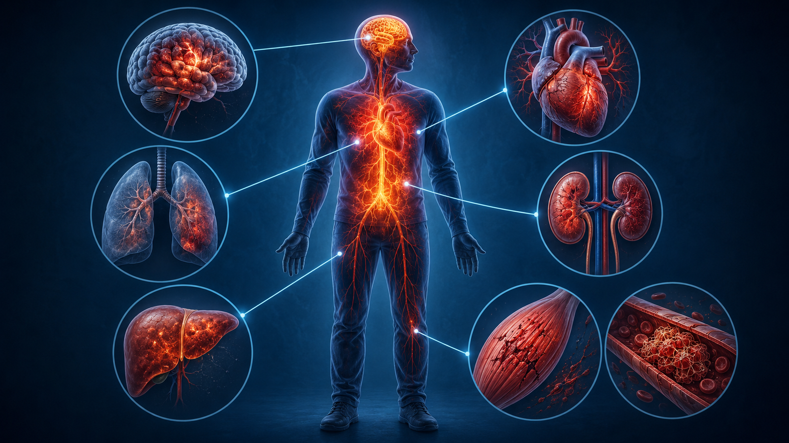
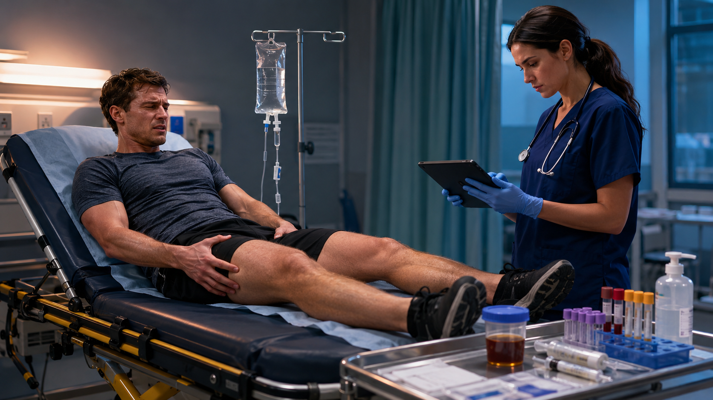
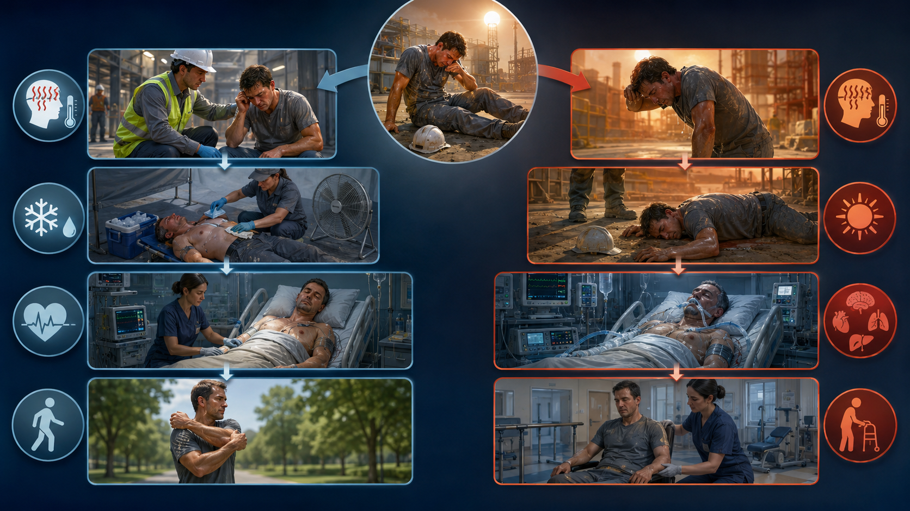
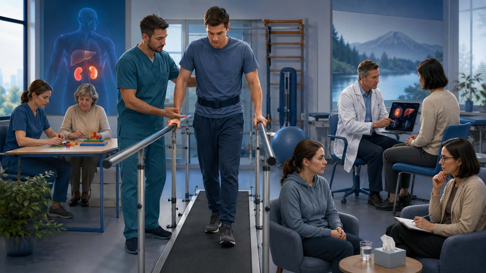

# Иллюстрации глав

Тридцать иллюстраций, по две на главу, вынесенные из текста монографии.
В главах остались только Mermaid-схемы — они проверяемы и правятся вместе
с текстом, тогда как эти изображения растровые и правке не поддаются.

> [!NOTE]
> Иллюстрации мнемонические, а не документальные: они помогают запомнить
> структуру темы, но не являются гистологическими, анатомическими или
> протокольными схемами. Подписи сохранены в исходном виде — в них эта
> оговорка проговаривается отдельно почти для каждого рисунка.

Презентационные слайды 16:9 — в отдельном разделе [`СЛАЙДЫ.md`](СЛАЙДЫ.md).

## Глава 1. Введение и определения

*Рисунок 1. Мнемонический контраст регулируемой лихорадки и нерегулируемого накопления тепла. Цвет кожи и потоотделение вариабельны и сами по себе механизм не определяют.*

*Рисунок 2. От наблюдения и термометрии к мониторингу, молекулярной генетике и механизм-ориентированной терапии.*

## Глава 2. Физиология терморегуляции (рефрешер-курс)

*Рисунок 1. Условная карта входов и эффекторных ответов: терморецепторы, гипоталамические сети, кожный кровоток, потоотделение и мышечная активность.*

*Рисунок 2. Излучение, конвекция, проведение и испарение. Рисунок показывает физические пути, а не их фиксированный вклад: он зависит от среды и одежды.*

## Глава 3. Патофизиология гипертермического синдрома

*Рисунок 1. Концептуальная, не гистологическая схема: белковый и мембранный стресс, митохондриальная дисфункция, повреждение эндотелия и органов.*

*Рисунок 2. Накопление тепла возникает, когда суммарное поступление и продукция тепла устойчиво превышают возможности его отдачи.*

## Глава 4. Этиология и классификация гипертермических состояний

*Рисунок 1. Контексты, которые быстро сужают поиск причины: нагрузка и жара, анестезия, лекарственный триггер, поражение ЦНС или эндокринный криз.*

*Рисунок 2. Условная связь наследственной предрасположенности, кальциевой регуляции скелетной мышцы и анестезиологического триггера. Это не родословная и не изображение конкретного белка.*

## Глава 5. Клиническая картина

*Рисунок 1. Мнемоническая последовательность от теплового стресса к угрожающему состоянию. Реальное течение может быть быстрым и не обязано проходить все этапы.*

*Рисунок 2. Группы признаков, которые оценивают совместно: ЦНС, кровообращение, дыхание, кожа, мышцы и возможные признаки пигментурии.*

## Глава 6. Диагностика

*Рисунок 1. Первичная оценка объединяет ABCDE, неврологический статус, надёжную температуру ядра и информацию о контексте; действия выполняют параллельно.*

*Рисунок 2. Лабораторный мониторинг подбирают для почек, печени, мышц, электролитов, КОС и коагуляции; изображённые панели не являются бланком тестов.*

## Глава 7. Дифференциальная диагностика

*Рисунок 1. Контекстная подсказка: нагрузка, анестезия, дофаминергический или серотонинергический триггер. Ни один отдельный признак не заменяет оценку.*

*Рисунок 2. Мнемонический контраст устойчивой ригидности и повторных движений при клонусе. Точный неврологический осмотр включает рефлексы и распределение.*

## Глава 8. Осложнения гипертермического синдрома

*Рисунок 1. Органы-мишени и системные процессы. Это карта мониторинга, а не обязательная последовательность поражения.*

*Рисунок 2. Боль и слабость мышц, пигментурия, КФК, калий, диурез и функция почек оцениваются совместно; отсутствие тёмной мочи рабдомиолиз не исключает.*

## Глава 9. Неотложная помощь и лечение

*Рисунок 1. При тепловом ударе на нагрузке погружение в холодную воду — наиболее быстрый полевой метод при сохранённом доступе к дыхательным путям и мониторингу.*

*Рисунок 2. Параллельные действия команды при MH: прекратить триггер, кислород, дантролен, охлаждение при гипертермии, коррекция нарушений и мониторинг.*

## Глава 10. Профилактика

*Рисунок 1. Акклиматизация, контроль условий, работа-отдых, одежда, питьевой план и взаимное наблюдение работают как система, а не как отдельные советы.*

*Рисунок 2. Семейный анестезиологический анамнез, готовность к MH и проверка лекарственных взаимодействий снижают предотвратимый риск.*

## Глава 11. Прогноз и исходы

*Рисунок 1. Сравнение траекторий при раннем эффективном охлаждении и при задержке. Это иллюстрация факторов прогноза, а не предсказание для пациента.*

*Рисунок 2. Последующее наблюдение может включать двигательную, когнитивную, психологическую и органную реабилитацию.*

## Глава 12. Особенности гипертермического синдрома у различных категорий пациентов

*Рисунок 1. Младенцы, пожилые, беременные и спортсмены имеют разные механизмы риска и не должны рассматриваться как одна «уязвимая группа».*

*Рисунок 2. Мнемоническая карта: возрастная дозировка и участие caregiver, коморбидность и риск перегрузки, материнская стабилизация и акушерская оценка, быстрое охлаждение при тепловом ударе на нагрузке.*

## Глава 13. Современные направления исследований и актуальные вопросы

*Рисунок 1. Лестница доказательств: механизм и животная модель не равны клинической эффективности; практика требует человеческой валидации и исходов.*

*Рисунок 2. Генетика, носимые сенсоры, биомаркеры и модели риска полезны только после калибровки, внешней проверки, оценки пользы, безопасности и приватности.*

## Глава 14. Клинические случаи и разбор ситуаций

*Рисунок 1. Четыре линии рассуждения: контекст, темп, нервно-мышечный фенотип и повторная проверка. Изображение сознательно не кодирует лечение.*

*Рисунок 2. Дебрифинг отделяет наблюдение от предположения, восстанавливает временную линию, ищет системные причины и возвращает выводы в тренировку.*

## Глава 15. Контроль знаний и заключение

*Рисунок 1. Мнемоническое кольцо: ЦНС, ABC, охлаждение, поиск триггера и серийный контроль органов. Точная последовательность приведена ниже.*

*Рисунок 2. Контроль знаний эффективнее как цикл: проверка, сравнение синдромов, ветвящийся сценарий, командная симуляция, обратная связь и повторение.*
