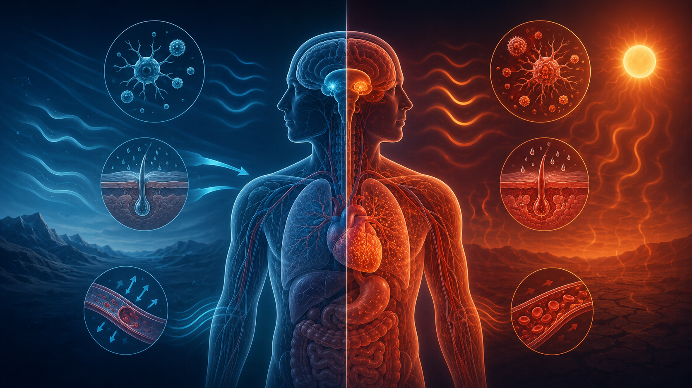
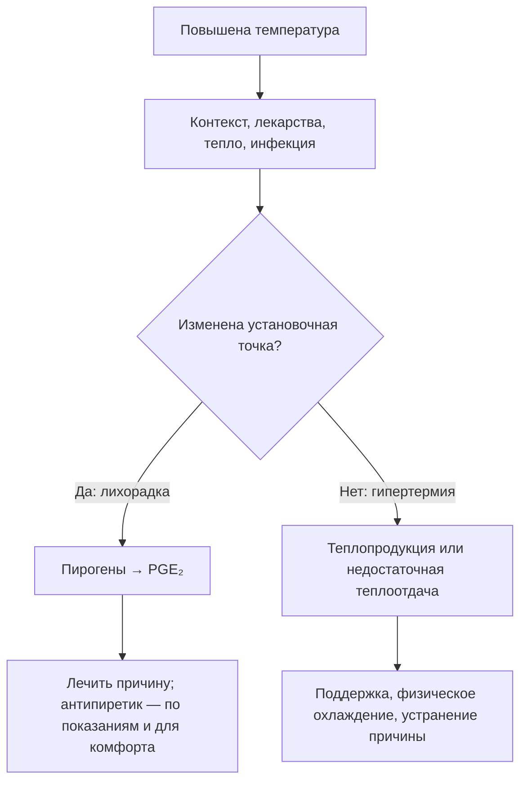
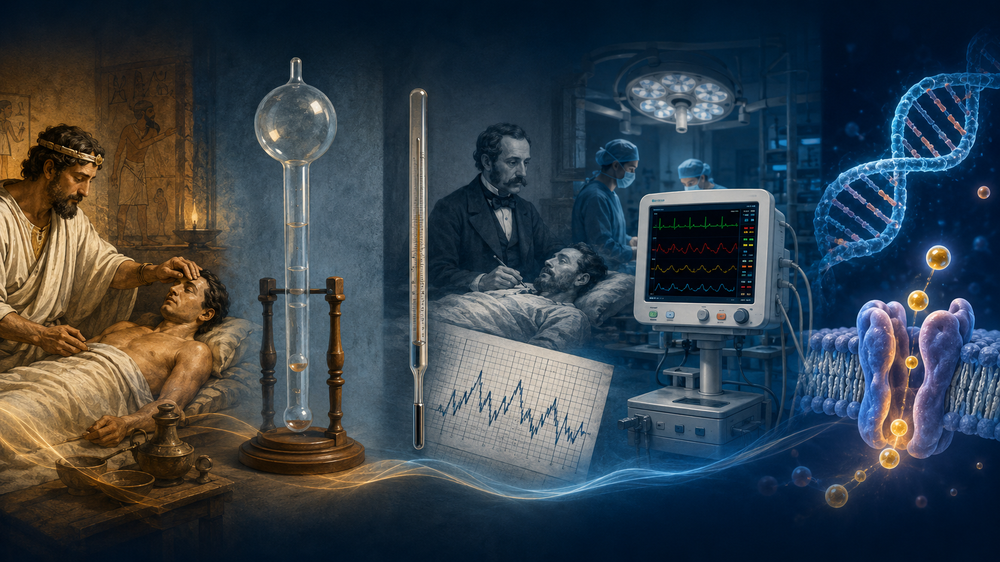
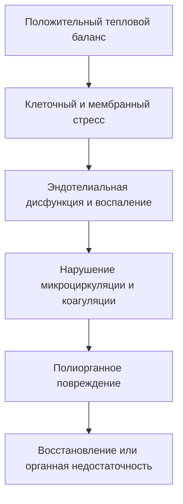

# Глава 1. Введение и определения

<!-- visual-summary:start -->

*Рисунок 1. Титульная визуальная схема: Гипертермический синдром и тепловые поражения (Клинические рекомендации 2026: ERC, ВОЗ, Минздрав РФ).*

### Схема для запоминания

> [!IMPORTANT]
> Ответ на антипиретик не является надёжной диагностической пробой и не должен
> задерживать охлаждение при подозрении на опасную гипертермию.
<!-- visual-summary:end -->
## 1.1. Исторический аспект проблемы гипертермических состояний

Проблема повышенной температуры тела привлекала внимание врачей с древнейших времён, пройдя путь от мистических представлений до современного молекулярно-генетического понимания механизмов терморегуляции. Изучение истории этого вопроса помогает понять главное: различие между лихорадкой как защитной реакцией и гипертермией как патологическим срывом терморегуляции формировалось медленно, на протяжении более двух тысячелетий, и окончательно оформилось лишь во второй половине XX века.

### 1.1.1. Ранние представления: от Гиппократа до Галена

Понятие *febris* (лихорадка) было центральным в медицине со времён Гиппократа (ок. 460–370 гг. до н. э.). Основоположник клинической медицины рассматривал лихорадку не как самостоятельную болезнь, а как проявление борьбы организма с болезнью — своеобразный «очистительный огонь», механизм «сжигания» вредоносных веществ. Гиппократ связывал лихорадку с теорией четырёх гуморов (кровь, флегма, жёлтая и чёрная желчь), полагая, что повышение температуры отражает попытку организма восстановить баланс этих жидкостей. Это интуитивное понимание защитной роли лихорадки, хотя и основанное на ошибочных представлениях о физиологии, сохранялось тысячелетиями — и, как ни парадоксально, в своей сути оказалось верным.

Гален (129–200 гг. н. э.), древнегреческий врач, чьи труды доминировали в европейской медицине вплоть до эпохи Возрождения, развил гуморальную теорию и предложил кровопускание как основной метод лечения лихорадки. Сегодня мы понимаем, что этот подход был не просто бесполезным, но и прямо вредным, особенно при истинной гипертермии, где гиповолемия и без того является ключевым патогенетическим звеном. Тем не менее эти представления отражали первую систематическую попытку врачей понять механизмы развития гипертермии и найти способы её лечения.

### 1.1.2. Становление термометрии: Санторио, Вундерлих, Клод Бернар

Первый переход от субъективных ощущений («больной горячий») к объективным измерениям связан с именем итальянского врача и физиолога **Санторио Санторио** (Santorio Santorio, 1561–1636). В XVI–XVII веках, с развитием экспериментальной физиологии, он провёл первые систематические измерения температуры тела и разработал один из первых медицинских термометров, положив начало количественному изучению гипертермии.

Подлинная революция произошла во второй половине XIX века благодаря работам немецкого врача **Карла Рейнхольда Августа Вундерлиха** (Carl Reinhold August Wunderlich). В 1868 году он опубликовал монументальный труд *«Das Verhalten der Eigenwärme in Krankheiten»* («Поведение собственной температуры тела при болезнях»). Проанализировав более одного миллиона измерений температуры у 25 000 пациентов, Вундерлих установил норму человеческой температуры тела (37 °C, или 98,6 °F) и впервые систематизировал температурные кривые, что позволило объективно классифицировать болезни по характеру лихорадки. Он описал постоянную, ремиттирующую и интермиттирующую лихорадку — типы кривых, которые до сих пор используются в дифференциальной диагностике инфекционных заболеваний. Вундерлих показал, что температура тела — не случайный показатель, а строго регулируемый параметр, изменения которого отражают патологические процессы. Однако чёткого различия между лихорадкой как адаптивной реакцией и гипертермией как срывом регуляции он ещё не проводил.

В тот же период французский физиолог **Клод Бернар** (Claude Bernard, 1813–1878) сформулировал фундаментальную концепцию «внутренней среды» (*milieu intérieur*) организма и показал, что температура тела поддерживается на постоянном уровне благодаря сложному балансу между теплопродукцией и теплоотдачей. Это было революционным сдвигом: впервые гипертермия рассматривалась не как мистическое явление, а как результат физиологического дисбаланса — количественно описываемого и в принципе управляемого.

### 1.1.3. Современная эра: открытие специфических синдромов

Осознание того, что не всякое повышение температуры является лихорадкой, пришло в XX веке с развитием фармакологии, анестезиологии и молекулярной биологии.

Важным шагом стало исследование механизмов регуляции капиллярного кровообращения, имеющее прямое отношение к пониманию процессов теплоотдачи: датский физиолог **Август Крог** (August Krogh) получил за него Нобелевскую премию по физиологии и медицине в 1920 году «за открытие механизма регуляции капилляров». Крог показал, что капилляры сужаются и расширяются пропорционально потребности ткани в кровотоке, — именно этот механизм лежит в основе вазомоторного компонента теплоотдачи.

Ключевые открытия специфических гипертермических синдромов пришлись на вторую половину XX века.

- **Злокачественная гипертермия** (Malignant Hyperthermia, MH). Поворотным событием стала публикация 1960 года в журнале *The Lancet*: **Майкл Денборо** (Michael Denborough) с соавторами описал случай в австралийской семье, где 10 из 24 родственников погибли во время наркоза (статья «Anaesthetic deaths in a family»). Это положило начало изучению MH как фармакогенетического заболевания — наследственной патологии, которая клинически проявляется только в ответ на приём определённых лекарств.
- **Нейролептический злокачественный синдром** (Neuroleptic Malignant Syndrome, NMS/НЗС). Вскоре после введения в практику первых нейролептиков (хлорпромазин, 1950-е годы) французские психиатры **Жан Деле** (Jean Delay) и **Пьер Деникер** (Pierre Deniker), описавшие сам антипсихотический эффект, столкнулись и с его редким, но смертельным осложнением. Термин НЗС был окончательно сформулирован в 1960-х годах для описания синдрома, характеризующегося мышечной ригидностью, гипертермией и вегетативной дисфункцией.
- **Тепловой удар.** Состояние было известно со времён римских легионов, однако его патофизиология и фундаментальное отличие от инфекционной лихорадки были систематически изучены лишь во время Второй мировой войны и последующих военных конфликтов (в частности, войны во Вьетнаме), а также в связи с развитием спортивной медицины.
- **Серотониновый синдром** был выделен как самостоятельная нозологическая единица позже, по мере широкого распространения серотонинергических антидепрессантов.

В конце XX века были идентифицированы гены, ответственные за развитие злокачественной гипертермии: в первую очередь ген рианодинового рецептора **RYR1** на 19-й хромосоме и ген кальциевого канала **CACNA1S** на 1-й хромосоме. Это позволило перейти от фенотипической диагностики (по симптомам и мышечной биопсии) к генотипической и открыло возможности молекулярной профилактики у членов семей пациентов с MH. В XXI веке развитие молекулярной биологии, протеомики и метаболомики позволило глубже понять патофизиологию всех форм гипертермического синдрома.

### 1.1.4. Эволюция подходов к диагностике и лечению

**Диагностика** прошла путь от клинического наблюдения к объективной
термометрии, затем к лабораторным маркерам и молекулярно-генетическому
тестированию. Сегодня эти уровни дополняют друг друга, а не заменяют клинический
контекст.

Ключевым прорывом в диагностике MH стала разработка **галотан-кофеинового контрактурного теста** (Caffeine-Halothane Contracture Test, CHCT). Метод сформировался в Торонто в работах группы У. Калоу и **Беверли А. Бритт** (Beverley A. Britt) — канадского анестезиолога и фармаколога: первое подробное описание кофеинового теста изолированной человеческой мышцы опубликовано ими в 1977 году (Kalow W., Britt B. A., Richter A., *Canadian Anaesthetists' Society Journal*), а к концу 1970-х — началу 1980-х годов тест был доведён до стандартизированного протокола. Требующий биопсии мышечной ткани, CHCT на десятилетия стал «золотым стандартом» диагностики предрасположенности к злокачественной гипертермии и сохраняет статус референсного метода до сих пор.

**Лечение** эволюционировало от откровенно деструктивного (кровопускание, ртуть — как предлагал Гален) к поддерживающему и механизм-ориентированному. Дантролен стал специфической терапией MH. При серотониновом синдроме и НЗС основой остаются отмена триггера и интенсивная поддержка; ципрогептадин, дофаминергические препараты, дантролен и ЭСТ применяют лишь в выбранных ситуациях, поскольку качество сравнительных данных ограничено.

Триумфом понимания патофизиологии стало внедрение **дантролена натрия**
(dantrolene sodium) — специфической терапии злокачественной гипертермии.
Внутривенная форма получила одобрение FDA в 1979 году; вместе с капнографией,
командными протоколами и улучшением интенсивной терапии дантролен резко снизил
смертность от MH.

Экстракорпоральные методы могут влиять на температуру, но ЭКМО или CRRT
начинают по самостоятельным показаниям — например, при рефрактерном шоке,
дыхательной или почечной недостаточности, — а не как стандартный следующий
метод охлаждения.

*Рисунок 2. Эпидемиология и прогностическая летальность: 10% без гипотензии vs 33% при артериальной гипотензии. Критичность порога > 40,5 °C и окна 30 минут (ERC 2025).*

---

## 1.2. Определение гипертермического синдрома

### 1.2.1. Гипертермический синдром как патологическое состояние

**Гипертермический синдром (ГС)** — это неспецифический патологический синдром, представляющий собой критическое, жизнеугрожающее состояние, которое определяется как неконтролируемое повышение центральной температуры тела («температуры ядра») выше критических значений, возникающее вследствие срыва механизмов терморегуляции, когда скорость теплопродукции превышает способность организма к теплоотдаче.

Пороговые определения различаются. Практически значимы контекст, надёжность
измерения и органная дисфункция: при тепловой экспозиции изменение сознания
требует лечения как возможного теплового удара, даже если после начала
охлаждения температура уже ниже 40 °C. Риск повреждения растёт с тепловой дозой,
но 41–42 °C не являются универсальной границей необратимости.

Гипертермический синдром характеризуется:

- критическим повышением температуры тела (обычно > 39,5 °C, часто > 40–41 °C);
- дисфункцией центра терморегуляции в гипоталамусе либо неспособностью нормально работающего центра справиться с тепловой нагрузкой;
- срывом компенсаторных механизмов организма;
- полиорганными нарушениями вследствие прямого цитотоксического действия высокой температуры;
- высокой летальностью при отсутствии своевременного лечения.

**Ключевой момент:** гипертермический синдром — это не просто высокая цифра на термометре, а срыв механизмов терморегуляции, при котором организм теряет способность контролировать и снижать температуру тела.

### 1.2.2. Гипертермия как нарушение теплового баланса

В основе ГС лежит нарушение фундаментального уравнения теплового баланса организма. В норме организм поддерживает стабильную температуру, балансируя теплопродукцию и теплоотдачу:

$$\Delta E_{body} = (M - W) \pm K \pm C \pm R - E$$

где:

- **ΔE_body** — изменение запаса тепла в организме (в норме стремится к нулю);
- **M** — метаболическая теплопродукция;
- **W** — совершаемая внешняя работа;
- **K, C, R** — теплообмен с окружающей средой (кондукция, конвекция, радиация); эти члены двунаправленны и меняют знак, когда температура среды превышает температуру кожи;
- **E** — теплоотдача за счёт испарения (потоотделение, дыхание).

При гипертермии ΔE_body становится резко положительным. Это происходит по двум основным причинам или их комбинации.

**1. Резкое повышение теплопродукции (M).** Источники теплопродукции в норме: базальный метаболизм (основной источник тепла в покое), специфическое динамическое действие пищи (термический эффект пищи), мышечная активность (произвольная и непроизвольная), дрожательный термогенез (шиверинг) и недрожательный термогенез за счёт бурой жировой ткани, а также экзогенное поступление тепла. Патологические примеры: чрезмерная мышечная ригидность при злокачественной гипертермии и НЗС, неконтролируемый метаболизм при тиреотоксикозе, интенсивная физическая нагрузка (марафон, военные учения в полной выкладке).

**2. Катастрофическое снижение теплоотдачи (E, K, C, R).** В нормальных условиях покоя вклад путей теплоотдачи распределяется примерно так: радиация (излучение) — 40–45 %, конвекция — 30–35 %, испарение (пот, дыхание) — 20–25 %, кондукция (теплопроведение) — 3–5 %. Однако в жару эта иерархия переворачивается: как только температура среды приближается к температуре кожи и превышает её, радиация, конвекция и кондукция не только перестают отводить тепло, но и становятся каналами его притока, и единственным работающим механизмом остаётся испарение. Примеры блокады теплоотдачи: высокая температура в сочетании с высокой влажностью (блокируется E), ношение непроницаемой защитной одежды (блокируются E, C, R), приём антихолинергических препаратов с развитием ангидроза (блокируется E).

При злокачественной гипертермии оба механизма работают одновременно: мышечная ригидность резко повышает теплопродукцию и одновременно ухудшает условия теплоотдачи.

### 1.2.3. Синдром срыва регуляции: дисфункция «термостата»

Ключевое слово в определении ГС — «срыв» (поломка, перегрузка). Гипертермический синдром — это клинический синдром в строгом смысле слова: совокупность симптомов и признаков, объединённых общим патогенетическим механизмом — несостоятельностью терморегуляции.

Центр терморегуляции расположен в гипоталамусе, прежде всего в его преоптической области, и работает как «биологический термостат», удерживая температуру тела на уровне 36,5–37,5 °C. Он получает информацию от двух групп датчиков:

- **центральных терморецепторов** — в самом гипоталамусе, спинном мозге, внутренних органах и крупных сосудах;
- **периферических терморецепторов** — в коже и подкожной клетчатке.

При гипертермическом синдроме установочная точка (set-point) **не сдвигается** — она остаётся на уровне нормы (около 37 °C). Температура тела растёт вопреки попыткам гипоталамуса её снизить. Гипоталамус «видит» перегрев и запускает механизмы теплоотдачи на полную мощность — максимальную кожную вазодилатацию и потоотделение, — но эти попытки либо оказываются неэффективными (пот не испаряется при высокой влажности), либо сами механизмы сломаны (нет потоотделения на фоне атропина), либо истощаются со временем. Результатом становятся:

- потеря способности адекватно реагировать на рост температуры;
- неэффективность компенсаторных механизмов;
- неконтролируемое повышение температуры тела;
- развитие каскада патологических реакций.

Отдельно следует различать две ситуации, которые в клинике объединяются термином «гипертермический синдром»: перегрузку исправного центра (тепловой удар, злокачественная гипертермия) и первичное повреждение самого центра терморегуляции (центральная гипертермия при ЧМТ, инсульте, опухолях мозга). В первом случае «термостат» цел, но система исполнения не справляется; во втором — сломан сам «термостат». Лечебная тактика в обоих случаях строится на физическом охлаждении, но прогноз и обратимость различаются.

---

## 1.3. Отличие гипертермии от лихорадки (fever vs hyperthermia)

Это, без преувеличения, самый важный дифференциально-диагностический пункт всей темы. Ошибка на этом этапе неминуемо ведёт к неверной тактике лечения и может стоить пациенту жизни.

### 1.3.1. Мысленный эксперимент: аналогия с термостатом в доме

**Лихорадка (fever).** Вы находитесь в своём доме (тело) в прохладный день. Вы подходите к термостату (гипоталамус) и вручную выставляете желаемую температуру с 20 °C (норма) на 22 °C (новая установочная точка). Что делает дом? Немедленно включает котёл (теплопродукция: дрожь, вазоконстрикция), чтобы достичь новой, более высокой, *желаемой* температуры. Система работает штатно — просто по новой уставке.

**Гипертермия (hyperthermia).** Термостат по-прежнему стоит на 20 °C. Но либо в доме начался пожар (патологическая теплопродукция — злокачественная гипертермия), либо котёл сломался и не выключается (тиреотоксикоз), либо на улице +50 °C и сломался кондиционер (тепловой удар). Термостат «кричит», что в доме 25, 30, 40 °C, и изо всех сил пытается включить охлаждение (потоотделение), но система не справляется с нагрузкой или разрушена. Температура растёт **вопреки** уставке.

### 1.3.2. Лихорадка как защитно-приспособительная реакция

**Определение.** Лихорадка (лат. *febris*, англ. *fever*) — типовая, филогенетически выработанная защитно-приспособительная реакция организма, характеризующаяся контролируемым повышением температуры тела вследствие перестройки (сдвига вверх) установочной точки центра терморегуляции в гипоталамусе в ответ на действие пирогенов.

**Роль в иммунитете.** Лихорадка — не поломка, а адаптивный механизм, выработанный эволюцией для борьбы с инфекцией. Умеренное повышение температуры:

- угнетает рост и репликацию многих микроорганизмов, особенно вирусов (риновирусы, полиовирусы) и бактерий, оптимум которых лежит около 37 °C;
- усиливает фагоцитарную активность нейтрофилов и макрофагов;
- ускоряет пролиферацию и повышает активность T-лимфоцитов, в том числе цитотоксических;
- усиливает синтез антител B-лимфоцитами (оптимум при 38–39 °C);
- увеличивает продукцию противовирусных интерферонов.

Исследования показывают, что пациенты с умеренной лихорадкой нередко выздоравливают быстрее тех, у кого лихорадка была агрессивно подавлена антипиретиками. Это подтверждает её защитную роль и служит аргументом против рутинного «сбивания» умеренной температуры при инфекциях.

**Пирогены — вещества, вызывающие лихорадку.**

*Экзогенные пирогены* — компоненты микроорганизмов и их продукты: липополисахарид (ЛПС) грамотрицательных бактерий (классический пример), пептидогликаны грамположительных бактерий, вирусные белки, грибковые антигены, бактериальные токсины (например, токсин Шига).

*Эндогенные пирогены (цитокины)* высвобождаются иммунными клетками — макрофагами, моноцитами, дендритными клетками — в ответ на встречу с экзогенными пирогенами: интерлейкин-1 (IL-1) — основной эндогенный пироген, интерлейкин-6 (IL-6), фактор некроза опухоли-α (TNF-α), интерлейкин-8 (IL-8), интерферон-γ (IFN-γ).

**Механизм развития лихорадки — пошагово:**

1. Воздействие экзогенного пирогена (ЛПС, вирусный белок) на клетки иммунной системы через паттерн-распознающие рецепторы.
2. Активация макрофагов, моноцитов и дендритных клеток, развёртывание воспалительного ответа.
3. Синтез и выброс эндогенных пирогенов: IL-1, TNF-α, IL-6, IL-8.
4. Доставка цитокинов током крови к гипоталамусу — точнее, к его циркумвентрикулярным органам, лишённым гематоэнцефалического барьера.
5. Активация в преоптической области гипоталамуса фермента циклооксигеназы-2 (ЦОГ-2), преимущественно под действием IL-1.
6. Синтез простагландина E₂ (PGE₂) из арахидоновой кислоты.
7. Связывание PGE₂ с рецепторами EP3 на термочувствительных нейронах гипоталамуса и сдвиг установочной точки вверх (например, на 39 °C).
8. Гипоталамус начинает «считать» нормальные 37 °C холодом и активирует теплопродукцию (мышечная дрожь, озноб) и теплосбережение (периферическая вазоконстрикция — бледная, холодная, «гусиная» кожа в фазе подъёма). Пациент укрывается одеялом, пытаясь «согреться» до новой уставки.
9. Температура достигает нового установленного уровня, озноб прекращается.

Роли основных цитокинов различаются. **IL-1** — главный эндогенный пироген, синтезируется макрофагами, моноцитами и дендритными клетками, действует на гипоталамус через рецепторы IL-1R, стимулирует синтез PGE₂. **TNF-α** синтезируется активированными макрофагами, усиливает эффект IL-1 и участвует в системном воспалительном ответе. **IL-6** продуцируется макрофагами, фибробластами и эндотелиальными клетками, усиливает синтез острофазных белков в печени и выступает поздним медиатором лихорадочной реакции.

**Антипиретики действуют на пирогенный путь лихорадки.** Ибупрофен и другие НПВС, а также парацетамол уменьшают центральный синтез PGE₂ и снижают повышенную установочную точку. Эффект бывает неполным и зависит от времени, дозы, всасывания и причины лихорадки. Поэтому клинический ответ может поддержать гипотезу, но **не является диагностическим тестом** и не исключает опасную гипертермию.

### 1.3.3. Механизмы развития гипертермии

**Определение.** Гипертермия — неконтролируемое повышение температуры тела, при котором установочная точка гипоталамуса остаётся нормальной (около 37 °C), но механизмы терморегуляции не справляются с избыточной тепловой нагрузкой — вследствие дисфункции самого центра, неэффективности теплоотдачи или чрезмерной теплопродукции.

**Нарушение теплоотдачи** — ситуация, когда «кондиционер» сломан или перегружен. Механизмы: ангидроз (отсутствие потоотделения), парадоксальная вазоконстрикция периферических сосудов, нарушение периферического кровообращения, спазм кожных сосудов.

- *Пример 1 (тепловой удар).* Жаркий и влажный день. Температура среды выше температуры кожи, поэтому теплоотдача путём радиации, конвекции и кондукции невозможна — наоборот, тело получает тепло извне; высокая влажность блокирует испарение. Потовые железы работают на полную, но пот не испаряется, а просто стекает, не охлаждая.
- *Пример 2 (фармакологический).* Приём антихолинергических препаратов — атропина, трициклических антидепрессантов, некоторых антигистаминных и нейролептиков. Они блокируют мускариновые рецепторы потовых желёз; гипоталамус «кричит» о перегреве, но потоотделение физически не может включиться. Развивается «сухая», или «белая», гипертермия.

**Повышение теплопродукции** — ситуация, когда в доме «пожар» или «сломанный котёл». Механизмы: мышечная ригидность (неконтролируемое сокращение мышц), рост метаболической активности, неконтролируемый метаболизм мышечных клеток.

- *Пример 1 (физическая нагрузка).* Интенсивная работа мышц при марафоне или военных учениях генерирует огромное количество метаболического тепла. Если это происходит в жару, теплоотдача не успевает за теплопродукцией — развивается тепловой удар при нагрузке (exertional heat stroke).
- *Пример 2 (патологический).* Злокачественная гипертермия. Анестетик-триггер воздействует на генетически дефектный рианодиновый рецептор (RYR1) саркоплазматического ретикулума мышечной клетки. Происходит массивное, лавинообразное высвобождение Ca²⁺ в цитоплазму. Мышца впадает в ригидное сокращение; клетка тратит всю АТФ на попытки закачать Ca²⁺ обратно в депо. Этот неконтролируемый гиперметаболизм генерирует колоссальное количество тепла.

**Комбинация обоих факторов** — типичная ситуация для злокачественной гипертермии и НЗС, где повышенная теплопродукция сочетается с нарушенной теплоотдачей.

**При непирогенной гипертермии антипиретики не устраняют механизм перегрева.** Они не заменяют физическое охлаждение и устранение причины. Ненужные НПВС или парацетамол способны добавить почечный, печёночный или гемостатический риск, особенно при органной дисфункции, но степень риска зависит от конкретного препарата и пациента.

### 1.3.4. Сводное сравнение

| Параметр | Лихорадка (fever) | Гипертермия (hyperthermia) |
|---|---|---|
| Установочная точка (set-point) | Сдвинута вверх (например, на 39 °C) | Нормальная (около 37 °C) или центр повреждён |
| Механизм | Контролируемое повышение до новой точки | Неконтролируемое повышение вопреки точке |
| Озноб, дрожь | Есть в фазе подъёма (организм «считает» себя холодным) | Отсутствует либо представлен патологическим тремором или ригидностью |
| Потоотделение | Вариабельно; часто появляется при снижении точки | Может сохраняться, быть чрезмерным или отсутствовать — зависит от причины |
| Эффект антипиретиков (НПВС, парацетамол) | Возможен, но не является диагностической пробой | Не устраняет непирогенный механизм и не заменяет охлаждение |
| Физическое охлаждение | Субъективно неприятно пациенту, обычно не требуется | Необходимо, является основой лечения |
| Максимальная температура | Обычно < 40 °C | Часто > 40 °C |
| Скорость развития | Медленная (часы—дни) | Быстрая (минуты—часы) |
| Летальность | Низкая (сама по себе) | Высокая (10–80 % в зависимости от формы) |

### 1.3.5. Практический пример у постели больного

**Пациент с лихорадкой 39 °C.** Он ощущает озноб, дрожит, кутается в одеяло, просит согреть — потому что его «уставка» сдвинута на 39 °C, а текущая температура ещё ниже, и организм стремится «догреться». Кожа в фазе подъёма бледная, «мраморная», холодная на ощупь на периферии. Когда температура достигает 39 °C, озноб прекращается. Если дать парацетамол, установочная точка вернётся к 37 °C: пациент немедленно почувствует жар, сбросит одеяло, кожа покраснеет, начнётся обильное потоотделение.

**Пациент с гипертермией 41 °C (тепловой удар).** Озноба он не ощущает или ощущает минимально. Кожа горячая, может быть сухой (ангидроз) или парадоксально влажной, но потоотделение неэффективно. Пациент дезориентирован, возможны делирий, судороги, кома. Парацетамол не даст ничего — температура продолжит расти. Требуется немедленное агрессивное физическое охлаждение: лёд, холодные инфузионные растворы, обдувание, погружение в холодную воду.

---

## 1.4. Актуальность проблемы в современной клинической практике

Гипертермический синдром — не казуистика, а реальная угроза, с которой сталкиваются врачи множества специальностей.

### 1.4.1. Распространённость в различных областях медицины

**Реаниматология и интенсивная терапия.** Высокая температура в ОРИТ имеет
много причин: инфекцию, лекарственные реакции, повреждение ЦНС и средовой
перегрев. Единой достоверной доли «гипертермического синдрома среди всех
пациентов ОРИТ» нет из-за различий определений.

**Анестезиология.** Злокачественная гипертермия — редкое, но фатальное без лечения осложнение наркоза. Приводимые в исходных материалах оценки частоты различаются: от 1:10 000 – 1:15 000 анестезий до 1:50 000. Обе оценки укладываются в диапазон, который приводят современные обзоры MH, — от 1:5 000 до 1:100 000 и реже, в зависимости от популяции, возраста пациентов и методики учёта (клинические эпизоды регистрируются существенно реже, чем встречается генетическая предрасположенность, распространённость которой оценивается примерно в 1:2 000–1:3 000). Практический вывод от разброса цифр не зависит: готовность к MH в операционной должна быть стопроцентной, а дантролен — доступен везде, где проводится общая анестезия.

**Психиатрия и неврология.** НЗС редок, а его наблюдаемая частота зависит от
критериев, популяции и препаратов. Частоту серотонинового синдрома оценить ещё
сложнее из-за широкого спектра тяжести и неполного распознавания. Для практики
важнее знать триггеры и фенотип, чем переносить один процент между учреждениями.

**Педиатрия.** Дети крайне уязвимы к гипертермии из-за незрелости систем терморегуляции. Фебрильные судороги встречаются у 3–5 % детей в возрасте от 6 месяцев до 6 лет. Гипертермический синдром у детей раннего возраста способен быстро привести к полиорганной недостаточности.

**Спортивная медицина.** Тепловой удар при физической нагрузке — одна из ведущих причин внезапной смерти молодых здоровых спортсменов.

**Инфекционные болезни.** Инфекция часто вызывает лихорадку, но у пожилых,
иммунокомпрометированных и новорождённых возможна нормотермия или гипотермия.
Прогноз сепсиса определяется источником, шоком и органной дисфункцией, а не
одной цифрой температуры.

### 1.4.2. Эпидемиологические и социально-медицинские аспекты

**Глобальная статистика.** ВОЗ оценивает среднее число смертей, связанных с жарой, примерно в 489 000 в год за 2000–2019 годы. Это оценка всей связанной с жарой смертности, а не числа клинически подтверждённых тепловых ударов. Сопоставимые глобальные данные по заболеваемости тепловым ударом ограничены из-за различий определений и учёта.

**Глобальное потепление.** Частота и интенсивность волн жары (heat waves) неуклонно растёт. Аномальная жара в Европе в 2003 году привела к избыточной смертности, превысившей 70 000 человек, — в основном за счёт декомпенсации хронических заболеваний и классического теплового удара у пожилых.

**Младенцы в закрытых автомобилях.** Трагическая и полностью предотвратимая
причина фатальной гипертермии: салон быстро нагревается, а приоткрытое окно не
делает его безопасным.

**Региональные особенности.** Риск меняют климат, урбанизация, доступ к
охлаждению, характер труда, лекарства и качество учёта. Нельзя сводить страны с
жарким климатом только к классическому тепловому удару, а умеренный климат —
к лекарственным причинам.

**Социально-экономические аспекты.** ГС ведёт к значительным экономическим потерям — прямым затратам на интенсивное лечение и потере трудоспособности. Он требует специальной подготовки персонала и наличия оборудования (в первую очередь запаса дантролена и средств активного охлаждения). Профилактика — от информирования населения в период жары до протоколов предоперационного скрининга — способна существенно снизить эти затраты.

### 1.4.3. Группы риска

Гипертермический синдром может развиться у любого, однако существуют группы повышенного риска.

**Дети раннего возраста.**
- *Младенцы, особенно до 3 месяцев:* большее отношение поверхности тела к
  массе, зависимость от взрослых и высокий риск серьёзной инфекции. Ректальная
  температура 38,0 °C и выше требует срочной медицинской оценки; объём
  обследования определяется возрастом, видом ребёнка и протоколом.
- *Дети до 6 лет:* склонность к фебрильным судорогам (3–5 %) — формально это осложнение лихорадки, а не гипертермии, но оно отражает общую лабильность ЦНС; быстрое развитие дегидратации; высокий риск осложнений.

**Пожилые пациенты.** Снижена эффективность потоотделения и кожной вазодилатации; притуплено чувство жажды, что ведёт к скрытой дегидратации; высокая коморбидность (сердечная недостаточность, диабет, болезни почек); полипрагмазия с приёмом препаратов, нарушающих терморегуляцию (диуретики, бета-блокаторы, антихолинергические средства). Итог — сниженные адаптационные возможности и повышенный риск летального исхода.

**Пациенты с заболеваниями ЦНС.** Черепно-мозговая травма, инсульты, опухоли мозга, эпилепсия, болезнь Паркинсона (в том числе как фактор риска НЗС, особенно при резкой отмене дофаминергической терапии). Повышен риск нейрогенной, «центральной» гипертермии.

**Пациенты с сердечно-сосудистыми заболеваниями.** Сердечная недостаточность, кардиомиопатии, врождённые пороки сердца ограничивают способность увеличить сердечный выброс, необходимый для адекватной кожной вазодилатации, — то есть прямо подрывают главный механизм теплоотдачи.

**Пациенты с психическими расстройствами**, принимающие нейролептики и антидепрессанты, — как из-за фармакологического риска (НЗС, серотониновый синдром, антихолинергический ангидроз), так и из-за сниженной способности к самопомощи в жару.

**Пациенты с ожирением.** Жировая ткань — мощный теплоизолятор, резко затрудняющий теплоотдачу; кроме того, при ожирении выше теплопродукция при любой нагрузке.

**Пациенты с наследственными нарушениями.** Носители мутаций генов RYR1 и CACNA1S, предрасположенные к злокачественной гипертермии; пациенты с наследственными нарушениями обмена веществ. Эта группа требует генетического консультирования и семейного скрининга.

### 1.4.4. Потенциальная опасность: от цитотоксичности до полиорганной недостаточности

Необходимо понимать: гипертермия — не просто «высокая температура», а агрессивный цитотоксический агент. При температуре ядра выше 41–42 °C запускается каскад, быстро становящийся необратимым.

**Прямое клеточное повреждение:**
- денатурация белков — ферменты, структурные белки и рецепторы «сворачиваются» и перестают работать;
- повреждение мембран — повышается текучесть липидного бислоя, мембраны «текут», нарушаются проницаемость и работа ионных каналов;
- апоптоз и некроз клеток, в первую очередь нейронов головного мозга, гепатоцитов и клеток почечных канальцев.

**Системный каскад (цитокиновый шторм):** повреждённые клетки высвобождают медиаторы воспаления, запуская системный воспалительный ответ (SIRS), во многом идентичный тяжёлому сепсису; шторм усугубляет повреждение эндотелия сосудов и нарушает микроциркуляцию.

**Полиорганная недостаточность:**
- рабдомиолиз — массивный распад мышечной ткани (особенно при MH, НЗС, тепловом ударе);
- острая почечная недостаточность — миоглобин забивает почечные канальцы, к чему добавляется прямое ишемическое повреждение;
- ДВС-синдром вследствие повреждения эндотелия и массивного выброса тканевого фактора;
- отёк мозга и энцефалопатия — делирий, судороги, кома;
- острый респираторный дистресс-синдром (ОРДС) из-за повреждения лёгочных капилляров;
- печёночная недостаточность, кардиогенный шок;
- летальный исход.

Спектр осложнений удобно ранжировать по тяжести: **лёгкие** — головная боль, слабость, тошнота; **средней тяжести** — фебрильные судороги у детей, делирий, нарушение сознания; **тяжёлые** — отёк мозга, энцефалопатия, кома; **критические** — полиорганная недостаточность, ДВС-синдром, рабдомиолиз с ОПН, ОРДС, кардиогенный шок, смерть.

Обобщённая последовательность событий выглядит так:

### 1.4.5. Клиническая значимость и сравнение риска

Опубликованная летальность несопоставима между эпохами, определениями и
популяциями, поэтому единая таблица процентов создаёт ложную точность.

| Состояние | Главные изменяемые факторы исхода |
|---|---|
| Тепловой удар | быстрое распознавание дисфункции ЦНС и эффективное охлаждение |
| Злокачественная гипертермия | прекращение триггера, 100 % O₂, ранний дантролен и командный протокол |
| Нейролептический злокачественный синдром | отмена триггера, контроль мышечной активности и органная поддержка |
| Серотониновый синдром | отмена триггера, бензодиазепины, контроль гипертермии и осложнений |
| Сепсис с высокой температурой | своевременная антимикробная терапия/контроль источника, гемодинамика и органы |

**Факторы, определяющие летальность:**

- максимальная достигнутая температура: выше 42 °C — крайне неблагоприятный прогноз;
- длительность гипертермии и задержка эффективного охлаждения;
- время до начала и скорость эффективного охлаждения: задержка повышает риск осложнений, но универсальной прибавки летальности «на каждый час» для всех форм не установлено;
- наличие осложнений: ДВС-синдром, рабдомиолиз, ОРДС;
- возраст: дети до 3 месяцев и пациенты старше 65 лет;
- сопутствующие заболевания.

Практический вывод: тяжёлая гипертермия — неотложное состояние; отсутствие
универсального процента не оправдывает задержку.

---

## 1.5. Структура и цели курса

### 1.5.1. Обзор основных разделов

Материал построен по логике: норма, механизм нарушения, клинические следствия
и действия.

1. Введение и определения — сущность гипертермического синдрома и его отличие от лихорадки.
2. Физиология терморегуляции — фундамент: как система работает в норме.
3. Патофизиология ГС — что именно и как в ней ломается.
4. Этиология и классификация — виновники: от теплового удара до редких синдромов.
5. Клиническая картина — как это выглядит у постели больного.
6. Диагностика — инструменты подтверждения диагноза.
7. Дифференциальная диагностика — как отличить одно состояние от другого.
8. Осложнения — чем это грозит.
9. Неотложная помощь и лечение — главный практический раздел.
10. Профилактика — первичная и вторичная.
11. Прогноз и исходы.
12. Особенности у различных категорий пациентов — дети, пожилые, беременные.
13. Современные направления исследований.
14. Клинические случаи — разбор конкретных примеров.
15. Контроль знаний и заключение.

### 1.5.2. Образовательные задачи

**Знать:**
- определение гипертермического синдрома и его фундаментальное отличие от лихорадки;
- основные механизмы нормальной терморегуляции и точки их «поломки»;
- этиологию, классификацию и патофизиологию основных форм ГС;
- клинические проявления различных форм;
- методы диагностики и дифференциальной диагностики;
- осложнения гипертермического синдрома;
- принципы неотложной терапии, профилактики и прогнозирования.

**Уметь:**
- мгновенно дифференцировать лихорадку и гипертермию у постели больного;
- распознавать «большую четвёрку» гипертермических синдромов: тепловой удар, злокачественную гипертермию, НЗС и серотониновый синдром;
- проводить дифференциальную диагностику между этими состояниями;
- оказывать неотложную помощь, включая методы физического охлаждения;
- отличать доказанную специфическую терапию MH от вспомогательных препаратов с ограниченной доказательной базой при НЗС и серотониновом синдроме;
- приоритизировать действия: когда давать парацетамол (лихорадка), когда — лёд и дантролен (MH), а когда — лёд, бензодиазепины и отмену препаратов (НЗС, серотониновый синдром);
- применять дантролен при MH и обосновывать индивидуальный выбор вспомогательной терапии при других синдромах;
- мониторировать пациента с ГС и предотвращать осложнения.

**Владеть:**
- навыками клинического обследования пациента с подозрением на ГС;
- интерпретацией лабораторных и инструментальных данных;
- алгоритмами оказания неотложной помощи;
- методами физического охлаждения;
- навыками работы в команде при лечении пациента в критическом состоянии.

---

## Выводы по главе 1

**Ключевое различие.** Лихорадка (fever) — контролируемая, адаптивная реакция со сдвигом установочной точки гипоталамуса вверх, опосредованная PGE₂. Гипертермия (hyperthermia) — неконтролируемый патологический процесс срыва терморегуляции при нормальной (или повреждённой, но не сдвинутой сознательно) установочной точке, развивающийся вследствие дисбаланса между теплопродукцией и теплоотдачей.

**Практическое следствие.** Это различие определяет приоритеты. При лихорадке антипиретик может уменьшить дискомфорт, но лечение направляют на причину. При опасной непирогенной гипертермии основу составляют немедленная поддержка, эффективное физическое охлаждение и устранение триггера; при MH безотлагательно вводят дантролен.

**Значимость.** Гипертермический синдром — не симптом, а цитотоксический каскад, ведущий через денатурацию белков и системное воспаление к полиорганной недостаточности и смерти. Летальность колеблется от менее 1 % при серотониновом синдроме до 70–80 % при нелеченой злокачественной гипертермии. Особенно уязвимы дети раннего возраста, пожилые, пациенты с патологией ЦНС и сердечно-сосудистой системы, с ожирением, психическими расстройствами и наследственной предрасположенностью. Актуальность проблемы растёт в связи с климатическими изменениями и широким применением психотропных препаратов.

**Переход.** Чтобы понять, как система терморегуляции ломается, необходимо сначала детально разобрать, как она работает в норме. Этому посвящена следующая глава.

<!-- chapter-nav:start -->

---

[Оглавление](../README.md#оглавление) · [Следующая глава →](02-fiziologiya-termoregulyacii.md)

<!-- chapter-nav:end -->

### 1.3.1. Современная эпидемиология и летальность (Данные ВОЗ и ERC 2025)
По данным Всемирной организации здравоохранения (ВОЗ) и Европейского совета по реанимации (ERC 2025), глобальные тепловые волны и климатические экстремумы сопровождаются резким ростом частоты критических тепловых поражений. 
- **Показатели летальности:** При тепловом ударе летальность составляет около **10%** в отсутствие гипотензии, однако при сочетании гипертермии с артериальной гипотензией смертность достигает **33%** [ERC 2025].
- **Критический температурный порог:** Устойчивое сохранение температуры ядра тела **> 40,5 °C** и задержка начала активного охлаждения **более чем на 30 минут** являются независимыми факторами развития полиорганной недостаточности (ОПН, рабдомиолиз, ДВС) и фатального исхода.
