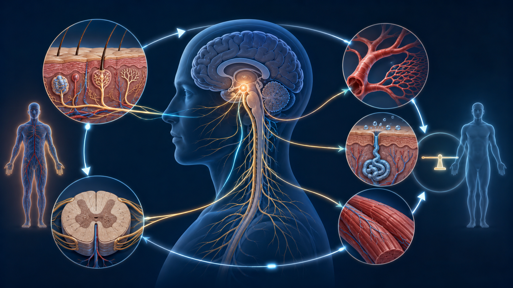
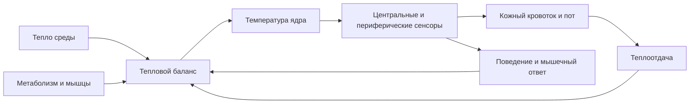
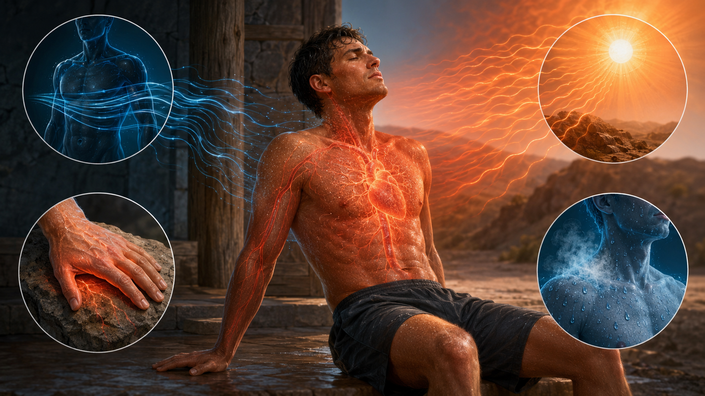

# Глава 2. Физиология терморегуляции (рефрешер-курс)

<!-- visual-summary:start -->

*Рисунок 1. Условная карта входов и эффекторных ответов: терморецепторы,
гипоталамические сети, кожный кровоток, потоотделение и мышечная активность.*

### Схема для запоминания

<!-- visual-summary:end -->
Для понимания патофизиологии гипертермического синдрома необходимо восстановить в памяти механизмы нормальной терморегуляции. Это не «базовый» материал, который можно пропустить: практически каждая форма ГС представляет собой поломку конкретного звена этой системы, и без знания исправной схемы невозможно понять, что именно и где именно вышло из строя.

## 2.1. Нормальная терморегуляция организма

Человек — **гомойотермный эндотерм**: мы поддерживаем постоянную температуру «ядра» (T_core) на уровне приблизительно 36,5–37,5 °C независимо от температуры окружающей среды (T_amb), за счёт внутренней генерации тепла. Эта стабильность критически важна для оптимальной работы ферментативных систем: белки функционируют в узком температурном коридоре, и выход за его пределы означает потерю каталитической активности.

Система терморегуляции — классическая система с обратной связью, состоящая из трёх компонентов:

1. **Сенсоры** — терморецепторы в центре и на периферии;
2. **Интегратор** — центральный контроллер в гипоталамусе;
3. **Эффекторы** — механизмы изменения теплопродукции и теплоотдачи.

### 2.1.1. Центральные механизмы

#### Роль гипоталамуса

Главный «термостат» и интеграционный центр — гипоталамус, небольшая структура массой около 4 граммов, расположенная под таламусом и над гипофизом. Несмотря на скромный размер, он контролирует множество жизненно важных функций: терморегуляцию, голод, жажду, сон, половое поведение, гормональную регуляцию.

Ключевая структура для терморегуляции — **преоптическая область** (Preoptic Area, POA) и передний гипоталамус. Именно POA содержит большинство термочувствительных нейронов:

- **медиальная преоптическая область (mPOA)** — преимущественно теплочувствительные нейроны;
- **латеральная преоптическая область (lPOA)** — преимущественно холодочувствительные нейроны.

Функции POA: интеграция информации о температуре, сравнение текущей температуры с установочной точкой, активация теплопродукции при её снижении и теплоотдачи при повышении.

#### Термочувствительные нейроны и «установочная точка»

В POA выделяют три типа нейронов, совместно формирующих «термостат»:

- **Теплочувствительные нейроны (W-SN, ~30 %)** — увеличивают частоту разрядов при повышении их собственной температуры, то есть температуры притекающей крови. Это первичные сенсоры T_core. Молекулярная основа чувствительности — каналы семейства TRPV.
- **Холодочувствительные нейроны (C-SN, ~10 %)** — увеличивают частоту разрядов при снижении температуры; в норме их активность подавлена тоническим тормозным влиянием W-SN. Связаны с каналами TRPM8.
- **Температурно-нечувствительные нейроны (T-insensitive, ~60 %)** — задают ту самую установочную точку (set-point) около 37 °C, с которой сравнивается текущая температура.

**Механизм работы термостата:**

- *Если T_core > 37 °C (перегрев).* Кровь, омывающая гипоталамус, нагревает W-SN, их активность растёт. Они активируют эфферентные пути теплоотдачи (потоотделение, кожная вазодилатация) и тормозят C-SN вместе с путями теплопродукции (дрожь, термогенез).
- *Если T_core < 37 °C (переохлаждение).* Активность W-SN падает, что растормаживает C-SN. Активируются пути теплопродукции (дрожь, недрожательный термогенез) и теплосбережения (вазоконстрикция кожи).

При лихорадке установочная точка смещается вверх (например, на 39 °C), и вся система начинает работать штатно, но относительно новой уставки. При гипертермии уставка остаётся прежней — меняется способность системы её удерживать.

#### Нейромедиаторные системы

Работа термостата модулируется несколькими нейромедиаторными системами, и это объясняет, почему препараты, влияющие на их баланс, способны вызвать жизнеугрожающие гипертермические синдромы.

- **Дофамин (DA).** Критически важен для терморегуляции. Блокада D₂-рецепторов в гипоталамусе и полосатом теле (приём нейролептиков) либо резкая отмена дофаминергической терапии нарушают способность гипоталамуса регулировать температуру и одновременно вызывают мышечную ригидность — патогенетическая основа нейролептического злокачественного синдрома.
- **Серотонин (5-HT).** Участвует в регуляции температуры; избыток серотонина в синапсах (антидепрессанты, ингибиторы МАО, трамадол) нарушает работу термостата и вызывает мышечный тремор — основа серотонинового синдрома.
- **Простагландины (PGE₂).** Медиатор сдвига установочной точки вверх при лихорадке; синтез стимулируется цитокинами IL-1 и TNF-α, ингибируется антипиретиками.
- **Прочие медиаторы:** норадреналин, ГАМК, глутамат — участвуют в модуляции терморегуляторных путей.

### 2.1.2. Периферические механизмы

#### Термочувствительные рецепторы

Гипоталамус получает информацию не только о температуре «ядра», но и о температуре «оболочки» и окружающей среды.

**Кожа** — основное место расположения периферических терморецепторов, измеряющих T_amb. Кожные рецепторы обеспечивают **антиципаторную (упреждающую) регуляцию**: при входе в холодную комнату кожа сигнализирует гипоталамусу о холоде ещё до того, как T_core успеет снизиться, и вазоконстрикция запускается превентивно.

- **Холодовые рецепторы:** в коже их примерно в 10 раз больше, чем тепловых; активируются при 10–35 °C с максимумом около 25 °C; молекулярная основа — каналы TRPM8.
- **Тепловые рецепторы:** активируются при 30–45 °C с максимумом около 40 °C; каналы семейства TRPV (TRPV1–TRPV4).

**TRP-каналы (Transient Receptor Potential)** — молекулярная основа термочувствительности, и два примера объясняют бытовые ощущения:
- *TRPV1 (ванилоидный)* активируется при T > 43 °C, а также капсаицином — поэтому жгучий перец ощущается «горячим»;
- *TRPM8 (ментоловый)* активируется при T < 25 °C, а также ментолом — поэтому мята ощущается «холодной».

**Другие локализации терморецепторов:** слизистые оболочки (рот, нос, пищевод), внутренние органы (печень, почки, спинной мозг), крупные кровеносные сосуды — все они постоянно мониторят T_core.

#### Афферентные и эфферентные пути

**Афферентные (восходящие).** Сигналы от периферических и центральных терморецепторов идут по **спиноталамическому тракту** в гипоталамус (для рефлекторных ответов) и в соматосенсорную кору (где формируется осознанное ощущение температуры). Информация от кожи передаётся спинальными нервами, от внутренних органов — в том числе блуждающим нервом (CN X).

**Эфферентные (нисходящие).** Гипоталамус посылает команды через:
- **соматическую нервную систему** — к скелетным мышцам (произвольная активность и непроизвольная дрожь);
- **вегетативную нервную систему** — к сосудам кожи (вазоконстрикция/вазодилатация), потовым железам, бурой жировой ткани, а также к мышцам, поднимающим волос (пилоэрекция); симпатический отдел здесь основной, парасимпатический играет вспомогательную роль;
- **эндокринную систему** — оси «гипоталамус — гипофиз — щитовидная железа» (контроль метаболизма) и «гипоталамус — гипофиз — надпочечники» (адреналин, кортизол).

---

## 2.2. Механизмы теплопродукции (термогенез)

Тепло — неизбежный побочный продукт метаболизма (экзергонических реакций). Организм генерирует его непрерывно.

### 2.2.1. Базальный метаболизм

**Базальный метаболизм (Basal Metabolic Rate, BMR)** — расход энергии в состоянии полного покоя на поддержание жизненно важных функций: дыхание, кровообращение, синтез белков. Это «холостой ход» организма; тепло выделяется при работе внутренних органов (печень, мозг, сердце — самые «горячие») и поддержании ионных градиентов, прежде всего непрерывной работой Na⁺/K⁺-АТФазы.

*Источники тепла:* окисление углеводов, жиров и белков; синтез АТФ; принципиальная неполнота сопряжения окислительного фосфорилирования — часть энергии всегда рассеивается в виде тепла.

*Вклад:* в полном покое базальный метаболизм обеспечивает около 60–70 % общей теплопродукции; остальные 30–40 % дают мышечная активность и прочие механизмы.

*Регуляция и факторы влияния:* тиреоидные гормоны (Т3/Т4) и катехоламины (адреналин, норадреналин) действуют как «педаль газа» клеточного метаболизма — именно здесь ключ к пониманию гипертермии при тиреотоксическом кризе и феохромоцитоме. На BMR также влияют возраст (снижается с годами), пол (у мужчин выше), масса тела и кортизол.

### 2.2.2. Специфическое динамическое действие пищи

**Специфическое динамическое действие пищи (SDA), или термический эффект пищи (TEF)** — прирост расхода энергии после еды, связанный с перевариванием, абсорбцией, синтезом белков из аминокислот и активацией симпатической нервной системы.

Вклад в общую теплопродукцию — около 10 %, и он резко зависит от состава пищи: белки — 20–30 % от их калорийности уходит в тепло, углеводы — 5–10 %, жиры — 0–3 %.

### 2.2.3. Мышечная активность

Самый мощный и наиболее регулируемый источник тепла.

**Произвольная мышечная активность.** КПД мышечного сокращения составляет всего ~20–25 %; остальные 75–80 % энергии АТФ рассеиваются в виде тепла. При интенсивной физической нагрузке мышцы могут обеспечивать до 90 % общей теплопродукции. У элитного марафонца теплопродукция возрастает в 15–20 раз по сравнению с BMR — этого достаточно, чтобы «вскипятить» тело за 30–40 минут, если бы не работала теплоотдача. Даже при обычном беге температура работающих мышц повышается на 1–2 °C.

**Шиверинг (дрожательный термогенез).** Непроизвольное, быстрое, ритмичное сокращение скелетных мышц с частотой порядка 10–20 сокращений в секунду. Запускается из заднего гипоталамуса в ответ на сигнал «холодно» (низкая T_core или T_skin): гипоталамус активирует моторные нейроны спинного мозга, при этом полезная механическая работа отсутствует и практически вся энергия переходит в тепло. Способ эффективный, но энергозатратный, увеличивающий теплопродукцию в 2–5 раз.

**Нешиверинговый термогенез (НШТ)** — генерация тепла без мышечных сокращений.
- *Источник:* бурая жировая ткань (brown adipose tissue, BAT), богатая митохондриями и капиллярами; у новорождённых располагается между лопатками и вокруг почек.
- *Механизм:* норадреналин из симпатических окончаний действует на β3-адренорецепторы адипоцитов, активируя липазу; триглицериды расщепляются, жирные кислоты окисляются в митохондриях. Уникальный белок **термогенин (UCP1, Uncoupling Protein 1)** «разобщает» окислительное фосфорилирование, создавая протонную «дырку» во внутренней мембране митохондрий: протоны обходят АТФ-синтазу, и вся энергия протонного градиента рассеивается в виде тепла вместо синтеза АТФ.
- *Значение по возрастам:* у новорождённых и младенцев НШТ — основной механизм теплопродукции на холоде, поскольку эффективно дрожать они не могут; именно поэтому новорождённые так чувствительны к охлаждению. У взрослых вклад меньше, но сохраняется и возрастает при хронической адаптации к холоду.
- *Токсикологическая параллель:* синтетические разобщители, прежде всего **2,4-динитрофенол (DNP)**, нелегально применяемый для «сжигания жира», вызывают тот же эффект во всех клетках организма, а не только в буром жире, приводя к неконтролируемому гиперметаболизму и фатальной гипертермии.

**Мышечная ригидность и тремор — патологическая теплопродукция.** Ригидность представляет собой стойко повышенный мышечный тонус, при котором мышцы напряжены даже в покое; постоянное напряжение требует непрерывного расхода АТФ и генерирует тепло. Классические примеры — «свинцовая» ригидность при НЗС и генерализованная ригидность при злокачественной гипертермии. Тремор — ритмичные непроизвольные движения — также даёт значительную теплопродукцию и характерен для серотонинового синдрома и гипертиреоза.

**Неконтролируемый метаболизм мышечных клеток.** При MH триггерные
ингаляционные анестетики или сукцинилхолин запускают патологическое
высвобождение Ca²⁺ из саркоплазматического ретикулума, стойкую мышечную
активацию, расход АТФ и резкий гиперметаболизм. Температура может расти быстро,
но нередко повышается позже, чем EtCO₂, ацидоз и ригидность.

### 2.2.4. Экзогенные источники тепла

Не следует забывать и о тепле, поступающем извне. При нахождении в горячей среде (сауна, жаркая погода, горячий цех) и при T_amb > T_skin тело не отдаёт, а **поглощает** тепло путём радиации, конвекции и кондукции. Физическая нагрузка формально относится к эндогенной теплопродукции, но её триггер и условия часто внешние — сочетание нагрузки с жарой является самым опасным.

---

## 2.3. Механизмы теплоотдачи

Организм должен эффективно сбрасывать излишки метаболического тепла. Существует четыре физических пути и два регуляторных механизма.

*Рисунок 2. Излучение, конвекция, проведение и испарение. Рисунок показывает
физические пути, а не их фиксированный вклад: он зависит от среды и одежды.*

### 2.3.1. Физические механизмы

**Радиация (излучение).** Передача тепла инфракрасным электромагнитным излучением; излучают все объекты с температурой выше абсолютного нуля. Если T_skin > T_amb — тело теряет тепло; если T_amb > T_skin (например, на солнце) — получает. Оценки вклада в покое при комфортной температуре в источниках различаются: 40–45 % по одним данным, до 60 % по другим; итоговый диапазон разумно принять как 40–60 % в зависимости от условий измерения и одежды.

**Конвекция.** Потеря тепла при движении воздуха или воды у поверхности тела: нагретый у кожи слой уходит, его место занимает холодный. Вклад в норме — около 30–35 %, но он сильно зависит от скорости движения среды. Ветер (wind chill) резко увеличивает конвекцию; вода обладает теплопроводностью примерно в 25 раз выше воздуха, поэтому погружение в холодную воду ведёт к быстрой потере тепла — свойство, которое клинически используется при активном охлаждении.

**Кондукция (теплопроведение).** Прямая передача тепла при контакте с более холодным объектом за счёт передачи молекулярных колебаний. В обычных условиях вклад невелик — 3–5 %, зависит от площади контакта и теплопроводности материала.

**Испарение.** Единственный эффективный механизм теплоотдачи, когда T_amb > T_skin. Фазовый переход воды в пар требует энергии — скрытая теплота парообразования составляет около 0,58 ккал на 1 г воды, то есть примерно 580 ккал на литр; эта энергия забирается у кожи, охлаждая её. Вклад в норме — 20–25 %, но при высокой температуре среды он возрастает до 80–90 %, а при T_amb выше температуры тела становится единственным работающим механизмом.
- *Источники:* неощутимые потери (испарение при дыхании, трансэпидермальная диффузия воды через кожу) и ощутимые потери (потоотделение).
- *Критическое ограничение:* эффективность испарения снижается при высокой
  влажности, слабом движении воздуха и непроницаемой одежде. Стекающий пот
  почти не отдаёт скрытую теплоту испарения, поэтому видимое потоотделение не
  гарантирует достаточного охлаждения.

### 2.3.2. Вазомоторная регуляция

Главный механизм управления теплоотдачей через радиацию, конвекцию и кондукцию: тело использует кожу как радиатор с регулируемым потоком теплоносителя.

**Вазодилатация.** При перегреве по сигналу гипоталамуса снижается симпатический тонус периферических артериол, открываются артериовенозные анастомозы, кровь устремляется к поверхности кожи. Кожа краснеет и становится горячей, градиент температуры между кожей и средой растёт, теплоотдача максимизируется. Кожный кровоток при этом способен увеличиться в 10–20 раз.

**Вазоконстрикция.** При переохлаждении растёт симпатический тонус: норадреналин действует на α-адренорецепторы гладких мышц артериол, сосуды кожи сужаются, кровь шунтируется в «ядро», а теплоотдача уменьшается. При тяжёлом перегреве бледные, мраморные или холодные конечности чаще означают гипоперфузию, шок, действие лекарств или индивидуальную сосудистую реакцию. Это важный признак тяжести, но не отдельный общепринятый тип гипертермии и не основание откладывать охлаждение при тепловом ударе.

### 2.3.3. Потоотделение

**Типы потовых желёз.**
- *Эккриновые* — 2–4 миллиона желёз по всему телу, выделяют водянистый пот, активируются при повышении температуры тела; именно они обеспечивают терморегуляторное потоотделение.
- *Апокриновые* — сосредоточены в подмышечных впадинах, паховой области, на лице; выделяют вязкий пот с белками и липидами; активируются при эмоциональном стрессе и физической нагрузке, в терморегуляции существенной роли не играют.

**Механизм активации.** Гипоталамус в ответ на рост T_core активирует симпатические нейроны, иннервирующие эккриновые железы. Это уникальный случай в вегетативной нервной системе: волокна симпатические, но медиатором служит **ацетилхолин**, действующий на **мускариновые рецепторы** желёз, а не норадреналин, как в сосудах.

**Клиническое значение этой особенности исключительно велико:** именно она объясняет, почему антихолинергические (атропиноподобные) препараты вызывают гипертермию — они блокируют потоотделение на уровне рецептора, вызывая ангидроз при полностью сохранном центральном сигнале.

**Состав пота:** вода (~99 %), электролиты (натрий, калий, хлориды, магний), мочевина, молочная кислота, следовые количества белков. Пот гипотоничен по отношению к плазме — важное обстоятельство, объясняющее развитие гипернатриемии при массивных потерях.

**Производительность и пределы.** При интенсивной нагрузке выделение 1–2 литров пота в час является нормой, что теоретически соответствует отводу 580–1160 ккал тепла в час. Но повторим главное: **пот не охлаждает, если он не испаряется**. Без испарения обильное потоотделение — лишь путь к дегидратации и электролитным потерям, а не к охлаждению.

---

## Выводы по главе 2

**Интегративная система.** Терморегуляция — многоуровневая система с обратной связью, управляемая из преоптической области гипоталамуса, где ~30 % теплочувствительных, ~10 % холодочувствительных и ~60 % температурно-нечувствительных нейронов совместно формируют «термостат» с уставкой около 37 °C. В норме она удерживает температуру тела в диапазоне 36,5–37,5 °C.

**Два рычага управления.** Теплопродукция (базальный метаболизм 60–70 %, термический эффект пищи ~10 %, мышечная активность вплоть до 90 % при нагрузке, шиверинг, НШТ) и теплоотдача (радиация 40–60 %, конвекция 30–35 %, испарение 20–25 % в покое и до 80–90 % в жару, кондукция 3–5 %), регулируемые вазомоторным тонусом и потоотделением.

**Ключевые точки уязвимости**, которые станут центральными в следующих главах:
- **гипоталамус** — работа зависит от тонкого баланса дофамина и серотонина, отсюда НЗС и серотониновый синдром;
- **мышцы** — мощный физиологический источник тепла и потенциальная «тепловая бомба» при MH и НЗС;
- **разобщение окислительного фосфорилирования (UCP1)** — физиологический механизм НШТ и одновременно мишень для токсинов (DNP) и патологии (тиреотоксикоз);
- **потоотделение** — зависит от ацетилхолина (уязвимость к антихолинергикам) и от влажности воздуха (внешний, непреодолимый физический лимит).

**Переход.** Зная, как работает эта машина в исправном состоянии, мы готовы разобрать её поломки. Что именно происходит, когда баланс нарушается, — тема следующей главы.

<!-- chapter-nav:start -->

---

[← Предыдущая глава](01-vvedenie-i-opredeleniya.md) · [Оглавление](../README.md#оглавление) · [Следующая глава →](03-patofiziologiya.md)

<!-- chapter-nav:end -->

### 2.5. Клиническая термометрия: выбор метода измерения температуры ядра (ERC 2025 / ВОЗ)
Для точной оценки физиологического статуса при подозрении на гипертермический синдром или тепловой удар фундаментальное значение имеет измерение **температуры ядра тела (Core Body Temperature)**.
- **Почему аксиллярная термометрия непригодна:** Измерение температуры в подмышечной впадине или на поверхности кожи отражает температуру оболочки и при периферическом спазме сосудов («белая» лихорадка, централизация кровообращения, тепловой шок) может показывать ложно-нормальные или сниженные цифры при критическом перегреве внутренних органов.
- **Эталонные методы (Gold Standard по ERC 2025):**
  1. **Ректальная термометрия** (термодатчик вводится на глубину 10–15 см) — стандарт на догоспитальном этапе и в приемном покое.
  2. **Пищеводный термодатчик** — золотой стандарт для пациентов на ИВЛ в ОРИТ и операционной.
  3. **Катетер Фолея с термоистором (температура мочевого пузыря)** — оптимальный метод непрерывного мониторинга при интенсивной терапии.
  4. **Тимпаническая термометрия** (инфракрасный датчик мембраны барабанной перепонки) — допустимый метод при невозможности ректального измерения.
