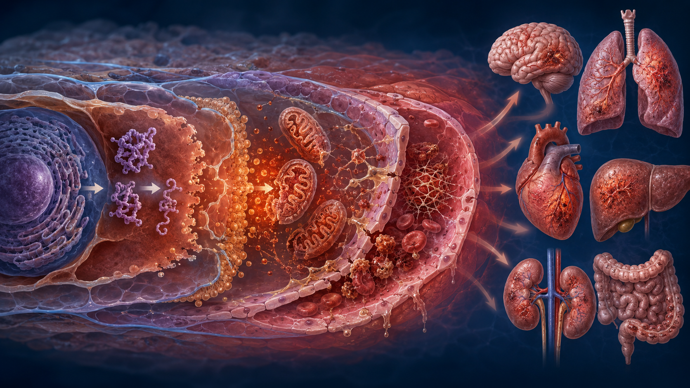
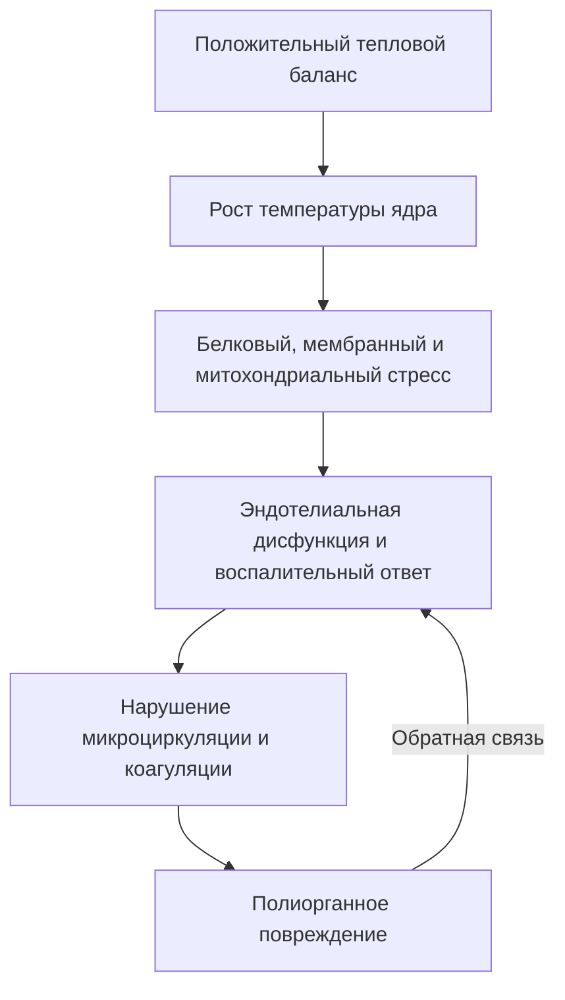
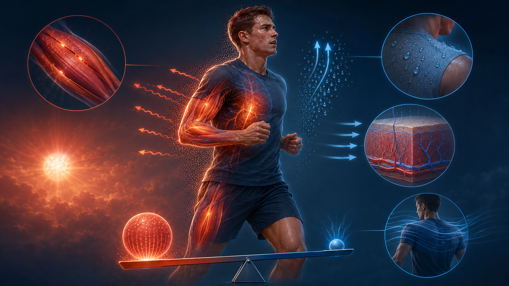
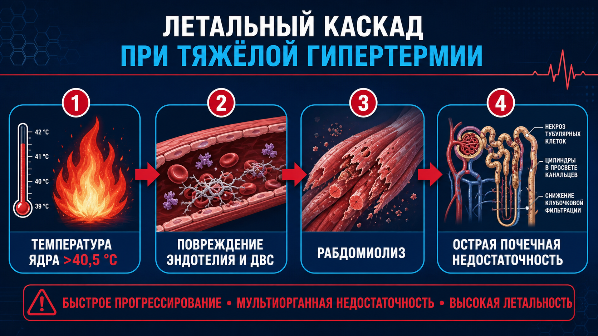

# Глава 3. Патофизиология гипертермического синдрома

<!-- visual-summary:start -->

*Рисунок 1. Концептуальная, не гистологическая схема: белковый и мембранный
стресс, митохондриальная дисфункция, повреждение эндотелия и органов.*

### Схема для запоминания

<!-- visual-summary:end -->
Патофизиологическая суть ГС — **положительный тепловой баланс (ΔE_body ≫ 0)**, который система терморегуляции не может скомпенсировать. Это реализуется по двум основным сценариям, которые часто сочетаются и усиливают друг друга: внутренний «пожар» (гиперпродукция тепла) и «сломанный радиатор» (срыв теплоотдачи). К ним примыкает третий, самостоятельный вариант — «сломанный термостат», то есть первичное повреждение центра терморегуляции.

## 3.1. Нарушение баланса теплопродукции и теплоотдачи

### 3.1.1. Повышение теплопродукции («внутренний пожар»)

#### Мышечная ригидность и неконтролируемый метаболизм

Наиболее драматичный механизм, лежащий в основе самых «злокачественных» форм ГС, когда тело само генерирует несовместимое с жизнью количество тепла.

**Механизм на примере злокачественной гипертермии (MH):**

1. Триггер — ингаляционный анестетик или сукцинилхолин — попадает в организм пациента с мутацией рианодинового рецептора (RYR1) в саркоплазматическом ретикулуме (СР) мышечной клетки.
2. RYR1 — канал, высвобождающий Ca²⁺ для сокращения. Дефектный рецептор «заклинивает» в открытом состоянии.
3. Происходит массивное, лавинообразное высвобождение Ca²⁺ в цитоплазму.
4. Избыток Ca²⁺ вызывает стойкое непрекращающееся сокращение — **контрактуру**.
   Это принципиально не тетанус: тетанус представляет собой нормальный ответ на
   частую нервную стимуляцию, реализуется через нервно-мышечный синапс и
   прекращается вместе со стимуляцией. Контрактура при MH возникает внутри самой
   мышечной клетки и не зависит от нервного импульса, поэтому недеполяризующие
   миорелаксанты, действующие на синапс, патологический выброс Ca²⁺ не
   останавливают. Их применяют как вспомогательное средство для интубации и
   контроля тонуса, но **проверять ими диагноз нельзя**: MH не подтверждается и
   не исключается ответом на миорелаксант, а прекращение триггера и введение
   дантролена начинают по клиническим признакам, не дожидаясь никаких проб.
5. Клетка пытается выжить и активирует все Ca²⁺-АТФазы (насосы SERCA), чтобы закачать Ca²⁺ обратно в СР.
6. Этот процесс требует колоссального количества АТФ.
7. Для ресинтеза АТФ митохондрии переходят в режим максимального аэробного метаболизма: поглощается весь доступный O₂ (гипоксемия) и выделяется огромное количество CO₂ — **тяжёлая гиперкапния, которая часто становится самым первым признаком катастрофы**, опережая рост температуры.
8. Тепло — побочный продукт этого гиперметаболизма. Температура способна расти очень быстро, но её скорость непостоянна; гипертермия при MH нередко является поздним признаком по сравнению с ростом EtCO₂, ацидозом и ригидностью.

**Нейролептический злокачественный синдром (НЗС).** Механизм менее ясен, но считается, что блокада D₂-дофаминовых рецепторов в ЦНС (базальные ганглии, гипоталамус) приводит к дизрегуляции мышечного тонуса — экстрапирамидной «свинцовой» ригидности — и вегетативной дисфункции, что раскручивает гиперметаболизм. Стойкое тоническое напряжение мышц требует непрерывного расхода АТФ и генерирует тепло.

**Серотониновый синдром (СС).** Избыток серотонина в ЦНС и на периферии вызывает мышечную гиперактивность: миоклонус, гиперрефлексию, тремор, умеренную ригидность. Ритмичные непроизвольные сокращения сами по себе служат мощным источником тепла.

#### Повышение общей метаболической активности

- **Тиреотоксический криз.** Избыток тиреоидных гормонов резко повышает общий
  обмен: растут потребление кислорода, митохондриальный биогенез и активность,
  оборот Na⁺/K⁺-АТФазы и Ca²⁺-АТФазы (SERCA), субстратные («холостые») циклы и
  чувствительность тканей к катехоламинам. Часть энергии этих процессов
  неизбежно рассеивается в виде тепла. Ключевые «холостые» механизмы — утечка
  ионов с усиленной работой Na⁺/K⁺-АТФазы и SERCA, а также субстратные циклы
  (гликолиз/глюконеогенез, липолиз/липогенез, оборот белка).

  Распространённую формулировку «тиреоидные гормоны действуют подобно UCP1»
  следует считать неточной. Тиреоидные гормоны действительно регулируют
  экспрессию UCP1 и работают синергично с симпатической стимуляцией бурого жира,
  однако прирост теплопродукции при системном тиреотоксикозе в значительной мере
  **UCP1-независим**, а сама динамика UCP1 и активности бурого жира вариабельна и
  зависит от контекста. Главное отличие сохраняется: это не прямое химическое
  разобщение окислительного фосфорилирования во всех клетках — такой механизм
  остаётся за DNP и токсическими дозами салицилатов.
- **Феохромоцитома.** Избыток катехоламинов резко ускоряет основной обмен.
- **Отравления.** Прямое химическое разобщение окислительного фосфорилирования: 2,4-динитрофенол (DNP), токсические дозы салицилатов.

### 3.1.2. Снижение теплоотдачи («сломанный радиатор»)

#### Ангидроз

Испарение пота — главный механизм охлаждения в жару, и его «выключение» фатально.

- *Классический тепловой удар.* У пожилых, истощённых пациентов на фоне дегидратации и перегрева механизм потоотделения истощается или ломается на центральном уровне. Кожа становится горячей и сухой — классический, хотя и не обязательный, признак крайне неблагоприятного течения.
- *Антихолинергический синдром.* Атропин, трициклические антидепрессанты, антигистаминные препараты 1-го поколения, ряд нейролептиков фармакологически блокируют M-холинорецепторы потовых желёз. Тело «хочет» потеть, но физически не может.

#### Нарушение периферического кровообращения (исторически — «белая» гипертермия)

При шоке симпатическая активация и норадреналин вызывают периферическую
вазоконстрикцию через α-адренорецепторы. Это признак нарушенной перфузии, а не
самостоятельный «тип» гипертермии.

*Патофизиология:* кожа-«радиатор» выключается, кровь не поступает на периферию, тепло не сбрасывается, развивается централизация кровообращения.

*Клинический парадокс:* T_core (ректальная) растёт выше 40 °C, а кожа конечностей, носа и ушей парадоксально бледная, «мраморная» и холодная на ощупь. Это признак тяжести и нарушенной перфузии, который требует немедленной оценки и лечения шока.

> [!CAUTION]
> Из этого механизма **не следует**, что охлаждение нужно отложить до «снятия
> спазма». При подозрении на тепловой удар эффективное охлаждение и поддержку
> перфузии проводят параллельно; спазмолитики (дротаверин, папаверин),
> растирание и согревание конечностей не входят в доказательные алгоритмы
> теплового удара (см. § 4.3.5, § 7.2 и § 9.4). Отдельная национальная
> педиатрическая практика при «белой» **лихорадке инфекционного генеза**
> разобрана в § 12.1.6 и на непирогенную гипертермию не распространяется.

*Последствия:* снижение теплоотдачи, ишемия периферических тканей, вплоть до некроза и — в крайних случаях — гангрены.

#### Внешние факторы

- **Высокая влажность** — блокирует испарение (E).
- **Высокая T_amb (> 37 °C)** — блокирует радиацию, конвекцию и кондукцию и превращает их в каналы притока тепла.
- **Непроницаемая одежда** — костюмы химзащиты, военная амуниция, спортивная экипировка — создаёт жаркий влажный микроклимат и резко ограничивает испарение.

### 3.1.3. Обобщённая схема патогенеза

Триггер увеличивает теплопродукцию и/или ограничивает теплоотдачу. Дальнейшую
связь между тепловым балансом, клеточным стрессом, микроциркуляцией и органным
повреждением показывает Mermaid-схема в начале главы.

*Рисунок 2. Накопление тепла возникает, когда суммарное поступление и продукция
тепла устойчиво превышают возможности его отдачи.*

---

## 3.2. Нарушение центральной терморегуляции («сломанный термостат»)

Ситуации, когда поломка происходит в самом центре управления.

**Прямое повреждение гипоталамуса:** черепно-мозговая травма, инсульт (особенно в бассейне передней мозговой артерии), субарахноидальное кровоизлияние, опухоль (в частности краниофарингиома), энцефалит, менингит. Повреждение нейронов POA приводит к утрате контроля над эфферентными путями; развивается **«центральная», или нейрогенная, гипертермия**, часто рефрактерная к любому лечению, кроме агрессивного физического охлаждения.

**Нейромедиаторный дисбаланс:** блокада дофаминовых рецепторов (НЗС), избыток серотонина (СС), нарушение синтеза нейромедиаторов — всё это расстраивает тонкую настройку нейронов «термостата».

**Воспаление гипоталамуса** при менингите и энцефалите нарушает его функцию непосредственно.

**Варианты расстройства уставки.** Возможны три сценария: чрезмерный и неконтролируемый сдвиг установочной точки вверх (при инфекционных состояниях, пограничных с лихорадкой); полная потеря контроля над установочной точкой при тяжёлой гипертермии; нарушение восприятия текущей температуры, когда гипоталамус перестаёт адекватно «видеть» перегрев и не активирует теплоотдачу.

**Нарушение окислительного фосфорилирования в ЦНС.** Высокая температура денатурирует ферменты дыхательной цепи в митохондриях нейронов; нарушается целостность внутренней мембраны митохондрий, протоны «утекают», градиент падает, синтез АТФ снижается. Нейроны теряют способность поддерживать ионные градиенты, что ведёт к их дисфункции, активации апоптоза и гибели — «центральный хаос» усугубляется.

---

## 3.3. Каскад патологических реакций: эффект домино

Ядро патофизиологии: **избыточное тепло способно повреждать ткани напрямую**. Риск резко возрастает по мере увеличения температуры и длительности воздействия, но универсального порога, после которого повреждение обязательно и необратимо у каждого пациента, не существует.

**Как описывают порог современные сводки.** В обзорах и руководствах (в том числе
в материалах ERC и CDC) устойчивая температура ядра порядка **40,5 °C и выше**
приводится как зона, в которой денатурация белков и эндотелиальное повреждение
становятся клинически значимыми, а вероятность полиорганного поражения быстро
растёт. Эту цифру корректно понимать как ориентир высокого риска, а не как
момент, после которого повреждение у каждого пациента обязательно и необратимо:
индивидуальная переносимость, точность измерения и длительность экспозиции
различаются. Типичная последовательность органного поражения при тяжёлом
перегреве выглядит так:

> тепловая цитотоксичность → системная активация эндотелия и коагуляции (ДВС) →
> рабдомиолиз с разрушением сарколеммы миоцитов → обструкция почечных канальцев
> миоглобином и ОПП, параллельно — центрилобулярное повреждение печени.

Практический вывод: значение имеет не преодоление конкретной цифры, а суммарная
тепловая доза, поэтому снижение температуры до безопасного диапазона начинают
без ожидания лабораторного подтверждения.

### 3.3.1. Цитотоксичность и клеточные повреждения

#### Денатурация белков

*Аналогия:* яичный белок на горячей сковороде необратимо меняет структуру — «сворачивается».

*Механизм:* трёхмерная структура белка поддерживается водородными связями, ионными и гидрофобными взаимодействиями, дисульфидными мостиками. При нагревании молекулы получают избыточную энергию, слабые связи рвутся, белок разворачивается и теряет функцию. Большинство белков начинают денатурировать при 40–45 °C, причём порог у разных белков различается; критическая граница для клинически значимых процессов — около 41 °C.

*Что страдает:* ферменты (останавливаются метаболические процессы), структурные белки и белки цитоскелета (нарушается форма и целостность клетки), рецепторы, ионные каналы и насосы мембран (нарушается проницаемость и ионный транспорт).

*Результат:* клеточный метаболизм останавливается, клетка погибает.

#### Повреждение клеточных мембран

При высокой температуре липиды мембран становятся «слишком жидкими» — повышается текучесть бислоя. Мембрана теряет структурную целостность, становится «дырявой»: исчезают ионные градиенты Na⁺, K⁺, Ca²⁺, нарушается работа встроенных белков. Особенно уязвимы **эндотелиальные клетки сосудов** — и это определяет системный характер катастрофы.

#### Перекисное окисление липидов и окислительный стресс

Гипертермия и гиперметаболизм запускают массовое производство активных форм кислорода (АФК). Причины: нарушение окислительного фосфорилирования, при котором электроны «утекают» из дыхательной цепи и образуют супероксид-анион (O₂⁻), и одновременное снижение активности антиоксидантных ферментов — супероксиддисмутазы, каталазы, глутатионпероксидазы.

*Механизм ПОЛ:* гидроксильный радикал атакует ненасыщенные жирные кислоты,
возникают липидные радикалы и пероксиды. Их распад создаёт реактивные продукты,
а цепная реакция распространяется на соседние молекулы.

*Последствия:* рост проницаемости мембран, нарушение мембранных белков,
повреждение ДНК и активация гибели клеток. Воспаление и активные формы кислорода
взаимно усиливают повреждение.

#### Нарушение проницаемости сосудов: синдром утечки

Прямое термическое повреждение в сочетании с медиаторами воспаления (гистамин, брадикинин, лейкотриены, цитокины) разрушает эндотелиальный барьер и межклеточные плотные контакты (tight junctions), прежде всего в капиллярах.

*Результат:* **синдром «протекающей» капиллярной стенки (Capillary Leak Syndrome)** — плазма, альбумин и вода массивно уходят из сосудов в интерстиций.

*Двойной удар:* внутри сосудов — гиповолемия и гипотензия; вне сосудов — массивный интерстициальный отёк, прежде всего отёк лёгких и отёк мозга.

### 3.3.2. Активация системного воспалительного ответа

#### Цитокиновый шторм

*Механизм:* массовая гибель клеток по механизму некроза высвобождает **DAMPs** (Damage-Associated Molecular Patterns) — «сигналы опасности» из внутриклеточного пространства. Врождённый иммунитет реагирует на них так же, как на инвазию патогена: макрофаги, моноциты и дендритные клетки выбрасывают провоспалительные цитокины, каждый из которых активирует новые клетки, — развивается каскадное, самоусиливающееся высвобождение медиаторов.

*Ключевые медиаторы:* IL-1 (основной пироген, активирует воспаление), TNF-α (активирует воспаление, способен вызвать шок), IL-6 (стимулирует синтез острофазных белков), IL-8 (привлекает нейтрофилы в ткани), IFN-γ (активирует макрофаги).

*Результат:* системный воспалительный и эндотелиальный ответ может напоминать
сепсис, активировать коагуляцию, нарушать микроциркуляцию и способствовать шоку
и полиорганному повреждению. Сходство не отменяет параллельного поиска инфекции.

### 3.3.3. Нарушения гемодинамики и микроциркуляции

**Фаза 1 — компенсация (гипердинамическая).** Гипоталамус запускает максимальную кожную вазодилатацию и тахикардию. Сердечный выброс резко растёт, периферическое сосудистое сопротивление падает. Кожа горячая, красная, влажная. В старой литературе эту картину называли «красной» гипертермией.

**Фаза 2 — декомпенсация (шок).** На фоне дегидратации от потоотделения и синдрома утечки объём циркулирующей крови катастрофически падает. Развивается шок — гиповолемический, распределительный или их сочетание; сердечный выброс и артериальное давление снижаются, кожа бледнеет и холодеет («белая» гипертермия старых классификаций).

> [!NOTE]
> Термины «красная» и «белая» гипертермия описывают **две гемодинамические фазы
> одного процесса**, а не два самостоятельных заболевания с противоположным
> лечением. Переход к «белой» картине означает шок и требует поддержки перфузии
> **одновременно** с продолжающимся охлаждением (§ 4.3.5).

**Централизация кровообращения.** В ответ на шок вегетативная нервная система запускает компенсаторную вазоконстрикцию в «неприоритетных» бассейнах — кожа, почки, кишечник, мышцы — чтобы сохранить перфузию мозга и сердца. Ценой становится дальнейшая блокада теплоотдачи (переход в «белую» гипертермию) и усугубление ишемии органов. Это один из ключевых порочных кругов ГС.

**Расстройства микроциркуляции.** Воспаление, повреждение эндотелия и стаз крови приводят к замедлению кровотока в капиллярах, агрегации («сладжированию») эритроцитов, активации коагуляции и микротромбозам. Итог — тканевая гипоксия при формально сохранном сердечном выбросе.

### 3.3.4. Водно-электролитный баланс и КОС

**Дегидратация и гиповолемия.** Потоотделение до 1–2 л/час при тепловом ударе быстро приводит к потере воды и электролитов. Дополнительные пути потерь: испарение при тахипноэ, диарея (характерна для серотонинового синдрома). Следствия — гиповолемия, гипотензия, шок, преренальное повреждение почек, нарушение функции мозга.

**Натрий может изменяться в обе стороны.** Гипернатриемия возможна при потере свободной воды, а гипонатриемия — при избыточном питье гипотонической жидкости или значительных потерях натрия. Поэтому состав и скорость жидкости определяют по клинической картине и повторным анализам, а не по одному предполагаемому механизму.

**Гипокалиемия** (K⁺ < 3,5 мЭкв/л) обусловлена потерями калия с потом, его перемещением внутрь клеток и почечными потерями. Проявляется аритмиями, мышечной слабостью, нарушением функции почек.

**Парадокс — гиперкалиемия** (K⁺ > 5,5 мЭкв/л). При массивном рабдомиолизе калий выходит из миллионов разрушенных мышечных клеток, а поражённые почки не могут его вывести. Развивается жизнеугрожающая гиперкалиемия с опасными аритмиями вплоть до фибрилляции желудочков, мышечной слабостью и параличами. Клинически важно: на разных этапах одного и того же случая ГС возможны противоположные калиевые нарушения, поэтому калий требует повторного контроля.

**Кислотно-основное состояние.**
- *Ранняя фаза:* респираторный алкалоз — тахипноэ «вымывает» CO₂.
- *Поздняя фаза:* тяжёлый, обычно смешанный метаболический ацидоз. Компоненты: лактат-ацидоз (гиперметаболизм при MH и гипоперфузия при шоке вынуждают ткани перейти на анаэробный гликолиз); кетоацидоз вследствие истощения гликогена; почечный компонент — ишемизированные почки не выводят H⁺ и не регенерируют бикарбонат; накопление мочевой и фосфорной кислот.
- *Последствия ацидоза:* угнетение ферментных систем, аритмии, энцефалопатия, дальнейшее ухудшение функции почек, снижение чувствительности сосудов к катехоламинам.

### 3.3.5. Система гемостаза

**Механизм — классическая триада Вирхова:** повреждение эндотелия (термическое и цитокиновое), стаз крови (шок и гиповолемия), гиперкоагуляция (выброс DAMPs и тканевого фактора).

**Результат — ДВС-синдром**, протекающий в две фазы:
- *Фаза гиперкоагуляции:* по всему организму в микроциркуляции образуются тысячи микротромбов, «забивающих» почки, лёгкие, мозг, что ведёт к ишемии органов.
- *Фаза гипокоагуляции (потребления):* факторы свёртывания и тромбоциты израсходованы на тромбообразование, параллельно активируется фибринолиз с образованием продуктов деградации фибрина. Кровь перестаёт сворачиваться, начинается фатальное кровотечение — из мест инъекций, ЖКТ, слизистых, в ткани.

Дополнительный вклад вносит печёночная недостаточность: печень перестаёт синтезировать факторы свёртывания.

### 3.3.6. Полиорганная дисфункция и поражение органов-мишеней

#### Центральная нервная система

*Причины:* прямая термическая цитотоксичность для нейронов (особенно уязвимы клетки Пуркинье мозжечка — отсюда частая стойкая атаксия у выживших); отёк мозга; ишемия из-за шока и микротромбозов; воспаление с локальной продукцией цитокинов; нарушение синтеза и высвобождения нейромедиаторов.

*Отёк мозга* развивается по трём механизмам: цитотоксический (отказ ионных насосов, вода входит в клетки, клетки набухают), вазогенный (повреждение ГЭБ, выход жидкости из сосудов в ткань) и интерстициальный. Последствия — рост внутричерепного давления, ухудшение мозгового кровотока, вторичная ишемия, дислокация структур мозга, смерть.

*Клиническая динамика энцефалопатии* вариабельна: возможны возбуждение,
делирий, атаксия, сонливость, судороги и кома. Эти признаки не обязаны
возникать в фиксированной последовательности. Судороги могут быть связаны с
гипоксией, электролитными нарушениями и поражением ЦНС.

#### Сердечно-сосудистая система

*Причины:* прямое повреждение миокарда с денатурацией белков; электролитные нарушения, прежде всего гиперкалиемия; ишемия миокарда на фоне шока и запредельной тахикардии; воспалительное поражение (миокардит); резкий рост потребности миокарда в кислороде в гипердинамическую фазу.

*Проявления:* тахикардия (> 100 уд/мин) как самый ранний признак; артериальная гипотензия — при «красной» гипертермии за счёт вазодилатации и падения периферического сопротивления, при «белой» и в фазе шока за счёт падения сердечного выброса; аритмии — синусовая тахикардия, фибрилляция предсердий, желудочковые нарушения ритма вплоть до фибрилляции желудочков; острая сердечная недостаточность с одышкой, отёком лёгких и падением выброса.

*Типы шока при ГС:* распределительный (вазодилатация, «красная» фаза), гиповолемический (потери с потом, диареей, утечка в интерстиций), кардиогенный (прямое повреждение миокарда). На практике шок обычно смешанный.

#### Дыхательная система

*Тахипноэ* (> 20 в минуту) возникает как компенсация: активация дыхательного центра гипоксией, ацидозом и симпатической стимуляцией. Приводит к гипервентиляции, вымыванию CO₂ и раннему респираторному алкалозу, а затем — к утомлению дыхательной мускулатуры.

*Отёк лёгких* — сначала некардиогенный (синдром утечки в альвеолах, повреждение эндотелия лёгочных капилляров), затем к нему может присоединиться кардиогенный (рост давления в лёгочных капиллярах при сердечной недостаточности). Проявления: одышка, кашель, пенистая мокрота, хрипы, гипоксемия.

*ОРДС* формируется вследствие повреждения альвеолярного эпителия и эндотелия
капилляров, воспаления и микроциркуляторных нарушений. Клиника: острая
гипоксемическая дыхательная недостаточность, двусторонние затемнения и снижение
растяжимости лёгких. Тяжёлые формы требуют протективной ИВЛ; прогноз зависит от
тяжести ОРДС и основного заболевания.

#### Почки

*Рабдомиолиз* — разрушение мышечной ткани вследствие прямого термического повреждения миоцитов, длительной ригидности и нарушения клеточного метаболизма. В кровь выходят миоглобин, калий, фосфаты, креатинфосфокиназа (КФК), актин и миозин.

*Миоглобинурия:* миоглобин может окрашивать мочу в тёмно-бурый цвет, однако этот признак непостоянен и неспецифичен. Рабдомиолиз подтверждают по клинике, КФК, электролитам, функции почек и анализу мочи; отрицательная визуальная оценка мочи его не исключает.

*Механизмы ОПП при рабдомиолизе:*
- **преренальный** — шок и гиповолемия (функциональная почечная недостаточность: активация РААС, вазоконстрикция почечных сосудов, падение СКФ; потенциально обратима при восстановлении перфузии);
- **ренальный (внутрипочечный)** — острый тубулярный некроз от ишемии и
  термического повреждения, прямое токсическое действие миоглобина,
  окислительный стресс, внутрипочечная вазоконстрикция и **внутриканальцевая
  преципитация миоглобина с образованием цилиндров**.

> [!NOTE]
> Обструкцию **внутри** почечных канальцев относят к внутрипочечному, а не к
> постренальному механизму. Термин «постренальное ОПП» зарезервирован за
> нарушением оттока мочи ниже почки — на уровне мочеточника, мочевого пузыря или
> уретры. При рабдомиолизе такой обструкции нет.

*Проявления:* олигурия (< 400 мл/сут) или анурия, рост креатинина и мочевины, гиперкалиемия, метаболический ацидоз, отёки. Часто требуется заместительная почечная терапия; возможен исход в хроническую болезнь почек.

#### Печень

Печень — «горячий» метаболический орган, крайне чувствительный и к гипоперфузии, и к прямому термическому повреждению; добавляются локальное воспаление и нарушение микроциркуляции. Проявления: резкий цитолитический скачок АСТ и АЛТ (при тяжёлом тепловом ударе нередко > 10 000 Ед/л), рост билирубина и желтуха, снижение синтеза альбумина и факторов свёртывания с коагулопатией, гипогликемия, нарушение детоксикации, печёночная энцефалопатия, асцит. В тяжёлых случаях развивается острая печёночная недостаточность, при которой может обсуждаться трансплантация.

#### Желудочно-кишечный тракт

Ишемия кишечной стенки на фоне централизации кровообращения ведёт к повреждению слизистой, кровотечениям, в тяжёлых случаях — к перфорации, а также к транслокации кишечной флоры, что дополнительно подпитывает системное воспаление.

#### Синдром полиорганной недостаточности

СПОН — одновременное нарушение функции двух и более органов — становится непосредственной причиной смерти большинства пациентов с ГС. Типично поражаются мозг, сердце, лёгкие, почки, печень, ЖКТ и система гемостаза.

Прогноз при СПОН ухудшается с числом и тяжестью органных дисфункций, возрастом, причиной синдрома и задержкой эффективного лечения. Универсальная прибавка летальности «за каждый орган» неприменима к разным популяциям и шкалам.

---

## 3.4. Компенсаторные реакции организма

Организм отчаянно пытается спастись, и понимание этих реакций важно, поскольку каждая из них имеет цену.

**Учащение дыхания.** Попытка увеличить оксигенацию, «выдохнуть» тепло и компенсировать метаболический ацидоз. Плата: респираторный алкалоз в ранней фазе, дополнительные потери воды, быстрое утомление дыхательной мускулатуры.

**Усиление потоотделения.** Главный механизм теплоотдачи, когда температура
среды приближается к температуре кожи. Плата — потеря жидкости и натрия.
Высокая влажность, непроницаемая одежда и отсутствие движения воздуха снижают
испарение, но не образуют единой «точки невозврата».

**Кожная вазодилатация.** Максимизирует теплоотдачу, но снижает периферическое сопротивление и вносит вклад в гипотензию, а при развитии шока сменяется контрпродуктивной вазоконстрикцией.

**Клеточный ответ: белки теплового шока (Heat Shock Proteins, HSP).** Синтезируются в ответ на тепловой стресс и пытаются «починить» (рефолдировать) денатурированные белки, а также защитить клетку от апоптоза. Параллельно активируются антиоксидантные системы. Однако при истинном ГС этот механизм быстро перегружается, и защита сменяется управляемой гибелью клеток.

**Переход на анаэробный гликолиз.** Отчаянная попытка клетки получить энергию без кислорода в условиях шока и гиперметаболизма; ценой становится усугубление лактат-ацидоза.

---

### 3.4.5. Критический температурный порог денатурации и каскад полиорганного поражения (ERC 2025 / CDC)
В соответствии с новейшими руководствами Европейского совета по реанимации (ERC 2025), критической точкой необратимого клеточного повреждения является устойчивая температура ядра тела **> 40,5 °C**.
- **Каскад полиорганной недостаточности:** *Тепловая цитотоксичность → Системная активация эндотелия и коагуляции (ДВС-синдром) → Рабдомиолиз (деструкция сарколеммы миоцитов) → Обструкция почечных канальцев миоглобином и острая почечная недостаточность (ОПН) + Острый центрилобулярный некроз печени*.
- **Фактор экспозиции:** Задержка достижения безопасной температуры ядра (38,5 °C) **более чем на 30 минут** от начала симптомов экспоненциально увеличивает риск стойких неврологических последствий (атрофия мозжечка) и фатального исхода.

<!-- presentation-slide:start -->

*Презентационный слайд 5 (16:9): Патофизиологический каскад — критический порог > 40,5 °C и смертельная триада «Повреждение эндотелия и ДВС -> Рабдомиолиз -> ОПН».*
<!-- presentation-slide:end -->

## Выводы по главе 3

**Два пути к катастрофе.** ГС запускается либо «тепловой бомбой» (гиперпродукция тепла, как при MH), либо «сломанным радиатором» (срыв теплоотдачи, как при тепловом ударе), либо их комбинацией; отдельным вариантом стоит «сломанный термостат» — первичное повреждение гипоталамуса.

**Тепло как токсин.** Ключевая идея главы — прямая цитотоксичность гипертермии. При T_core > 41–42 °C белки денатурируют, мембраны «текут», клетки гибнут.

**Патофизиологический каскад.** Клеточный и эндотелиальный стресс, воспаление,
гипоперфузия, коагулопатия и рабдомиолиз могут взаимно усиливаться и приводить
к полиорганной недостаточности. Схема в начале главы показывает эти связи без
ложной линейности.

**Ключевые патофизиологические механизмы**, которые нужно удерживать в голове у постели больного: цитотоксичность (денатурация, повреждение мембран, окислительный стресс), воспаление (цитокиновый шторм), гемодинамика (шок, микротромбозы, централизация), метаболизм (ацидоз, электролитные расстройства, дегидратация), коагулопатия (ДВС), полиорганная дисфункция.

**Значимость.** Понимание каскада диктует срочность лечения: мы боремся не с «цифрой на градуснике», а с растущей тепловой дозой и системным повреждением. Чем выше температура и дольше воздействие, тем больше риск; поэтому при опасной непирогенной гипертермии физическое охлаждение начинают немедленно и не подменяют антипиретиками.

**Переход.** Мы увидели, *как* развивается ГС. Теперь необходимо систематизировать, *почему* он начинается: какие конкретные болезни, лекарства и ситуации запускают этот каскад.

<!-- chapter-nav:start -->

---

[← Предыдущая глава](02-fiziologiya-termoregulyacii.md) · [Оглавление](../README.md#оглавление) · [Следующая глава →](04-etiologiya-i-klassifikaciya.md)

<!-- chapter-nav:end -->
