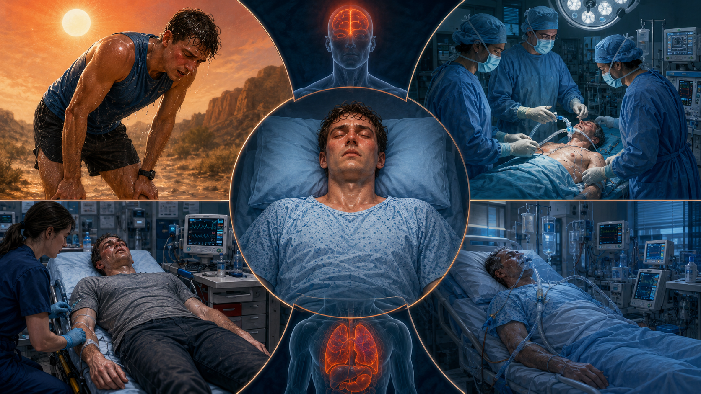
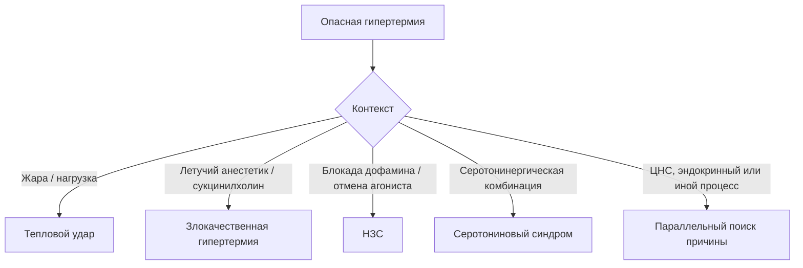
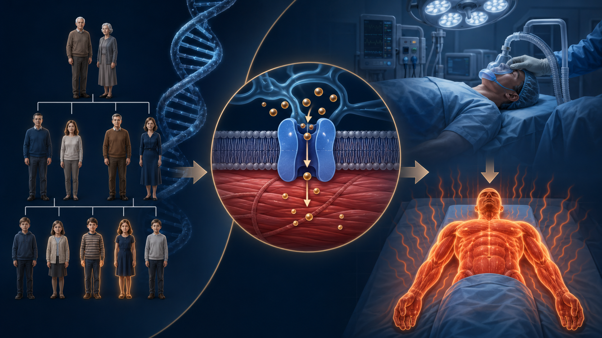

# Глава 4. Этиология и классификация гипертермических состояний

<!-- visual-summary:start -->
## Визуальный конспект главы

*Рисунок 1. Контексты, которые быстро сужают поиск причины: нагрузка и жара,
анестезия, лекарственный триггер, поражение ЦНС или эндокринный криз.*

### Схема для запоминания

<!-- visual-summary:end -->
Мы рассмотрели норму и поломку. Теперь нужно научиться узнавать врага в лицо. Это «детективная» часть курса: увидев пациента с T > 40 °C, врач должен немедленно запустить алгоритм, начинающийся с вопроса «**почему?**». Ответ на него — этиология — полностью определяет тактику, потому что для нескольких форм ГС существует специфический антидот, а для остальных единственным работающим средством остаётся охлаждение.

Все причины условно делятся на две большие группы: жар приходит **извне** (экзогенные причины) или рождается **внутри** (эндогенные).

## 4.1. Экзогенные (внешние) причины

Здесь первопричина — высокая температура окружающей среды, с которой система теплоотдачи не справляется.

### 4.1.1. Воздействие высокой температуры окружающей среды

Общий термин для ситуаций, когда T_amb высока: «волна жары», работа в горячем цеху, раскалённый автомобиль, помещение без вентиляции и кондиционирования, пустынный климат.

*Механизм:* при T_amb выше температуры тела организм не может отдавать тепло радиацией и конвекцией — остаётся только испарение; при T_amb выше ~35 °C в сочетании с высокой влажностью и испарение становится неэффективным, и температура тела начинает расти.

*Факторы риска:* T_amb > 35 °C, высокая влажность, отсутствие вентиляции, отсутствие доступа к воде, физическая активность, крайние возрасты, сопутствующие заболевания.

### 4.1.2. Тепловой удар (heat stroke)

Клинический синдром, развивающийся в результате перегрева и характеризующийся
дисфункцией ЦНС — от спутанности до комы — обычно при высокой температуре ядра.
После начатого охлаждения температура может быть ниже 40 °C. Различают два
основных клинических контекста.

**Классический (non-exertional) тепловой удар.**
- *Механизм:* пассивная гипертермия — система теплоотдачи перегружена длительным воздействием жары и высокой влажности, блокирующей испарение.
- *Группы риска:* классическая жертва — пожилой пациент старше 65 лет, живущий один в городской квартире без кондиционера во время волны жары; также младенцы, оставленные в машине или душном помещении, лица с хроническими заболеваниями.
- *Особенности:* часто развивается в течение часов или дней жары. Кожа может
  быть сухой или влажной; потоотделение не исключает диагноз.

**Тепловой удар при физическом напряжении (exertional heat stroke).**
- *Механизм:* фатальное сочетание внешней жары и колоссальной внутренней теплопродукции работающих мышц.
- *Группы риска:* молодые здоровые люди — марафонцы, футболисты, солдаты в полной выкладке на марше, пожарные, рабочие горячих цехов.
- *Особенности:* развивается очень быстро, иногда за 30–60 минут интенсивной нагрузки. **Потоотделение часто сохранено и даже профузно** — и это ловушка для врача, ожидающего «сухую кожу»: в условиях жары, влажности и непроницаемой экипировки пот просто не испаряется. Пациенты буквально «варятся» в собственном тепле. Характерны тяжелейший рабдомиолиз и острая почечная недостаточность.

*Клинические проявления обоих типов:* T > 40 °C, нарушение сознания (спутанность, делирий, кома), судороги, гиперемия или бледность кожи, тахикардия, гипотензия, тахипноэ.

### 4.1.3. Солнечный удар (инсоляция)

«Солнечный удар» — бытовой и исторический термин для тепловой болезни после прямой инсоляции. Надёжных оснований выделять отдельный механизм «локального перегрева мозговых оболочек» нет: пациента оценивают по общей тепловой нагрузке, температуре ядра, гидратации и, главное, функции ЦНС. При изменении сознания состояние ведут как возможный тепловой удар независимо от того, была ли голова покрыта.

*Симптомы:* доминируют церебральные проявления — резкая головная боль, головокружение, тошнота, рвота, менингеальные знаки, быстрая потеря сознания, судороги — на фоне общего перегрева.

### 4.1.4. Ятрогенные экзогенные факторы

- **Чрезмерное укутывание младенцев.** Избыточная одежда, высокая температура
  помещения и отсутствие возможности изменить среду повышают риск перегрева;
  точную влажность внутри одежды по внешнему виду определить нельзя.
- **Неправильное использование согревающих устройств** — электрических одеял, тепловых ламп, согревающих матрасов у пациента с уже повышенной температурой.
- **Небезопасная организация охлаждения.** Риск создают задержка начала, отсутствие контроля дыхательных путей и температуры ядра, недостаточная площадь охлаждения или прекращение слишком поздно. При тепловом ударе на нагрузке погружение в холодную воду, напротив, является предпочтительным быстрым методом при правильно организованном наблюдении.

---

## 4.2. Эндогенные (патологические) причины

Здесь пожар начинается внутри организма — из-за болезни или химического вещества, даже при нормальной температуре среды.

### 4.2.1. Фармакологически индуцированные синдромы

Одна из важнейших и сложнейших групп для дифференциальной диагностики.

#### Злокачественная гипертермия (Malignant Hyperthermia, MH)

*Природа.* Редкое, но высоколетальное фармакогенетическое заболевание. Оценки частоты: 1:15 000 педиатрических и 1:50 000 взрослых анестезий по одним источникам, 1:10 000 – 1:15 000 анестезий по другим (см. обсуждение расхождения в § 1.4.1).

*Генетика.* Предрасположенность чаще наследуется аутосомно-доминантно с неполной и вариабельной пенетрантностью. По GeneReviews патогенные варианты выявляют в **RYR1** примерно у 60–70 % лиц с подтверждённой предрасположенностью, в **CACNA1S** — примерно у 1 %, в **STAC3** — менее чем у 1 %. Отрицательная генетическая панель не исключает предрасположенность; референсным фенотипическим методом остаётся контрактурный тест.

*Механизм.* Гиперметаболический криз в скелетной мышце связан с нарушением кальциевой регуляции (подробно разобран в главе 3). Температура способна расти быстро, но часто повышается позже, чем EtCO₂, ацидоз и ригидность.

*Триггеры:*
- **все ингаляционные галогенсодержащие анестетики** — галотан (исторически), севофлуран, десфлуран, изофлуран, энфлуран;
- **деполяризующий миорелаксант сукцинилхолин** (суксаметоний, дитилин), часто выступающий «запалом».

**Важно запомнить: закись азота (N₂O) и ксенон триггерами не являются.**

*Безопасные препараты:* внутривенные анестетики (пропофол, тиопентал, кетамин, этомидат), опиоиды (морфин, фентанил), недеполяризующие миорелаксанты (рокуроний, атракурий, цисатракурий, панкуроний), местные анестетики (лидокаин, бупивакаин), кислород.

*Клиника.* Развивается на фоне анестезии или сразу после неё. Триада: гипертермия, тахикардия, мышечная ригидность — особенно **тризм** (спазм жевательных мышц) после сукцинилхолина. **Самый ранний признак — необъяснимый рост EtCO₂ на капнографе**, опережающий подъём температуры. Далее — гиперкапния, аритмии, нестабильная гемодинамика, быстрое прогрессирование.

*Диагностика:* клинические критерии, резкий рост КФК (нередко > 10 000 Ед/л), гиперкалиемия, миоглобинурия, галотан-кофеиновый контрактурный тест (CHCT) как референсный метод, генетическое тестирование.

*Лечение:* немедленное прекращение триггеров, гипервентиляция 100 % кислородом и **дантролен натрия** по актуальному алгоритму MHAUS/EMHG; дозы повторяют до клинического ответа, а при персистирующем кризе суммарная доза может превысить 10 мг/кг. При гипертермии проводят активное охлаждение, корректируют угрожающие нарушения и продолжают мониторинг из-за риска рецидива.

*Исход:* исторически смертность была высокой; раннее распознавание, прекращение
триггера, дантролен и современная интенсивная терапия резко улучшают исход.

*Профилактика:* генетическое консультирование и семейный скрининг, документирование риска, выбор безопасной методики анестезии.

#### Нейролептический злокачественный синдром (НЗС, NMS)

*Природа.* Редкая и непредсказуемая реакция на резкое снижение дофаминергической передачи. Риск увеличивают высокие дозы, быстрое титрование, парентеральное введение, ажитация, обезвоживание и сочетание препаратов, поэтому называть синдром полностью «недозозависимым» неточно.

*Причины:*
- **приём** — чаще «сильные» нейролептики 1-го поколения (галоперидол, хлорпромазин), реже атипичные 2-го поколения (оланзапин, рисперидон, кветиапин); риск выше при высоких дозах, быстром титровании, внутримышечном введении;
- **отмена** — резкое прекращение дофаминергической терапии болезни Паркинсона (леводопа, бромокриптин); механизм тот же — резкое падение дофаминовой активности.

*Механизм.* Генерализованная блокада D₂-рецепторов в гипоталамусе (нарушение центральной терморегуляции) и в нигростриатном пути (экстрапирамидная «свинцовая» ригидность → гиперпродукция тепла).

*Клиника — тетрада:* гипертермия (часто > 40 °C); мышечная ригидность типа «свинцовой трубы»; изменение сознания (делирий, спутанность, кома); вегетативная дисфункция — тахикардия, лабильное АД, профузное потоотделение, иногда ангидроз. Дополнительно: тремор, брадикинезия.

*Особенность:* обычно развивается в течение нескольких дней после начала или изменения терапии, тогда как серотониновая токсичность чаще проявляется в течение часов. Возможны исключения, поэтому темп — подсказка, а не самостоятельный критерий.

*Диагностика:* клинические критерии, резко повышенная КФК, гиперкалиемия, миоглобинурия, исключение иных причин.

*Лечение:* немедленная отмена причинного препарата, интенсивная поддержка, контроль температуры, осложнений и жидкости; бензодиазепины полезны при ажитации и кататонических признаках. Бромокриптин, амантадин, дантролен или ЭСТ рассматривают индивидуально совместно с реаниматологом, токсикологом, неврологом и психиатром. Сравнительные данные преимущественно наблюдательные, поэтому эти препараты не являются универсальными антидотами.

*Летальность:* 10–20 %.

#### Серотониновый синдром (СС)

*Природа.* Токсическая, **дозозависимая** реакция, вызванная избытком серотонина (5-HT) в синапсах ЦНС и на периферии.

*Причины.* Часто — комбинация серотонинергических препаратов, взаимодействие,
передозировка или повышение дозы; возможен эпизод и при одном препарате.
- *Классический пример:* пациент принимает СИОЗС (флуоксетин), и ему назначают ингибитор МАО — фатальная комбинация.
- *Другие опасные сочетания:* СИОЗС + трамадол; СИОЗС + декстрометорфан (в сиропе от кашля); СИОЗСН + линезолид (антибиотик с МАО-ингибирующей активностью); литий; трициклические антидепрессанты; кокаин; MDMA («экстази»); метиленовый синий.

*Механизм.* Гиперстимуляция рецепторов 5-HT₂A и 5-HT₁A → когнитивные нарушения, вегетативная дисфункция, нервно-мышечная гиперактивность.

*Клиника — триада:*
- **нервно-мышечная гиперактивность** (ключ к диагнозу): миоклонус, гиперрефлексия, особенно в ногах, клонус стоп, тремор, умеренная ригидность;
- **вегетативная дисфункция:** тахикардия, диарея, мидриаз, профузное потоотделение;
- **изменение сознания:** возбуждение, делирий.

*Особенность:* развивается **быстро**, за часы после приёма или изменения дозы.

*Диагностика:* Хантеровские критерии (Hunter Serotonin Toxicity Criteria), исключение иных причин.

*Лечение:* немедленная отмена серотонинергических препаратов, поддержка, бензодиазепины и физическое охлаждение при гипертермии. При тяжёлой гипертермии из-за мышечной активности могут потребоваться интубация и недеполяризующая нейромышечная блокада. **Ципрогептадин** — энтеральный вспомогательный вариант с ограниченными данными; его не следует представлять как доказанный антидот, заменяющий поддержку.

*Летальность:* менее 1 % при адекватном лечении; тяжёлые формы могут быть фатальны.

#### Антихолинергический синдром

*Природа.* Отравление веществами, блокирующими M-холинорецепторы.

*Причины:* передозировка атропина, скополамина, трициклических антидепрессантов (амитриптилин), антигистаминных 1-го поколения (дифенгидрамин), ряда нейролептиков; отравление растениями — дурманом, беленой, красавкой (белладонной).

*Механизм:* центральный компонент — делирий; периферический — блокада потоотделения с развитием ангидроза и гипертермии.

*Мнемоника:* «слепой как летучая мышь (мидриаз), сухой как кость (ангидроз), красный как свёкла (кожная вазодилатация), горячий как печь (гипертермия), безумный как шляпник (делирий)». К этому добавляются тахикардия и задержка мочи.

*Лечение:* отмена препарата, агрессивное охлаждение, при тяжёлом центральном антихолинергическом синдроме — антидот **физостигмин** (1–2 мг внутривенно медленно, под контролем ЭКГ), поддерживающая терапия.

#### Психостимуляторы

Амфетамины, метамфетамин, кокаин, MDMA («экстази») вызывают гипертермию по механизму **тройного удара**:
1. резко повышают теплопродукцию — психомоторное возбуждение и прямая стимуляция метаболизма;
2. нарушают центральную терморегуляцию через дофаминовые и серотониновые системы;
3. вызывают периферическую вазоконстрикцию, блокируя теплоотдачу.

*Контекст:* риск многократно возрастает при сочетании с внешними факторами — танцы в душном клубе без доступа к воде, физическая нагрузка в жару. Именно поэтому «клубная» гипертермия часто достигает крайних значений.

#### Злокачественная кататония

Редкое жизнеугрожающее психиатрическое состояние (подтип кататонии), протекающее с гипертермией, ригидностью и вегетативной нестабильностью. Возникает на фоне шизофрении, биполярного расстройства, тяжёлой депрессии; может провоцироваться как приёмом, так и отменой нейролептиков.

*Клиника:* кататония (мутизм, негативизм, восковая гибкость, эхолалия, эхопраксия), гипертермия, мышечная ригидность, вегетативная дисфункция.

*Ключевая трудность:* клинически почти неотличима от НЗС, что создаёт серьёзные диагностические сложности — тем более что нейролептики, назначаемые при психозе, могут быть и причиной, и «маскировкой» состояния.

*Лечение:* отмена нейролептиков, **бензодиазепины** (лоразепам, диазепам) в качестве терапии первой линии, электросудорожная терапия (ЭСТ) при неэффективности, дантролен при выраженной ригидности.

#### Лекарственная лихорадка (drug fever)

Лекарственная лихорадка может быть иммунной или неиммунной; сыпь и эозинофилия
возможны, но не обязательны. Временная связь варьирует, а диагноз требует
исключения инфекции и других причин. После отмены причинного препарата
температура часто снижается в течение нескольких суток. Это лихорадка, а не
истинная гипертермия, но она входит в дифференциальный ряд.

### 4.2.2. Центральные (нейрогенные) поражения ЦНС

*Причины:* прямое повреждение гипоталамуса или ствола мозга.
- **Травмы:** тяжёлая ЧМТ, нейрохирургические вмешательства.
- **Инсульты:** геморрагические (субарахноидальное кровоизлияние, внутрижелудочковое, внутримозговое, эпи- и субдуральные гематомы) и ишемические (в частности, инфаркт в бассейне передней соединительной/передней мозговой артерии, питающей преоптическую область).
- **Опухоли:** краниофарингиома, глиома гипоталамуса, менингиома.
- **Инфекции ЦНС:** энцефалит (особенно герпетический), менингит, абсцесс мозга.

*Особенности:* развивается «центральная», или нейрогенная, гипертермия, которая часто **рефрактерна к антипиретикам** и требует агрессивного физического охлаждения. Дополнительный вклад вносят отёк мозга и нарушение мозгового кровообращения.

### 4.2.3. Эндокринные нарушения и метаболические кризы

**Тиреотоксический криз.**
- *Причина:* декомпенсированный тиреотоксикоз — болезнь Грейвса (диффузный токсический зоб), токсическая аденома, многоузловой токсический зоб, тиреоидит, передозировка тиреоидных гормонов.
- *Механизм:* избыток тиреоидных гормонов усиливает метаболизм и теплопродукцию.
- *Клиника:* гипертермия (обычно 38–40 °C, может быть выше), выраженная тахикардия (часто > 140 уд/мин), аритмии, гипертензия, возбуждение и делирий, профузное потоотделение, тошнота, рвота, диарея; фоновые признаки тиреотоксикоза — зоб, офтальмопатия, тремор.
- *Диагностика:* повышение Т3 и Т4, подавленный ТТГ.
- *Лечение:* тиреостатики (пропилтиоурацил, тиамазол), бета-блокаторы (пропранолол), глюкокортикоиды, йодиды — обязательно не ранее чем через час после тиреостатиков, агрессивное охлаждение.
- *Летальность:* 10–20 % без лечения, менее 5 % при адекватной терапии.

**Феохромоцитома.**
- *Причина:* опухоль надпочечников (или вненадпочечниковая параганглиома), секретирующая катехоламины.
- *Механизм:* пароксизмальный выброс адреналина и норадреналина → резкая вазоконстрикция (падение теплоотдачи) + стимуляция метаболизма (рост теплопродукции).
- *Клиника:* кризовая пароксизмальная гипертензия, головная боль, профузный пот, тахикардия, тревога, гипертермия во время криза.
- *Диагностика:* повышение метанефринов и катехоламинов в крови и моче, визуализация опухоли (КТ, МРТ).
- *Лечение:* альфа-адреноблокаторы (фентоламин, феноксибензамин), **только затем** бета-блокаторы (обратный порядок опасен), охлаждение, в плановом порядке — хирургическое удаление опухоли.

### 4.2.4. Инфекционные заболевания

Инфекции чаще вызывают пирогенную лихорадку, но фиксированные проценты здесь ненадёжны: часть пациентов, особенно пожилых и иммунокомпрометированных, может быть нормо- или гипотермичной, а сепсис способен сосуществовать с тепловым ударом. Ответ на антипиретик не исключает инфекцию и не служит тестом на механизм.

*Когда инфекция всё же вызывает истинную гипертермию:*
- **Сепсис и септический шок.** Пирогенная лихорадка может сочетаться с органной дисфункцией, нарушением перфузии и лекарственными или внешними факторами перегрева. Холодные конечности означают гипоперфузию, но не отдельный «белый» тип. Диагноз сепсиса требует предполагаемой инфекции и органной дисфункции; его оценивают параллельно с другими причинами.
- **Тяжёлые инфекции ЦНС:** менингит, энцефалит — за счёт прямого поражения центра терморегуляции.
- **Тяжёлые тропические лихорадки:** прежде всего тропическая малярия (*Plasmodium falciparum*), где T > 41 °C служит маркером тяжёлого течения.
- **Инфекционно-токсические состояния:** синдром токсического шока, вызванный токсинами *Staphylococcus aureus* или *Streptococcus pyogenes*.

Прочие инфекции — бактериальные (пневмония, абсцессы), вирусные (грипп, ОРВИ, корь, краснуха, ветряная оспа), грибковые (кандидоз, аспергиллёз) и паразитарные — вызывают классическую лихорадку и в контексте ГС значимы в основном как объект дифференциальной диагностики.

### 4.2.5. Прочие причины

- **Тяжёлые травмы и ожоги:** массивный выброс медиаторов воспаления, рабдомиолиз.
- **Воспалительные и аутоиммунные заболевания:** тяжёлые васкулиты, ревматоидные кризы, болезнь Стилла взрослых, системная красная волчанка.
- **Онкологические процессы:** «опухолевая лихорадка» при лимфомах и лейкозах (обусловлена продукцией цитокинов и чаще является именно лихорадкой), но синдром массивного лизиса опухоли может сопровождаться истинной гипертермией.
- **Послеоперационная гипертермия (исторический термин — синдром Омбредана).** Сегодня рассматривается как форма нераспознанной интраоперационно MH, как НЗС либо как проявление инфекции.
- **Анафилаксия** может сопровождаться повышением температуры.

### 4.2.6. Наследственные и генетические формы

Ярчайший пример — злокачественная гипертермия (мутации RYR1, CACNA1S). Описаны и другие семейные дефекты терморегуляции и наследственные метаболические нарушения, но они казуистически редки.

*Рисунок 2. Условная связь наследственной предрасположенности, кальциевой
регуляции скелетной мышцы и анестезиологического триггера. Это не родословная и
не изображение конкретного белка.*

### 4.2.7. Предрасполагающие факторы

Это не причины, а условия, повышающие вероятность развития ГС при воздействии триггера — они снижают «запас прочности» системы:

- **Возраст:** младенцы (незрелость ЦНС и терморегуляции) и пожилые (дегенеративные изменения ЦНС, коморбидность).
- **Патология ЦНС** (ДЦП, последствия ЧМТ) — снижает резерв гипоталамуса.
- **Врождённые пороки сердца и сердечная недостаточность** — ограничивают прирост сердечного выброса, необходимый для кожной вазодилатации.
- **Судорожная готовность (эпилепсия)** — образует порочный круг: гипертермия снижает судорожный порог, а судороги сами служат мощным источником тепла.
- **Ожирение** — жировая ткань как теплоизолятор.
- **Дегидратация** — снижает ОЦК и способность к потоотделению.
- **Алкоголизм** — нарушает центральную регуляцию, вызывает дегидратацию и часто сочетается с социальной изоляцией.
- **Генетическая предрасположенность** (RYR1, CACNA1S), эндокринные нарушения, полипрагмазия.

---

## 4.3. Классификация гипертермических состояний

Классификация нужна не ради систематики, а чтобы структурировать мышление у постели больного.

### 4.3.1. По этиологии (ключевая)

- **Экзогенная:** тепловой удар, солнечный удар, перегрев в жаркой среде.
- **Эндогенная:** MH, НЗС, СС, тиреотоксический криз, феохромоцитома, поражения ЦНС, сепсис, воспалительные и онкологические процессы.
- **Смешанная:** тепловой удар при нагрузке, гипертермия на фоне приёма кокаина в жару, ГС у пожилого пациента на антихолинергиках во время волны жары.

### 4.3.2. По патогенетическому механизму (фундаментальная)

- **Лихорадка (fever):** пирогенный сдвиг установочной точки через PGE₂; антипиретики могут снижать точку, но клинический ответ вариабелен.
- **Непирогенная гипертермия (hyperthermia):** накопление тепла без такого сдвига; антипиретики механизм не устраняют. Теплопродукция и нарушение теплоотдачи часто сочетаются.

### 4.3.3. По уровню температуры

Классификация условна и в источниках различается; ниже приведена обобщённая клиническая шкала:

| Уровень | Температура |
|---|---|
| Субфебрильная | 37,1–38,0 °C |
| Фебрильная (умеренная) | 38,1–39,0 °C |
| Пиретическая (высокая) | 39,1–40,9 °C |
| Гиперпиретическая | ≥ 41,0 °C |

В части источников границы смещены: фебрильная 38–38,5 °C, пиретическая 38,5–39,5 °C, гиперпиретическая > 39,5 °C. Расхождение отражает отсутствие единого стандарта и не влияет на тактику.

**Клиническое правило:** чем выше температура и дольше воздействие, тем больше риск повреждения, однако одна цифра не устанавливает механизм и не задаёт универсальный порог необратимости. При подозрении на тепловой удар ключевым признаком служит дисфункция ЦНС; после начатого охлаждения температура может быть ниже 40 °C.

### 4.3.4. По степени тяжести

- **Лёгкая степень — тепловое истощение:** T_core < 40 °C, слабость, тошнота, тахикардия, обильный пот, **сознание ясное**. Это ещё не тепловой удар, но его непосредственный предвестник, и именно на этой стадии вмешательство наиболее эффективно.
- **Средняя степень:** условный промежуточный термин; ориентировочно 38,5–39,5 °C с начальными признаками декомпенсации.
- **Тяжёлая степень — тепловой удар / гипертермический синдром:** T_core > 40 °C **плюс дисфункция ЦНС** (спутанность, делирий, судороги, кома).

Именно наличие неврологической симптоматики, а не цифра на термометре, переводит состояние в категорию тяжёлых.

### 4.3.5. По состоянию кожи и перфузии

Цвет, влажность и температура кожи полезны как часть осмотра, но деление на
«красную» и «белую» гипертермию не является универсальной клинической
классификацией и не должно определять охлаждение.

- горячая влажная кожа возможна при тепловом ударе на нагрузке и
  серотониновом синдроме;
- горячая сухая кожа заставляет думать об ангидрозе, антихолинергическом
  токсидроме или истощении потоотделения, но не подтверждает диагноз;
- бледные, мраморные или холодные конечности требуют немедленной оценки шока,
  перфузии, лекарственных эффектов и сосудистого доступа.

При подозрении на тепловой удар эффективное охлаждение **не откладывают** ради
спазмолитиков, растирания или согревания конечностей. ABCDE, поддержка перфузии
и охлаждение идут параллельно; метод выбирают так, чтобы сохранить контроль
дыхательных путей и возможность реанимации.

### 4.3.6. По типу температурной кривой

Классификация исторически важна для диагностики инфекций; при ГС она малоинформативна, поскольку температура обычно остаётся стойко высокой до начала лечения.

- **Febris continua (постоянная):** суточные колебания < 1 °C — пневмония, брюшной тиф.
- **Febris remittens (послабляющая):** колебания > 1 °C, но температура не снижается до нормы — туберкулёз, абсцессы.
- **Febris intermittens (перемежающаяся):** эпизоды высокой температуры чередуются с нормальной — малярия, сепсис.
- **Febris hectica (гектическая, истощающая):** суточные колебания 3–5 °C с ознобами и проливными потами — сепсис, туберкулёз.
- **Febris recurrens (волнообразная):** многодневные периоды лихорадки чередуются с периодами нормы — возвратный тиф.
- **Неправильная:** без определённой закономерности.

### 4.3.7. По длительности эпизода

- **Острая (часы):** тепловой удар, MH, серотониновый синдром.
- **Подострая/хроническая (дни–недели):** НЗС, центральная гипертермия, опухолевая лихорадка.

### 4.3.8. По характеру течения

- **Компенсированная:** организм справляется, органной дисфункции нет.
- **Декомпенсированная:** компенсаторные механизмы исчерпаны, развивается полиорганная дисфункция.

---

## Выводы по главе 4

**Многообразие причин.** Гипертермический синдром — не одна болезнь, а финал множества различных состояний: от внешнего перегрева (тепловой удар) до редких генетических дефектов (MH) и ятрогенных катастроф (НЗС, серотониновый синдром).

**Ключевые синдромы.** Для практики необходимо знать тепловой удар, MH, НЗС, серотониновый синдром и эндокринные кризы. Только при MH дантролен является доказанной специфической терапией; при остальных состояниях решающими остаются отмена триггера, поддержка, охлаждение и лечение основной причины.

**Кожа — признак, не алгоритм.** Мраморность и холодные конечности заставляют искать гипоперфузию, но при тепловом ударе не отменяют и не задерживают охлаждение.

**Инфекцию оценивают параллельно.** Сепсис и перегрев могут имитировать друг друга и сосуществовать; решение не строят на одном антипиретическом ответе или маркёре.

**Факторы риска.** Дети, пожилые, пациенты с коморбидностью, ожирением, дегидратацией и полипрагмазией теряют запас прочности терморегуляции и декомпенсируются значительно быстрее.

**Переход.** Мы знаем, *почему* (этиология) и *как* (патофизиология). Теперь нужно научиться видеть это глазами: как именно выглядит пациент, у которого «плавятся» белки и «текут» мембраны.

<!-- chapter-nav:start -->

---

[← Предыдущая глава](03-patofiziologiya.md) · [Оглавление](../README.md#оглавление) · [Следующая глава →](05-klinicheskaya-kartina.md)

<!-- chapter-nav:end -->
