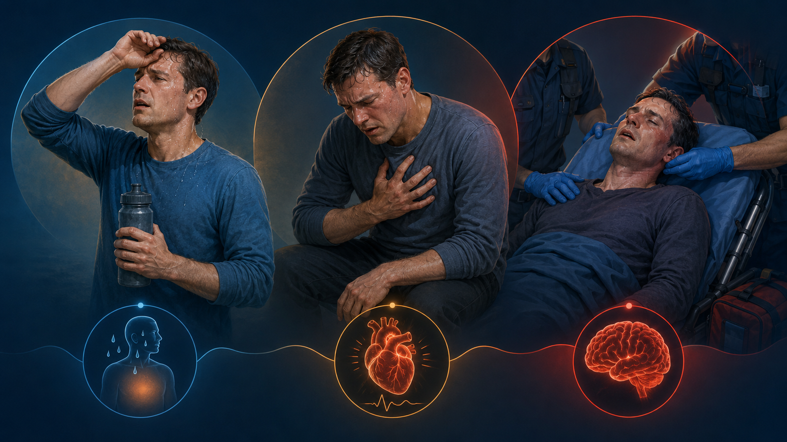
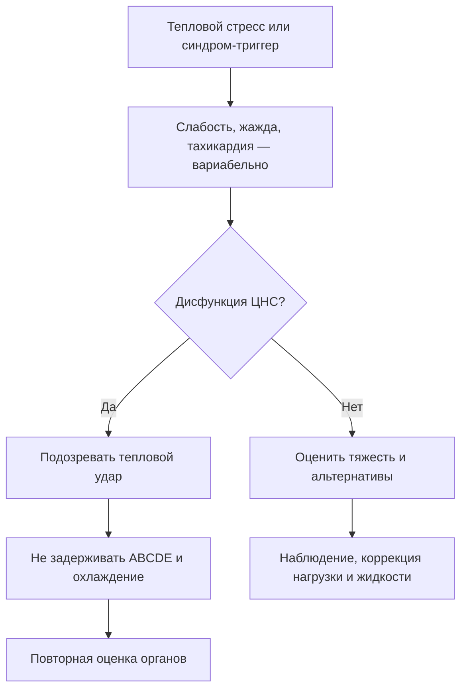
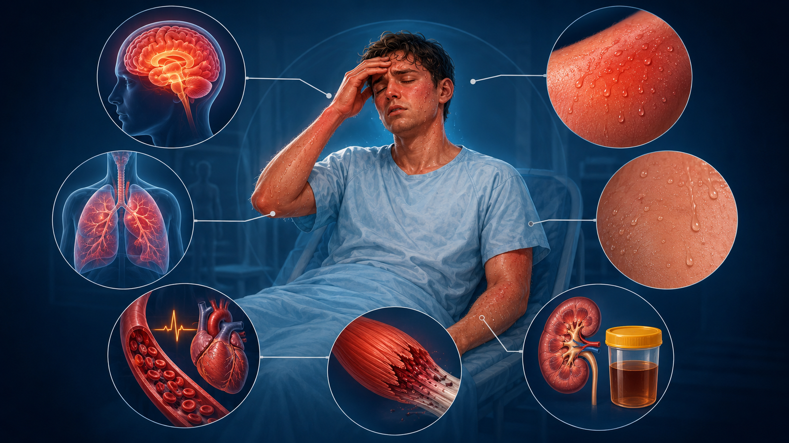

# Глава 5. Клиническая картина

<!-- visual-summary:start -->

*Рисунок 1. Мнемоническая последовательность от теплового стресса к угрожающему
состоянию. Реальное течение может быть быстрым и не обязано проходить все этапы.*

### Схема для запоминания

> [!NOTE]
> Горячая сухая кожа не обязательна: при тепловом ударе пациент может обильно
> потеть. Холодные или мраморные конечности указывают на гипоперфузию, а не на
> запрет охлаждения.
<!-- visual-summary:end -->
Клиническая картина гипертермического синдрома всегда складывается из двух компонентов:

1. **Общие, неспецифические проявления самого перегрева** — прямого токсического действия тепла на органы;
2. **Специфические симптомы-«ключи»**, указывающие на конкретную причину.

Задача врача у постели больного — быстро отделить одно от другого: первое говорит, насколько тяжёл пациент, второе — что именно с ним делать.

## 5.1. Общие проявления

### 5.1.1. Температурные изменения

**Критическое повышение температуры.** T_core (измеренная ректально) выше 40,0 °C; часто достигает 41–42 °C и выше. Часть источников отсчитывает критический уровень от 39,5 °C.

**Пороговые значения:**
- **> 41 °C** — крайне высокий риск клеточного и органного повреждения, особенно при длительном воздействии;
- **> 42–43 °C** — часто несовместимо с жизнью либо приводит к необратимому повреждению ЦНС вплоть до декортикации.

**Динамика.** Может быть быстрой — при злокачественной гипертермии описывают
подъём порядка 1 °C каждые 5–10 минут, при тепловом ударе на нагрузке счёт идёт
на десятки минут — или постепенной (классический тепловой удар, НЗС). Скорость
подъёма служит подсказкой: стремительный рост указывает на срыв терморегуляции и
требует немедленного охлаждения. При этом темп непостоянен, а при MH температура
нередко повышается **позже**, чем EtCO₂, ацидоз и ригидность, поэтому ожидание
«характерной скорости» — диагностическая ошибка (см. § 5.4.2).

**Температурная кривая.** При ГС это, как правило, *febris continua* — температура держится на запредельных цифрах до начала агрессивного охлаждения; при септических состояниях возможна гектическая кривая с резкими колебаниями.

### 5.1.2. Общее состояние

**Ранние признаки (предвестники, тепловое истощение) — «жёлтый свет», последняя возможность предотвратить катастрофу:**
- астения: выраженная слабость, вялость, адинамия, головокружение;
- интенсивная пульсирующая головная боль;
- тошнота, рвота, отказ от еды и питья;
- мышечные спазмы (cramps), особенно при нагрузке в жару. Их традиционно
  объясняли потерей Na⁺ и K⁺ с потом, однако одним дефицитом электролитов они не
  исчерпываются: вклад вносят утомление и нарушенный нейромышечный контроль.
  Тактика — прекратить нагрузку, увести в прохладу, мягко растянуть мышцу,
  оценить гидратацию, натрий и признаки теплового истощения или удара.

**Ключевой момент этой стадии: сознание ещё ясное.**

**Развёрнутая картина.** Состояние стремительно утяжеляется до крайне тяжёлого. Поведение меняется: неадекватность, отказ от еды и питья. Характерна двухфазность психического статуса — вначале психомоторное возбуждение и делирий (пациент «буйный», агрессивный, сопротивляется помощи), которое по мере истощения ЦНС и нарастания отёка мозга сменяется глубоким угнетением сознания вплоть до сопора и комы. Слабость и адинамия обусловлены нарушением метаболизма мышечных клеток, истощением энергетических ресурсов и расстройством нервно-мышечной передачи.

### 5.1.3. Вегетативная дисфункция

**Дрожь — важный парадокс.** При опасной гипертермии она может отражать мышечную гиперактивность, судороги, серотониновую токсичность, действие лекарств или реакцию на охлаждение. Её механизм выясняют, поскольку мышечная работа увеличивает теплопродукцию.

**Озноб при охлаждении — клинически критичное явление.** Если начать слишком агрессивное физическое охлаждение, кожные рецепторы сигнализируют «холодно» нормально работающему гипоталамусу, и тот, защищаясь от переохлаждения, запускает дрожь. Дрожь — это мышечная работа, генерирующая **дополнительное** тепло и прямо противодействующая усилиям врача.

> [!IMPORTANT]
> **Практический вывод:** выраженная дрожь снижает эффективность охлаждения.
> Сначала оптимизируют метод и комфорт, а седацию или нейромышечную блокаду
> применяют только по клиническим показаниям с контролем дыхательных путей.

**Вегетативная лабильность:** колебания артериального давления, частоты сердечных сокращений, интенсивности потоотделения, нестабильность дыхания.

### 5.1.4. Кожные проявления

Ключевой дифференциально-диагностический признак у постели больного, оцениваемый за секунды.

Описывают три независимых свойства: **цвет, влажность и перфузию**. Горячая
влажная кожа возможна при тепловом ударе на нагрузке и серотониновом синдроме;
горячая сухая — при ангидрозе или антихолинергическом токсидроме. Бледность,
мраморность и холодные конечности требуют оценки шока и гипоперфузии. Ни одна
комбинация не подтверждает и не исключает тепловой удар, а потливость
вариабельна как при классической, так и при нагрузочной форме.

**Цианоз ногтевых лож и губ** отражает гипоксемию и нарушение оксигенации тканей, свидетельствуя о декомпенсации.

---

## 5.2. Системные и органные проявления

Прямое отражение патофизиологического каскада из главы 3.

*Рисунок 2. Группы признаков, которые оценивают совместно: ЦНС, кровообращение,
дыхание, кожа, мышцы и возможные признаки пигментурии.*

### 5.2.1. Центральная нервная система

**Энцефалопатия — кардинальный, определяющий признак ГС.** Именно она, а не цифра на термометре, переводит состояние в разряд критических.

> [!IMPORTANT]
> **Клиническое правило — работает в контексте тепловой экспозиции или нагрузки:**
> T_core < 40 °C + ясное сознание = **тепловое истощение**;
> T_core > 40 °C + нарушенное сознание = **тепловой удар до доказательства обратного**.
>
> Два ограничения. После начатого охлаждения температура может быть ниже 40 °C —
> это диагноз не исключает. И наоборот: если теплового контекста нет, та же
> связка означает лишь «опасная гипертермия с энцефалопатией», а причину ищут
> параллельно — сепсис, нейроинфекция, инсульт, интоксикация, MH, НЗС,
> серотониновый синдром, тиреотоксический криз.

**Спектр нарушений сознания:**
- *возбуждение* — агрессия, делирий с бредом и галлюцинациями (зрительными, слуховыми, тактильными);
- *спутанность и дезориентация* — невнятная речь (дизартрия), нарушения памяти и внимания, пациент не ориентируется в месте и времени;
- *угнетение* — от сомнолентности и сопора до комы с утратой защитных реакций.

**Судорожный синдром.** Тонико-клонические судороги (Grand Mal) — частое явление. Тоническая фаза длится 10–20 секунд (напряжение мышц, вытягивание тела, возможное апноэ), клоническая — 30–60 секунд (ритмичные сокращения, прикусывание языка, непроизвольное мочеиспускание и дефекация). Судороги могут быть как **причиной** гипертермии (эпилептический статус сам генерирует тепло), так и её **следствием** (отёк мозга, гипоксия, гипонатриемия). Возможны генерализованные, парциальные судороги и переход в эпилептический статус.

> [!IMPORTANT]
> **«Красные флаги» ЦНС, переводящие тепловое истощение в тепловой удар.**
> Атаксия (ранний признак поражения мозжечка), делириозное возбуждение,
> галлюцинации, судороги или угнетение сознания до ступора и комы. Появление
> любого из них на фоне тепловой экспозиции требует немедленного охлаждения и
> ведения как теплового удара — независимо от того, какую цифру показал
> термометр.

**Неврологический дефицит:**
- *мозжечковые симптомы* — атаксия, шаткая походка, нистагм — вследствие высокой уязвимости клеток Пуркинье к перегреву; у выживших нередко сохраняются надолго;
- *очаговые симптомы* — парезы, параличи, нарушения чувствительности;
- *менингеальные знаки* — ригидность затылочных мышц может быть положительной из-за отёка мозга даже без нейроинфекции;
- нарушения координации, равновесия, речи, зрения, слуха.

### 5.2.2. Сердечно-сосудистая система

Сердце работает на пределе: одновременно «прокачивает» кровь через расширенный кожный «радиатор» и страдает от гиповолемии, гипоксии и токсинов.

**Тахикардия часта, но не обязательна.** Её выраженность зависит от причины, лекарств, возраста, объёма циркулирующей крови и проводящей системы сердца. Брадикардия или нормальная ЧСС не делают тяжёлую гипертермию безопасной.

**Артериальное давление:**
- *ранняя фаза* — нормальное или повышенное (гипердинамический сердечный выброс, возбуждение);
- *поздняя фаза* — артериальная гипотензия, прогрессирующая в шок вследствие гиповолемии, вазодилатации и синдрома утечки.

**Аритмии.** Причины: прямое термическое повреждение миокарда, ишемия, активация симпатической системы и — что особенно важно — электролитные нарушения, прежде всего гиперкалиемия при рабдомиолизе. Типы: синусовая тахикардия, фибрилляция предсердий, желудочковая экстрасистолия, желудочковая тахикардия, фибрилляция желудочков.

**ЭКГ-признаки:** депрессия ST при ишемии, высокие остроконечные зубцы T при гиперкалиемии. У пациента с ГС ЭКГ — не формальность, а способ вовремя увидеть жизнеугрожающую гиперкалиемию.

### 5.2.3. Дыхательная система

Лёгкие — орган-мишень для SIRS и синдрома утечки.

**Тахипноэ и одышка часты.** Они могут отражать ацидоз, симпатическую активацию, гипоксемию или ОРДС. Частота дыхания и газовый состав оцениваются в динамике; отсутствие тахипноэ не исключает тяжёлого состояния, особенно после седативных препаратов.

**Признаки развивающегося ОРДС:** влажные хрипы, пенистая мокрота (отёк лёгких), падение SpO₂ несмотря на ингаляцию кислорода — рефрактерная гипоксемия.

### 5.2.4. Желудочно-кишечный тракт

Кишечник крайне чувствителен к ишемии на фоне централизации кровообращения.

- **Тошнота и рвота** — ранний и постоянный симптом; генез центральный (воздействие на рвотный центр) и ишемический.
- **Диарея** — часто водянистая, возможна с примесью крови. Механизм — ишемический колит с некрозом слизистой. Особенно характерна для серотонинового синдрома, где имеет иной, рецепторный, механизм.
- **Последствия поражения кишечника:** усугубление гиповолемии и — что особенно опасно — **бактериальная транслокация**: «дырявая» кишечная стенка пропускает микрофлору в кровоток, подпитывая SIRS и вторичный сепсис.
- **Абдоминальный болевой синдром** — признак ишемии органов брюшной полости.
- **Непроизвольная дефекация** — маркер глубокого поражения ЦНС.

### 5.2.5. Мочевыделительная система

- **Олигурия/анурия** — снижение диуреза (< 400 мл/сут) вплоть до полного отсутствия мочи. Механизмы преренальные (шок, дегидратация, активация РААС) и ренальные (острый тубулярный некроз).
- **Цвет мочи.** Тёмно-бурая моча может указывать на миоглобин, гемоглобин, кровь или другие причины. Это красный флаг для немедленного контроля КФК, калия, креатинина, анализа мочи и объёмного статуса, но не показание к автоматическому «форсированному диурезу».
- **Непроизвольное мочеиспускание** — утрата контроля тазовых органов при коме.

---

## 5.3. Стадии развития гипертермического синдрома

Процесс редко бывает одномоментным — исключение составляет злокачественная гипертермия.

**Стадия 1. Компенсаторная (тепловое истощение).**
- T_core < 40 °C; сознание **ясное**.
- Клиника: слабость, тошнота, головная боль, тахикардия, тахипноэ, профузный пот, мышечные спазмы, озноб.
- Патофизиология: система справляется — сердечный выброс высокий, вазодилатация и потоотделение работают на максимуме.
- Длительность: от нескольких минут до нескольких часов.

**Стадия 2. Относительной компенсации («серая зона»).**
- T_core около 40 °C.
- Начальные изменения ЦНС: лёгкая спутанность, иррациональное поведение — спортсмен пытается продолжать бег, пациент срывает с себя одежду. Возможны нарушения координации и речи, единичные судороги.
- Патофизиология: компенсаторные резервы (объём жидкости, насосная функция сердца) истощаются, начинается синдром утечки.
- Длительность: от нескольких часов до суток.

**Стадия 3. Декомпенсации (развёрнутый ГС).**
- T_core > 40–41 °C.
- Глубокая дисфункция ЦНС: кома, судороги; нарушения дыхания и кровообращения.
- Патофизиология: тепловая нагрузка превышает теплоотдачу; могут присоединиться
  обезвоживание, шок и системное воспалительно-эндотелиальное повреждение с
  ДВС, ОПП и ОРДС. Влажность и цвет кожи варьируют и не задают стадию.
- Длительность: развивается в течение часов.

**Крайне тяжёлая стадия** выделяется отдельно как состояние манифестной полиорганной недостаточности с непосредственной угрозой жизни, требующее полного объёма реанимационной помощи.

---

## 5.4. Особенности клиники при различных формах — ключ к дифференциальному диагнозу

Самый важный для клинициста раздел: контекст и уникальные симптомы определяют выбор антидота.

### 5.4.1. Тепловой удар

| Признак | Классический (non-exertional) | При нагрузке (exertional) |
|---|---|---|
| Пациент | Пожилой, с ХСН, на диуретиках, в «волну жары» | Молодой здоровый спортсмен, солдат, рабочий |
| Кожа | Может быть сухой или влажной; осмотр неспецифичен | Часто влажная, но потливость вариабельна |
| ЦНС | Медленное развитие (1–2 дня) спутанности, комы | Быстрое (минуты–часы), часто коллапс и судороги на финише |
| Рабдомиолиз | Возможен, особенно при тяжёлом течении | Встречается чаще; выраженность и ОПП вариабельны |
| Прочее | Дегидратация, фон коморбидности | Часто ДВС-синдром |

В классическом варианте традиционно выделяли две фазы: продромальную («предугар» — слабость, головная боль, тошнота, головокружение) и развёрнутую («угар» — нарушение сознания, судороги, кома).

### 5.4.2. Злокачественная гипертермия (MH)

*Контекст:* обычно во время анестезии или вскоре после неё; триггер —
ингаляционный анестетик или сукцинилхолин. Редкие поздние проявления требуют
сопоставления с экспозицией и исключения других причин.

*Ранние признаки (наиболее ценны для диагноза):*
1. **необъяснимая тахикардия** — первый и самый частый признак;
2. **гиперкапния (рост EtCO₂)** — важный ранний признак при неизменной вентиляции; он высоко подозрителен в подходящем контексте, но требует исключить проблемы контура, вентиляции и другие причины;
3. **ригидность жевательных мышц (тризм)** — «челюсть свело» после введения сукцинилхолина.

*Поздние признаки:*
4. генерализованная мышечная ригидность («как доска»);
5. **гипертермия — поздний признак!** Температура растёт последней, но очень быстро — примерно на 1 °C каждые 5–10 минут;
6. аритмии на фоне гиперкалиемии, тёмная моча, гипотензия, шок.

> [!TIP]
> **Триада для запоминания: тахикардия + гиперкапния + ригидность на фоне анестезии.** Ждать подъёма температуры для постановки диагноза — врачебная ошибка.

### 5.4.3. Нейролептический злокачественный синдром (НЗС)

*Контекст:* пациент, часто психиатрического профиля, принимает нейролептики (галоперидол) либо резко отменил леводопу.

*Развитие:* **медленное** — дни, иногда недели.

*Тетрада симптомов:*
1. гипертермия 38–42 °C, нередко с бледной, мраморной кожей и холодными
   конечностями — это признак нарушенной перфузии, а не отдельный «белый тип»
   гипертермии (§ 4.3.5);
2. мышечная ригидность типа **«свинцовой трубы»** — пластическая, постоянная;
3. изменение сознания: делирий, ступор, кома;
4. вегетативная дисфункция (дисавтономия): лабильное АД, тахикардия, профузное потоотделение, гиперсаливация.

*Дополнительно:* тремор, брадикинезия, маскообразное лицо.

*Лаборатория:* КФК очень высокая вследствие непрерывной ригидности.

### 5.4.4. Серотониновый синдром (СС)

*Контекст:* приём комбинации серотонинергических препаратов (СИОЗС + ингибитор МАО, СИОЗС + трамадол, СИОЗС + декстрометорфан).

*Развитие:* **быстрое** — часы, обычно менее 24 часов от приёма или изменения дозы.

*Триада симптомов:*
1. **когнитивные изменения:** возбуждение, спутанность, делирий;
2. **вегетативная дисфункция:** тахикардия, гипертермия, профузный пот, мидриаз, тошнота, **диарея** — очень характерна;
3. **нервно-мышечная гиперактивность (ключ к диагнозу):** миоклонус — внезапные подёргивания, особенно в ногах; гиперрефлексия (рефлексы «взлетают», 3+ и выше); клонус стоп и надколенника; тремор; умеренная ригидность с преобладанием в ногах.

> [!TIP]
> **Флаги серотонинового синдрома: миоклонус + гиперрефлексия + диарея.**

### 5.4.5. Антихолинергический синдром

*Контекст:* передозировка ТЦА, дифенгидрамина, атропина, отравление дурманом или беленой.

*Классическая мнемоника:*
- *Hot as a hare* — горячий: гипертермия;
- *Dry as a bone* — сухой: ангидроз, сухость слизистых;
- *Blind as a bat* — слепой: мидриаз с нарушением аккомодации;
- *Red as a beet* — красный: «атропиновый румянец» от кожной вазодилатации;
- *Mad as a hatter* — безумный: делирий, галлюцинации.

*Дополнительно:* тахикардия, задержка мочи, атония кишечника и запор.

### 5.4.6. Сводка ключей быстрой дифференциации

| Связка признаков | Диагноз |
|---|---|
| Анестезия + рост EtCO₂ + тризм/ригидность | Злокачественная гипертермия |
| Нейролептик (или отмена леводопы) + медленное развитие + «свинцовая» ригидность | НЗС |
| Антидепрессанты + быстрое развитие + миоклонус, гиперрефлексия, диарея | Серотониновый синдром |
| Жара + ангидроз + кома у пожилого | Классический тепловой удар |
| Нагрузка + профузный пот + коллапс у молодого | Тепловой удар при нагрузке |
| Сухая кожа + мидриаз + задержка мочи + делирий | Антихолинергический синдром |
| Зоб, тахикардия > 140, диарея, тремор | Тиреотоксический криз |

---

## 5.5. Критерии тяжести

Тяжесть оценивается по совокупности температуры и — что важнее — по наличию органной дисфункции.

- **Лёгкая (тепловое истощение):** T < 40 °C, сознание ясное, минимальные системные проявления, судорог и органной дисфункции нет.
- **Средняя:** T около 40–41 °C, лёгкая спутанность, умеренные системные нарушения, явной органной дисфункции нет.
- **Тяжёлая:** T > 41 °C (по ряду классификаций — выше 39,5 °C с органной дисфункцией), кома или судороги, гипотензия и шок, нарушения дыхания, признаки полиорганной дисфункции — ОПП, ОРДС, ДВС.
- **Крайне тяжёлая:** манифестная полиорганная недостаточность, непосредственная угроза жизни, необходимость реанимационных мероприятий в полном объёме.

---

## 5.6. Особенности клиники у детей первого года жизни

- **Неспецифичность.** Клиника «смазана»: ребёнок не жалуется. Он либо вял и сонлив («как тряпочка»), либо, напротив, пронзительно кричит — так называемый «мозговой крик», признак отёка мозга.
- **Быстрое развитие.** Декомпенсация наступает молниеносно из-за малых резервов жидкости, незрелости ЦНС и большого отношения поверхности тела к массе.
- **Судороги.** Фебрильные судороги — очень частый дебют. Важное правило: при T > 40 °C любые судороги следует расценивать как признак ГС, а не «простой» лихорадки.
- **Эксикоз.** Обезвоживание развивается быстро; оценивается по запавшему родничку, сухим слизистым, отсутствию слёз, снижению тургора кожи и диуреза. Незрелость почек усугубляет водно-электролитные нарушения.

---

## 5.7. Гипертермия в условиях интенсивной терапии

Особая диагностическая ситуация: пациент ОРИТ часто интубирован и седирован.

**Проблема:** невозможно оценить ключевой признак — изменение сознания; мышечная ригидность может быть замаскирована миорелаксантами; жалоб нет.

**На что смотреть:**
- **монитор:** необъяснимая тахикардия, лабильность АД;
- **капнограф:** рост EtCO₂ при неизменных параметрах ИВЛ;
- **температурный датчик** (ректальный, пищеводный, катетер в мочевом пузыре) — единственный надёжный источник данных о T_core; аксиллярная термометрия здесь непригодна;
- **лаборатория:** необъяснимый рост КФК, метаболический ацидоз, гиперкалиемия, миоглобин в моче.

---

## Выводы по главе 5

**Кардинальные признаки.** Клиническая картина тяжёлого ГС — триада: T_core > 40 °C, энцефалопатия (от спутанности до комы) и полиорганная дисфункция. Именно неврологический статус, а не показания термометра, определяет тяжесть.

**Оценка кожи за пять секунд.** Цвет, влажность и температура помогают распознать ангидроз или гипоперфузию, но не задают отдельный алгоритм. При тепловом ударе охлаждение не откладывают из-за мраморности или холодных конечностей; одновременно лечат шок и сохраняют доступ к пациенту.

**Ключи к дифференциации** (см. сводную таблицу § 5.4.6) позволяют быстро выбрать причинную ветвь. При MH немедленно нужен дантролен; при серотониновом синдроме исход определяют отмена триггера, поддержка, бензодиазепины и контроль мышечной гиперактивности, а ципрогептадин остаётся вспомогательным энтеральным вариантом.

**Ловушки.** Гипертермия при MH — поздний признак; профузный пот не исключает теплового удара; дрожь при охлаждении вредна и требует купирования; у детей и седированных пациентов ОРИТ классическая картина отсутствует.

**Переход.** Мы увидели пациента и сформулировали 2–3 ведущие гипотезы. Чтобы подтвердить одну и исключить остальные, нужны объективные данные — этому посвящена следующая глава.

<!-- chapter-nav:start -->

---

[← Предыдущая глава](04-etiologiya-i-klassifikaciya.md) · [Оглавление](../README.md#оглавление) · [Следующая глава →](06-diagnostika.md)

<!-- chapter-nav:end -->
