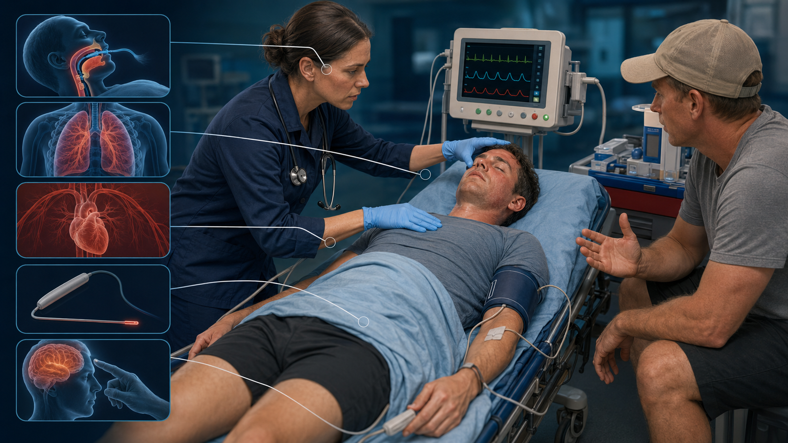
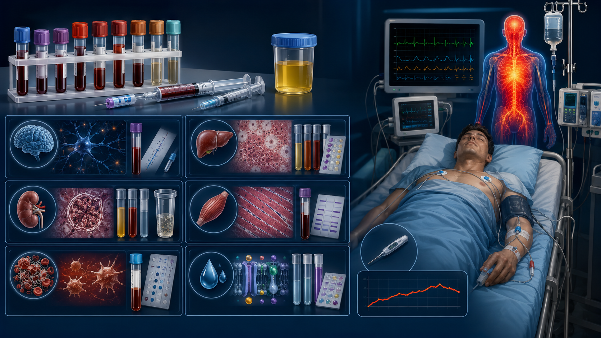
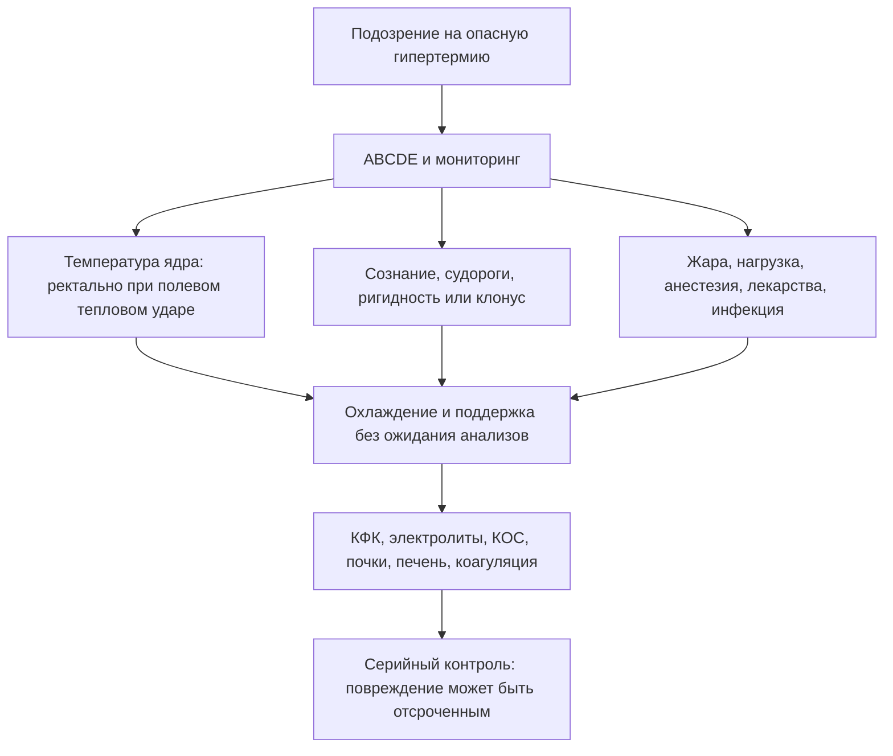

# Глава 6. Диагностика

<!-- visual-summary:start -->
## Визуальный конспект главы

*Рисунок 1. Первичная оценка объединяет ABCDE, неврологический статус, надёжную
температуру ядра и информацию о контексте; действия выполняют параллельно.*

*Рисунок 2. Лабораторный мониторинг подбирают для почек, печени, мышц,
электролитов, КОС и коагуляции; изображённые панели не являются бланком тестов.*

### Схема для запоминания

<!-- visual-summary:end -->
При T_core = 41 °C у врача нет дней — у него есть минуты. Диагностика ГС не является неспешным академическим процессом: это алгоритм неотложной помощи, работающий **параллельно** с первыми реанимационными мероприятиями.

**Цель диагностики тройная:**
1. подтвердить опасное повышение температуры ядра, не сводя диагноз к одному порогу;
2. немедленно начать дифференциальную диагностику этиологии — тепловой удар, MH, НЗС, серотониновый синдром, сепсис?
3. оценить степень полиорганной недостаточности — ОПП, ОРДС, ДВС, рабдомиолиз.

## 6.1. Сбор анамнеза и факторы риска

При ГС анамнез чаще собирается **не у пациента** (он в коме или делирии), а у родственников, очевидцев, бригады скорой помощи, а в случае MH и НЗС — у лечащего врача или анестезиолога.

### 6.1.1. Анамнез заболевания

**Скорость развития — первый разделяющий вопрос:**
- *молниеносно (минуты):* MH в операционной, тепловой удар при нагрузке (коллапс на марафоне), судорожный статус;
- *быстро (часы):* серотониновый синдром после приёма или смены дозы препаратов, отравления кокаином и «экстази»;
- *медленно (дни–недели):* НЗС с постепенным утяжелением, классический тепловой удар (третий день волны жары), тиреотоксический криз, сепсис.

Клиническое значение: темп помогает выбрать причины, но **ни медленное, ни быстрое развитие не даёт права откладывать поддержку и охлаждение**, если есть дисфункция ЦНС или иные признаки угрозы жизни.

**Предшествующие симптомы как подсказка к этиологии:**
- озноб и потоотделение — инфекционные заболевания;
- мышечная ригидность — MH, НЗС;
- миоклонус — серотониновый синдром;
- головная боль, боль в спине, менингеальные жалобы — менингит;
- кашель, боль в горле, дизурия — очаг инфекции, сепсис;
- рвота, диарея — эксикоз;
- контакт с инфекционными больными, эпидемиологическая обстановка.

### 6.1.2. Фармакологический анамнез — ключевой пункт

Это самый информативный раздел анамнеза при ГС.

**Вопросы по «большой тройке»:**
- **НЗС:** «Принимает ли пациент нейролептики — галоперидол, аминазин, оланзапин, рисперидон? Страдает ли болезнью Паркинсона, не пропускал ли приём леводопы?» Уточнить дозы, сроки начала, недавнее повышение дозы, внутримышечные введения.
- **Серотониновый синдром:** «Какие антидепрессанты принимает — флуоксетин, пароксетин, сертралин? Принимает ли ингибиторы МАО? Пьёт ли трамадол или сироп от кашля с декстрометорфаном? Не назначали ли линезолид?»
- **MH (вопрос анестезиолога к себе):** «Какие препараты я вводил? Были ли севофлуран, десфлуран, изофлуран, галотан или сукцинилхолин?»

**Другие «подозреваемые»:** антихолинергические средства (атропин, дифенгидрамин, амитриптилин); психостимуляторы (кокаин, амфетамины, MDMA); диуретики (обезвоживание и предрасположенность к тепловому удару); литий.

**Полипрагмазия** — одновременный приём пяти и более препаратов — сама по себе резко повышает риск. Обязательно уточнять любые недавние изменения терапии: новый препарат, повышение дозы, отмену, новую комбинацию.

### 6.1.3. Условия окружающей среды

- *Классический тепловой удар:* «В душной квартире без кондиционера», «в закрытой машине на солнце» (ребёнок), температура и длительность воздействия, наличие вентиляции и доступа к воде.
- *Тепловой удар при нагрузке:* «Бежал марафон», «тренировался в полной выкладке», «работал в литейном цеху»; интенсивность и продолжительность нагрузки, характер одежды и экипировки.
- *Влажность* — ключевой фактор, блокирующий испарение, и его нужно выяснять специально.
- *Профессиональные вредности:* работа в горячих цехах, у источников тепла, в защитных костюмах.

### 6.1.4. Наследственный анамнез

**Ключевой вопрос при подозрении на MH:** «Были ли у пациента или его кровных родственников проблемы с наркозом? Умирал ли кто-то из родственников во время операции или сразу после неё? Говорили ли ему, что у него или у семьи злокачественная гипертермия?»

Положительный ответ — **абсолютный красный флаг** для анестезиолога, требующий полностью безтриггерной методики анестезии. Также выясняется наличие подтверждённых мутаций RYR1 и CACNA1S у родственников.

### 6.1.5. Преморбидный фон

- **Психиатрический:** антипсихотики и резкая отмена дофаминергических средств
  повышают вероятность НЗС; серотонинергические препараты и взаимодействия —
  серотонинового синдрома.
- **Эндокринный:** тиреотоксикоз, болезнь Грейвса → риск криза; феохромоцитома.
- **ЦНС:** ДЦП, ЧМТ в анамнезе, инсульты, опухоли, эпилепсия и судорожная готовность.
- **Сердечно-сосудистый:** ХСН, врождённые пороки сердца, приём диуретиков — ограниченный резерв компенсации.
- **Прочее:** заболевания почек и печени (влияют на элиминацию препаратов), алкоголизм, наркомания, ожирение.

---

## 6.2. Физикальное обследование

Проводится немедленно и параллельно с обеспечением витальных функций.

### 6.2.1. Термометрия

**Золотой стандарт — измерение T_core (температуры ядра).**

**При подозрении на тепловой удар в полевых и приёмных условиях метод выбора — ректальная термометрия.** Она лучше периферических методов отражает температуру ядра во время нагрузки и быстрого охлаждения. Технику, глубину введения, фиксацию и противопоказания определяют локальный протокол и устройство датчика.

> [!WARNING]
> **Практическая ловушка:** обычный ртутный градусник для диагностики ГС непригоден — его шкала не показывает температуру выше 42 °C. Необходим электронный термометр с расширенным диапазоном.

**Другие методы выбирают по контексту:**
- пищеводный датчик — для интубированного/анестезированного пациента при корректном положении;
- датчик мочевого пузыря — может запаздывать при низком диурезе и быстром изменении температуры;
- катетер в лёгочной артерии — точен, но не устанавливается только ради термометрии;
- контактное тимпаническое измерение требует правильной техники и не равно бытовому инфракрасному «ушному» термометру.

Аксиллярные, кожные, лобные и бесконтактные методы могут существенно ошибаться
при нагрузке, потоотделении, гипоперфузии и активном охлаждении. Если
ректальное измерение временно недоступно, помощь не задерживают: используют
лучший доступный метод, интерпретируют его осторожно и переходят к подходящему
датчику как можно раньше. Кожно-ядерный градиент может отражать перфузию, но
пороговые значения не делят пациентов на отдельные «красный» и «белый» типы.

### 6.2.2. Оценка витальных функций (ABC)

- **A (Airway):** проходимость дыхательных путей — рвота, аспирация, тризм при MH.
- **B (Breathing):** ЧДД (тахипноэ > 20, часто 30–40 в минуту), SpO₂ (норма > 95 %, при ГС нередко снижена), аускультация — влажные хрипы как признак ОРДС.
- **C (Circulation):** ЧСС (тахикардия > 100, часто > 140 уд/мин), АД (в ранней фазе нормальное или повышенное, в поздней — гипотензия и шок), оценка периферической перфузии и времени капиллярного наполнения.

### 6.2.3. Оценка кожи — три вопроса за пять секунд

| Комбинация | Наиболее вероятная причина |
|---|---|
| Горячая и **сухая** | Ангидроз/антихолинергический синдром; тепловой удар возможен |
| Горячая и **влажная** | Тепловой удар, серотониновый синдром, тиреотоксический криз |
| **Холодная и бледная/мраморная** | Гипоперфузия или шок; причина гипертермии определяется отдельно |

Оцениваются цвет (гиперемия, бледность, мраморность, цианоз ногтевых лож и губ), температура кожи и её влажность.

### 6.2.4. Неврологический статус

- **Уровень сознания — шкала комы Глазго (GCS):** открывание глаз (1–4), вербальный ответ (1–5), моторный ответ (1–6); суммарно 3–15 баллов. Низкая оценка повышает вероятность нарушения защиты дыхательных путей, но решение об интубации принимают по защитным рефлексам, вентиляции, оксигенации, динамике и ожидаемому течению, а не автоматически по одному числу.
- **Зрачки:** мидриаз — серотониновый синдром, антихолинергический синдром, отравление стимуляторами, гипоксия; миоз — редко, возможен при НЗС; асимметрия — повод искать внутричерепную катастрофу.
- **Судороги:** генерализованные, парциальные, эпилептический статус.
- **Менингеальные знаки** (ригидность затылочных мышц, симптомы Кернига и Брудзинского) могут быть положительны из-за отёка мозга без нейроинфекции; важно не путать их с генерализованной мышечной ригидностью.
- **Очаговая симптоматика:** парезы, параличи, нарушения чувствительности и координации, атаксия, нистагм.

### 6.2.5. Оценка мышечного тонуса — ключ к дифференциации MH / НЗС / СС

**Ригидность:**
- **«свинцовая труба»** — пластическая, воскоподобная, пациент «застыл» → НЗС;
- **«деревянная»** — крайняя степень, пациент «как доска» → MH;
- **тризм** — спазм жевательных мышц, ранний признак MH после сукцинилхолина.

**Гиперактивность:**
- **миоклонус** — внезапные подёргивания, чаще в ногах → серотониновый синдром;
- **гиперрефлексия** — «взлетающие» сухожильные рефлексы, клонус → серотониновый синдром;
- **тремор** — крупноразмашистый → серотониновый синдром, тиреотоксикоз.

**Рефлексы как различитель:** гипорефлексия или норма характерны для НЗС и помогают отличить его от серотонинового синдрома с его гиперрефлексией.

**Отсутствие ригидности** с дряблыми (flaccid) мышцами типично для теплового удара — важный негативный признак.

### 6.2.6. Общий осмотр

Признаки дегидратации: сухость слизистых, снижение тургора кожи, запавшие глаза (у младенцев — запавший родничок, отсутствие слёз), олигурия, гипотензия. Запахи: алкоголь, ацетон (кетоацидоз). Следы инъекций как указание на употребление наркотиков. Оценка степени тяжести состояния в целом.

---

## 6.3. Лабораторная диагностика

Пациенту с ГС немедленно берётся целевая панель — **«гипертермический профиль»**. Все пробирки маркируются как STAT / Cito.

### 6.3.1. Общий анализ крови

- **Гематокрит и гемоглобин** — повышены (гемоконцентрация) как признак тяжёлой дегидратации.
- **Тромбоциты** — тромбоцитопения (< 150 000/мкл) — грозный признак ДВС.
- **Лейкоциты** — лейкоцитоз, часто 15–20 тыс./мкл, — неспецифическая стрессовая реакция в рамках SIRS. **Сам по себе не доказывает инфекцию.** Сдвиг лейкоформулы влево повышает вероятность бактериального процесса.
- **СОЭ** — повышена неспецифически.

### 6.3.2. Биохимический анализ крови

**Маркёры повреждения тканей:**

| Показатель | Норма | При ГС |
|---|---|---|
| **КФК** (ключевой анализ) | < 200 Ед/л | Резко повышена: > 10 000, часто 50 000–100 000 Ед/л при MH, НЗС, тепловом ударе при нагрузке; умеренное повышение при СС |
| Миоглобин | < 100 нг/мл | > 1000 нг/мл; появляется в крови **раньше** КФК |
| КФК-МВ | < 25 Ед/л | Повышение — повреждение миокарда |
| ЛДГ | 140–280 Ед/л | Всегда повышена (неспецифический маркёр лизиса клеток и гипоксии) |
| АСТ, АЛТ | < 40 Ед/л | Резко повышены; АСТ обычно выше АЛТ, поскольку АСТ содержится и в мышцах |

**Электролиты:**
- **Калий — критический анализ.** Гиперкалиемия (> 5,5 мЭкв/л) — жизнеугрожающее осложнение рабдомиолиза, требует немедленной коррекции; гипокалиемия (< 3,5 мЭкв/л) возможна на ранних стадиях за счёт потерь с потом и рвотой. Норма 3,5–5,5 мЭкв/л.
- **Натрий** (норма 135–145 мЭкв/л): чаще гипернатриемия (> 145) вследствие преобладания потери воды над потерей соли; возможна и гипонатриемия, если пациент восполнял потери чистой водой — классическая ситуация у марафонцев.
- **Кальций** (норма 8,5–10,5 мг/дл): часто гипокальциемия из-за связывания с фосфатами разрушенных мышц.
- **Магний** (норма 1,7–2,2 мг/дл): возможны нарушения.

**Функция почек:** креатинин (норма 0,7–1,3 мг/дл) и мочевина (7–20 мг/дл) повышены — признак ОПП.

**Функция печени:** билирубин (норма 0,1–1,2 мг/дл) повышен, щелочная фосфатаза и ГГТ, диспротеинемия и снижение альбумина как маркёр печёночной недостаточности.

**Метаболические показатели:** глюкоза может быть как повышена (стресс-гипергликемия), так и снижена (истощение гликогена, печёночная недостаточность); **лактат** (норма < 2 ммоль/л) повышен — маркёр тканевой гипоперфузии и анаэробного метаболизма, важный индикатор тяжести.

### 6.3.3. Газы крови и КОС

- **pH** (норма 7,35–7,45): < 7,35 — ацидоз.
- **Метаболический ацидоз:** HCO₃⁻ < 22 мЭкв/л, дефицит оснований — за счёт лактата и ОПП.
- **Респираторный ацидоз:** PaCO₂ > 45 мм рт. ст. — **очень характерно для MH** вследствие гиперпродукции CO₂, а также при угнетении дыхания.
- **Смешанный ацидоз** — низкий pH при низком HCO₃⁻ и высоком PaCO₂ — наиболее тяжёлый вариант.
- **Гипоксемия:** PaO₂ < 80 мм рт. ст., при ОРДС — рефрактерная.
- В ранней фазе возможен респираторный алкалоз вследствие тахипноэ.

### 6.3.4. Коагулограмма (панель ДВС)

АЧТВ и ПВ/МНО удлинены (факторы свёртывания израсходованы), фибриноген снижен, D-димер и ПДФ резко повышены, тромбоцитопения по данным ОАК. Совокупность этих изменений подтверждает ДВС-синдром.

### 6.3.5. Общий анализ мочи

- **Цвет:** бурый, «цвета кока-колы» или «мясных помоев».
- **Тест-полоска на кровь:** резко положительная — реактив реагирует на гем, не различая гемоглобин и миоглобин.
- **Микроскопия осадка:** эритроциты отсутствуют или единичные.

> [!IMPORTANT]
> **Диагностическая подсказка:** «гем-положительная тест-полоска + мало или нет
> эритроцитов в осадке» указывает на пигмент (миоглобин или свободный
> гемоглобин), но не различает их. Результат сопоставляют с КФК, гемолизом и
> клиническим контекстом.

Дополнительно: протеинурия, цилиндрурия, гематурия как признаки повреждения почек; обязателен контроль почасового диуреза.

### 6.3.6. Маркёры воспаления

**С-реактивный белок и прокальцитонин** могут входить в общую оценку инфекции,
но при тепловом ударе повышаются и без бактериального процесса. Даже очень
высокий прокальцитонин способен отражать тяжесть стерильного воспаления.
Сепсис подтверждают совокупностью очага, посевов/ПЦР, визуализации,
гемодинамики и динамики, не одиночным порогом маркёра.

### 6.3.7. Специфические тесты

- **Гормоны щитовидной железы** (Т3, Т4, ТТГ) — при подозрении на тиреотоксический криз.
- **Бакпосевы** крови, мочи, ликвора, мокроты — при подозрении на сепсис или менингит.
- **Серологические и ПЦР-тесты** для идентификации возбудителя.
- **Токсикологический скрининг** крови и мочи — кокаин, амфетамины, антидепрессанты; определение концентраций препаратов (например, лития, нейролептиков).
- **Катехоламины и метанефрины** — при подозрении на феохромоцитому.

---

## 6.4. Инструментальная диагностика

**ЭКГ — обязательно и немедленно.** Что ищем:
- **признаки гиперкалиемии** (важнейшее): ранние — высокие заострённые симметричные зубцы T («палатки»); поздние — расширение QRS, удлинение PR, уплощение и исчезновение зубца P, синусоидальная кривая, переходящая в фибрилляцию желудочков;
- синусовая тахикардия — присутствует практически всегда;
- признаки ишемии — депрессия ST, инверсия T;
- аритмии — фибрилляция предсердий, желудочковые нарушения ритма.

**Рентгенография органов грудной клетки — обязательно** (допустимо портативным аппаратом): диффузное двустороннее затемнение по типу «бабочки» — ОРДС и отёк лёгких, линии Керли; очаговые тени — пневмония как возможная причина сепсиса; признаки аспирации при бывшей рвоте.

**Эхокардиография** — по показаниям при шоке и аритмиях, у постели больного: фракция выброса (норма > 50 %), зоны гипокинеза, дилатация камер, выпот в перикард, признаки тампонады.

**КТ/МРТ головного мозга.** Основное показание — **пациент не приходит в сознание после нормализации T_core**, а также очаговая симптоматика, судороги, подозрение на травму. Цель: исключить центральные причины (инсульт, кровоизлияние, опухоль, ЧМТ, энцефалит, абсцесс) и оценить осложнения — диффузный отёк мозга, ишемию.

**УЗИ внутренних органов** — при болях в животе (подозрение на ишемию кишечника), оценка размеров и структуры печени и почек, поиск свободной жидкости.

**ЭЭГ** — при сохраняющихся судорогах или необъяснимой коме; главная задача — диагностика бессудорожного эпилептического статуса. Находки: эпилептиформная активность, спайки, острые волны, замедление фонового ритма.

---

## 6.5. Патогенетические и генетические тесты

**Важно: эти тесты не применяются в неотложной ситуации.** Они выполняются после стабилизации — для подтверждения диагноза и планирования будущего пациента и его семьи.

**Галотан-кофеиновый контрактурный тест (CHCT) — референсный метод диагностики MH.** Инвазивный: требуется биопсия мышечной ткани, обычно из четырёхглавой мышцы бедра. Изолированные мышечные волокна in vitro подвергаются воздействию галотана и кофеина; у восприимчивых к MH пациентов мышца отвечает аномально сильной контрактурой. Ограничение: тест выполняется лишь в нескольких специализированных центрах мира.

**Генетическое тестирование.** Пациента после вероятного криза и его родственников направляют в специализированный центр. Панели включают прежде всего RYR1, CACNA1S и STAC3; интерпретация варианта требует генетического консультирования. Отрицательный результат не исключает предрасположенность, поэтому необходимость контрактурного теста решают отдельно.

---

## 6.6. Алгоритм первичного осмотра

1. **Оценить угрозу жизни (ABCDE).** Обеспечить дыхательные пути по клиническим показаниям, мониторинг и сосудистый доступ.
2. **Измерить T_core подходящим методом.** При тепловом ударе предпочтительна ректальная температура; нормализовавшаяся после предварительного охлаждения цифра диагноз не исключает.
3. **Немедленно начать эффективное охлаждение**, если контекст и дисфункция ЦНС указывают на тепловой удар; цвет кожи не является условием.
4. **Быстрый осмотр по мнемонике 5S:** Skin (кожа и перфузия), Stiffness (ригидность/клонус), Size (зрачки), Substances (препараты), Situation (жара, нагрузка, операционная).
5. **Взять кровь и мочу** на «гипертермический профиль».
6. **ЭКГ** — с прицельным поиском гиперкалиемии.
7. **Титровать инфузию** по перфузии, электролитам и риску перегрузки; охлаждённый раствор может быть дополнением, но не заменяет эффективного охлаждения всего тела.
8. **Сформулировать причинную ветвь** и без промедления применить доказанную специфическую терапию там, где она существует (дантролен при MH).

---

## 6.7. Мониторинг

**Непрерывный мониторинг обязателен:**
- **температура ядра** — постоянный ректальный или пищеводный датчик, контроль каждые 15–30 минут; при активном охлаждении — непрерывно, чтобы не «проскочить» в гипотермию;
- **ЭКГ** — непрерывно;
- **артериальное давление** — при шоке предпочтителен инвазивный мониторинг через артериальную линию;
- **SpO₂ и EtCO₂** — капнография критически важна при MH, где рост EtCO₂ служит и ранним диагностическим признаком, и маркёром эффективности лечения;
- **диурез** — почасовой через катетер Фолея, с обязательной оценкой цвета мочи;
- **лабораторные показатели в динамике** — КОС, калий, КФК, коагулограмма каждые 2–4 часа в острой фазе.

---

## Выводы по главе 6

**Диагностика = терапия.** При ГС диагностика не предшествует лечению, а идёт параллельно с ним: ABCDE, подходящая температура ядра, эффективное охлаждение при подозрении на тепловой удар и поиск причины распределяются между членами команды.

**Скорость решает.** Ключевые неотложные исследования: T_core, ЭКГ (калий!), КОС (ацидоз, CO₂), КФК (рабдомиолиз), миоглобин в моче.

**Термометрия имеет решающее значение.** Периферические методы могут существенно ошибаться при нагрузке, поте, гипоперфузии и охлаждении; метод выбирают по контексту и не откладывают помощь ради измерения.

**Анамнез и осмотр важнее лаборатории** для дифференциации «большой четвёрки»:
- **MH:** тризм + рост EtCO₂ + анестезия;
- **НЗС:** «свинцовая» ригидность + нейролептики + медленное развитие;
- **СС:** миоклонус и гиперрефлексия + СИОЗС + быстрое развитие;
- **тепловой удар:** жара + отсутствие ригидности (дряблые мышцы) + сухая или влажная кожа.

**Переход.** Диагноз ГС поставлен, причина предположена. Но нередко — особенно у пациента в коме — несколько диагнозов выглядят одинаково вероятными. Как принять решение, когда на кону жизнь, а информация неполна? Об этом следующая глава.

<!-- chapter-nav:start -->

---

[← Предыдущая глава](05-klinicheskaya-kartina.md) · [Оглавление](../README.md#оглавление) · [Следующая глава →](07-differencialnaya-diagnostika.md)

<!-- chapter-nav:end -->
