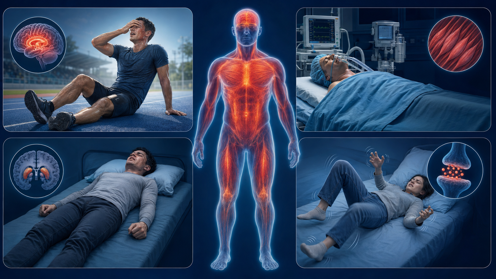
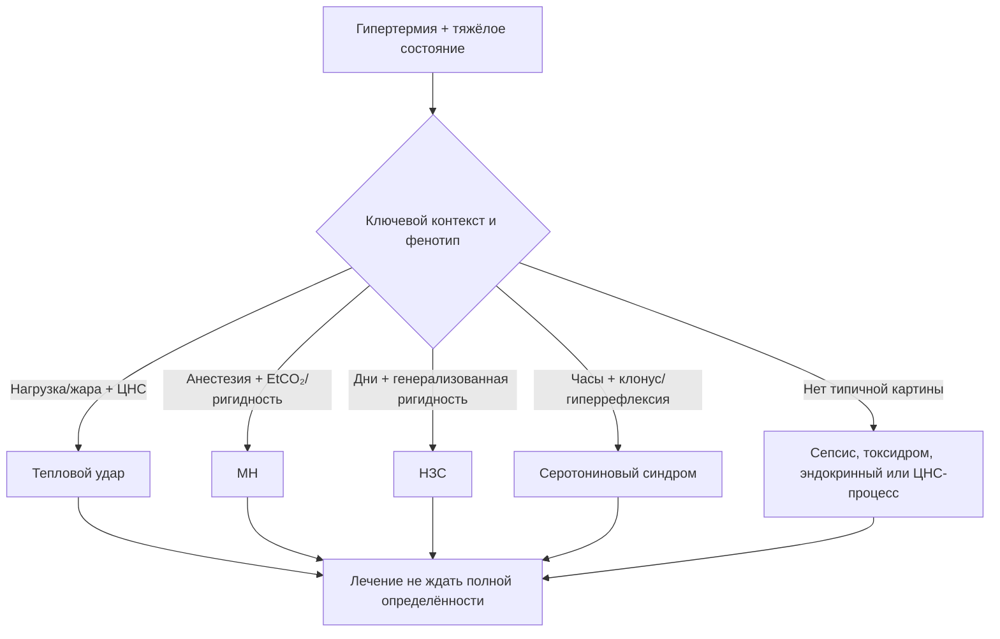
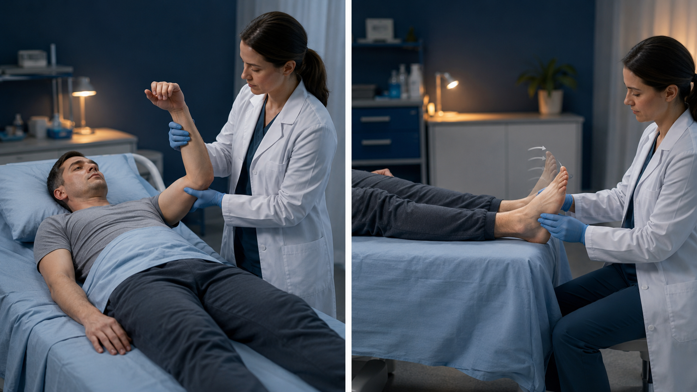

# Глава 7. Дифференциальная диагностика

<!-- visual-summary:start -->

*Рисунок 1. Контекстная подсказка: нагрузка, анестезия, дофаминергический или
серотонинергический триггер. Ни один отдельный признак не заменяет оценку.*

### Схема для запоминания

<!-- visual-summary:end -->
Это, возможно, самая интеллектуально сложная часть темы. Пациент с высокой температурой ядра и нарушенным сознанием — «чёрный ящик», а времени на раздумья нет. Ошибка здесь означает неверный приоритет и упущенное время. Задача — быстро сортировать контекст и признаки, одновременно продолжая безопасную поддержку.

## 7.1. Фундаментальный шаг: гипертермия или лихорадка?

### 7.1.1. Ключевой вопрос: «Сломан ли термостат?»

- **Лихорадка (fever):** термостат не сломан, он *переставлен вверх*. Гипоталамус активно защищает новую установочную точку, например 39,5 °C.
- **Гипертермия (hyperthermia):** термостат в норме (уставка 37 °C) или разрушен, но система перегружена. T_core растёт **вопреки** усилиям гипоталамуса.

### 7.1.2. Почему «проба с антипиретиком» ненадёжна

Антипиретики уменьшают PGE₂-зависимый сдвиг установочной точки при лихорадке,
но клинический ответ зависит от всасывания, времени, дозы, тяжести и причины.
Параллельное физическое охлаждение, инфузия и естественная динамика ещё больше
мешают интерпретации. Поэтому наличие или отсутствие снижения температуры
**не подтверждает и не исключает** механизм.

> [!CAUTION]
> Не назначайте и не ожидайте антипиретик как диагностическую пробу. При
> подозрении на опасную гипертермию немедленно обеспечивают поддержку,
> охлаждение и поиск причины. Ненужные НПВС/парацетамол способны добавить риск
> при почечной, печёночной или гемостатической дисфункции.

### 7.1.3. Сводное сравнение

| Параметр | Лихорадка (fever) | Гипертермия (hyperthermia) |
|---|---|---|
| Установочная точка | Сдвинута вверх | Нормальная или сломана |
| Механизм | Контролируемое повышение | Неконтролируемое повышение |
| Озноб | Есть на подъёме температуры | Отсутствует или патологический тремор |
| Кожа | Вариабельна по фазе и перфузии | Также вариабельна; не определяет механизм |
| Максимальная температура | Обычно < 40–41 °C | Часто > 41 °C |
| Ответ на антипиретики | Возможен, но не диагностичен | Механизм не устраняет |
| Физическое охлаждение | Неприятно пациенту, вызывает дрожь | Жизненно необходимо |

### 7.1.4. Лихорадка инфекционного генеза против ГС

Тяжёлый сепсис — «великий имитатор»: он способен вызвать и лихорадку (через цитокины и PGE₂), и картину, неотличимую от гипертермического синдрома — SIRS, шок, гипоперфузию с бледной мраморной кожей. Это одна из самых частых и сложных дилемм ОРИТ.

**Как отличить сепсис от, например, теплового удара:**

- **Анамнез:** условия среды (жара, нагрузка) против наличия очага инфекции — пневмония, ИМВП, рана, кашель, боль в горле, дизурия, контакт с больными.
- **Прокальцитонин и СРБ:** могут быть высокими при тепловом ударе без инфекции; интерпретируются только вместе с очагом, микробиологией, визуализацией и динамикой.
- **КФК:** выраженное повышение поддерживает мышечное повреждение, но не исключает одновременный сепсис и не различает MH, НЗС и тепловой удар.
- **Ответ на терапию:** полезен для повторной оценки, но слишком запаздывает для первичного решения и не является доказательством одного диагноза.
- **Прочие маркёры:** лейкоцитоз со сдвигом влево, повышение СРБ и СОЭ поддерживают инфекционную версию, но неспецифичны — при ГС они тоже растут.

Дифференциация инфекционной и неинфекционной лихорадки строится на наличии очага, характере маркёров воспаления и ответе на антибиотики; неинфекционная лихорадка встречается при воспалительных, аутоиммунных и онкологических заболеваниях.

---

## 7.2. Кожа и перфузия: как не сделать ложную развилку

Горячая/холодная, сухая/влажная и гиперемированная/мраморная кожа — три
отдельных наблюдения. Они помогают распознать ангидроз, вазодилатацию или шок,
но не создают два синдрома с противоположным лечением.

При бледных или холодных конечностях оценивают капиллярное наполнение,
артериальное давление, лактат, диурез и признаки гипоперфузии. Поддержку
перфузии проводят параллельно с охлаждением. Дротаверин, папаверин, растирание
или предварительное согревание конечностей не входят в стандарт лечения
теплового удара и не должны задерживать эффективное охлаждение.

---

## 7.3. Алгоритм дифференциальной диагностики «большой четвёрки»

Типичная задача: пациент в ОРИТ (не в операционной), T = 41 °C, ригидность, спутанность, «принимает какие-то таблетки». Что это — НЗС или серотониновый синдром?

### 7.3.1. НЗС против серотонинового синдрома

Два частых «мимика», которые важно различать по темпу, лекарственному контексту
и нервно-мышечным признакам. У них нет пары равноценных доказанных
«антидотов»: лечение обоих начинается с отмены триггера и поддержки.

| Признак | Нейролептический злокачественный синдром (НЗС) | Серотониновый синдром (СС) |
|---|---|---|
| **Анамнез** | Приём нейролептиков (галоперидол, хлорпромазин, оланзапин, рисперидон) **или** отмена L-DOPA | Приём серотонинергических препаратов: СИОЗС + ингибитор МАО, СИОЗС + трамадол, + декстрометорфан, + линезолид |
| **Начало** | Медленное: дни–недели | Быстрое: часы, обычно < 24 ч |
| **Мышечный тонус** | «Свинцовая труба»: генерализованная, пластическая, экстремальная ригидность | Миоклонус, тремор; ригидность есть, но в ногах > рук и менее выражена |
| **Рефлексы** | Гипорефлексия или норма | **Гиперрефлексия** (3+/4+), клонус стоп и надколенника |
| **Кожа** | Чаще бледность и мраморность (признак гипоперфузии, не отдельный «тип»); потоотделение лабильное | Чаще гиперемия; профузное потоотделение |
| **Зрачки** | Норма или миоз | **Мидриаз** |
| **ЖКТ** | Замедление моторики, запор, слюнотечение | Гиперактивность: диарея, тошнота, рвота |
| **КФК** | Часто повышена, иногда резко; нормальный ранний результат не исключает НЗС | Может повышаться при тяжёлом течении и мышечной активности |
| **Время разрешения** | Дни–недели | 24–72 часа |
| **Основа лечения** | Отмена триггера и поддержка; препараты/ЭСТ индивидуально | Отмена триггера, бензодиазепины и поддержка; ципрогептадин как возможное дополнение |

> [!TIP]
> **Мнемоника.**
> **НЗС** — пациент **медленный** (days), **сухой** (гипорефлексия, парез кишечника), **«свинцовый»** (ригидность), на **нейролептиках**.
> **СС** — пациент **быстрый** (hours), **мокрый** (пот, диарея), **«дёрганый»** (миоклонус, гиперрефлексия), на **серотониновых** препаратах.

*Рисунок 2. Мнемонический контраст устойчивой ригидности и повторных движений
при клонусе. Точный неврологический осмотр включает рефлексы и распределение.*

### 7.3.2. Дифференциация злокачественной гипертермии

**MH против теплового удара в операционной.**
*Проблема:* в операционной жарко, пациента (особенно ребёнка) могли банально перегреть.
*Ключи:*
- **контекст** — при MH был триггер (севофлуран, десфлуран, изофлуран, сукцинилхолин);
- **капнография** — главный различитель: при MH EtCO₂ **резко растёт** вследствие гиперметаболизма; при перегреве EtCO₂ низкий (гипервентиляция) или нормальный;
- **тонус** — при MH генерализованная ригидность и тризм; при тепловом ударе мышцы, наоборот, дряблые (flaccid).

**MH против НЗС.**
*Проблема:* оба дают ригидность и гипертермию.
*Ключ — контекст и время:* MH возникает только в связи с анестезией и развивается молниеносно (минуты); НЗС — только в связи с нейролептиками и развивается медленно (дни). Во времени эти сценарии практически не пересекаются. Также следует помнить: НЗС может проявиться в послеоперационном периоде, но не во время подачи анестетика.

**MH против прочих форм:** серотониновый синдром требует серотонинергической
экспозиции, а тепловой удар — тепловой нагрузки. При MH типичен необъяснимый
рост EtCO₂, но КФК, калий, температура и миоглобин могут изменяться позже;
отрицательный семейный анамнез восприимчивость не исключает.

### 7.3.3. Тепловой удар против центральной гипертермии

*Проблема:* пациент с ЧМТ лежит в ОРИТ без кондиционера, на третий день жары T = 41 °C. Что это — повреждение гипоталамуса или тепловой удар?

*Ключи:*
- **анамнез:** предшествовала ли тепловая экспозиция подъёму температуры;
- **нейровизуализация:** центральная лихорадка/гипертермия — диагноз исключения
  после острого повреждения ЦНС. Поражение не обязано ограничиваться видимым
  очагом в гипоталамусе; визуализация помогает оценить основное заболевание и
  альтернативы, но не подтверждает механизм сама по себе;
- **лаборатория:** при тепловом ударе присутствует весь спектр полиорганной дисфункции — ДВС, ОПП, рабдомиолиз, печёночная недостаточность; при «чистой» центральной гипертермии органная дисфункция развивается значительно медленнее и вторично;
- **неврологический контекст:** очаговая симптоматика и неврологический анамнез поддерживают центральный генез, их отсутствие — экзогенный.

---

## 7.4. Дифференциация от эндокринных кризов

### 7.4.1. Тиреотоксический криз

*Проблема:* даёт тахикардию, гипертермию, делирий — то есть имитирует любой ГС.

*Ключи:*
- **анамнез:** болезнь Грейвса или узловой токсический зоб, часто — самовольное прекращение приёма тиреостатиков;
- **клиника:** зоб; офтальмопатия (экзофтальм, симптом Грефе, отёк век); мелкоразмашистый постоянный тремор; **фибрилляция предсердий** (очень характерна); тахикардия часто > 140 уд/мин; кожа тёплая, бархатистая, профузный пот; диарея, потеря веса, раздражительность в анамнезе;
- **лаборатория:** ТТГ подавлен (< 0,01 мМЕ/л), свободные Т4 (> 20 мкг/дл) и Т3 (> 200 пг/мл) резко повышены.

**Шкала Burch — Wartofsky (BWPS)** помогает формализовать подозрение, когда
гипертермия, тахикардия и делирий выглядят одинаково при тепловом ударе и
тиреотоксическом кризе. Баллы начисляют по пяти доменам:

| Домен | Диапазон баллов |
|---|---|
| Температура тела | 5 (37,2–37,7 °C) → 30 (≥ 40,0 °C) |
| Дисфункция ЦНС | 10 (умеренное возбуждение) → 20 (делирий, психоз, выраженная заторможенность) → 30 (судороги, кома) |
| ЖКТ и печень | 10 (тошнота, рвота, диарея, боль в животе) → 20 (желтуха) |
| Сердечно-сосудистая система | тахикардия 5 (99–109) → 25 (≥ 140/мин); сердечная недостаточность до 15; фибрилляция предсердий +10 |
| Провоцирующее событие | 0 (нет) → 10 (есть) |

*Интерпретация:* **< 25** — криз маловероятен; **25–44** — «назревающий» криз,
требующий высокой настороженности; **≥ 45** — криз весьма вероятен.

> [!NOTE]
> BWPS — инструмент клинической настороженности, а не лабораторный критерий: шкала
> разрабатывалась на небольшой серии, не валидирована как решающий тест и не
> отменяет оценку гормонов и поиск альтернативных причин. Лечение при высокой
> вероятности криза начинают, не дожидаясь результатов ТТГ и Т4 (§ 9.6.5,
> принцип «блокада 4 в 1»).

### 7.4.2. Феохромоцитома (криз)

*Проблема:* гипертермия, тахикардия, головная боль, профузный пот.

*Ключевой различитель:* **пароксизмальная неконтролируемая артериальная гипертензия** (АД > 220/120 мм рт. ст.). При большинстве других форм ГС — тепловом ударе, НЗС, СС — давление либо нормальное, либо сниженное вследствие шока. Характерна кризовая динамика: периоды нормального давления чередуются с резкими подъёмами.

*Подтверждение (не экстренное):* метанефрины в суточной моче, катехоламины крови; визуализация опухоли надпочечника при КТ, МРТ или УЗИ.

---

## 7.5. Дифференциация от отравлений: токсидромы

Типичная ситуация: пациент на вечеринке принял «что-то» и доставлен с T = 41 °C.

**Симпатомиметический токсидром** (кокаин, амфетамины, метамфетамин, MDMA): высокая температура, психомоторное возбуждение, мидриаз, профузный пот, тахикардия, артериальная гипертензия. Выраженный двусторонний клонус и гиперрефлексия больше поддерживают серотониновый синдром, но смешанные интоксикации и перекрытие признаков возможны.

**Антихолинергический токсидром** (амитриптилин и другие ТЦА, дифенгидрамин, атропин, дурман, белладонна): высокая температура, делирий, мидриаз, **сухая кожа**, задержка мочи, атония кишечника.

> [!TIP]
> **Ключ к дифференциации токсидромов — потоотделение.** Симпатомиметики и серотониновый синдром — пациент «мокрый». Антихолинергики — «сухой».

*Дополнительные инструменты:* токсикологический анамнез (контакт с веществами, приём неизвестных препаратов, отравление растениями), токсикологический скрининг крови и мочи, определение концентраций препаратов. Наличие специфических антидотов (физостигмин при антихолинергическом отравлении, налоксон при опиоидном) делает точную идентификацию токсидрома практически значимой.

---

## 7.6. Дифференциация от сепсиса и септического шока

- **Поиск очага инфекции:** рентгенография органов грудной клетки, анализ и посев мочи, осмотр кожи и ран, посевы крови, при показаниях — люмбальная пункция.
- **Критерии:** qSOFA (изменение психического статуса, систолическое АД ≤ 100 мм рт. ст., ЧДД ≥ 22 в минуту) для быстрого скрининга; SOFA (0–24 балла) — для формальной оценки органной дисфункции по критериям Сепсис-3.
- **Прокальцитонин** не специфичен: при тепловом ударе он может быть очень высоким без бактериальной инфекции.
- **КФК** показывает мышечное повреждение, но не исключает сопутствующую инфекцию и не устанавливает причину.
- **Ответ на терапию** служит ретроспективным подтверждением.

Важно помнить: сепсис и ГС **не исключают друг друга** — тепловой удар с транслокацией кишечной флоры может осложниться истинным сепсисом, а сепсис — спровоцировать срыв терморегуляции.

---

## 7.7. Дифференциация при особых клинических ситуациях

**Лихорадка у младенцев до 3 месяцев.**
*Правило:* любой младенец младше 3 месяцев с T > 38 °C — это сепсис или менингит, пока не доказано обратное.
*Дифференциальный ряд:* серьёзная бактериальная инфекция (ИМВП, пневмония, сепсис, менингит), вирусная инфекция, экзогенная гипертермия от укутывания.
*Тактика:* полный септический скрининг (ОАК, ОАМ, посевы, люмбальная пункция), госпитализация, эмпирическая антибиотикотерапия.

**Лихорадка и сыпь.**
- *менингококцемия* — геморрагическая «звёздчатая» сыпь, T > 40 °C, шок; смертельно опасна и требует немедленной терапии;
- *синдром токсического шока* (стафилококковый, стрептококковый) — T > 39 °C, гипотензия, диффузная эритема по типу «солнечного ожога» с последующим шелушением;
- *вирусные экзантемы* — корь, краснуха, ветряная оспа;
- *лекарственная лихорадка и аллергические реакции*, включая синдром Стивенса — Джонсона.

**Лихорадка, боль в животе и рвота:** острая хирургическая патология (аппендицит, холецистит, перфорация, перитонит), кишечные инфекции, панкреатит, диабетический кетоацидоз (чаще с нормальной или низкой температурой), нижнедолевая пневмония с иррадиацией боли в живот.

**Лихорадка и головная боль или боль в шее:** бактериальный менингит (требуется немедленная люмбальная пункция), энцефалит, субарахноидальное кровоизлияние («самая сильная головная боль в жизни», менингеальные знаки, T может превышать 39 °C за счёт центрального механизма — КТ головы обязательна), солнечный удар при соответствующем анамнезе.

**Лихорадка и боли в суставах:** септический артрит, ревматические заболевания, вирусные инфекции.

**Периодическая лихорадка:** синдром PFAPA, наследственные периодические лихорадки — семейная средиземноморская лихорадка, синдром гипер-IgD. Как правило, это не предмет экстренной дифференциальной диагностики с ГС.

---

## 7.8. Диагностические критерии и шкалы

### 7.8.1. Критерии НЗС

**DSM-5:** воздействие нейролептика + гипертермия (> 38,5 °C) + мышечная ригидность + три и более признака из следующих: потоотделение или слюнотечение, тремор, недержание мочи, изменение сознания, тахикардия, аномальное или лабильное АД, тахипноэ, повышение КФК.

**Шкала Levenson:** большие критерии (все три) — гипертермия, «свинцовая» ригидность, рост КФК; малые критерии — тахикардия, лабильность АД, изменение сознания, тахипноэ, лейкоцитоз. Обязательное условие — анамнез приёма нейролептиков.

### 7.8.2. Критерии Hunter для серотонинового синдрома

*Обязательное условие:* приём серотонинергического препарата.
*Диагноз ставится при наличии одного из следующих:*
- спонтанный клонус;
- индуцируемый клонус + возбуждение или потоотделение (в ряде формулировок — или диарея);
- окулярный клонус + возбуждение или потоотделение;
- тремор + гиперрефлексия;
- гипертонус + температура > 38 °C (в части источников — > 38,5 °C) + индуцируемый или окулярный клонус.

### 7.8.3. Клинические стандарты для злокачественной гипертермии

**Шкала клинической градации MHAUS (Clinical Grading Scale):** баллы начисляются за 12 признаков — генерализованная ригидность, рост EtCO₂ (наиболее весомый признак), тахикардия, температура > 38,8 °C, ацидоз, гиперкалиемия, рост КФК, миоглобинурия, семейный анамнез и др. Сумма баллов свыше 50 соответствует оценке «MH почти несомненна».

Клинически диагноз опирается на триаду (гипертермия, тахикардия, ригидность) в сочетании с гиперкапнией, миоглобинурией, ростом КФК и гиперкалиемией на фоне применения триггерных препаратов.

---

## 7.9. Лабораторные маркёры: сводка

| Находка | Наиболее вероятный диагноз |
|---|---|
| Экстремально высокая КФК (> 50 000 Ед/л) | MH, НЗС, рабдомиолиз (тепловой удар при нагрузке, судорожный статус) |
| Высокий прокальцитонин | Неспецифичен: оценить инфекцию и тяжесть в контексте |
| Высокий EtCO₂ + ацидоз в операционной | MH |
| Подавленный ТТГ + высокий свободный Т4 | Тиреотоксический криз |
| Миоклонус + гиперрефлексия (клинически) | Серотониновый синдром |
| Сухая кожа + мидриаз + задержка мочи | Антихолинергический синдром |
| Положительный токсикологический скрининг | Отравление стимуляторами |
| Очаговая неврология + соответствующий очаг на КТ/МРТ после исключения иных причин | Центральная гипертермия возможна |

---

## 7.10. Сводная матрица «большой четвёрки»

Таблица собирает разобранные выше признаки в один экран. Она предназначена для
быстрой ориентации и **не заменяет** оценку контекста: отдельные строки
перекрываются, а смешанные картины (например, серотонинергический препарат плюс
нейролептик, или нагрузка в жару на фоне психотропной терапии) встречаются
регулярно.

| Признак | Тепловой удар | Злокачественная гипертермия | НЗС | Серотониновый синдром |
|---|---|---|---|---|
| **Триггер** | жара, влажность, физическая нагрузка | галогенсодержащие анестетики, сукцинилхолин | антипсихотики; резкая отмена дофаминергических средств | серотонинергические препараты и их комбинации (СИОЗС, ИМАО, трамадол, линезолид, MDMA) |
| **Темп** | минуты–часы (EHS) или часы–дни (классический) | минуты–часы от контакта с триггером | дни–недели | часы, обычно < 24 ч |
| **Мышечный тонус** | обычно дряблые мышцы; при EHS возможны судороги | генерализованная «деревянная» ригидность, тризм | «свинцовая труба» — пластическая генерализованная ригидность | клонус, миоклонус, умеренная ригидность с преобладанием в ногах |
| **Рефлексы** | норма или снижены | норма или снижены | **гипорефлексия** или норма | **гиперрефлексия**, клонус стоп и надколенника |
| **Зрачки** | обычно норма | норма | норма или миоз | **мидриаз** |
| **Установочная точка** | нормальная — во всех четырёх случаях механизм непирогенный | | | |
| **Антипиретики** | механизм не устраняют; не показаны — во всех четырёх случаях | | | |
| **Основа лечения** | немедленное эффективное охлаждение (при EHS — погружение в холодную воду), поддержка органов | прекращение триггера, 100 % O₂, **дантролен 2,5 мг/кг с повторами** | отмена триггера, интенсивная поддержка, охлаждение | отмена триггеров, бензодиазепины, охлаждение, контроль мышечной активности |
| **Дополнительная фармакотерапия** | специфического препарата нет | дантролен — единственная доказанная специфическая терапия среди всех четырёх | бромокриптин, амантадин, ЭСТ — индивидуально; дантролен рутинно **не** рекомендуется (§ 4.2.1) | ципрогептадин — энтеральное дополнение с ограниченной доказательной базой |

> [!CAUTION]
> Строку «дополнительная фармакотерапия» часто ошибочно читают как список
> антидотов. Доказанным специфическим препаратом располагает только MH. При НЗС и
> серотониновом синдроме исход определяют отмена триггера, поддержка и контроль
> мышечной активности; ципрогептадин, бромокриптин и амантадин их не заменяют.

**О триптанах.** Их регулярно включают в перечни серотонинергических триггеров.
Совместное применение триптанов с СИОЗС/СИОЗСН действительно требует осведомлённости,
однако клинически значимая серотониновая токсичность в этой комбинации встречается
крайне редко и её причинная связь именно с триптаном оспаривается; польза адекватного
лечения мигрени и депрессии, как правило, перевешивает этот риск. Триптан в анамнезе
не должен становиться главным аргументом в пользу диагноза серотонинового синдрома
при наличии более вероятного триггера.

---

## Выводы по главе 7

**Дифференциальный диагноз — это действие,** а не академическое размышление: быстрый алгоритм, запускаемый параллельно с реанимационными мероприятиями.

**Антипиретики не являются диагностическим тестом.** Механизм определяют по контексту, температуре ядра, функции ЦНС, нервно-мышечному фенотипу и данным обследования.

**НЗС против СС** различаются по типичному темпу, тонусу и рефлексам (устойчивая ригидность против клонуса/гиперрефлексии), лекарственному контексту и ЖКТ-проявлениям; отдельные признаки перекрываются.

**Контекст решает всё:**
- операционная + триггер + рост CO₂ = **MH**;
- жара или нагрузка + условия среды = **тепловой удар**;
- очаг инфекции + органная дисфункция + микробиологические/визуализационные данные = **сепсис**;
- нейролептики + медленное развитие + ригидность = **НЗС**;
- СИОЗС или ИМАО + быстрое развитие + миоклонус = **серотониновый синдром**;
- зоб + экзофтальм + подавленный ТТГ = **тиреотоксический криз**;
- сухая кожа + мидриаз + задержка мочи = **антихолинергический синдром**;
- очаг в гипоталамусе на КТ/МРТ при отсутствии иных причин = **центральная гипертермия**.

**Переход.** Мы диагностировали и дифференцировали состояние. Но пока это делалось, патофизиологический каскад уже нанёс удар по органам. Прежде чем перейти к лечению, необходимо оценить масштаб ущерба.

<!-- chapter-nav:start -->

---

[← Предыдущая глава](06-diagnostika.md) · [Оглавление](../README.md#оглавление) · [Следующая глава →](08-oslozhneniya.md)

<!-- chapter-nav:end -->
