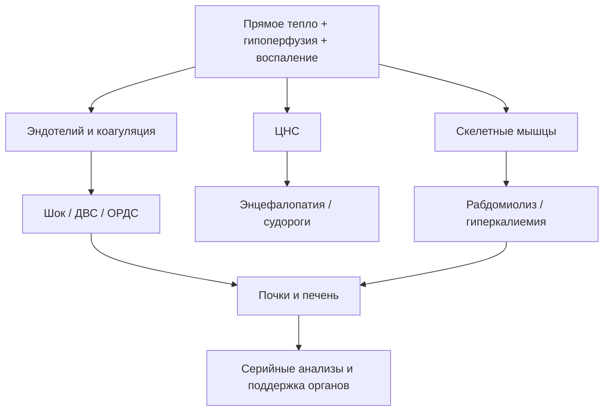

# Глава 8. Осложнения гипертермического синдрома

<!-- visual-summary:start -->

### Схема для запоминания

<!-- visual-summary:end -->
Гипертермический синдром — «быстрый» убийца. Эта глава посвящена оценке ущерба.
При T_core около 41 °C и выше риск неврологических, почечных, печёночных,
коагуляционных и кардиореспираторных осложнений резко возрастает — особенно при
длительном воздействии, шоке, судорогах и рабдомиолизе. Но перечисленные ниже
осложнения не являются неизбежными у каждого пациента: их нужно активно и
повторно **искать**, а не считать состоявшимися. Задача врача в ОРИТ — не только
«сбить температуру», но и вести серийный контроль по всему этому списку.

По сути, осложнения ГС — это клиническое проявление полиорганной недостаточности, вызванной прямым термическим повреждением, системным воспалением (SIRS), шоком и ДВС-синдромом.

## 8.1. Неврологические осложнения — орган-мишень № 1

Мозг наиболее чувствителен к гипертермии, отёку и гипоксии.

### 8.1.1. Судорожный синдром

**Механизм.** Судороги при ГС — следствие энцефалопатии. Причины: прямое термическое раздражение нейронов; отёк мозга с повышением ВЧД; электролитные нарушения (гипонатриемия, гипокальциемия); гипоксия; микротромбозы при ДВС; истощение ГАМК-ергического торможения при усилении глутаматергического возбуждения.

**Формы:**
- **Фебрильные судороги у детей.** Возникают у части детей примерно от
  6 месяцев до 5 лет. Простые — генерализованные, менее 15 минут и без повтора
  в течение 24 часов. Высокая цифра температуры сама по себе не переводит
  приступ в «сложный»; очаговость, длительность, повторение и неполное
  восстановление требуют срочной оценки.
  **Определённого температурного порога фебрильных судорог не существует** —
  приступ возможен при любой лихорадке, и представление о «критической цифре»
  ошибочно.
  Отдельный вопрос — профилактика жаропонижающими, и здесь данные расходятся.
  Плацебо-контролируемые исследования (ибупрофен, van Stuijvenberg 1998;
  Strengell 2009) **не показали** снижения частоты повторных фебрильных судорог
  при последующих эпизодах лихорадки. Позднее рандомизированное исследование
  ректального парацетамола (Murata et al., *Pediatrics* 2018) обнаружило меньшую
  частоту рецидива **в пределах того же лихорадочного эпизода** (9,1 % против
  23,5 %), однако систематические обзоры считают вопрос нерешённым.
  Практический вывод: назначать антипиретик **исключительно** ради профилактики
  судорог не следует, но применять его для комфорта ребёнка правомерно.
- **Генерализованные тонико-клонические судороги (Grand Mal):** потеря сознания, тоническая фаза, затем клоническая, прикус языка, непроизвольное мочеиспускание.
- **Эпилептический статус:** судороги длительностью более 5 минут либо серия приступов без восстановления сознания между ними.

> **Порочный круг:** гипертермия повышает риск судорог, а продолжающаяся
> мышечная активность увеличивает теплопродукцию и ацидоз.
> **Тактика:** продолжающийся приступ немедленно лечат по алгоритму
> эпилептического статуса, начиная с бензодиазепина.

### 8.1.2. Отёк головного мозга

**Механизмы:**
- *цитотоксический отёк* — энергетическая недостаточность нарушает работу
  Na⁺/K⁺-АТФазы, и вода накапливается внутри клеток;
- *вазогенный отёк* — повышение проницаемости гематоэнцефалического барьера
  приводит к выходу жидкости и белка в интерстиций;
- *интерстициальный отёк* как дополнительный компонент.

**Клинические проявления:** повышение внутричерепного давления — головная боль, рвота «фонтаном», отёк дисков зрительных нервов при офтальмоскопии; прогрессирующее угнетение сознания вплоть до комы; ухудшение мозгового кровотока и вторичная ишемия.

**Дислокационный синдром** — терминальное осложнение: отёчный мозг вклинивается в естественные отверстия черепа (вырезку намёта мозжечка, большое затылочное отверстие). Клинически: анизокория, брадикардия, арефлексия, нарушение и затем остановка дыхания. Исход — смерть.

### 8.1.3. Энцефалопатия

Дисфункция ЦНС — определяющий признак **теплового удара** и ключевой маркёр
тяжести опасной гипертермии в целом. Она складывается из прямого термического
повреждения, отёка и судорожной активности. Спектр нарушений сознания
простирается от лёгкой спутанности и делирия до сопора и глубокой комы (GCS = 3).
**Уровень угнетения сознания — прямой маркёр тяжести повреждения ЦНС.**
Проявления включают дезориентацию, нарушения памяти, внимания, координации, речи.

Однако для всех причин ГС энцефалопатия не обязательна в каждый момент времени:
при MH пациент обычно находится под анестезией, при раннем лекарственном
токсидроме сознание может быть ещё сохранено, а у седированного пациента ОРИТ
оценка попросту недоступна. Поэтому отсутствие явной энцефалопатии не должно
задерживать лечение при опасном контексте, гипертермии, гиперкапнии, ригидности,
клонусе, шоке или лабораторных признаках органного повреждения.

### 8.1.4. Необратимые поражения ЦНС у выживших

- **Мозжечковая атаксия — самое частое отдалённое последствие.** Клетки Пуркинье чрезвычайно чувствительны к гипертермии; пациент выживает, но остаётся «пьяная» походка, нарушение координации, нистагм.
- **Дизартрия** — стойкое нарушение речи.
- **Парезы и параличи** — реже, вследствие ишемических микроинсультов.
- **Когнитивные нарушения:** снижение памяти и внимания, «туман в голове», изменения личности, эмоциональная лабильность.
- **В тяжёлых случаях** — вегетативное состояние, апаллический синдром (декортикация), симптоматическая эпилепсия.

---

## 8.2. Кардиоваскулярные осложнения

Сердце работает в режиме «форсаж», одновременно пытаясь прокачать кровь через расширенный кожный «радиатор», компенсировать гиповолемию и функционировать в «токсичном бульоне» ацидоза, гиперкалиемии и цитокинов.

### 8.2.1. Аритмии

**Причины:**
- **гиперкалиемия вследствие рабдомиолиза — причина № 1 фатальных желудочковых аритмий**; также гипокалиемия и гипокальциемия;
- прямое термическое повреждение с нарушением работы ионных каналов кардиомиоцитов;
- ишемия миокарда на фоне шока или коронарного микротромбоза при ДВС;
- избыточная симпатическая стимуляция.

**Типы:** синусовая тахикардия (практически всегда); фибрилляция предсердий (часто, особенно при тиреотоксическом кризе), способная привести к тромбоэмболии; желудочковая экстрасистолия, желудочковая тахикардия, фибрилляция желудочков с исходом в клиническую смерть.

### 8.2.2. Острая сердечная недостаточность

**Систолическая дисфункция.** Механизм — «оглушение» миокарда (myocardial stunning): токсическое (гипертермия, цитокины) и ишемическое повреждение снижает сократимость левого желудочка, падает фракция выброса. Результат — кардиогенный шок или отёк лёгких с застоем в малом круге.

**Парадокс ОСН с высоким сердечным выбросом.** В ранней гипердинамической фазе, особенно при «красной» гипертермии, сердце качает очень много крови, но АД всё равно низкое из-за катастрофической периферической вазодилатации. Это дистрибутивный шок, и попытка «поднять давление» инотропами без волемической нагрузки здесь неэффективна.

### 8.2.3. Шок

При ГС шок носит **смешанный характер**:
- *гиповолемический* — потери с потом, рвотой, диареей;
- *дистрибутивный* — вазодилатация и синдром утечки;
- *кардиогенный* — прямое повреждение миокарда.

Клинически — гемодинамическая нестабильность, колебания АД и ЧСС, рефрактерная гипотензия, ишемия органов, прогрессирование ПОН.

---

## 8.3. Почечные осложнения — орган-мишень № 2

Почки принимают «тройной удар».

### 8.3.1. Острое повреждение почек (ОПП)

**Преренальное ОПП.** Гипоперфузия из-за гиповолемии, шока и централизации кровообращения; резко падает СКФ, развивается олигурия. Носит функциональный характер и потенциально обратимо при своевременном восстановлении перфузии.

**Ренальное ОПП (острый тубулярный некроз).** Три механизма: длительная ишемия с гибелью клеток канальцев; прямое термическое цитотоксическое повреждение эпителия; миоглобинурическое поражение (см. ниже). Возможен и гемоглобинурийный вариант при гемолизе.

**Внутриканальцевая обструкция** миоглобиновыми цилиндрами и кристаллами — это
часть ренального (внутрипочечного) механизма. Постренальным ОПП называют
нарушение оттока мочи ниже почки (мочеточник, мочевой пузырь, уретра); при
рабдомиолизе оно не возникает и в этом контексте термин неприменим.

### 8.3.2. Рабдомиолиз — ключевое осложнение

Массивное разрушение мышечной ткани при MH, НЗС и тепловом ударе при нагрузке. При MH и НЗС это сама суть болезни (непрерывная ригидность), при тепловом ударе — прямое термическое и ишемическое повреждение мышц.

**Что выходит в кровь из разрушенных миоцитов:** миоглобин, калий (гиперкалиемия), КФК (диагностический маркёр), фосфаты, мочевая кислота, актин и миозин, ЛДГ.

**Механизм повреждения почек:**
1. миоглобин фильтруется в клубочках и попадает в канальцы;
2. **в кислой среде — а у пациента метаболический ацидоз — миоглобин преципитирует** и забивает просвет канальцев, «как грязь трубу»;
3. параллельно он оказывает прямое токсическое действие на эпителий канальцев;
4. развивается острый тубулярный некроз, быстро прогрессирующий до анурии и требующий гемодиализа.

**Клинические маркёры:** тёмно-бурая моча цвета «кока-колы», экстремально высокая КФК (нередко > 100 000 Ед/л), гиперкалиемия, гипокальциемия, гиперфосфатемия.

**Практический ориентир нефропротекции.** Эта цепочка обосновывает раннюю оценку
объёмного статуса и **титрованное введение изотонического кристаллоида** (0,9 %
NaCl или сбалансированный раствор). Распространённый целевой ориентир — темп
диуреза около **1–2 мл/кг/ч** до снижения КФК и разрешения пигментурии.

Важные оговорки, без которых ориентир становится опасным:

- это **цель, достигаемая титрованием**, а не предписание вводить фиксированный
  большой объём: скорость и суммарный объём подбирают по гемодинамике,
  электролитам, сердечной и почечной функции и признакам перегрузки;
- у пожилых пациентов, при ХСН и уже развившейся олигурической ОПП стремление
  «додавить» диурез объёмом приводит к отёку лёгких;
- **рутинное ощелачивание мочи, маннитол и петлевые диуретики не показали
  доказанной пользы** для профилактики ОПП и могут навредить; их применяют только
  при отдельных самостоятельных показаниях (например, диуретики — для лечения
  подтверждённой перегрузки объёмом, а не для «вымывания» миоглобина).

---

## 8.4. Респираторные осложнения — орган-мишень № 3

**Острая дыхательная недостаточность:** гипоксемия (PaO₂ < 80 мм рт. ст.) и гиперкапния (PaCO₂ > 45 мм рт. ст.) — при MH за счёт гиперпродукции CO₂, при коме за счёт гиповентиляции.

**Отёк лёгких** бывает кардиогенным (следствие ОСН и застоя в малом круге) и некардиогенным (следствие «дырявых» капилляров).

**ОРДС.** Воспалительно-эндотелиальное повреждение повышает проницаемость
альвеолярно-капиллярного барьера, вызывает некардиогенный отёк и нарушает
газообмен. Дополнительный вклад вносят микроциркуляторные нарушения.

*Клиника:* острая гипоксемия, двусторонние затемнения, не полностью объяснимые
сердечной недостаточностью/перегрузкой, и снижение растяжимости лёгких.
Отношение PaO₂/FiO₂ интерпретируют вместе с уровнем PEEP по действующим
критериям. Тяжёлые формы требуют протективной ИВЛ; прогноз зависит от тяжести
ОРДС и основного заболевания.

---

## 8.5. Гематологические осложнения

### 8.5.1. ДВС-синдром

Классическое осложнение теплового удара, сепсиса и тяжёлого рабдомиолиза.

**Патофизиология — триада Вирхова:** повреждение эндотелия (термическое и цитокиновое) с активацией свёртывания; стаз крови при шоке; гиперкоагуляция вследствие массивного выброса DAMPs и тканевого фактора.

**Фаза 1 — микротромбозы.** По всему организму — в почках, лёгких, мозге, печени — образуются тысячи микротромбов, усугубляющих ПОН за счёт ишемии.

**Фаза 2 — коагулопатия потребления.** Тромбоциты и факторы свёртывания, прежде всего фибриноген, израсходованы на тромбообразование; параллельно активируется фибринолиз. Кровь теряет способность сворачиваться, начинаются фатальные кровотечения: желудочно-кишечные, из мест инъекций и послеоперационной раны, из слизистых, петехии и экхимозы, геморрагический инсульт.

**Лабораторная картина:** тромбоцитопения, снижение фибриногена, удлинение АЧТВ и ПВ/МНО, резкий рост D-димера и ПДФ.

### 8.5.2. Тромбоцитопения

Обусловлена потреблением тромбоцитов в ходе ДВС. Снижение тромбоцитов ниже 150 000/мкл в динамике — грозный ранний признак развивающегося ДВС, требующий немедленного внимания даже при отсутствии клинической кровоточивости.

---

## 8.6. Печёночные осложнения

Печень — «горячий цех» метаболизма, страдающий одновременно от гипоперфузии при шоке и от прямого термического некроза гепатоцитов.

**Дисфункция печени.** Маркёры: резкий «взлёт» АСТ и АЛТ — нередко до 10 000–20 000 Ед/л и выше, что отражает массивный цитолиз; рост билирубина; снижение синтеза альбумина; диспротеинемия.

**Острая печёночная недостаточность:**
- *желтуха* вследствие роста билирубина;
- *гипогликемия* — печень не способна синтезировать глюкозу;
- *коагулопатия* — не синтезируются новые факторы свёртывания, что усугубляет ДВС;
- *печёночная энцефалопатия* из-за накопления аммиака, наслаивающаяся на термическую энцефалопатию;
- *асцит*, нарушение детоксикации.

В крайних случаях обсуждается вопрос о трансплантации печени.

---

## 8.7. Метаболические нарушения

**Дегидратация и гиповолемия.** Потери с потом и дыханием, рвота, диарея и
перераспределение жидкости могут снизить перфузию и способствовать
преренальному ОПП.

**Электролитные расстройства:**
- **гиперкалиемия** — самое опасное нарушение (рабдомиолиз, ОПП);
- гипокалиемия — потери с потом и рвотой на ранних этапах;
- гипернатриемия (потеря воды преобладает над потерей соли) или гипонатриемия (при восполнении потерь чистой водой);
- гипокальциемия — связывание кальция с фосфатами при рабдомиолизе.

**Метаболический ацидоз:** лактат-ацидоз из-за гипоперфузии и гиперметаболизма; кетоацидоз при истощении гликогена; почечный компонент — ОПП не позволяет выводить H⁺ и регенерировать бикарбонат. Итог — падение pH ниже 7,35 и HCO₃⁻ ниже 22 мЭкв/л с угнетением функции ферментов, сердца, мозга и почек.

---

## 8.8. Полиорганная недостаточность

**СПОН (MODS)** — финальный общий путь для всех тяжёлых форм ГС. Это не отдельное осложнение, а **сумма** всех перечисленных выше.

*Взаимосвязь:* воспаление, шок, коагулопатия и рабдомиолиз могут одновременно
повреждать лёгкие, почки, печень и ЦНС; это отражено в схеме в начале главы.

*Критерий:* дисфункция двух и более систем органов.

*Особенность течения:* при тепловом ударе и MH органные нарушения могут
развиваться быстро, а часть повреждения печени, почек и коагуляции проявляется
отсроченно. Поэтому раннее улучшение температуры не завершает наблюдение.

*Прогноз:* СПОН резко ухудшает исход; риск зависит от причины, тяжести и длительности дисфункций, возраста и резерва. Универсальная прибавка летальности на каждый орган для всех популяций не установлена.

---

## 8.9. Летальный исход

**Причины смерти в остром периоде (первые часы):**
- фатальная аритмия вследствие гиперкалиемии и ишемии;
- отёк мозга с дислокацией и вклинением;
- рефрактерный шок — кардиогенный, дистрибутивный или смешанный.

**Причины смерти в отсроченном периоде (дни–недели):**
- необратимая полиорганная недостаточность;
- ДВС-синдром — фатальное кровотечение либо распространённый тромбоз;
- вторичные инфекции: нозокомиальная пневмония, сепсис на фоне бактериальной транслокации из «дырявого» кишечника;
- острая печёночная недостаточность.

**Факторы, определяющие летальность:**
- **максимальная достигнутая температура** — выше 42 °C крайне неблагоприятно;
- **длительность гипертермии** — чем дольше сохраняется высокая температура,
  тем больше тепловая доза; универсального временного порога необратимости нет;
- **время до эффективного охлаждения** — задержка увеличивает тепловую дозу и риск осложнений, но единый процент на каждый час неприменим ко всем формам;
- наличие осложнений — ДВС, рабдомиолиз, ОРДС;
- возраст — дети младше 3 месяцев и пациенты старше 65 лет;
- преморбидный фон и сопутствующие заболевания.

## Выводы по главе 8

**ГС — это системное отравление.** Гипертермия выше 41 °C представляет собой универсальный цитотоксический яд, запускающий каскад, идентичный тяжелейшему сепсису или политравме.

**Ключевые осложнения = мишени терапии.** «Большая четвёрка», требующая немедленного вмешательства:
- **неврологические** — отёк мозга и судороги;
- **почечные** — рабдомиолиз и ОПП (требуют оценки перфузии, осторожной инфузии и серийного контроля; не рутинного форсированного диуреза);
- **гематологические** — ДВС-синдром (требует коррекции коагулопатии);
- **кардиореспираторные** — шок и ОРДС (требуют гемодинамической и респираторной поддержки).

**Гиперкалиемия — «тихий убийца».** При рабдомиолизе на фоне MH, НЗС и теплового удара при нагрузке она способна убить пациента раньше самой температуры, поэтому ЭКГ-мониторинг и контроль калия обязательны с первых минут.

**Отсроченные последствия существуют.** Даже у выживших мозжечковая атаксия, когнитивные нарушения и хроническая болезнь почек могут остаться на всю жизнь — что делает скорость охлаждения вопросом не только выживания, но и качества жизни.

**Переход.** Мы знаем, почему возникает ГС, как он развивается, что мы видим, как отличить одну форму от другой и чего боимся. Настало время главного вопроса: как спасать этого пациента.

<!-- chapter-nav:start -->

---

[← Предыдущая глава](07-differencialnaya-diagnostika.md) · [Оглавление](../README.md#оглавление) · [Следующая глава →](09-neotlozhnaya-pomoshch-i-lechenie.md)

<!-- chapter-nav:end -->
