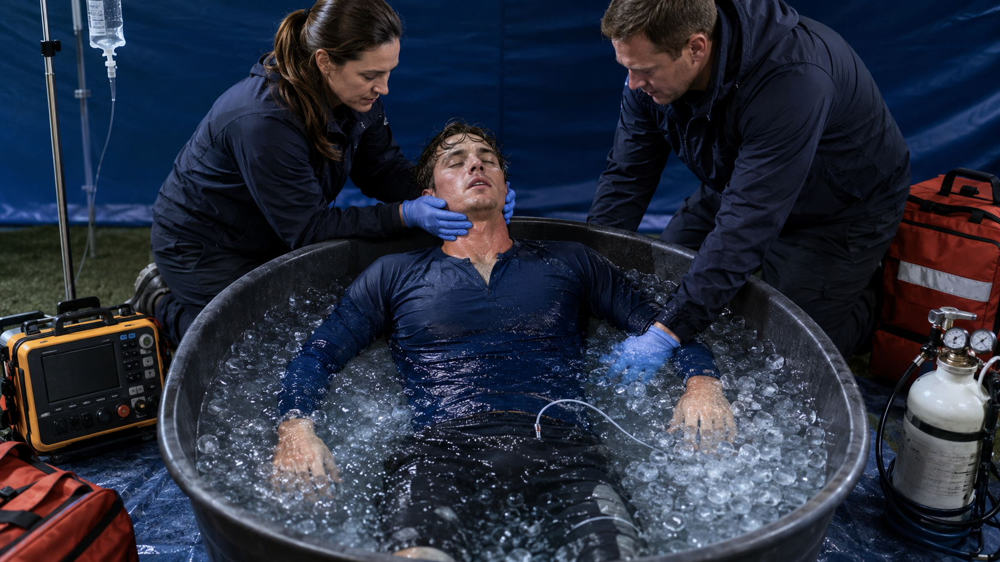
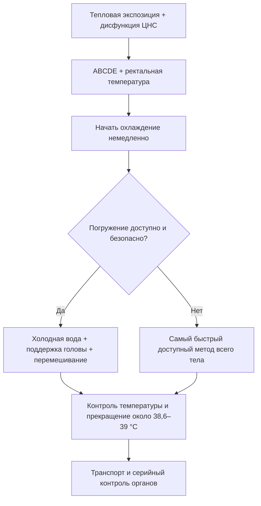
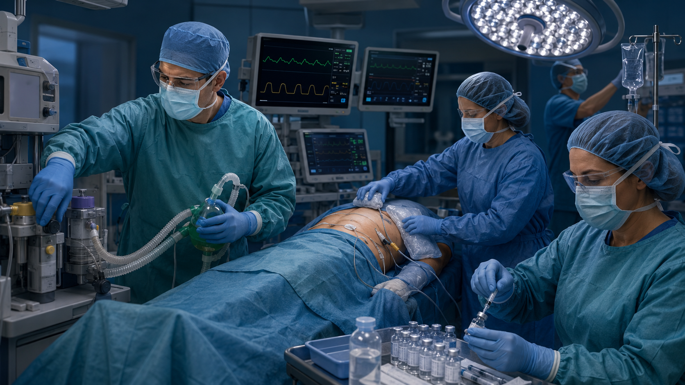

# Глава 9. Неотложная помощь и лечение

<!-- visual-summary:start -->


*Рисунок 1. При тепловом ударе на нагрузке погружение в холодную воду — наиболее
быстрый полевой метод при сохранённом доступе к дыхательным путям и мониторингу.*

### Схема для запоминания



> [!IMPORTANT]
> Мраморность или холодные конечности требуют оценки шока и перфузии, но не
> являются основанием откладывать эффективное охлаждение при тепловом ударе.
<!-- visual-summary:end -->
Тяжёлая гипертермия — неотложное состояние: исход во многом определяется
продолжительностью тепловой нагрузки и скоростью начала эффективного охлаждения.
Однако единого температурного порога необратимости и универсального прироста
летальности «за каждый час» не существует. Действовать нужно немедленно, не
дожидаясь полной лабораторной верификации причины.

**Терапия ГС стоит на трёх китах, которые выполняются ОДНОВРЕМЕННО, а не последовательно:**

1. **поддержка витальных функций** (ABCDE);
2. **немедленное агрессивное охлаждение**;
3. **этиологическая терапия** — устранение причины и, когда существует
   доказанная специфическая терапия, её раннее применение.

---

## 9.1. Общие принципы: алгоритм ABCDE

**A (Airway) — дыхательные пути.**
*Оценка:* проходимы ли? Нет ли рвотных масс, прикуса языка после судорог, тризма при MH?
*Действие:* интубация показана при невозможности защитить дыхательные пути,
недостаточной вентиляции/оксигенации, рефрактерных судорогах или необходимости
контролируемой нейромышечной блокады. Решение не принимают автоматически по
одной оценке GCS.

**B (Breathing) — дыхание.**
*Оценка:* тахипноэ, гипоксемия, влажные хрипы (ОРДС).
*Действие:* кислород и вентиляцию титруют по оксигенации, газам крови и
сопутствующему поражению лёгких. При MH используют высокий поток 100 % O₂ и
увеличивают минутную вентиляцию для контроля резко повышенного CO₂. Рутинная
гипервентиляция остальных пациентов не лечит метаболический ацидоз и может
ухудшить мозговой кровоток.

**C (Circulation) — кровообращение.**
*Оценка:* тахикардия, гипотензия, признаки шока.
*Действие:* немедленный венозный доступ — 2–3 периферических катетера большого диаметра (G14–G16) либо центральный венозный катетер; инфузионная терапия; при рефрактерной гипотензии — вазопрессоры. Непрерывный мониторинг ЭКГ (критически важен из-за риска гиперкалиемии) и инвазивный мониторинг АД при шоке.
*Целевые показатели:* систолическое АД > 90 мм рт. ст., среднее АД > 65 мм рт. ст., диурез > 0,5 мл/кг/ч.

**D (Disability) — неврологический статус.**
*Оценка:* уровень сознания по GCS, зрачки, мышечный тонус, судороги.
*Действие:* немедленное купирование судорог — диазепам 0,1–0,2 мг/кг внутривенно (до 10 мг) или лоразепам 0,05–0,1 мг/кг (до 4 мг), при необходимости повторно через 5–10 минут.

**E (Exposure / Environment) — осмотр и устранение причины.**
1. полностью **раздеть** пациента;
2. немедленно измерить **T_core ректально**;
3. оценить цвет, влажность, перфузию и признаки шока;
4. **немедленно устранить причину:**
   - *тепловой удар* — эвакуация из жаркой среды: вынести с солнца, из машины, остановить забег;
   - *MH* — прекратить подачу **всех** ингаляционных анестетиков, продуть контур 100 % кислородом, по возможности прервать или свернуть операцию;
   - *НЗС, серотониновый синдром, антихолинергический синдром* — отменить все подозреваемые препараты;
   - *судороги* — купировать немедленно, поскольку они сами являются мощным источником тепла.

### Показания к неотложной помощи

**Поводы немедленно начать помощь и экстренную оценку:**
- тепловая экспозиция с изменением сознания — независимо от того, успела ли
  измеренная температура превысить 40 °C;
- высокая температура с признаками гипоперфузии или шока;
- высокая температура с судорогами;
- ректальная температура 38,0 °C и выше у младенца младше 3 месяцев требует
  срочной медицинской оценки по отдельному педиатрическому алгоритму;
- любое подозрение на MH, НЗС или серотониновый синдром;
- любые признаки органной дисфункции.

---

## 9.2. Физическое охлаждение

Камень преткновения всей терапии. Цель — как можно быстрее уменьшить тепловую
дозу и не допустить переохлаждения. В обзорах скорость не менее 0,15 °C/мин
часто используют как ориентир адекватного метода при тепловом ударе на нагрузке,
но реальная эффективность зависит от пациента, условий и техники.

**Общие мероприятия:** раздеть пациента, переместить в прохладное помещение, включить кондиционер, обеспечить движение воздуха.

> [!CAUTION]
> Цвет кожи не является противопоказанием к охлаждению при тепловом ударе.
> При шоке одновременно поддерживают перфузию и выбирают метод, сохраняющий
> доступ к дыхательным путям и реанимации.

### 9.2.1. Наружное охлаждение

**Эвапоративное охлаждение (испарение) — метод выбора в большинстве ситуаций.**
*Методика «опрыскивание + обдувание»:* тело опрыскивают водой комнатной температуры (20–25 °C) из пульверизатора или накрывают влажной простынёй; направляют на пациента мощный вентилятор.
*Почему работает:* испаряясь, вода забирает огромное количество тепла (скрытая теплота парообразования), а вентилятор сдувает влажный пограничный слой воздуха, ускоряя испарение.
*Температура воды:* для испарительного метода используют мелкодисперсное
смачивание и мощный поток воздуха. Ледяная вода здесь не нужна, но это не
означает, что холодная вода «запирает тепло»: погружение в холодную воду остаётся
самым быстрым методом для теплового удара на нагрузке.
*Эффективность:* около 0,05–0,1 °C в минуту — ниже, чем при погружении, но метод переносится лучше и не мешает реанимационным мероприятиям.

**Применение холода (кондукция).**
*Методика:* пузыри со льдом на проекции магистральных сосудов, где они лежат близко к коже: подмышечные впадины (a. axillaris), паховые складки (a. femoralis), боковые поверхности шеи (a. carotis); дополнительно — лоб, подколенные ямки, локтевые сгибы.
*Цель:* увеличить локальный кондуктивный теплоотвод как дополнение; идея
«охладить кровь в магистральной артерии» чрезмерно упрощает механизм.
*Техника:* лёд обернуть тонкой тканью во избежание локального обморожения, менять компрессы каждые 10–15 минут.
*Эффективность:* отдельные пакеты со льдом обычно охлаждают медленнее, чем
погружение, и не должны быть единственным методом при тепловом ударе.

**Погружение в холодную воду (Cold Water Immersion, CWI).**
*Показание:* **метод выбора при тепловом ударе при физической нагрузке** у молодых пациентов — спортсменов, военнослужащих.
*Методика:* погружение в ванну с холодной водой; в источниках указываются диапазоны 2–15 °C и 4–15 °C, при использовании прохладной воды — 20–25 °C. Современные протоколы спортивной медицины рекомендуют поддерживать температуру воды около 10 °C и погружать тело от шеи вниз.
*Эффективность:* самый быстрый метод наружного охлаждения — 0,2–0,3 °C в минуту и выше (по данным исследований в военных и спортивных популяциях — 0,15–0,35 °C в минуту), поскольку теплопроводность воды примерно в 25 раз выше, чем у воздуха.
*Ограничения:* нужна ёмкость и обученная команда; голову и дыхательные пути
держат над водой, воду перемешивают, температуру контролируют ректально.
Необходимость дефибрилляции или компрессий требует немедленного безопасного
доступа и может изменить метод. Риск переохлаждения снижают своевременной
остановкой.

> [!IMPORTANT]
> **Принцип «cool first, transport second».** Для теплового удара при нагрузке ведущие профильные организации (NATA, NAEMSP, Korey Stringer Institute) рекомендуют начинать охлаждение на месте и продолжать его до достижения безопасной температуры **до** транспортировки, а не наоборот. Целевой ориентир — снижение ректальной температуры ниже 38,6–38,9 °C, в идеале в течение 30 минут от начала эпизода. Это прямо противоположно обычной логике «хватай и вези» и оправдано тем, что исход определяется именно временем, проведённым выше критического порога.

**Охлаждающие одеяла.** Специальные медицинские системы с циркулирующей холодной водой (например, ArcticSun). Преимущество — управляемая, контролируемая гипотермия с обратной связью по температуре пациента. Недостатки: требуют времени на развёртывание, доступны не везде.

### 9.2.2. Внутреннее (инвазивное) охлаждение

Инвазивное охлаждение не является рутинной первой линией при тепловом ударе.
Его обсуждают в ОРИТ при рефрактерном состоянии или когда экстракорпоральная
поддержка нужна по самостоятельным показаниям.

**Охлаждённый изотонический кристаллоид** может дополнять охлаждение, если
пациенту действительно требуется восполнение объёма (и входит в алгоритмы MH).
Объём и скорость титруют по перфузии, электролитам, сердечной/почечной функции;
холодная жидкость не заменяет охлаждение всего тела и не требует центрального
доступа сама по себе.

**Лаваж желудка или мочевого пузыря** имеет небольшую теплообменную поверхность,
добавляет процедурный риск и рутинно не рекомендуется. Перитонеальный или
плевральный лаваж — исключительные спасительные вмешательства, а не следующий
шаг стандартного алгоритма.

**Экстракорпоральные методы.** ЭКМО или CRRT могут изменять температуру, но их
начинают из-за рефрактерного шока, дыхательной или почечной недостаточности,
а не по одному температурному порогу. Данные как о самостоятельном методе
охлаждения ограничены сериями случаев.

### 9.2.3. Целевая температура и контроль дрожи

Для теплового удара на нагрузке распространённый ориентир прекращения активного
охлаждения — ректальная температура около **38,6–39,0 °C**; в алгоритмах MH
EMHG прекращает активное охлаждение ниже 38,5 °C. Цель уточняют по причине и
локальному протоколу.

> [!CAUTION]
> **СТОП на 38,5 °C.** По достижении этой отметки активное охлаждение необходимо **прекратить**. Причина — инерция процесса (overshoot): тело продолжит остывать самостоятельно. Если охлаждать до 37,0 °C, пациент «проскочит» в ятрогенную гипотермию (< 35 °C), которая не менее опасна: аритмии, коагулопатия, дрожь, замедление восстановления.

Главная опасность — недостаточно быстрое охлаждение и поздняя остановка, а не
достижение эффективной скорости само по себе.

**Контроль дрожи.** Сначала оптимизируют технику и комфорт. Если дрожь или
мышечная гиперактивность мешает лечению, седацию и при необходимости
недеполяризующую нейромышечную блокаду проводят с полноценным контролем
дыхательных путей; универсальная лекарственная схема здесь неуместна.

---

## 9.3. Единый алгоритм охлаждения при подозрении на тепловой удар

1. **ABCDE, мониторинг, температура ядра.**
2. **Устранить тепловую нагрузку и снять лишнюю одежду/экипировку.**
3. **Начать самый быстрый доступный эффективный метод:** при нагрузочной форме
   предпочтительно погружение в холодную воду; если оно невозможно —
   испарительно-конвективное охлаждение, ледяные полотенца/простыни или иной
   протокольный метод всего тела.
4. **Сохранять доступ к голове и дыхательным путям**, перемешивать воду при
   погружении, непрерывно контролировать ректальную температуру.
5. **Остановить активное охлаждение у целевого диапазона**, продолжить
   транспорт, мониторинг и поиск осложнений.
6. **Титровать жидкость по перфузии и потерям.** Пациент с нарушенным сознанием
   не получает питьё через рот.

Антипиретики не устраняют механизм непирогенного теплового удара.

---

## 9.4. Что делать при мраморности и холодных конечностях

Это признаки возможной гипоперфузии, а не отдельный тип гипертермии.

1. Повторно оценить ABCDE, пульс, капиллярное наполнение, давление, лактат,
   диурез и причины шока.
2. Начать поддержку перфузии по общим принципам и обеспечить надёжный доступ.
3. Продолжать эффективное охлаждение при тепловом ударе, выбирая метод,
   совместимый с реанимацией и мониторингом.
4. Не задерживать охлаждение ради дротаверина, папаверина, «литической смеси»,
   никотиновой кислоты, растирания или согревания конечностей: эти действия не
   входят в доказательные алгоритмы теплового удара.

---

## 9.5. Общая медикаментозная терапия

### 9.5.1. Антипиретики

Парацетамол, ибупрофен и другие НПВС, селективные ингибиторы ЦОГ-2.

*Механизм:* ингибирование циклооксигеназы снижает синтез простагландинов и
возвращает повышенную при лихорадке установочную точку вниз.

*Дозы (при лихорадке):* парацетамол 10–15 мг/кг у детей и 500–1000 мг у взрослых (максимум 4000 мг/сут); ибупрофен 5–10 мг/кг у детей и 200–400 мг у взрослых; напроксен 5–7 мг/кг у детей, 250–500 мг у взрослых. Пути введения: внутрь, ректально, внутривенно (парацетамол).

> [!CAUTION]
> **При истинной гипертермии антипиретики не устраняют механизм перегрева.**
> Они могут добавить риск при поражении печени, почек или нарушении гемостаза,
> поэтому не должны отвлекать от охлаждения и этиологического лечения.
> **Вывод: при тепловом ударе, MH, НЗС и серотониновом синдроме антипиретики не применяются.**

### 9.5.2. Инфузионная терапия

*Цели:* восполнение подтверждённой гиповолемии, поддержка перфузии, коррекция
КОС и электролитов. Охлаждённый кристаллоид может быть дополнением, но не заменой
охлаждения всего тела.

*Объёмы:* изотонические кристаллоиды вводят небольшими повторно оцениваемыми
болюсами при гипоперфузии. Темп и суммарный объём титруют по гемодинамике,
диурезу, электролитам, ультразвуковым/клиническим признакам перегрузки и фоновой
сердечной или почечной патологии.

*Коррекция метаболического ацидоза:* прежде всего устраняют гипоперфузию,
гипоксию, судороги и продолжающуюся теплопродукцию. Бикарбонат не вводят
рутинно по одному уровню лактата или для профилактики ОПП; его применение
обсуждают при отдельных тяжёлых нарушениях КОС/гиперкалиемии с серийным
контролем газов крови и электролитов.

### 9.5.3. Седативная терапия

*Цель:* купирование психомоторного возбуждения и делирия, которые сами генерируют тепло, а также купирование дрожи при охлаждении.

*Препараты выбора:* бензодиазепины внутривенно — диазепам 0,1–0,2 мг/кг (до 10 мг), мидазолам 0,05–0,1 мг/кг, лоразепам 0,05–0,1 мг/кг (до 4 мг). Механизм — потенцирование ГАМК-ергического торможения с седативным и противосудорожным эффектом.

### 9.5.4. Противосудорожная терапия

*Цель:* немедленно прекратить судороги, которые сами увеличивают
теплопродукцию.

- **1-я линия:** бензодиазепины внутривенно болюсно (диазепам, лоразепам).
- **2-я линия:** фенитоин 15–20 мг/кг (максимум 1000 мг), вальпроевая кислота 15–20 мг/кг, леветирацетам 20–60 мг/кг внутривенно.
- **При эпилептическом статусе:** общая анестезия — тиопентал, пропофол, барбитураты.

### 9.5.5. Почему вазодилататоры не входят в стандартный алгоритм охлаждения

Мраморность, холодные конечности и замедленное капиллярное наполнение могут
указывать на гипоперфузию, но не образуют отдельный тип гипертермии, который
нужно сначала лечить спазмолитиком. Для хлорпромазина, доксазозина, дротаверина
или папаверина нет доказанной роли в ускорении безопасного охлаждения при
тепловом ударе. Они способны усугубить гипотензию. Приоритеты — эффективное
охлаждение, оценка шока и титрованная поддержка перфузии.

---

## 9.6. Этиологическая и специфическая терапия

Специфический препарат с доказанной обязательной ролью есть при MH — дантролен.
При других синдромах основой остаются отмена триггера и интенсивная
поддерживающая терапия; фармакологические дополнения выбирают индивидуально.

### 9.6.1. Злокачественная гипертермия — дантролен

**Механизм.** Дантролен — прямой мышечный релаксант, блокирующий рианодиновые рецепторы RYR1 и прекращающий неконтролируемое высвобождение Ca²⁺ из саркоплазматического ретикулума: он «перекрывает кран» с кальцием.

**Дозировка:**
- *начальная:* 2,5 мг/кг внутривенно болюсно, быстро;
- *повторные:* если ригидность и рост EtCO₂ сохраняются — по 1–2,5 мг/кг каждые 5–10 минут до регресса симптомов;
- *максимальная:* до 10 мг/кг; при фульминантном течении рекомендованный максимум **может потребоваться превысить** — по рекомендациям Европейской группы по злокачественной гипертермии (EMHG) и MHAUS доза свыше 10 мг/кг допустима при персистирующей ригидности;
- *после купирования:* поддерживающую дозу или инфузию назначают по актуальному
  протоколу MHAUS/EMHG и клинической динамике из-за риска рецидива.

**Техника:** препарат разводится в стерильной воде (классический флакон содержит 20 мг дантролена, что требует разведения большого числа флаконов — для взрослого пациента может понадобиться 36 и более); современная форма (нанокристаллическая суспензия) готовится значительно быстрее.

**Ответ оценивают** по снижению EtCO₂/PaCO₂ при неизменной вентиляции,
уменьшению ригидности, стабилизации температуры, калия, КОС и гемодинамики.
Если после больших суммарных доз ответа нет, параллельно пересматривают диагноз.

**Побочные эффекты:** мышечная слабость, головокружение, тошнота, рвота, флебит в месте введения.

**Протокол MH (MHAUS):**
1. **СТОП** — прекратить подачу триггеров, продуть контур 100 % кислородом;
2. **позвать на помощь** — для полноценного ведения криза требуется 5–6 человек;
3. **дантролен 2,5 мг/кг** внутривенно немедленно;
4. **гипервентиляция 100 % кислородом**;
5. **охлаждение** — внутреннее и наружное;
6. **коррекция ацидоза** (бикарбонат) **и гиперкалиемии** (глюкозо-инсулиновая смесь, кальция глюконат);
7. **защита почек** — титрованные кристаллоиды при показаниях, серийный контроль
   калия, креатинина и диуреза; без рутинного маннитола или бикарбоната;
8. непрерывный мониторинг, продолжение наблюдения в ОРИТ не менее 24 часов из-за риска рецидива.

Организационное требование: дантролен должен быть доступен везде, где применяются ингаляционные анестетики или сукцинилхолин, с возможностью введения первой дозы **в течение 10 минут** от появления первых признаков MH.



*Рисунок 2. Параллельные действия команды при MH: прекратить триггер, кислород,
дантролен, охлаждение при гипертермии, коррекция нарушений и мониторинг.*

### 9.6.2. Нейролептический злокачественный синдром

- **Шаг 1:** отмена всех нейролептиков (либо возобновление отменённой дофаминергической терапии, если НЗС спровоцирован отменой леводопы).
- **Шаг 2:** поддерживающая терапия — охлаждение, ИВЛ при показаниях, инфузия, коррекция электролитов.
- **Шаг 3:** при тяжёлом или рефрактерном течении — консультация
  токсиколога/реаниматолога и индивидуальное обсуждение бромокриптина,
  амантадина, дантролена или ЭСТ. Доказательства этих вмешательств основаны
  преимущественно на наблюдательных данных и описаниях случаев; порог КФК сам
  по себе не является показанием к дантролену.
- **Бензодиазепины** особенно полезны, когда в дифференциальном диагнозе остаётся
  злокачественная кататония.

Лечение НЗС длительное — дни и недели; необходим мониторинг КФК, электролитов и функции почек.

### 9.6.3. Серотониновый синдром

- **Шаг 1:** отмена всех серотонинергических препаратов.
- **Шаг 2:** поддерживающая терапия — охлаждение, седация бензодиазепинами (они же купируют миоклонус и ригидность).
- **Шаг 3:** при сохраняющихся проявлениях умеренного/тяжёлого синдрома можно
  рассмотреть энтеральный **ципрогептадин** как дополнение. Он не заменяет
  седацию, контроль температуры, дыхательных путей и прекращение мышечной
  активности; качественных сравнительных испытаний мало.

При короткодействующем причинном препарате симптомы часто регрессируют в
пределах суток, но течение зависит от периода полувыведения, активных
метаболитов и осложнений. Неидентифицируемые или искажённые названия препаратов
не должны переноситься в клинический алгоритм.

### 9.6.4. Гипертермия при повреждении ЦНС

*Проблема:* центральная лихорадка/гипертермия — диагноз исключения после
повреждения ЦНС; инфекцию и лекарственные причины оценивают параллельно.
*Лечение:* контролируемое физическое охлаждение при необходимости и лечение
основного заболевания. Инвазивные методы не являются автоматической следующей
ступенью, а «нейропротекция» не обозначает один доказанный препарат.

### 9.6.5. Эндокринные кризы

**Тиреотоксический криз — принцип «блокада 4 в 1»:**
1. **блокада синтеза** — тиреостатики: пропилтиоурацил 100–150 мг 3 раза в сутки внутрь или тиамазол — **первый шаг**;
2. **блокада выхода гормонов** — йодиды (раствор Люголя, калия йодид 50–100 мг 3 раза в сутки) **строго через 1 час после тиреостатиков**, иначе йод станет «топливом» для синтеза гормонов;
3. **блокада симптомов** — бета-блокаторы: пропранолол 40–80 мг 3 раза в сутки внутрь или внутривенно, для купирования тахикардии и аритмий;
4. **блокада периферической конверсии Т4 → Т3** — глюкокортикоиды: дексаметазон 2 мг 4 раза в сутки внутривенно или гидрокортизон.
Плюс агрессивное охлаждение и инфузионная терапия.

**Феохромоцитома (криз):**
1. **альфа-блокада** — фентоламин 5–10 мг внутривенно, феноксибензамин 10 мг 2–3 раза в сутки внутрь;
2. **бета-блокада** — пропранолол **строго после** альфа-блокады: обратный порядок ведёт к неконтролируемой альфа-стимуляции и катастрофическому росту АД;
3. охлаждение, в плановом порядке — хирургическое удаление опухоли.

---

## 9.7. Поддерживающая и симптоматическая терапия

### 9.7.1. Коррекция электролитов и КОС

*Мониторинг:* повторные анализы каждые 2–4 часа в острой фазе — натрий, калий, кальций, магний, КОС.

**Лечение гиперкалиемии** (жизнеугрожающее состояние при рабдомиолизе):
- **кальция глюконат 10 % 10–20 мл внутривенно** — защита миокарда (не снижает калий, но стабилизирует мембрану кардиомиоцита);
- **глюкозо-инсулиновая смесь** — перемещение K⁺ внутрь клетки;
- **натрия бикарбонат** — тот же эффект, особенно на фоне ацидоза;
- при неэффективности — экстренный гемодиализ.

Прочие коррекции: при гипернатриемии — гипотонические растворы; при гипокалиемии — препараты калия; при гипокальциемии — осторожно, поскольку при рабдомиолизе кальций может «отдаться» обратно в фазу восстановления.

*Контроль гликемии:* целевой уровень 140–180 мг/дл, инсулин по потребности.

### 9.7.2. Профилактика и раннее выявление ОПП при рабдомиолизе

1. Устранить причину мышечного повреждения и корректировать гиповолемию
   изотоническими кристаллоидами.
2. Титровать инфузию по возрасту, массе, гемодинамике, диурезу и признакам
   перегрузки; единая скорость для всех пациентов небезопасна.
3. Серийно контролировать калий, креатинин, КОС, КФК, баланс жидкости и ЭКГ.
4. Рутинное применение бикарбоната или маннитола для профилактики ОПП не
   поддерживается имеющимися клиническими данными. Диуретики применяют для
   лечения перегрузки объёмом, а не для «вымывания» миоглобина.
5. Рано консультировать нефролога при нарастающей ОПП, рефрактерной
   гиперкалиемии, ацидозе или перегрузке жидкостью.

### 9.7.3. Антиаритмическая терапия

Амиодарон 300 мг внутривенно болюсно, при необходимости 150 мг повторно через 10–15 минут; лидокаин 1–1,5 мг/кг внутривенно болюсно. **Обязательное условие: параллельная коррекция электролитов** — гиперкалиемии, гипокалиемии, гипомагниемии; без неё антиаритмики неэффективны.

### 9.7.4. Коррекция ДВС-синдрома

- **свежезамороженная плазма** 10–15 мл/кг — восполнение факторов свёртывания;
- **тромбоконцентрат** — из расчёта примерно 1 доза на 10 кг массы тела;
- **криопреципитат** при выраженной гипофибриногенемии;
- антикоагуляцию не назначают автоматически по факту ДВС: решение принимают
  по клиническому фенотипу, кровотечению/тромбозу и отдельным показаниям.

### 9.7.5. Лечение органной недостаточности

Гемодиализ или CRRT при ОПП; протективная ИВЛ при ОРДС; инотропы и вазопрессоры при сердечной недостаточности и шоке; терапия печёночной недостаточности.

---

## 9.8. Интенсивная терапия при тяжёлых формах

**Респираторная поддержка.** Кислородотерапия с целевой SpO₂ > 94 %; неинвазивная вентиляция (CPAP, BiPAP) при умеренной гипоксемии; ИВЛ при коме, судорогах, невозможности защиты дыхательных путей, ОРДС. **Протективная вентиляция при ОРДС:** дыхательный объём 6–8 мл/кг идеальной массы тела, PEEP 5–15 см H₂O, прон-позиция при рефрактерной гипоксемии, седация и при необходимости миоплегия.

**Гемодинамическая поддержка:**
- *1-я линия* — инфузия, «заполнение» расширенного сосудистого русла;
- *2-я линия* — вазопрессоры при рефрактерной гипотензии: норадреналин 0,01–0,5 мкг/кг/мин, при необходимости адреналин 0,01–0,5 мкг/кг/мин, дофамин 2–20 мкг/кг/мин;
- *3-я линия* — инотропы при систолической дисфункции: добутамин 2–20 мкг/кг/мин, милринон 0,25–0,75 мкг/кг/мин.

**Заместительная почечная терапия.** Решение основывают на клинике: рефрактерной
гиперкалиемии, тяжёлом ацидозе, перегрузке жидкостью с органной дисфункцией,
уремических осложнениях и динамике ОПП, а не на одном пороге креатинина или КФК.
При нестабильной гемодинамике обычно выбирают продлённые методики, при стабильной
возможен интермиттирующий гемодиализ.

**Мониторинг:** непрерывно ЭКГ, АД (инвазивно при шоке), SpO₂ и EtCO₂ (капнография критична при MH); T_core ректально или пищеводно каждые 15–30 минут; почасовой диурез с оценкой цвета мочи; при необходимости — ЦВД, катетер в лёгочной артерии.

---

## 9.9. Критерии эффективности терапии

- снижение T_core до 38,0–38,5 °C;
- стабилизация гемодинамики: систолическое АД > 90 мм рт. ст., среднее > 65 мм рт. ст., урежение ЧСС, прекращение аритмий;
- восстановление сознания, прекращение судорог;
- адекватный диурез в клиническом контексте и стабилизация функции почек; цвет
  мочи сам по себе не подтверждает и не исключает миоглобинурию;
- нормализация КОС и EtCO₂ (последнее особенно показательно при MH);
- снижение КФК в динамике через 12–24 часа;
- нормализация электролитов, функции почек и коагулограммы.

---

## 9.10. Показания к госпитализации

**Госпитализация показана при:** подозрении на тепловой удар; судорогах;
нарушении сознания; гипоперфузии; значимой сопутствующей патологии; невозможности
безопасного наблюдения вне стационара; любых признаках органной дисфункции.
Возраст и температура усиливают настороженность, но не заменяют клиническую
оценку.

**Госпитализация в ОРИТ показана при:** коме; судорогах и эпилептическом статусе; дыхательной недостаточности; нарушении кровообращения (гипотензия, шок); полиорганной дисфункции; необходимости ИВЛ или вазопрессорной поддержки; подтверждённом или предполагаемом MH, НЗС, серотониновом синдроме.

---

## 9.11. Специфика терапии у отдельных категорий пациентов

### 9.11.1. Дети

- **Дозировки рассчитывают по массе и сверяют с педиатрическим протоколом;**
  дантролен при MH начинают с 2,5 мг/кг независимо от возраста.
- **Инфузия:** повторно оцениваемые болюсы при гипоперфузии с частой проверкой
  дыхания, гемодинамики, электролитов и диуреза.
- **Судороги:** активный приступ лечат по алгоритму; профилактические
  противосудорожные препараты не назначают только из-за высокой температуры.

### 9.11.2. Беременные

- **Безопасность препаратов:** буквенные категории FDA A/B/C/D/X больше не
  используются. Риск оценивают по сроку беременности, дозе, показанию и
  актуальной инструкции; жизнеугрожающее состояние матери лечат без задержки.
- **Мониторинг матери и плода:** как можно раньше подключают акушера; способ
  мониторинга плода зависит от срока и жизнеспособности беременности.
- **Охлаждение:** эффективную помощь матери не откладывают; одновременно
  предупреждают переохлаждение и продолжают контроль температуры ядра.

### 9.11.3. Пациенты с фоновой патологией

- **Врождённые пороки сердца и ХСН:** осторожная, дозированная инфузионная терапия под контролем гемодинамики; повышенный риск декомпенсации.
- **Судорожная готовность:** более раннее и агрессивное охлаждение, готовность к противосудорожной терапии.
- **Патология ЦНС:** высокий риск судорог и отёка мозга; при необходимости — мониторинг ВЧД.
- **Заболевания дыхательной системы:** тщательный контроль оксигенации, раннее рассмотрение вопроса о респираторной поддержке.

---

## Выводы по главе 9

**Время имеет значение.** Чем дольше сохраняется тяжёлая гипертермия, тем выше
тепловая доза и риск органного повреждения. Универсальной формулы
«летальность за час» нет, но охлаждение начинают немедленно.

**Три кита терапии, выполняемые одновременно:** поддержка витальных функций (ABCDE); агрессивное физическое охлаждение; специфическая этиологическая терапия.

**Перфузия и охлаждение — параллельно.** Цвет и температура конечностей помогают
распознать шок, но не определяют отдельный алгоритм и не являются основанием
для спазмолитика перед охлаждением.

**Антипиретики не работают** при истинной гипертермии и вредны на фоне полиорганной недостаточности.

**Знать специфичность терапии:**
- **MH → дантролен** 2,5 мг/кг с повторами до ответа;
- **НЗС → отмена триггера и интенсивная поддержка;** бромокриптин, амантадин,
  дантролен или ЭСТ — индивидуально при тяжёлом/рефрактерном течении;
- **серотониновый синдром → отмена триггера, бензодиазепины и поддержка;**
  ципрогептадин — возможное энтеральное дополнение;
- **тиреотоксический криз → «блокада 4 в 1»**;
- **феохромоцитома → альфа-блокада, затем бета-блокада**;
- **центральная гипертермия → антидота нет, только охлаждение**.

**Лечим не только температуру:** при рабдомиолизе титруем жидкость и мониторируем
ОПП без рутинного маннитола/бикарбоната; отдельно лечим гиперкалиемию, шок,
кровотечение/коагулопатию и ОРДС.

**Точку остановки охлаждения выбирают по причине и протоколу:** ориентировочно
38,6–39,0 °C при тепловом ударе на нагрузке и ниже 38,5 °C при MH, с непрерывным
контролем температуры ядра.

**Переход.** Пациент спасён. Теперь закономерный вопрос: можно ли было этого избежать?

<!-- chapter-nav:start -->

---

[← Предыдущая глава](08-oslozhneniya.md) · [Оглавление](../README.md#оглавление) · [Следующая глава →](10-profilaktika.md)

<!-- chapter-nav:end -->


### 9.2.4. Золотой стандарт охлаждения ERC 2025 / ANZCOR: правило «Cool First, Transport Second» и метод Cold-Water Immersion (CWI)
Европейский совет по реанимации (ERC 2025) и Австралийско-Новозеландский совет по реанимации (ANZCOR) единогласно регламентируют:
1. **Правило «Cool first, transport second» (Охлаждай на месте, транспортируй вторым этапом):** При распознавании триады теплового удара (ядровая температура > 40,0 °C + дисфункция ЦНС + тепловая экспозиция) активное физическое охлаждение должно быть начато **немедленно на месте происшествия**. Задержка начала охлаждения более чем на 15–30 минут является главной причиной необратимых поражений ЦНС и смерти.
2. **Метод выбора — Погружение в ледяную или холодную воду (Cold-Water Immersion, CWI):**
   - Пациента погружают по шею в ванну или емкость с холодной/ледяной водой (температура **1–26 °C**).
   - **Целевая скорость охлаждения:** Не менее **0,15 °C/мин**, оптимально для нагрузочного теплового удара — **0,20–0,35 °C/мин**.
   - **Целевая температура ядра:** Снижение температуры до **38,5–38,0 °C в течение первых 30 минут**.
   - *Критическое предупреждение:* Активное охлаждение должно быть немедленно прекращено при достижении ядровой температуры **38,5 °C** для предотвращения гипотермического перелета (overshoot) и рефлекторного озноба.
3. **Коррекция гипонатриемии (ERC 2025):** При выявлении гипонатриемии (сывороточный натрий **Na+ ≤ 130 ммоль/л**) на фоне теплового истощения или удара показано внутривенное введение **гипертонического 3% раствора NaCl болюсами до 3 × 100 мл с интервалом 10 минут**. *Гипотонические растворы (5% декстроза, 0,45% NaCl) противопоказаны из-за риска усугубления отека мозга.*

---

### 9.2.5. Фармакологический красный флаг: почему жаропонижающие КАТЕГОРИЧЕСКИ ПРОТИВОПОКАЗАНЫ при истинной гипертермии и тепловом ударе

> **КРИТИЧЕСКОЕ ПРАВИЛО КЛИНИЧЕСКОЙ БЕЗОПАСНОСТИ:**  
> Применение антипиретиков (Парацетамол / Ацетаминофен, Ибупрофен, Аспирин, Метамизол натрия) при тепловом ударе, нагрузочной гипертермии и тепловом истощении **СТРОГО ПРОТИВОПОКАЗАНО И НЕЭФФЕКТИВНО!** [ERC 2025, CDC, Минздрав РФ].

**Патофизиологическое обоснование:**
- **Отсутствие мишени действия:** Антипиретики снижают температуру исключительно за счет ингибирования циклооксигеназы (ЦОГ) и снижения синтеза простагландина E2 в гипоталамусе при инфекционной лихорадке. При тепловом ударе гипоталамическая установочная точка нормальна (37,0 °C); перегрев вызван физическим срывом теплоотдачи.
- **Высокий риск смертельных осложнений:**
  - **Парацетамол:** в условиях теплового шока, ишемии печени и истощения глютатиона кратно возрастает гепатотоксичность, что приводит к фульминантной печеночной недостаточности.
  - **НПВС (Ибупрофен, Аспирин):** усугубляют ишемию почечных канальцев, вызывая острую почечную недостаточность (ОПН), и провоцируют желудочно-кишечные кровотечения и ДВС-синдром.

---

### 9.6. Федеральный протокол Минздрава РФ и Союза педиатров России: купирование гипертермического синдрома у детей («Белая» лихорадка)
В педиатрической практике гипертермический синдром чаще всего возникает при инфекционных заболеваниях. Минздрав РФ и Союз педиатров России регламентируют строгий алгоритм при развитии **«белой» (злокачественной) лихорадки** (бледность, акроцианоз, холодные дистальные конечности, разница аксиллярной и ректальной температуры > 0,7–1,0 °C):

```
====================================================================================
           АЛГОРИТМ КУПИРОВАНИЯ "БЕЛОЙ" ЛИХОРАДКИ У ДЕТЕЙ (МИНЗДРАВ РФ)
====================================================================================
 [ЭТАП 1] СОГРЕВАНИЕ КОНЕЧНОСТЕЙ + СПАЗМОЛИТИК: Папаверин 2% или Дротаверин 2%
          Доза: 0,1 мл на год жизни (в/м или в/в медленно) --> Снятие вазоспазма!
 [ЭТАП 2] АНТИПИРЕТИК (После спазмолитика!): Парацетамол в/в инфузия (15 мг/кг)
          ИЛИ Метамизол натрия 50% (до 1 года: 0,01 мл/кг; старше 1 года: 0,1 мл/год)
 [ЭТАП 3] АНТИГИСТАМИННОЕ: Хлоропирамин 2% (0,1 мл/год) + ПРИ СУДОРОГАХ: Диазепам в/в
====================================================================================
```

- **Критическое правило Минздрава РФ:** *Физическое охлаждение (обтирание, ледяные компрессы, холодные растворы) при «белой» лихорадке КАТЕГОРИЧЕСКИ ПРОТИВОПОКАЗАНО до устранения периферического вазоспазма!* Холод усиливает спазм сосудов кожи и приводит к парадоксальному перегреву внутренних органов.
- **Шаг 1. Вазодилатация:** Растереть конечности, надеть теплые носки, приложить тепло к ногам + ввести **Папаверин (2% раствор) 0,1 мл/год жизни** или **Дротаверин (2% раствор) 0,1 мл/год жизни**.
- **Шаг 2. Антипиретик:** Внутривенная инфузия **Парацетамола 15 мг/кг** или **Метамизол натрия (50% раствор Анальгина) 0,1 мл/год жизни**.
- **Шаг 3. Седативная поддержка:** При судорожной готовности — **Диазепам (0,5% раствор) 0,3–0,5 мг/кг** в/в или в/м.

---

### 9.7. Экстренный протокол при Злокачественной гипертермии (Malignant Hyperthermia — ERC 2025)
При развитии признаков ЗГ в операционной (стремительный рост EtCO2 > 55–60 мм рт. ст., мышечная ригидность, рост температуры):
1. **Немедленно прекратить подачу триггерных анестетиков** (галогены, сукцинилхолин); перейти на пропофол и недеполяризующие миорелаксанты.
2. **Гипервентиляция 100% кислородом** (поток > 10 л/мин); установить угольные фильтры в дыхательный контур.
3. **СПЕЦИФИЧЕСКИЙ АНТИДОТ:** Немедленное внутривенное введение **ДАНТРОЛЕНА (Dantrolene) в начальной дозе 2,5 мг/кг в/в болюсно**. При необходимости повторять каждые 5–10 минут до максимальной дозы **10 мг/кг**.
4. Активное физическое охлаждение до 38,5 °C и коррекция метаболического ацидоза и гиперкалиемии.


### 9.8. Инвазивное и экстракорпоральное охлаждение в ОРИТ (ECMO, CRRT, Внутрисосудистый TTM)
В условиях отделения реанимации и интенсивной терапии (ОРИТ), когда наружное охлаждение (CWI) недоступно, неэффективно или затруднено нестабильной гемодинамикой и проведением реанимационных мероприятий, применяются методы инвазивного целевого температурного менеджмента (Targeted Temperature Management, TTM):
1. **Внутрисосудистые теплообменные катетеры (Intravascular TTM):**
   - Установка специализированного многопросветного баллонного катетера в нижнюю или верхнюю полую вену (например, системы Thermogard / Quattro).
   - Обеспечивает прецизионный контроль снижения температуры ядра со скоростью **0,5–1,0 °C/ч** без вызова рефлекторной мышечной дрожи и холодового вазоспазма.
2. **Экстракорпоральная мембранная оксигенация (В-А ЭКМО / V-A ECMO) и CRRT:**
   - При рефрактерном тепловом ударе или фульминантной злокачественной гипертермии, сопровождающейся кардиогенным шоком или тяжелым ДВС-синдромом, подключение контура ЭКМО с теплообменником или постоянной почечно-заместительной терапии (CRRT / ПРТ) позволяет в течение 10–15 минут снизить температуру ядра тела до безопасных 38,5 °C и одновременно корректировать метаболический ацидоз, гиперкалиемию и миоглобинемию.
