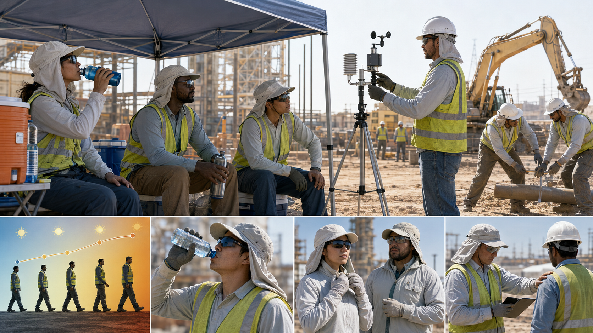
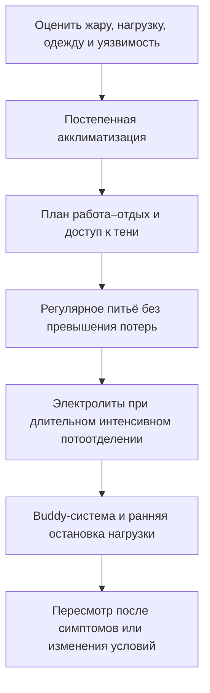
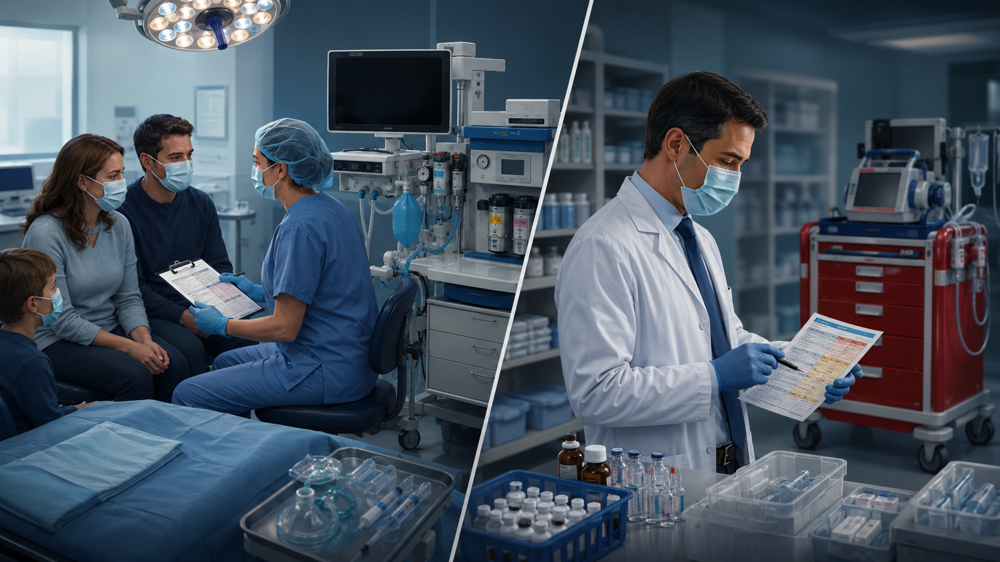

# Глава 10. Профилактика

<!-- visual-summary:start -->

*Рисунок 1. Акклиматизация, контроль условий, работа-отдых, одежда, питьевой
план и взаимное наблюдение работают как система, а не как отдельные советы.*

### Схема для запоминания

<!-- visual-summary:end -->
Лучшая терапия — та, которая не понадобилась. Гипертермический синдром, особенно в ятрогенных (MH, НЗС, серотониновый синдром) и экзогенных (тепловой удар) формах, во многих случаях представляет собой **предотвратимое** состояние. Профилактика здесь не рекомендация, а профессиональная обязанность врача.

Профилактика делится на первичную (предотвращение первого эпизода) и вторичную (предотвращение рецидива у пациента, уже перенёсшего ГС).

## 10.1. Первичная профилактика

### 10.1.1. Профилактика теплового удара

Зона ответственности врачей общей практики, спортивных врачей и служб общественного здравоохранения.

**Обучение населения:**
- избегать пиковой инсоляции (11:00–16:00);
- носить лёгкую, свободную и воздухопроницаемую одежду и головной убор;
- использовать кондиционирование и вентиляцию помещений;
- знать симптомы теплового удара, методы профилактики и приёмы первой помощи.

> [!WARNING]
> **Критическое правило: никогда не оставлять детей, пожилых людей и животных
> в закрытых автомобилях — даже ненадолго.** Салон быстро нагревается и не
> становится безопасным из-за приоткрытого окна.

**Индивидуальный питьевой план:**
- обеспечить свободный доступ к воде и регулярно предлагать пить; при умеренной
  работе в жаре NIOSH приводит ориентир около 240 мл каждые 15–20 минут, но
  реальная потребность зависит от потоотделения, акклиматизации и нагрузки;
- не пытаться «выпить как можно больше»: приём жидкости сверх потерь повышает
  риск гипонатриемии. Для длительной интенсивной работы с выраженным
  потоотделением нужен план восполнения натрия и углеводов, а не обязательный
  спортивный напиток для каждого;
- избегать алкоголя. Обычные количества кофеина не требуют универсального
  запрета, но энергетики и чрезмерные дозы стимуляторов нежелательны;
- как общий предел NIOSH советует обычно не превышать примерно 1,4 л жидкости
  в час.

**Режим труда и отдыха:**
- ограничение физической активности в жаркое время суток, перенос работы и тренировок на ранние утренние или поздние вечерние часы;
- регулярные перерывы, работа в тени или в помещениях с кондиционированием;
- **акклиматизация** при переезде в жаркий климат или в начале сезона тренировок: постепенное наращивание нагрузки и времени пребывания на жаре; полная адаптация потоотделения занимает 10–14 дней (в части источников — 1–2 недели);
- **отмена массовых мероприятий и тяжёлых работ** при высоком индексе WBGT («температура влажного шарика и чёрного шара»), учитывающем температуру воздуха, влажность и инсоляцию, — именно этот показатель, а не столбик термометра, отражает реальную тепловую нагрузку.

**Почему WBGT, а не термометр.** NIOSH/CDC и ACOEM рекомендуют управлять тепловой
нагрузкой на производстве и в спорте именно по WBGT, поскольку он объединяет
температуру воздуха, влажность, движение воздуха и лучистое тепло. Ключевой вклад
вносит влажность: по мере её роста градиент давления водяного пара между кожей и
воздухом уменьшается, и испарение пота отводит всё меньше тепла. Универсального
порога влажности, за которым испарительное охлаждение «выключается», не
существует: предел зависит от сочетания температуры воздуха, его движения,
лучистого тепла, метаболической нагрузки и одежды — именно поэтому нагрузку
нормируют по WBGT, а не по одному показателю. Физически испарение при
этом не прекращается полностью, но перестаёт компенсировать теплопродукцию — с
практической точки зрения именно это и означает потерю основного механизма
теплоотдачи.

**Что даёт акклиматизация.** За 7–14 дней постепенной адаптации растёт скорость
потоотделения, снижается концентрация натрия в поте, увеличивается объём
циркулирующей плазмы и падает нагрузка на сердечно-сосудистую систему.
Рекомендуемый режим для новых работников: в первый день около 20 % обычной
нагрузки с последующим приростом не более чем на 20 % в сутки. Отсутствие
акклиматизации — один из главных модифицируемых факторов риска: значительная
часть случаев профессионального теплового удара приходится на первые дни работы.

### 10.1.2. Скрининг перед анестезией — профилактика MH

Зона ответственности анестезиолога.

**Сбор семейного анамнеза — ключевой и обязательный пункт.** Вопросы: «Были ли у Вас или Ваших кровных родственников проблемы с наркозом? Была ли необъяснимая смерть во время или сразу после операции? Ставился ли кому-либо в семье диагноз злокачественной гипертермии?»

**При положительном анамнезе:**
- пациент считается **MH-восприимчивым (MHS)** до доказательства обратного;
- **запрещено использовать триггеры** — все ингаляционные галогенсодержащие анестетики и сукцинилхолин;
- **безопасная анестезия:** тотальная внутривенная анестезия (пропофол, кетамин, тиопентал), опиоиды, регионарные методики (спинальная, эпидуральная, проводниковая), закись азота, недеполяризующие миорелаксанты (рокуроний, атракурий);
- **подготовка наркозного аппарата (плановая, в отличие от действий при кризе):**
  снять или заблокировать испарители, заменить контур, дыхательный мешок и
  адсорбент CO₂, продуть аппарат высоким потоком свежего газа, после чего
  установить активированные угольные фильтры на инспираторное и экспираторное
  колена. Далее в течение всей операции поддерживают достаточный поток свежего
  газа, чтобы предотвратить обратное поступление агента из аппарата. Конкретные
  значения потока и времени продувки различаются между моделями аппаратов и
  системами фильтров — их сверяют с инструкцией производителя и локальным
  протоколом. **Во время уже развившегося криза замену аппарата не проводят:**
  ставят фильтры, поднимают поток и не задерживают дантролен;
- **обязательное условие:** наличие в операционной «укладки для MH» — достаточного запаса дантролена, холодных растворов, средств коррекции гиперкалиемии и ацидоза.

**Генетическое тестирование** (RYR1, CACNA1S) проводится у пациентов с MH-анамнезом и их кровных родственников; при невозможности или неинформативности — CHCT в специализированном центре.

**Генетическое консультирование:** информирование пациента и родственников о характере наследования (аутосомно-доминантном), о риске и о необходимости пожизненно сообщать о нём анестезиологам.

### 10.1.3. Рациональная фармакотерапия — профилактика НЗС и серотонинового синдрома

Зона ответственности психиатра, невролога, терапевта.

**Профилактика НЗС:**
- осторожное назначение нейролептиков по принципу «start low, go slow» — начинать с минимальных доз и титровать медленно, особенно у пациентов группы риска (ЧМТ, ДЦП, дегидратация, ажитация);
- назначать только при наличии показаний, использовать минимально эффективные дозы, регулярно пересматривать терапию;
- избегать полипрагмазии — одновременного назначения двух-трёх нейролептиков;
- **не отменять резко леводопу и другие дофаминомиметики** у пациентов с паркинсонизмом;
- регулярный клинический мониторинг, особенно в первые недели терапии и после повышения дозы.

**Профилактика серотонинового синдрома — знать опасные комбинации:**
- **абсолютно противопоказано: СИОЗС + ингибиторы МАО.** При переходе с одного класса на другой требуется «отмывочный» период 2–5 недель (для флуоксетина — максимальный из-за длительного периода полувыведения активного метаболита);
- **высокий риск:** СИОЗС + трамадол; СИОЗС + декстрометорфан (в том числе в безрецептурных сиропах от кашля); СИОЗС + литий; СИОЗС/СИОЗСН + линезолид;
- проверка лекарственных взаимодействий при каждом новом назначении;
- **информирование пациента:** «Если на фоне приёма антидепрессанта появились жар, подёргивания мышц, дрожь, диарея — немедленно прекратите приём и вызовите скорую помощь».

*Рисунок 2. Семейный анестезиологический анамнез, готовность к MH и проверка
лекарственных взаимодействий снижают предотвратимый риск.*

### 10.1.4. Профилактика при эндокринных заболеваниях

- **тиреотоксикоз:** регулярный контроль гормонов, приверженность терапии тиреостатиками, своевременное радикальное лечение (радиойодтерапия, тиреоидэктомия), особая настороженность в периоперационном периоде и при интеркуррентных инфекциях — типичных провокаторах криза;
- **феохромоцитома:** своевременная диагностика, альфа- и затем бета-блокада, плановое хирургическое удаление опухоли.

### 10.1.5. Образование родителей и пациентов

Родителей необходимо обучать правилам измерения температуры и распознаванию
тревожных признаков: нарушению сознания, затруднённому дыханию, судорогам,
признакам обезвоживания, необычной вялости или стойкому отказу от питья.
Мраморность оценивают вместе с капиллярным наполнением и общим состоянием, а не
как самостоятельный «тип» гипертермии. При лихорадке ребёнка не укутывают,
предлагают жидкость и используют жаропонижающее для комфорта в корректной
возрастной дозе; при тревожных признаках требуется срочная медицинская помощь.

### 10.1.6. Обучение медицинского персонала

- внедрение в клиниках чётких письменных протоколов (SOP) по диагностике и лечению всех форм ГС;
- регулярные тренинги и симуляционные учения по ведению криза MH — состояния настолько редкого, что без тренировки алгоритм не воспроизводится;
- обучение персонала, работающего в жарком климате, правилам профилактики теплового удара — как у пациентов, так и у себя.

---

## 10.2. Вторичная профилактика

### 10.2.1. Мониторинг групп риска

Пациенты с ЧМТ, ДЦП, врождёнными пороками сердца, эпилепсией, тяжёлой коморбидностью требуют особого внимания: регулярное наблюдение, раннее выявление признаков гипертермии, своевременная диагностика и адекватное лечение интеркуррентных инфекций.

### 10.2.2. Профилактика рецидивов

**Пациент, перенёсший MH:**
- должен быть чётко информирован о своём диагнозе и его пожизненном характере;
- должен носить **браслет тревоги (MedicAlert)** и иметь при себе информационную карту;
- обязан сообщать о диагнозе каждому анестезиологу перед любым вмешательством, включая стоматологическое;
- диагноз должен быть документирован в медицинской карте на видном месте; кровные родственники подлежат обследованию.

**Пациент, перенёсший НЗС:**
- повторное назначение антипсихотика несёт риск рецидива;
- необходимость, срок и препарат определяет психиатр после полного разрешения
  эпизода. Обычно выдерживают период восстановления, выбирают средство с
  меньшим риском, начинают с низкой дозы, медленно титруют и внимательно
  контролируют гидратацию, температуру, тонус и психический статус.

**Пациент, перенёсший серотониновый синдром:** пожизненное избегание опасных комбинаций, документирование эпизода, информирование всех лечащих врачей.

**Общий принцип:** избегание триггеров — тепловых, нагрузочных и медикаментозных; документирование в истории болезни; использование альтернативных препаратов.

### 10.2.3. Рациональная антипиретическая терапия

При **обычной лихорадке** жаропонижающее используют прежде всего для уменьшения
дискомфорта и поддержки питья, а не для достижения заданной цифры. Оно не
предотвращает надёжно фебрильные судороги и не должно маскировать необходимость
оценки причины. При истинной гипертермии антипиретики механизм не устраняют.

---

## 10.3. Профилактика осложнений в ОРИТ и операционной

- **Мониторинг температуры:** способ и непрерывность выбирают по риску,
  клиническому состоянию и процедуре. При подозрении на тепловой удар нужен
  надёжный показатель температуры ядра; при общей анестезии и в ОРИТ следуют
  профильному протоколу.
- **Ранняя диагностика:** настороженность (high suspicion) при любой необъяснимой тахикардии, ацидозе, гиперкапнии — не дожидаясь подъёма температуры.
- **Наличие протоколов и укладок:** распечатанные алгоритмы по MH, НЗС и серотониновому синдрому в операционной и ОРИТ; «укладка для MH» с дантроленом в быстром доступе, с регулярной проверкой сроков годности и пополнением после каждого использования.
- **Немедленное начало терапии** при клинически обоснованном подозрении:
  прекратить триггер, начать показанные поддерживающие действия и охлаждение;
  при MH — не задерживать дантролен.

---

## 10.4. Вакцинация и контроль инфекций

*Механизм:* плановая иммунизация против гриппа, пневмококковой, менингококковой и других инфекций, соблюдение национального календаря прививок у детей и взрослых.

*Связь с ГС:* снижение вероятности развития сепсиса, пневмонии и менингита — состояний, которые сами по себе способны привести к срыву терморегуляции и гипертермическому синдрому. Это опосредованная, но реальная и недооценённая часть общей профилактики.

---

## Выводы по главе 10

**ГС — во многом предотвратимая катастрофа.** Значительная часть случаев имеет ятрогенную (MH, НЗС, СС) или средовую (тепловой удар) природу, то есть в принципе управляема.

**Роль врача в первичной профилактике распределена по специальностям:**
- **анестезиолог** — золотое правило: сбор анамнеза на MH перед каждым наркозом и наличие дантролена там, где применяются триггеры;
- **психиатр, невролог, терапевт** — рациональная фармакотерапия, знание «смертельных» комбинаций (СИОЗС + ИМАО) и правил титрования нейролептиков, недопустимость резкой отмены леводопы;
- **врач общей практики и спортивный врач** — образование населения: гидратация, акклиматизация, режим нагрузок по WBGT, опасность укутывания детей и оставления их в автомобиле.

**Вторичная профилактика:** пациент, перенёсший MH или НЗС, — «ходячая красная карточка». Он должен быть информирован, документирован и защищён от повторных триггеров браслетом MedicAlert, информационной картой и настороженностью каждого следующего врача.

**Системный уровень:** протоколы, укладки, симуляционные тренинги и мониторинг температуры в ОРИТ превращают индивидуальную бдительность в воспроизводимую практику.

**Переход.** Мы научились спасать пациента и предотвращать катастрофу. Но что ждёт того, кого удалось «вытащить»? Каковы его шансы, что определяет исход и каким будет качество жизни?

<!-- chapter-nav:start -->

---

[← Предыдущая глава](09-neotlozhnaya-pomoshch-i-lechenie.md) · [Оглавление](../README.md#оглавление) · [Следующая глава →](11-prognoz-i-ishody.md)

<!-- chapter-nav:end -->
