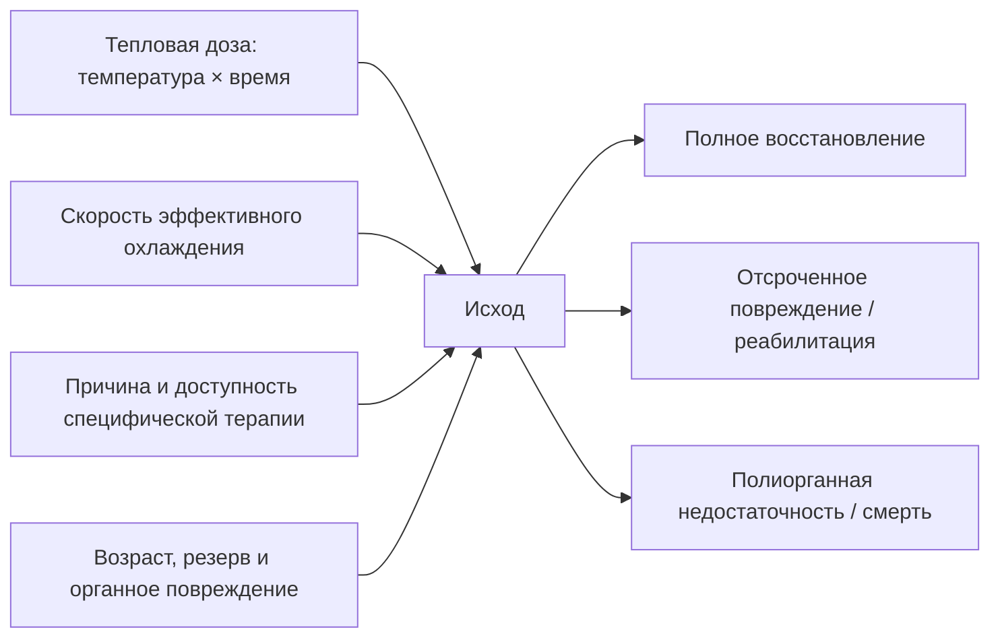

# Глава 11. Прогноз и исходы

<!-- visual-summary:start -->

### Схема для запоминания

<!-- visual-summary:end -->
Прогноз можно описать вопросом **«как велика тепловая доза и как быстро
устранена причина?»** Температура и время важны, но исход также определяют
этиология, возраст, физиологический резерв, шок, судороги и развившееся органное
повреждение. Ни одна цифра температуры не предсказывает исход изолированно.

## 11.1. Факторы, влияющие на прогноз

### 11.1.1. Своевременность диагностики и начала терапии

- **Ранняя диагностика** — например, распознавание необъяснимого роста EtCO₂ при
  MH до выраженного подъёма температуры — позволяет раньше прекратить триггер и
  ввести дантролен.
- **Поздняя диагностика** увеличивает тепловую дозу и вероятность
  полиорганного повреждения, но не делает неблагоприятный исход неизбежным.
- Для универсального прироста летальности на фиксированный процент за каждый
  час надёжных данных нет; клинический вывод проще: эффективное охлаждение не
  откладывают.

**Скорость охлаждения как изменяемый фактор.** При тепловом ударе на нагрузке
полевые протоколы стремятся начать охлаждение на месте и снизить ректальную
температуру примерно до 38,6–39,0 °C как можно быстрее, часто ориентируясь на
первые 30 минут от распознавания. Это цель процесса, а не гарантированный
прогностический рубеж.

### 11.1.2. Адекватность терапии

При тепловом ударе исход улучшает быстрое эффективное охлаждение; цвет кожи не
служит основанием от него отказаться. При MH критичны прекращение триггера и
ранний дантролен. При НЗС и серотониновом синдроме основа — отмена причинного
препарата, контроль мышечной активности и поддержка органов; бромокриптин и
ципрогептадин не равны дантролену по доказательности и обязательности.

### 11.1.3. Максимальная достигнутая температура

Риск повреждения растёт с температурой и длительностью воздействия, но
индивидуальная переносимость и точность измерения различаются. Пороги 41–43 °C
описывают зоны высокого риска, а не границы, после которых повреждение
обязательно и необратимо.

### 11.1.4. Длительность гипертермии

Продолжительность воздействия нередко важнее одной максимальной цифры:
кратковременный пик и длительный перегрев дают разную суммарную тепловую дозу.
Точное время начала часто неизвестно, поэтому прогноз уточняют по динамике
сознания, гемодинамики, лактата, коагуляции, печени, почек и КФК.

### 11.1.5. Коморбидность и возраст

Неблагоприятны: возраст старше 65 лет (истощение резервов) и младше 3 месяцев; ХСН и ИБС — сердце не выдерживает гипердинамической нагрузки и гиповолемии; хроническая болезнь почек — почки «ломаются» первыми при рабдомиолизе; патология ЦНС, включая инсульт в анамнезе; заболевания лёгких и печени; эндокринные и неврологические заболевания; ожирение.

### 11.1.6. Гемодинамика как прогностический маркёр

Среди отдельных признаков наиболее воспроизводимо связана с исходом
**артериальная гипотензия**. В сводках по тепловому удару приводится
ориентировочное различие: летальность около 10 % при отсутствии гипотензии и
порядка 33 % при систолическом АД ниже 90 мм рт. ст.

Эти цифры получены из наблюдательных данных, зависят от определения случая,
эпохи и доступности интенсивной терапии, и не должны использоваться как
индивидуальный прогноз. Их клинический смысл в другом: гипотензия при тяжёлой
гипертермии — не «сопутствующая деталь», а маркёр перехода в декомпенсацию,
требующий немедленной оценки шока, сосудистого доступа и поддержки перфузии
параллельно с продолжающимся охлаждением.

### 11.1.7. Развитие осложнений

ДВС-синдром, ОПП, ОРДС, шок, тяжёлое поражение печени и стойкое нарушение
сознания связаны с неблагоприятным прогнозом. Риск растёт по мере вовлечения
органов, но прибавлять фиксированный процент «за каждый орган» некорректно.
Рабдомиолиз значим прежде всего как источник гиперкалиемии и ОПП.

---

## 11.2. Ближайшие исходы

**Полное выздоровление возможно**, особенно при раннем устранении причины и
ограничении тепловой дозы. Образцовый пример — MH, распознанная в операционной
по необъяснимому росту EtCO₂, с немедленной отменой триггеров и введением
дантролена. Срок восстановления индивидуален.

**Выздоровление с остаточными явлениями** — частичное восстановление функций со стойким неврологическим дефицитом или сохраняющимся нарушением функции почек, печени, сердца.

**Летальный исход** — вследствие необратимого отёка мозга, рефрактерного шока, фатальной аритмии на фоне гиперкалиемии либо, отсроченно, от полиорганной недостаточности и вторичного сепсиса.

---

## 11.3. Почему одну таблицу летальности применять нельзя

Опубликованные показатели сильно меняются между популяциями, определениями
случая, эпохами и уровнем медицинской помощи. Поэтому диапазон из одной статьи
нельзя переносить на конкретного пациента.

| Состояние | Что сильнее всего меняет исход |
|---|---|
| **Классический тепловой удар** | возраст, коморбидность, одиночное проживание, длительность экспозиции, шок и доступ к охлаждению |
| **Тепловой удар при нагрузке** | распознавание дисфункции ЦНС, ректальное измерение и охлаждение на месте |
| **Злокачественная гипертермия** | раннее распознавание роста CO₂, прекращение триггера, доступность и скорость введения дантролена |
| **НЗС** | тяжесть ригидности и органного повреждения, задержка отмены препарата, качество интенсивной поддержки |
| **Серотониновый синдром** | свойства причинных препаратов, выраженность гипертермии и мышечной активности, осложнения |
| **Сепсис с высокой температурой** | источник инфекции, шок и органная дисфункция; температура сама по себе не задаёт прогноз |

---

## 11.4. Критерии неблагоприятного прогноза

- очень высокая или длительно сохраняющаяся температура ядра;
- значимая задержка эффективного охлаждения;
- стойкое нарушение сознания после охлаждения и стабилизации;
- развитие ДВС-синдрома;
- ОПП, требующее гемодиализа;
- ОРДС, требующий ИВЛ;
- возраст старше 65 лет;
- тяжёлый метаболический ацидоз и высокий лактат при поступлении;
- рабдомиолиз с почечной недостаточностью;
- тяжёлая сопутствующая патология.

Практический смысл перечня — выделить пациентов, которым требуется раннее
ведение в ОРИТ и серийная оценка. Отдельный фактор не заменяет клиническое
решение и не должен быть основанием прекращать лечение.

---

## 11.5. Отдалённые последствия

Это то, с чем пациент уходит из больницы.

### 11.5.1. Неврологические последствия — самые частые и инвалидизирующие

**Мозжечковая атаксия.** Описанное последствие тяжёлого теплового удара,
связанное с уязвимостью мозжечка и клеток Пуркинье. Возможны нарушение походки
и координации, дизартрия, тремор и нистагм; степень восстановления различается.

**Когнитивные нарушения:** снижение памяти, внимания и концентрации, «затуманенность» (brain fog), трудности обучения, изменения личности и эмоциональная лабильность.

**Периферическая полинейропатия:** слабость и онемение в стопах и кистях, нарушение чувствительности.

**Стойкие очаговые дефициты:** парезы и параличи вследствие ишемических микроинсультов, нарушения речи и зрения.

**Эпилепсия** постгипоксического и постишемического генеза, требующая длительной противосудорожной терапии.

### 11.5.2. Нефрологические последствия

**Хроническая болезнь почек.** Причина — острое повреждение почек вследствие рабдомиолиза и шока, оказавшееся настолько тяжёлым, что полного восстановления не произошло. Исход — от снижения СКФ с необходимостью пожизненного наблюдения до диализ-зависимости.

### 11.5.3. Прочие последствия

- **кардиомиопатия** со снижением фракции выброса;
- **хроническая печёночная дисфункция** — относительно редко, поскольку печень хорошо регенерирует, но требует контроля;
- **ПТСР** у пациентов, переживших ОРИТ, — недооценённое последствие, влияющее на качество жизни не меньше физического дефицита.

---

## 11.6. Качество жизни и реабилитация

Качество жизни выживших может быть значительно снижено — прежде всего из-за неврологического дефицита (атаксии, когнитивных нарушений) или необходимости в диализе. Именно поэтому скорость охлаждения — вопрос не только выживания, но и того, каким будет это выживание.

**Реабилитация** должна быть комплексной и длительной:
- **физическая** — ЛФК, восстановление координации и силы;
- **когнитивная** — нейрореабилитация, эрготерапия;
- **психологическая** — работа с тревогой, депрессией, ПТСР;
- **социальная** — возвращение к труду и повседневной активности, при необходимости — оформление инвалидности и адаптация среды.

Отдельная задача — диспансерное наблюдение: контроль функции почек, сердца и печени, а для пациентов с MH и НЗС — пожизненная защита от повторного контакта с триггерами.

---

## Выводы по главе 11

**«Время = весь организм».** По аналогии с инсультом, где «время = мозг», при ГС ключевым детерминантом исхода служит интеграл «температура × время». Именно поэтому охлаждение начинают до постановки окончательного диагноза.

**Риск снижаем.** История MH наглядно показывает, как мониторинг, прекращение
триггеров, доступность дантролена и отработанный командный протокол преобразуют
исход редкого криза.

**Необратимые последствия реальны.** Даже выживший пациент может остаться инвалидом из-за гибели клеток Пуркинье (атаксия) или некроза почечных канальцев (диализ). Успех измеряется не только фактом выписки.

**Прогноз — не только скорость.** Время критично, но на исход также влияют
причина, тяжесть органного повреждения, резерв пациента и доступность
последующего наблюдения.

**Переход.** Мы рассмотрели ГС у «среднестатистического» пациента. Но таких пациентов не бывает: возраст, физиологическое состояние и сопутствующая патология критически меняют картину. Ошибки в лечении ребёнка или пожилого человека часто фатальны — у них нет запаса прочности.

<!-- chapter-nav:start -->

---

[← Предыдущая глава](10-profilaktika.md) · [Оглавление](../README.md#оглавление) · [Следующая глава →](12-osobennosti-u-kategoriy-pacientov.md)

<!-- chapter-nav:end -->
