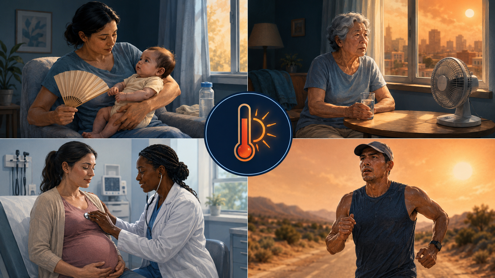
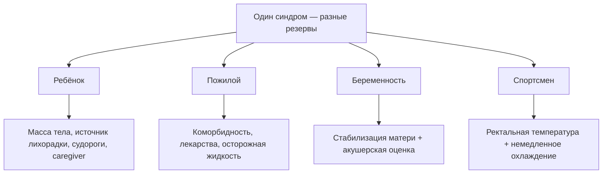
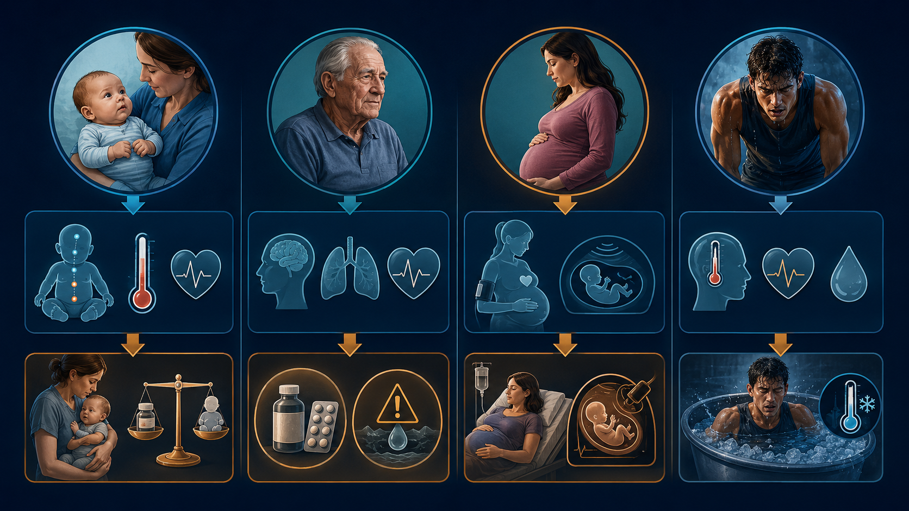

# Глава 12. Особенности гипертермического синдрома у различных категорий пациентов

<!-- visual-summary:start -->

*Рисунок 1. Младенцы, пожилые, беременные и спортсмены имеют разные механизмы
риска и не должны рассматриваться как одна «уязвимая группа».*

### Схема для запоминания

<!-- visual-summary:end -->
«Среднестатистических» пациентов не бывает. Возраст, физиологическое состояние и сопутствующая патология критически меняют картину ГС, и ошибки в лечении ребёнка или пожилого человека часто фатальны — именно потому, что у них нет запаса прочности.

## 12.1. Дети и новорождённые

Ребёнок — не «маленький взрослый»: его физиология терморегуляции принципиально иная.

### 12.1.1. Особенности терморегуляции

**Незрелость центра терморегуляции.** У новорождённых и младенцев преоптическая область гипоталамуса ещё не «настроена»: реакция на пирогены и на перегрев может быть смазанной или парадоксальной. Механизмы теплопродукции (дрожь) и теплоотдачи (потоотделение) развиты слабо.

> [!WARNING]
> **Клинический парадокс:** новорождённый с тяжелейшим сепсисом может дать не гипер-, а **гипотермию (< 36 °C)** — и это ещё более грозный признак, чем лихорадка.

**Большая поверхность тела относительно массы.** У младенца это отношение выше,
чем у взрослого, поэтому теплообмен со средой идёт быстрее. Ребёнок может быстро
как охлаждаться, так и перегреваться в небезопасной среде.

**Меньшие запасы жидкости.** Общий резерв воды мизерный, поэтому потери с тахипноэ, минимальным потоотделением, рвотой или диареей быстро приводят к эксикозу и гиповолемическому шоку. Незрелость почек усугубляет водно-электролитные нарушения.

**Особенности термогенеза.** Основной механизм согревания новорождённого — нешиверинговый термогенез за счёт бурой жировой ткани; при перегреве этот механизм бесполезен, а дрожать эффективно ребёнок не может.

**Неспособность к самопомощи.** Ребёнок не может сказать, что ему жарко, попросить пить, сбросить одеяло или уйти из раскалённого помещения — это делает его полностью зависимым от внимательности взрослых.

### 12.1.2. Специфика клинической картины

**Неспецифичность.** Возможны необычная вялость, раздражительность, отказ от
кормления, сухость слизистых, отсутствие слёз и снижение диуреза. Западение
родничка может сопровождать обезвоживание, а выбухание требует срочной оценки,
но ни один из этих признаков не устанавливает причину самостоятельно.

**Фебрильные судороги.** Возникают у части детей примерно от 6 месяцев до 5 лет
на фоне лихорадочного заболевания. «Простые» фебрильные судороги —
генерализованные, продолжаются менее 15 минут и не повторяются в течение
24 часов; цифра температуры не определяет их тип.

> [!WARNING]
> **Красные флаги:** очаговый приступ, длительность более 15 минут, повторение
> в течение 24 часов, неполное восстановление сознания, менингеальные признаки,
> петехии, дыхательные или гемодинамические нарушения. Они требуют срочной
> оценки причин, включая инфекцию ЦНС; высокая цифра температуры сама по себе
> не доказывает энцефалопатию.

**Перфузия.** Бледность, мраморность, холодные конечности и замедленное
капиллярное наполнение требуют оценки шока. Это не отдельный диагноз «белой
гипертермии» и не основание откладывать показанное охлаждение.

**Декомпенсация может быть быстрой.** Небольшая масса тела и ограниченная
возможность сообщить о симптомах требуют частой повторной оценки, но
универсального интервала «30–60 минут» нет.

### 12.1.3. Специфика лечения

**Дозировки рассчитывают по массе тела (мг/кг) и сверяют с локальным
педиатрическим протоколом.** Нужно учитывать возраст, максимальную суточную дозу,
функцию печени/почек и противопоказания; аспирин при вирусной инфекции у детей
связан с риском синдрома Рея.
- парацетамол 10–15 мг/кг на приём;
- ибупрофен 5–10 мг/кг на приём;
- диазепам 0,1–0,2 мг/кг;
- дантролен при MH 2,5 мг/кг.

**Инфузионная терапия требует повторной оценки.** При шоке кристаллоид вводят
болюсом по педиатрическому протоколу, после каждого этапа оценивают дыхание,
перфузию, диурез и признаки перегрузки.

**Судороги.** Активный приступ лечат по алгоритму. Жаропонижающие улучшают
комфорт, но не предотвращают надёжно рецидив фебрильных судорог; рутинная
профилактическая противосудорожная терапия обычно не рекомендуется.

**Охлаждение** — агрессивное физическое, но с осторожностью в отношении переохлаждения, к которому дети склонны из-за той же большой относительной поверхности тела.

### 12.1.4. Группы риска среди детей

- **младенцы до 3 месяцев** — ректальная температура 38,0 °C и выше требует
  срочной медицинской оценки; объём обследования определяют возраст,
  клинический вид и действующий протокол;
- **дети до 6 лет** — склонность к фебрильным судорогам и быстрой дегидратации;
- **дети с врождёнными пороками сердца:** лихорадка, обезвоживание и тахикардия
  могут снизить компенсаторный резерв;
- **дети с патологией ЦНС** или эпилепсией могут иметь особые риски аспирации,
  нарушения мобильности, лекарственных взаимодействий и судорог; план помощи
  индивидуализируют.

---

## 12.2. Пожилые пациенты (старше 65–70 лет)

Уязвимость пожилого пациента связана с уменьшением физиологического резерва,
коморбидностью, лекарствами и социальными факторами.

### 12.2.1. Особенности физиологии

- **нарушение терморегуляции** — «термостат» гипоталамуса работает хуже вследствие дегенерации нейронов;
- **снижение эффективности потоотделения** — атрофия потовых желёз, риск ангидроза;
- **снижение чувства жажды** — пациент не ощущает обезвоживания и не пьёт;
- **снижение способности к вазодилатации** — ригидные, атеросклеротически изменённые сосуды не могут адекватно расшириться для теплоотдачи;
- общее снижение адаптационных возможностей и гомеостатических резервов.

### 12.2.2. Коморбидность

- **ХСН и ИБС** — сердце не способно нарастить выброс, необходимый для кожной вазодилатации;
- **хроническая болезнь почек** — почки не компенсируют ацидоз и электролитные сдвиги, выше риск ОПП;
- **деменция** — пациент не может адекватно реагировать на жару: одеться по погоде, попить, уйти в прохладное место, а также не сообщает о симптомах, что требует более тщательного мониторинга;
- **сахарный диабет** — автономная нейропатия дополнительно нарушает потоотделение и вазомоторную регуляцию;
- артериальная гипертензия, аритмии, хронические заболевания лёгких.

### 12.2.3. Полипрагмазия — самостоятельный фактор риска

- **диуретики** — дегидратация и гипокалиемия;
- **бета-блокаторы** — снижение ЧСС и сердечного выброса, невозможность гемодинамической компенсации;
- **антихолинергические препараты** (от недержания, депрессии, аллергии) — блокада потоотделения;
- **нейролептики**, нередко назначаемые при деменции, — риск НЗС.

### 12.2.4. Особенности лечения

**Инфузионная терапия — «хождение по лезвию».** У пациента с ХСН агрессивный болюс 30 мл/кг способен «затопить» лёгкие. Тактика: меньшие объёмы, медленнее, под постоянным контролем — аускультация лёгких, УЗИ, оценка ЦВД и диуреза.

**Коррекция доз препаратов** с учётом сниженной функции почек и печени; более частый лабораторный мониторинг.

**Контроль функции почек:** креатинин и мочевина на фоне ХБП могут «взлететь» очень быстро; необходима регулярная оценка СКФ.

---

## 12.3. Беременные женщины

Беременная — это **два пациента**.

### 12.3.1. Риск для плода

- **I триместр — тератогенный эффект.** Гипертермия у матери (T > 39 °C, по ряду данных критический порог около 38,9 °C) в первые недели беременности — доказанный фактор риска дефектов нервной трубки (spina bifida) и других пороков развития ЦНС.
- **II и III триместры.** Тяжёлое состояние матери, гипоксемия, гипотензия и
  гипертермия могут ухудшить плацентарную перфузию и вызвать дистресс плода,
  поэтому стабилизация матери и ранняя акушерская оценка идут параллельно.

### 12.3.2. Физиология беременной

Организм уже работает в режиме гипердинамии (высокий сердечный выброс) и гипервентиляции, поэтому резервы компенсации ГС снижены.

> [!WARNING]
> **Аорто-кавальная компрессия.** В III триместре матка сдавливает аорту и нижнюю полую вену. Если уложить пациентку на спину для проведения охлаждения, разовьётся шок.
> **Тактика:** во второй половине беременности избегают длительного положения
> строго на спине; используют смещение матки влево или наклон, если это не
> мешает реанимации и эффективному охлаждению. Жизненно важные вмешательства
> матери имеют приоритет.

### 12.3.3. Специфика терапии

**Безопасность препаратов:**
- буквенные категории FDA A/B/C/D/X больше не применяются; риск оценивают по
  сроку, дозе, длительности и актуальной инструкции;
- парацетамол обычно рассматривают как средство выбора для кратковременного
  лечения лихорадки/боли при беременности, если он действительно нужен;
- НПВС имеют срок-зависимые риски, особенно после 20 недель и позднее;
- при MH дантролен вводят без задержки: стабилизация матери — лучший способ
  защитить плод;
- активные судороги лечат немедленно, учитывая материнские и неонатальные риски
  конкретного препарата.

**Двойной мониторинг:** стабилизация и непрерывная оценка матери; акушерская
команда выбирает метод наблюдения за плодом по сроку беременности и ситуации.

**Особенности охлаждения:** избегать избыточного охлаждения и гипотермии — они вызывают спазм маточных сосудов и ухудшают перфузию плаценты; целевая температура та же — 38,0–38,5 °C.

---

## 12.4. Спортсмены

Особая группа риска в отношении теплового удара при физической нагрузке (Exertional Heat Stroke, EHS).

### 12.4.1. Факторы риска

- **причина:** экстремальная эндогенная теплопродукция работающих мышц плюс экзогенные факторы — жара, влажность, непроницаемая экипировка;
- **психология:** высокая мотивация на соревнованиях заставляет игнорировать ранние признаки (слабость, головокружение, тошноту) и «бежать до коллапса»;
- недостаточная гидратация и отсутствие акклиматизации;
- **ассоциированные состояния:** возможны рабдомиолиз, ОПП, поражение печени,
  коагулопатия и гипонатриемия, особенно при питье сверх потерь.

### 12.4.2. Профилактика

- **акклиматизация** 10–14 дней с постепенным наращиванием нагрузки и времени пребывания на жаре;
- **индивидуальный питьевой план:** ориентируется на потери с потом, длительность
  нагрузки и доступ к натрию; нельзя как недопивать, так и пить сверх потерь.
  Для работников NIOSH приводит ориентир около 240 мл каждые 15–20 минут и
  обычно не более примерно 1,4 л/ч;
- **контроль условий тренировок по индексу WBGT** с отменой или переносом соревнований при высоком риске, обязательные перерывы, тень и охлаждение.

### 12.4.3. Лечение: правило «cool first, transport second»

Золотое правило EHS. Если спортсмен коллапсировал на дистанции с T = 41,5 °C:
1. вызвать экстренную помощь, выполнить ABCDE и измерить ректальную температуру;
2. при сохранённой возможности реанимации начать погружение в холодную воду
   или наиболее быстрый доступный метод всего тела;
3. продолжать охлаждение примерно до 38,6–39,0 °C, контролируя дыхательные пути
   и температуру;
4. координировать транспорт с охлаждением; жизнеугрожающие состояния, которые
   невозможно вести на месте, могут изменить последовательность.

Такой порядок действий спасает жизнь и предотвращает развитие полиорганной недостаточности. Он противоречит привычной логике «хватай и вези», и именно поэтому требует заранее оговорённого протокола и подготовленного персонала на спортивных мероприятиях.

*Рисунок 2. Мнемоническая карта: возрастная дозировка и участие caregiver,
коморбидность и риск перегрузки, материнская стабилизация и акушерская оценка,
быстрое охлаждение при тепловом ударе на нагрузке.*

---

## Выводы по главе 12

**«Нет» среднестатистическому пациенту.** Терморегуляция детей (незрелость, большая относительная поверхность тела), пожилых (изношенность, коморбидность, полипрагмазия) и беременных (риск для плода, аорто-кавальная компрессия) имеет критические особенности, меняющие и диагностику, и лечение.

**Дети = частая повторная оценка.** Ректальная температура 38,0 °C и выше у
младенца младше 3 месяцев требует срочной медицинской оценки. Дозы считают по
массе, жидкость вводят с переоценкой.

**Пожилые = сниженный резерв.** Не чувствуют жажды, плохо потеют, сосуды не расширяются, сердце и почки не выдерживают нагрузки, а собственные лекарства работают против них. Инфузия — хождение по лезвию между гиповолемией и отёком лёгких.

**Беременность = стабилизация матери и акушерская оценка.** Избегают
аорто-кавальной компрессии, учитывают срок-зависимые риски препаратов, а при MH
не задерживают дантролен.

**Спортсмены = EHS.** Ключ к спасению — «cool first, transport second»: сначала охладить в ледяной воде на месте, потом везти.

**Переход.** Мы разобрали особенности отдельных групп. Но медицина не стоит на месте: какие новые инструменты и знания появляются в борьбе с ГС?

<!-- chapter-nav:start -->

---

[← Предыдущая глава](11-prognoz-i-ishody.md) · [Оглавление](../README.md#оглавление) · [Следующая глава →](13-sovremennye-issledovaniya.md)

<!-- chapter-nav:end -->
