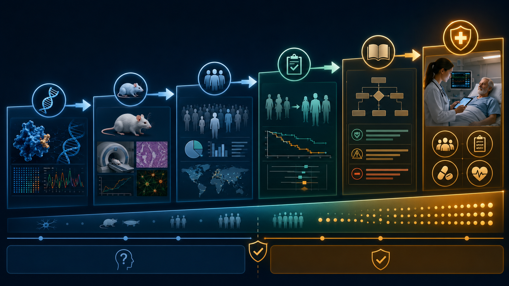
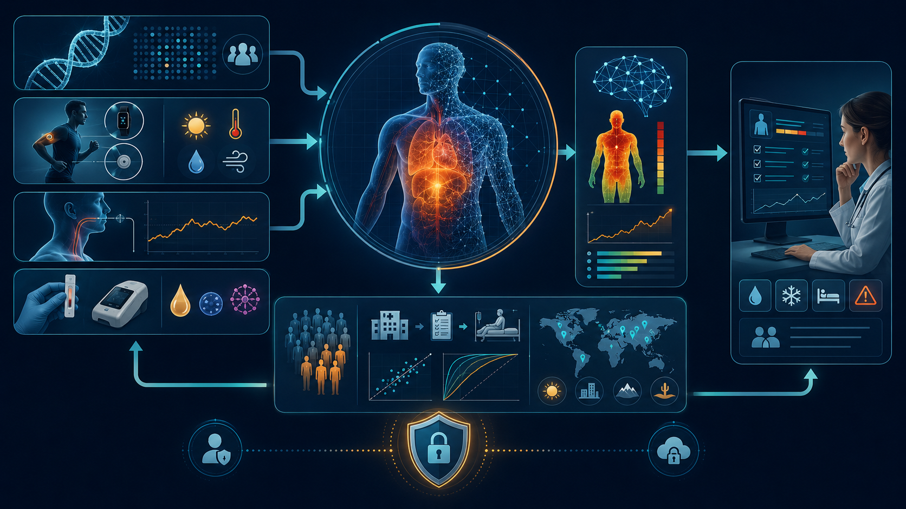
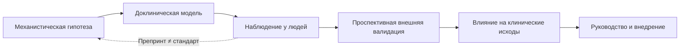

# Глава 13. Современные направления исследований и актуальные вопросы

<!-- visual-summary:start -->
## Визуальный конспект главы

*Рисунок 1. Лестница доказательств: механизм и животная модель не равны
клинической эффективности; практика требует человеческой валидации и исходов.*

*Рисунок 2. Генетика, носимые сенсоры, биомаркеры и модели риска полезны только
после калибровки, внешней проверки, оценки пользы, безопасности и приватности.*

### Схема для запоминания

<!-- visual-summary:end -->
Несмотря на многое, что уже известно о гипертермических состояниях, область
остаётся полна «белых пятен». Почему при сопоставимой экспозиции исходы
различаются? Можно ли распознать риск до органного повреждения? Ответы требуют
аккуратного разделения между гипотезой, доклиническим результатом и данными у
людей.

## 13.0. Как читать исследования этой главы

| Уровень | Что он позволяет утверждать | Чего он не доказывает |
|---|---|---|
| Механистическая работа / клетки | возможный путь повреждения | пользу лечения для пациента |
| Животная модель | биологический сигнал в модели | эффективность и безопасность у людей |
| Ретроспективное наблюдение | ассоциацию и формирование гипотезы | причинность |
| Проспективная валидация | воспроизводимость теста или модели | улучшение клинических исходов |
| Сравнительное клиническое исследование | пользу и риски вмешательства | применимость вне изученной популяции |

> [!IMPORTANT]
> Препринт не прошёл полноценное рецензирование, а положительный результат у
> животных не является основанием менять клинический протокол.

## 13.1. Генетические маркеры предрасположенности

### 13.1.1. Гены RYR1 и CACNA1S при злокачественной гипертермии

*Цель:* поиск новых, ранее неизвестных патогенных вариантов, ответственных за MH.

*Проблема:* в гене RYR1 описано более 400 вариантов, но далеко не все они «злокачественные». Требуется **функциональное картирование** — доказательство того, что конкретный вариант действительно вызывает дефект кальциевого канала. Именно поэтому отрицательный генетический тест сегодня не исключает предрасположенности.

*Перспектива:* расширение функционально подтверждённого каталога вариантов.
Сегодня отрицательный результат панели не исключает восприимчивость и не
позволяет повсеместно отказаться от контрактурного теста. По GeneReviews,
патогенные варианты RYR1 объясняют примерно 60–70 % установленной
восприимчивости, CACNA1S — около 1 %, STAC3 — менее 1 %.

### 13.1.2. Геномика НЗС

*Гипотеза:* НЗС — не просто идиосинкразия, а, возможно, тоже фармакогенетическое явление.

*Направление поиска:* полиморфизмы генов дофаминовых рецепторов (DRD2) и ферментов метаболизма лекарств (система цитохрома CYP450), делающие пациента уязвимым к нейролептикам.

*Статус:* ассоциации-кандидаты изучаются, но клинически валидированного теста,
который до назначения антипсихотика надёжно предсказывает НЗС, нет.

### 13.1.3. Геномика теплового удара при нагрузке

*Наблюдение:* после теплового удара при нагрузке некоторые пациенты дольше
сохраняют непереносимость жары или получают повторный эпизод.

*Гипотеза:* варианты генов мышечного кальциевого обмена могут объяснять часть
восприимчивости, но EHS и MH нельзя считать одним заболеванием. Генетический
результат пока не заменяет клиническую оценку восстановления и контролируемый
возврат к нагрузкам.

### 13.1.4. Другие направления

Изучаются полигенные факторы риска и редкие кандидаты. Например, препринт
2026 года сообщил о вариантах **CACNA2D4** в семьях с подозрением на
предрасположенность к MH. Это интересный сигнал, но до независимой репликации и
функциональной валидации он не должен входить в диагностическую панель:
[DOI 10.64898/2026.01.28.702251](https://doi.org/10.64898/2026.01.28.702251).

---

## 13.2. Новые подходы к фармакологическому воздействию на температуру

### 13.2.1. Сенсорные каналы холода и тепла

TRPM8 реагирует на охлаждение и ментол, но его активация не означает
автоматического выключения теплопродукции: холодовой сигнал может, напротив,
усиливать защитный термогенез и вазоконстрикцию. Поэтому TRP-каналы интересны
как механистические мишени, но «агонист TRPM8 против теплового удара» пока не
является клинической стратегией.

### 13.2.2. Цитокин-таргетная терапия

Тепловой удар сопровождается системным воспалительным и эндотелиальным ответом,
но термин «цитокиновый шторм» не превращает его в показание к блокаторам
IL-1, IL-6 или TNF-α. Убедительных клинических данных об улучшении исходов
такими препаратами нет; основной стандарт остаётся прежним — быстрое
охлаждение и поддержка органов.

### 13.2.3. Прочие экспериментальные подходы

Доклинические работы исследуют эндотелиальную защиту, коагуляцию,
ферроптоз/липопероксидацию и кишечный барьер. В 2025 году опубликованы, например,
результаты нафамостата в модели теплового удара у крыс
([DOI 10.3389/fphar.2025.1559181](https://doi.org/10.3389/fphar.2025.1559181))
и роли ALOX15 в животной модели
([DOI 10.1097/SHK.0000000000002625](https://doi.org/10.1097/SHK.0000000000002625)).
Это не разрешённые способы лечения людей и не альтернатива охлаждению.

---

## 13.3. Технологии мониторинга и экспресс-диагностики

### 13.3.1. Телемониторинг и носимые устройства

*Технология:* «умные» часы и фитнес-браслеты, «умные» пластыри, непрерывно измеряющие температуру кожи, ЧСС, SpO₂, с передачей данных на смартфон или в облако.

*Потенциальное применение:* персональные предупреждения о росте тепловой
нагрузки у работников и спортсменов, наблюдение за уязвимыми людьми и оценка
акклиматизации.

*Ограничение:* большинство потребительских устройств измеряет кожу или
оценивает температуру ядра косвенно. Ошибка меняется при потоотделении,
движении, одежде и условиях среды. Алгоритму нужны проспективная внешняя
валидация, заранее заданные пороги и доказательство того, что предупреждение
действительно улучшает исходы. Обзор носимых технологий и оси кишечник–мозг:
[DOI 10.3389/fphys.2025.1700342](https://doi.org/10.3389/fphys.2025.1700342).

### 13.3.2. Point-of-care диагностика

*Цель:* получить критически важные показатели у постели пациента быстрее
центральной лаборатории.

*Технология:* портативные анализаторы с картриджами (например, i-STAT), сразу выдающие лактат, K⁺, креатинин, показатели КОС и газов крови.

*Применение:* немедленная диагностика ацидоза и, что критично, гиперкалиемии — прямо у постели больного, в приёмном отделении и даже в машине скорой помощи.

*Ограничения:* результат требует контроля качества и клинической интерпретации;
отрицательный экспресс-тест не исключает раннее органное повреждение. Дипстик
«кровь» без эритроцитов поддерживает гипотезу пигментурии, но не является
специфичным тестом на миоглобин.

### 13.3.3. Искусственный интеллект

*Перспектива:* алгоритмы могут объединять ЧСС, АД, EtCO₂, температуру и
параметры вентиляции для раннего предупреждения. До внедрения нужны внешняя
валидация, анализ ложных тревог, проверка на смещение между группами и
исследование пользы для исходов. Формулировка «распознаёт раньше врача» без
такой проверки недопустима.

### 13.3.4. Нанотехнологии

*Идея:* инъекционные наносенсоры, циркулирующие в кровотоке и непрерывно передающие данные о T_core, pH, K⁺, оксигенации на внешний приёмник; в перспективе — нанотехнологические системы адресной доставки лекарств и локального охлаждения.

*Статус:* концептуальное направление; для рутинной помощи таких
валидированных систем нет.

---

## 13.4. Проблемы и ошибки клинической практики

Показательно, что фокус современных исследований смещается с вопроса «что делать?» на вопрос **«почему мы этого не делаем?»**.

**Проблема 1 — диагностическая: ненадёжное измерение температуры ядра.** При
подозрении на тепловой удар периферические измерения могут существенно
занижать температуру и не должны задерживать лечение. Для полевого EHS
ректальная термометрия остаётся эталоном; в операционной и ОРИТ выбор датчика
зависит от ситуации.

**Проблема 2 — терапевтическая: задержка начала охлаждения.** Ожидание «эффекта от парацетамола», использование заведомо неэффективных методов охлаждения, недооценка тяжести состояния и риска осложнений.

**Проблема 3 — логистическая: отсутствие дантролена в операционной.** Мотивировка «он дорогой, а у нас MH не бывает» превращает редкое, но управляемое состояние в фатальное.

**Проблема 4 — тактическая: цвет кожи подменяет оценку перфузии.** Мраморность и
холодные конечности требуют распознавания шока и параллельной поддержки
кровообращения, но не являются основанием откладывать охлаждение ради
спазмолитика.

---

## 13.5. Современные тенденции

**Мультидисциплинарный подход.** Лечением ГС занимается не один врач, а команда — «Hyperthermia Team»: реаниматолог, анестезиолог, невролог, нефролог, психиатр, при необходимости эндокринолог и токсиколог. Разрабатываются комплексные протоколы совместного ведения.

**Протоколы и клинические рекомендации** профильных организаций (MHAUS, Европейская группа по злокачественной гипертермии, ERC, профильные ассоциации спортивной медицины). Смысл жёсткой алгоритмизации (SOP) — убрать человеческий фактор и панику в ситуации, когда думать некогда, а действовать надо правильно с первой попытки.

**Симуляционное обучение** как способ поддерживать готовность к состояниям, которые конкретный врач может встретить один-два раза за карьеру.

---

## 13.6. Кто представлен в исследованиях

Результаты, полученные у молодых подготовленных мужчин, нельзя автоматически
переносить на женщин, пожилых людей или пациентов с коморбидностью. Работа
2024 года подчёркивает необходимость учитывать половые различия в ответе на
тепловую нагрузку, но не даёт основания использовать разные пороги диагностики
без дополнительной валидации:
[DOI 10.1152/japplphysiol.00463.2024](https://doi.org/10.1152/japplphysiol.00463.2024).

Для будущих исследований заранее нужны:

- прозрачное определение теплового удара и способ измерения температуры;
- представительство по полу, возрасту, коморбидности и условиям труда;
- внешняя валидация устройств и моделей;
- клинические исходы, а не только изменение биомаркера;
- регистрация протокола и публикация отрицательных результатов.

## Выводы по главе 13

**Генетика уже полезна при MH, но не всесильна.** Патогенный вариант может
подтвердить восприимчивость, тогда как отрицательная панель её не исключает.
Для НЗС и допуска к тепловым нагрузкам валидированного предиктивного теста нет.

**Технологии требуют проверки.** Носимые устройства, point-of-care-анализаторы
и модели машинного обучения полезны лишь после калибровки, внешней валидации и
доказательства пользы для пациента.

**Новые фармакологические мишени** пока преимущественно доклинические. Нельзя
переносить эффект в клетке или у животного в клинический алгоритм.

**Главный резерв сегодня — исполнение проверенных действий:** надёжно измерить
температуру ядра в нужном контексте, не задерживать эффективное охлаждение и
обеспечить доступность дантролена там, где используются триггеры MH.

**Переход.** Мы обсудили теорию, особенности отдельных групп и перспективы. Теперь — практика: как эти знания работают у постели конкретного больного.

<!-- chapter-nav:start -->

---

[← Предыдущая глава](12-osobennosti-u-kategoriy-pacientov.md) · [Оглавление](../README.md#оглавление) · [Следующая глава →](14-klinicheskie-sluchai.md)

<!-- chapter-nav:end -->
