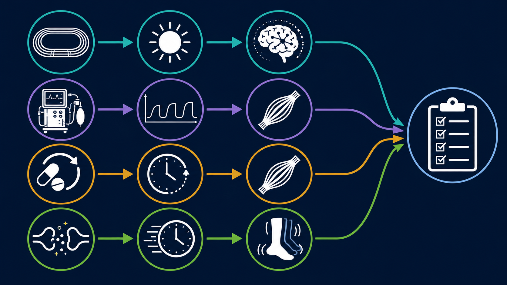
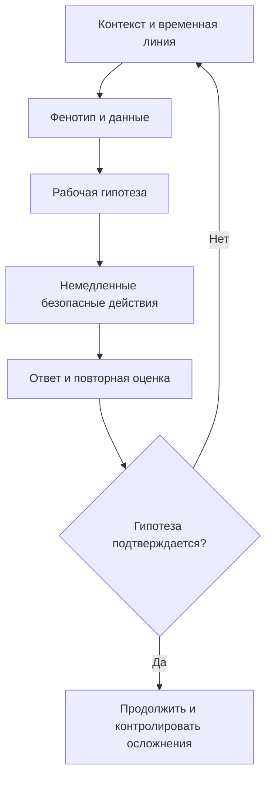

# Глава 14. Клинические случаи и разбор ситуаций

<!-- visual-summary:start -->
## Визуальный конспект главы

*Рисунок 1. Четыре линии рассуждения: контекст, темп, нервно-мышечный фенотип
и повторная проверка. Изображение сознательно не кодирует лечение.*

### Схема для запоминания

<!-- visual-summary:end -->
Теория мертва без практики. Ниже — четыре сценария; задача читателя мысленно, опираясь на предыдущие главы, ставить диагноз и принимать решения быстрее, чем это сделает текст.

## 14.1. Случай 1. Тепловой удар у марафонца

**Ситуация.** Мужчина 28–35 лет коллапсировал на финише марафона. Погода: +30…35 °C, влажность 70 %. Забег проходил в середине дня. Спортсмен был хорошо тренирован, но **не акклиматизирован**; пил воду, но недостаточно. За несколько километров до финиша ощутил головокружение и слабость, продолжил бег.

**Осмотр на месте.** Лежит, не реагирует на обращение (GCS = 7). Дыхание частое, хриплое. ЧСС 160, АД 90/50 (шок), ЧДД 36, SpO₂ 90 %. Кожа горячая («кипяток») и **профузно влажная**. Мышцы дряблые (flaccid). Зрачки нормальные. На месте развились генерализованные тонико-клонические судороги.

**Температура ректально: 41,5–41,8 °C.**

**Дифференциальный диагноз:**
- MH? — анестезии не было;
- НЗС? — нейролептиков нет, ригидности нет;
- серотониновый синдром? — нет миоклонуса и гиперрефлексии;
- менингит, энцефалит, инсульт? — менингеальных знаков и очаговой симптоматики нет;
- эпилепсия? — судороги явно связаны с гипертермией;
- гипогликемия? — проверяется немедленно и при наличии корректируется; высокая
  температура не отменяет параллельный поиск обратимых причин коллапса.

**Рабочий диагноз: тепловой удар при физической нагрузке (EHS).**

**Неотложная помощь:**
1. Вызвать экстренную помощь, выполнить ABCDE и немедленно начать охлаждение
   на месте.
2. Предпочтительно погружение в холодную воду с поддержкой головы, доступом к
   дыхательным путям, перемешиванием воды и непрерывной ректальной термометрией.
   Если оно невозможно — наиболее быстрый доступный метод всего тела.
3. Подать кислород по показаниям, получить внутривенный/внутрикостный доступ,
   проверить глюкозу.
4. Купировать продолжающиеся судороги бензодиазепином по протоколу.
5. При гипоперфузии вводить изотонический кристаллоид повторно оцениваемыми
   болюсами.
6. Координировать транспорт с охлаждением; жизненно важные вмешательства
   выполняются параллельно.

**В ОРИТ:** решение об интубации принимают по способности защищать дыхательные
пути, вентиляции, оксигенации и судорогам, а не по одной цифре GCS. Продолжают
серийный контроль органов; активное охлаждение при EHS обычно прекращают около
38,6–39,0 °C.

**Диагностика осложнений:** КФК > 100 000 Ед/л, K⁺ 6,0 ммоль/л, моча бурая → **рабдомиолиз, гиперкалиемия, ОПП**.
*Лечение:* титрованные кристаллоиды с контролем перегрузки, серийный калий,
креатинин, КОС, КФК и диурез. Гиперкалиемию лечат по ЭКГ и тяжести; рутинные
маннитол и ощелачивание для профилактики ОПП не показаны.

**Учебный исход.** После быстрого охлаждения судороги прекратились, сознание и
гемодинамика восстановились. Даже при раннем улучшении пациента наблюдают из-за
возможного отсроченного поражения печени, почек и коагуляции.

---

## 14.2. Случай 2. Злокачественная гипертермия в операционной

**Ситуация.** Мальчик 8 лет, масса 25 кг, плановая герниопластика. Отец умер во
время анестезии; этот факт не был передан анестезиологу до индукции и стал
важной системной ошибкой для последующего разбора.

**Анестезия:** индукция пропофолом и севофлураном, сукцинилхолин для интубации.

**Событие через 5–10 минут после интубации:**
- ЧСС выросла с 90 до 150 уд/мин;
- **EtCO₂ на капнографе «взлетел» с 35 до 70 мм рт. ст.** при неизменных параметрах ИВЛ;
- вентиляция затруднена — «мешок тугой»; ригидность жевательных мышц (тризм), затем генерализованная ригидность «как доска»;
- температура в пищеводе последовательно растёт: 36,8; 37,5; 38,0; 38,5 °C;
- аритмии на ЭКГ.

> [!IMPORTANT]
> **Ключевой момент: температура — поздний признак. Диагноз ставится по капнограмме и ригидности.**

**Дифференциальный диагноз:** недостаточная глубина анестезии («проснулся»)? — при этом EtCO₂ не поднимается до 70. Гипоксия? — SpO₂ 99 %. Перегрев в операционной? — при нём EtCO₂ был бы нормальным или низким, а мышцы дряблыми.

**Рабочий диагноз: злокачественная гипертермия.** Триада «тахикардия + гиперкапния + ригидность» на фоне севофлурана и сукцинилхолина, подкреплённая семейным анамнезом.

**Неотложная помощь — протокол MH:**
1. **Звать на помощь** — нужна «укладка MH» и минимум 5–6 человек.
2. **СТОП триггеры:** немедленно выключить севофлуран, вентилировать высоким
   потоком 100 % O₂ и увеличить минутную вентиляцию. Использовать подготовленный
   чистый аппарат или активированные угольные фильтры по локальному протоколу.
3. **Операция:** прекратить или завершить настолько быстро, насколько это
   безопасно; решение зависит от хирургической ситуации.
4. **Дантролен 2,5 мг/кг внутривенно немедленно** — для 25 кг это 62,5 мг.
   Повторять до клинического ответа; суммарная доза может превысить 10 мг/кг,
   одновременно пересматривая диагноз при отсутствии ответа.
5. **Охлаждение при гипертермии:** наружные методы и охлаждённый изотонический
   кристаллоид при показаниях; прекратить активное охлаждение ниже 38,5 °C.
   Лаваж мочевого пузыря не является рутинным методом.
6. **Коррекция осложнений:** серийные газы крови, калий, глюкоза, КФК,
   креатинин и коагуляция. Ацидоз и гиперкалиемию лечить по тяжести и
   педиатрическому протоколу, избегая непроверенных «универсальных» доз.

**Результат.** Температура снизилась с 39 до 38,5 °C за 30 минут, ригидность уменьшилась, гиперкапния разрешилась, гемодинамика стабилизировалась.

**Учебный исход.** После дантролена снижаются EtCO₂ и ригидность,
стабилизируются температура и калий. Пациента наблюдают в ОРИТ не менее 24 часов
по протоколу из-за риска рецидива. После выписки документируют эпизод и
направляют пациента/семью в центр MH для выбора генетического и контрактурного
обследования.

---

## 14.3. Случай 3. НЗС на фоне терапии антипсихотиками

**Ситуация.** Мужчина 35–45 лет с шизофренией доставлен в ОРИТ из психиатрического отделения.

**Анамнез со слов лечащего врача:** 10 дней назад терапия усилена — добавлен галоперидол, доза повышена с 5 до 10 мг дважды в сутки. Последние 3–4 дня пациент «заторможен», «скован», плохо ел, температура субфебрильная. Динамика по дням: 1–2-е сутки — ригидность в ногах и спине; 3–4-е — прогрессирование ригидности, тремор; 5-е — температура 38,5 °C, спутанность; 6-е — 39,5 °C и делирий. Сегодня утром перестал реагировать, T = 40 °C.

**Осмотр.** Выраженное нарушение сознания (GCS = 9). ЧСС 120, АД лабильное
160/100, ЧДД 28. Кожа бледная и мраморная, конечности холодные — требуется
оценка перфузии и шока. Потливость умеренная, гиперсаливация. Зрачки в норме.
При попытке согнуть руку — выраженная генерализованная ригидность типа
**«свинцовой трубы»**. Рефлексы снижены. Брадикинезия, тремор.

**Температура ректально 41,0 °C — при температуре кожи лба 37 °C.**

**Дифференциальный диагноз:**
- инфекция ЦНС или сепсис? — отсутствие менингеальных знаков и один уровень
  прокальцитонина не исключают инфекцию; посевы, визуализацию и люмбальную
  пункцию выполняют по показаниям параллельно с неотложной помощью;
- серотониновый синдром? — нет анамнеза СИОЗС, нет миоклонуса и гиперрефлексии (напротив, гипорефлексия), развитие медленное;
- MH? — анестезии не было, развитие не молниеносное.

**Рабочий диагноз: нейролептический злокачественный синдром.** Тетрада «гипертермия + „свинцовая“ ригидность + изменение сознания + вегетативная дисфункция» на фоне галоперидола при медленном развитии.

**Лаборатория:** КФК 80 000 Ед/л (в более лёгком варианте — 2000 Ед/л), лейкоцитоз 12 000/мкл, АСТ 100 Ед/л, АЛТ 80 Ед/л, моча бурая → рабдомиолиз.

**Неотложная помощь:**
1. **Отмена галоперидола.**
2. Начать контролируемое физическое охлаждение и одновременно оценивать/
   поддерживать перфузию; цвет кожи не является противопоказанием к охлаждению.
3. ABCDE; интубация — если пациент не защищает дыхательные пути, не
   оксигенируется/вентилируется или требуется контролируемая нейромышечная
   блокада. Инвазивные линии устанавливают по клинической необходимости.
4. Корректировать гиповолемию титрованными кристаллоидами; не использовать
   дротаверин как обязательный этап.
5. При тяжёлом/рефрактерном НЗС обсудить с токсикологом и психиатром
   бромокриптин, амантадин, дантролен или ЭСТ. КФК 80 000 Ед/л показывает
   тяжёлое мышечное повреждение, но сама по себе не выбирает препарат.
6. При рабдомиолизе — серийный контроль калия, КОС, КФК, креатинина и диуреза,
   титрованная жидкость без рутинного маннитола/ощелачивания.

**Учебный исход.** После отмены триггера, охлаждения и интенсивной поддержки
температура и ригидность постепенно уменьшаются, но восстановление может занять
дни или недели. Решение о повторном назначении антипсихотика принимает психиатр
после полного разрешения эпизода; начинают позже, с низкой дозы и медленной
титрацией. Эпизод документируют.

---

## 14.4. Случай 4. Серотониновый синдром при полипрагмазии

**Ситуация.** Женщина 45–50 лет; вызов скорой помощи: «неадекватна, трясёт, жар».

**Анамнез со слов мужа:** лечится от депрессии, принимает флуоксетин (в другом варианте — сертралин 100 мг/сут). Накануне «защемило спину», приняла **трамадол** 100 мг. Через 2–4 часа после приёма стала «странной», возбуждённой, пожаловалась на диарею, затем «начало трясти».

**Осмотр.** Выраженное психомоторное возбуждение, дезориентация, тревога. ЧСС 120–140, АД 150/90. Кожа **красная, горячая, профузно влажная**. **Мидриаз.** **Гиперрефлексия** — коленные рефлексы «взлетают». Спонтанный **миоклонус** в ногах, клонус, тремор. Диарея.

**Температура ректально 38,5–40,5 °C.**

**Дифференциальный диагноз:**
- НЗС? — нейролептиков нет, развитие быстрое, вместо гипорефлексии — гиперрефлексия, вместо «свинцовой» ригидности — миоклонус;
- отравление стимуляторами? — картина похожа, но при симпатомиметическом токсидроме нет миоклонуса и гиперрефлексии; выполняется токсикологический скрининг;
- антихолинергический синдром? — исключается по влажной коже и диарее (там «сухой как кость» и атония кишечника).

**Рабочий диагноз: серотониновый синдром** по критериям Hunter —
серотонинергическая экспозиция плюс спонтанный клонус. Возбуждение, потливость,
диарея и гиперрефлексия усиливают клиническую уверенность.

**Неотложная помощь:**
1. **Немедленная отмена флуоксетина/сертралина и трамадола.**
2. Начать наружное охлаждение; тепло создаёт мышечная гиперактивность, поэтому
   её подавление столь же важно.
3. ABCDE и титрованная жидкость при гиповолемии.
4. **Бензодиазепины** — первая линия для возбуждения и мышечной активности.
   При жизнеугрожающей гипертермии и тяжёлой ригидности может потребоваться
   интубация и недеполяризующая нейромышечная блокада; физические фиксаторы
   усиливают мышечную работу.
5. При сохраняющемся умеренном/тяжёлом синдроме можно рассмотреть энтеральный
   **ципрогептадин** как дополнение, а не замену интенсивной поддержки.
6. Мониторировать температуру, гемодинамику, КФК, почки, КОС и электролиты.

**Учебный исход.** После прекращения причинных препаратов и контроля мышечной
активности состояние улучшается. Срок зависит от периода полувыведения и
осложнений. Комбинацию, вызвавшую эпизод, отмечают в документации; будущую
психофармакотерапию пересматривают совместно с лечащим врачом.

---

## 14.5. Разбор: контрольные вопросы

*Рисунок 2. Дебрифинг отделяет наблюдение от предположения, восстанавливает
временную линию, ищет системные причины и возвращает выводы в тренировку.*

**Вопрос 1.** Пациент в ОРИТ: T = 40,5 °C, нарушение сознания, кожа бледная и
холодная. Ваши первые действия?
*Ответ:* ABCDE, надёжное измерение температуры ядра, немедленное эффективное
охлаждение и параллельная оценка/поддержка перфузии. Цвет кожи не является
противопоказанием к наружному охлаждению.

**Вопрос 2.** В чём разница между ригидностью при НЗС и мышечной гиперактивностью при СС?
*Ответ:* НЗС — «свинцовая труба», генерализованная пластическая ригидность, гипорефлексия, медленное развитие. СС — «дёрганый» пациент: миоклонус, гиперрефлексия, клонус, быстрое развитие.

**Вопрос 3.** В операционной EtCO₂ = 75 мм рт. ст., температура ещё 37,2 °C. Диагноз и действие?
*Ответ:* ранняя MH. Немедленно прекратить подачу анестетика и вводить дантролен. **Ждать роста температуры нельзя.**

**Вопрос 4.** Как отличить гипертермию от лихорадки?
*Ответ:* при лихорадке уставка сдвинута вверх, при гипертермии тепло накапливается
без такого сдвига. Ответ на антипиретик не является надёжным диагностическим
тестом; при подозрении на тепловой удар не откладывают охлаждение.

**Вопрос 5.** Пациент с T = 39 °C, мышечной ригидностью и делирием: как отличить НЗС от менингита?
*Ответ:* временная связь с антипсихотиком и «свинцовая» ригидность поддерживают
НЗС, но отсутствие менингеальных знаков не исключает инфекцию. Исследования на
инфекцию и неврологические причины проводят по показаниям параллельно; КФК
неспецифична.

**Вопрос 6.** Пациент 35 лет: T = 40,5 °C, нарушение сознания, судороги, накануне участвовал в марафоне в жару. Диагноз и лечение?
*Ответ:* тепловой удар. Немедленное охлаждение (погружение в холодную воду, испарительное охлаждение), инфузионная терапия, диазепам для купирования судорог, далее контроль рабдомиолиза и калия.

---

## Выводы по главе 14

**Алгоритмы работают.** Четыре совершенно разных пациента, у всех — гипертермический синдром, но потребовались четыре принципиально разных лечебных подхода, определённых дифференциальной диагностикой.

**Контекст формирует гипотезу.** Анестезия, антипсихотик, сочетание
серотонинергических препаратов или нагрузка в жару резко меняют вероятность
диагнозов, но не отменяют поиск конкурирующих причин.

**Фенотип проверяет гипотезу.** Ригидность, клонус, рефлексы, влажность кожи,
темп развития и ответ на первые действия полезны в совокупности, но редко
подтверждают диагноз по отдельности.

**Специфичность различается.** Дантролен обязателен при MH; бромокриптин и
ципрогептадин — возможные дополнения при отдельных тяжёлых случаях НЗС и
серотонинового синдрома, но не заменяют поддержку.

**Перфузия не конкурирует с охлаждением.** При тяжёлой гипертермии эффективное
охлаждение и лечение шока выполняют параллельно независимо от цвета кожи.

**Переход.** Пройден весь путь — от определения до прогноза и практики. Остаётся подвести итоги и зафиксировать то, что должно остаться с врачом на всю профессиональную жизнь.

<!-- chapter-nav:start -->

---

[← Предыдущая глава](13-sovremennye-issledovaniya.md) · [Оглавление](../README.md#оглавление) · [Следующая глава →](15-kontrol-znaniy-i-zaklyuchenie.md)

<!-- chapter-nav:end -->
