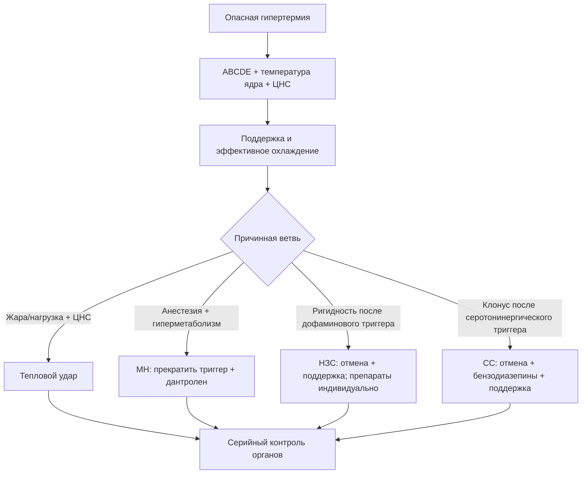

# Глава 15. Контроль знаний и заключение

<!-- visual-summary:start -->

*Рисунок 1. Итоговое клиническое заключение: 10 заповедей реаниматолога при ведении гипертермического синдрома (свод аксиом по стандартам ERC, ВОЗ и Минздрава РФ).*

### Схема для запоминания

<!-- visual-summary:end -->
## 15.1. Ключевые положения для клинической практики

### 15.1.1. Основные тезисы — то, что нужно запомнить навсегда

1. **Лихорадка ≠ гипертермия.** Лихорадка — контролируемый сдвиг «термостата» гипоталамуса вверх, опосредованный PGE₂. Гипертермия — неконтролируемый срыв терморегуляции при нормальной установочной точке.

2. **Антипиретики не работают при истинной гипертермии** (MH, НЗС, серотониновый синдром, тепловой удар) и могут быть вредны: гепатотоксичность парацетамола, нефротоксичность и усиление коагулопатии от НПВС.

3. **Тяжёлая гипертермия смертельно опасна, но не определяется одной цифрой.**
   При тепловой экспозиции нарушение сознания означает тепловой удар независимо
   от того, успели ли измерить температуру выше 40 °C.

4. **Тепловая доза = температура × время.** Риск органного повреждения растёт
   с интенсивностью и длительностью перегрева, но универсального порога
   необратимости или фиксированного процента летальности за час нет.

5. **Диагностика в первые минуты — клиническая.** Анамнез (контекст!) и физикальный осмотр (ригидность? миоклонус? пот? зрачки?) важнее лаборатории.

6. **Охлаждение и перфузия — параллельно.** Цвет кожи помогает заметить шок, но
   не задаёт отдельный «красный/белый» алгоритм и не является основанием
   откладывать наружное охлаждение ради спазмолитика.

7. **Различать специфичность лечения:** при MH дантролен обязателен; при НЗС
   основа — отмена триггера и интенсивная поддержка, дополнительные препараты
   индивидуальны; при серотониновом синдроме основа — отмена триггера,
   бензодиазепины и контроль мышечной активности, ципрогептадин возможен как
   энтеральное дополнение.

8. **Мультидисциплинарный подход.** Лечение ГС — командная работа реаниматолога, анестезиолога, невролога, нефролога, психиатра, опирающаяся на заранее утверждённые протоколы (SOP) и укладки.

9. **Понимание патофизиологии — инструмент:** оно объясняет, почему при MH
   ранним сигналом служит необъяснимый рост CO₂, при рабдомиолизе важны калий,
   почки и объёмный статус, а при мраморности нужно лечить шок, не задерживая
   охлаждение.

### 15.1.2. Итоговый алгоритм при подозрении на опасную гипертермию

1. **Позвать на помощь** — реанимационная бригада, «Hyperthermia Team».
2. **ABCDE:** обеспечить дыхательные пути/вентиляцию по клиническим показаниям,
   мониторировать ЭКГ, АД и SpO₂; при ИВЛ — EtCO₂.
3. **Надёжно измерить температуру ядра:** при полевом подозрении на тепловой
   удар — ректально; в операционной/ОРИТ — валидированным центральным способом.
4. **Устранить причину:** стоп ингаляционный анестетик, стоп нейролептик или серотонинергический препарат, эвакуация из жаркой среды, купирование судорог.
5. **Начать самый быстрый показанный метод охлаждения,** одновременно оценивая
   и поддерживая перфузию.
6. **Взять кровь и мочу:** электролиты, глюкоза, КОС/лактат, креатинин, КФК,
   печёночные показатели, общий анализ крови и коагуляцию; инфекционные
   исследования — по контексту. Один прокальцитонин не исключает сепсис.
7. **Применить специфическую терапию,** когда она существует: при MH —
   дантролен без задержки.
8. **Лечить осложнения:** гиперкалиемию, шок, судороги, коагулопатию и органную
   недостаточность. При рабдомиолизе — титрованная жидкость и мониторинг без
   рутинного маннитола/ощелачивания.
9. **Остановить активное охлаждение по причинному протоколу:** около
   38,6–39,0 °C при EHS и ниже 38,5 °C при MH.
10. **Госпитализация в ОРИТ** для мониторинга и лечения полиорганной недостаточности.

---

## 15.2. Вопросы для самопроверки

**1. Как отличить лихорадку от гипертермии?**

Показать ответ

По механизму — регулируемый сдвиг установочной точки против накопления тепла
без такого сдвига. Контекст, экспозиция, лекарства и мышечный фенотип важнее
одного симптома. Озноб, пот и цифра температуры перекрываются, а ответ на
антипиретик не является диагностическим тестом.

**2. Ключевые различия НЗС и серотонинового синдрома.**

Показать ответ

Анамнез: блокада дофамина/отмена дофаминергического препарата против
серотонинергической экспозиции. НЗС обычно развивается медленнее и даёт
генерализованную «свинцовую» ригидность; при серотониновом синдроме характернее
гиперрефлексия и клонус, особенно в ногах. КФК и вегетативные симптомы
перекрываются. В обоих случаях сначала отменяют триггер и поддерживают органы;
фармакологические дополнения различаются и не заменяют эти действия.

**3. Почему дантролен эффективен при MH?**

Показать ответ

Он блокирует дефектный рианодиновый рецептор RYR1 в саркоплазматическом ретикулуме, прекращая патологическое высвобождение Ca²⁺ в цитоплазму. Прекращается ригидность, останавливается гиперметаболизм, прекращается теплопродукция — препарат «тушит пожар» непосредственно в мышце.

**4. Какие меры охлаждения наиболее эффективны при тепловом ударе?**

Показать ответ

При тепловом ударе на нагрузке — погружение в холодную воду при сохранённом
доступе к дыхательным путям и мониторингу. Если оно невозможно — наиболее
быстрый доступный метод всего тела, например испарительно-конвективный.
Отдельные пакеты со льдом и охлаждённая жидкость — дополнения, а
экстракорпоральную поддержку начинают по самостоятельным органным показаниям,
не как рутинную следующую ступень охлаждения.

**5. Какие исследования обязательны при подозрении на ГС?**

Показать ответ

*У постели:* при полевом подозрении на тепловой удар — ректальная температура;
ЭКГ, глюкоза, при ИВЛ — EtCO₂, КОС с лактатом.
*Лаборатория:* КФК, электролиты, креатинин, АСТ/АЛТ и билирубин, коагуляция и
общий анализ крови. Анализ мочи помогает заподозрить пигментурию, но не заменяет
клиническую оценку. Посевы и другие исследования инфекции назначают по
контексту; прокальцитонин не разделяет надёжно сепсис и тепловой удар.

---

## 15.3. Тестовые задания

**Вопрос 1.** Какой признак при тепловой экспозиции наиболее важен для
клинического распознавания теплового удара?

A) сухая кожа  B) дисфункция ЦНС  C) КФК > 1000 Ед/л  D) отсутствие озноба

Ответ

**B) дисфункция ЦНС**

*Комментарий:* температура ядра обычно высока, но могла снизиться до измерения;
изменение сознания на фоне тепловой нагрузки требует немедленного охлаждения.

**Вопрос 2.** Какой препарат является специфическим антидотом при злокачественной гипертермии?

A) Парацетамол  B) Дантролен  C) Диазепам  D) Ципрогептадин

Ответ

**B) Дантролен**

**Вопрос 3.** Что означает мраморность и холодные конечности при тяжёлой
гипертермии?

A) запрет наружного охлаждения
B) показание к дротаверину
C) необходимость оценить шок и продолжать показанное охлаждение
D) доказательство НЗС

Ответ

**C) необходимость оценить шок и продолжать показанное охлаждение**

**Вопрос 4.** Какова роль бикарбоната и маннитола при рабдомиолизе?

A) обязательны всем  B) заменяют кристаллоиды
C) рутинно не рекомендуются для профилактики ОПП  D) назначаются по цвету мочи

Ответ

**C) рутинно не рекомендуются для профилактики ОПП**

**Вопрос 5.** Что является первой фармакологической линией для возбуждения и
мышечной гиперактивности при серотониновом синдроме?

A) бензодиазепин  B) бромокриптин  C) парацетамол  D) аспирин

Ответ

**A) бензодиазепин**

**Задание на соответствие.** Сопоставьте синдромы и характеристики:
1. Злокачественная гипертермия — 2. НЗС — 3. Серотониновый синдром
A) быстрое развитие (часы), миоклонус, диарея;
B) развивается при анестезии, гиперкапния, молниеносное течение;
C) постепенное развитие (дни–недели), «свинцовая» ригидность, делирий.

Ответ

**1 — B, 2 — C, 3 — A.**

---

## 15.4. Клинические задачи

**Задача 1.** 70-летняя женщина с ХСН, принимает диуретики. Третий день волны жары. Доставлена в коме: T_рект = 41,2 °C, ЧСС 130, АД 80/40. Кожа красная и сухая, мышцы дряблые.

Показать разбор

*Диагноз:* классический (ненагрузочный) тепловой удар с шоком.

*Первые действия:* ABCDE; немедленное испарительно-конвективное или другое
эффективное охлаждение всего тела; кислород и защита дыхательных путей по
показаниям; небольшие повторно оцениваемые болюсы кристаллоида с учётом ХСН.
Далее — серийный контроль электролитов, почек, печени, КФК и коагуляции.

**Задача 2.** Пациент 40 лет в операционной (севофлуран, сукцинилхолин). Через 15 минут: тахикардия 150 уд/мин, мышечная ригидность, гиперкапния (EtCO₂ 70 мм рт. ст.), T = 39 °C.

Показать разбор

*Диагноз:* злокачественная гипертермия.

*Неотложные мероприятия:* 1) немедленно прекратить триггеры, вентилировать
высоким потоком 100 % кислорода и увеличить минутную вентиляцию; 2) дантролен
2,5 мг/кг внутривенно с повторами до ответа; 3) охлаждать, если температура
повышена, и прекратить активное охлаждение ниже 38,5 °C.

*Исследования:* КФК, калий, креатинин, коагулограмма, газы крови и КОС, миоглобин мочи.

**Задача 3.** Пациент 50 лет: T = 41 °C, нарушение сознания, судороги; принимает галоперидол 10 мг дважды в сутки в течение двух недель. При осмотре — мышечная ригидность, тремор, гиперсаливация.

Показать разбор

*Диагноз:* нейролептический злокачественный синдром.

*Исследования:* КФК, электролиты, функция почек, коагулограмма, общий анализ крови, миоглобин мочи.

*Лечение:* немедленно отменить галоперидол; выполнить ABCDE, начать показанное
физическое охлаждение, контролировать мышечную активность и осложнения,
титровать жидкость по перфузии. При тяжёлом/рефрактерном течении совместно с
токсикологом и психиатром рассматривают бромокриптин, амантадин, дантролен или
ЭСТ; доказательства ограничены. Маннитол и бикарбонат для профилактики ОПП
рутинно не назначают.

*Рисунок 2. Контроль знаний эффективнее как цикл: проверка, сравнение синдромов,
ветвящийся сценарий, командная симуляция, обратная связь и повторение.*

---

## 15.5. Рекомендуемая литература и ресурсы

### Базовые руководства

*Международные:*
- **Harrison's Principles of Internal Medicine** — глава «Fever and Hyperthermia»;
- **Tintinalli's Emergency Medicine** — глава «Heat Emergencies»;
- **Miller's Anesthesia** — глава «Malignant Hyperthermia».

*Отечественные:* профильные руководства по анестезиологии-реаниматологии и интенсивной терапии (в частности, издания под редакцией А. А. Бунятяна и В. М. Мизикова, Б. Р. Гельфанда). Библиографические данные конкретных изданий следует уточнять по каталогам библиотек: в исходных материалах часть выходных сведений приведена неточно.

### Клинические рекомендации и протоколы

- **MHAUS** — протокол ведения криза MH, подготовка оборудования и доступность
  дантролена;
- **EMHG** — европейские рекомендации по распознаванию и лечению MH;
- рекомендации **ACSM**, **NATA**, **Wilderness Medical Society** по тепловому удару при нагрузке, включая принцип «cool first, transport second»;
- рекомендации **ERC** по реанимации.

Проверенные ссылки, DOI и дата аудита собраны в
[файле источников](../ИСТОЧНИКИ.md).

### Онлайн-ресурсы

- **PubMed** и **PubMed Central** — поиск по ключевым словам *heat stroke*, *malignant hyperthermia*, *neuroleptic malignant syndrome*, *serotonin syndrome*;
- **Cochrane Library** — систематические обзоры и метаанализы;
- **UpToDate** — обзорные статьи по всем формам ГС;
- **Google Scholar** — поиск публикаций и цитирований;
- образовательные платформы (Coursera, edX) — курсы по интенсивной терапии и анестезиологии.

---

## Заключительные замечания

Гипертермический синдром — одна из тех драматических патологий, где отточенные знания и скорость реакции врача имеют абсолютное значение. Это не хроническая сердечная недостаточность, развивающаяся годами: здесь в распоряжении врача — минуты.

Нужно **увидеть** различия между клонусом при серотониновом синдроме,
генерализованной ригидностью при НЗС, дисфункцией ЦНС после тепловой экспозиции
и необъяснимым ростом EtCO₂ при MH. Но ни влажность кожи, ни один лабораторный
маркер не должны подменять контекст и повторную оценку.

Ключевые моменты, которые следует унести из этого курса:

- гипертермия — это **срыв механизмов терморегуляции**, а не просто высокая цифра на термометре;
- отличие от лихорадки определяет выбор лечения: физическое охлаждение против антипиретиков;
- охлаждение нельзя откладывать ради окончательного диагноза; фиксированной
  формулы прироста летальности за час нет;
- специфическая терапия зависит от этиологии, а лаборатория помогает оценить
  осложнения и конкурирующие диагнозы;
- профилактика — от сбора анамнеза перед наркозом до правил поведения в жару — снижает летальность сильнее, чем любая реанимационная техника.

> [!TIP]
> **Запомните: лихорадку мы лечим. Гипертермический синдром мы спасаем — и спасаем немедленно.**

<!-- chapter-nav:start -->

---

[← Предыдущая глава](14-klinicheskie-sluchai.md) · [Оглавление](../README.md#оглавление)

<!-- chapter-nav:end -->

### 15.5. Аккредитационный блиц-тест (MCQ) по стандартам ERC 2025, ВОЗ и Минздрава РФ

1. **Почему антипиретики (Парацетамол, НПВС, Метамизол) противопоказаны при истинном тепловом ударе?**
   - А) Они вызывают аллергические реакции в жару
   - Б) **При тепловом ударе гипоталамическая установочная точка нормальна (нет синтеза ПГE2), а антипиретики усиливают риск фатального некроза печени и ОПН** *(Правильный ответ)*
   - В) Они слишком быстро снижают температуру

2. **Какова начальная доза специфического антидота Дантролена при злокачественной гипертермии?**
   - А) 1 мг/кг внутрь
   - Б) **2,5 мг/кг внутривенно болюсно (с повтором до 10 мг/кг)** *(Правильный ответ)*
   - В) 15 мг/кг внутривенно капельно

3. **При какой температуре ядра тела необходимо прекратить активное физическое охлаждение при тепловом ударе?**
   - А) 36,6 °C
   - Б) 37,5 °C
   - В) **38,5 °C (для предотвращения гипотермического перелета и озноба)** *(Правильный ответ)*

4. **Каков золотой стандарт охлаждения при нагрузочном тепловом ударе (ERC 2025 / ANZCOR)?**
   - А) Обтирание спиртом и обдув
   - Б) **Погружение по шею в ванну с ледяной/холодной водой (Cold-Water Immersion, CWI, 1–26 °C)** *(Правильный ответ)*
   - В) Внутривенное введение охлажденного 5% раствора глюкозы

5. **Какой препарат является обязательным первым шагом при «белой» лихорадке у детей перед антипиретиками (Минздрав РФ)?**
   - А) Диазепам
   - Б) **Папаверин 2% или Дротаверин 2% (0,1 мл/год жизни) для устранения спазма периферических сосудов** *(Правильный ответ)*
   - В) Ибупрофен перорально

### 15.6. Сложные клинические ситуационные задачи для самоконтроля ординаторов и врачей ОРИТ

#### Задача 1. Дифференциация серотонинового синдрома и НЗС в ОРИТ
**Условие:** Пациент 42 лет с тяжелой депрессией (прием сертралина 100 мг/сут) поступил в ОРИТ по поводу послеоперационного делирия, в связи с чем ему было введено 5 мг галоперидола в/в. Через 6 часов отмечено повышение температуры тела до 40,2 °C, тахикардия 135 уд/мин, АД 170/100 мм рт. ст., профузный пот. При неврологическом осмотре: выраженный клонус стоп и надколенника, мышечная ригидность преимущественно в нижних конечностях, гиперрефлексия.  
**Вопросы:**  
1. Какой синдром развился у пациента: НЗС (на галоперидол) или Серотониновый синдром? Каков главный дифференциально-диагностический признак?  
2. Какова неотложная фармакотерапевтическая тактика?  
**Эталон ответа:**  
1. У пациента развился **Серотониновый синдром** средней/тяжелой степени. Ключевые отличия от НЗС — **выраженная гиперрефлексия и спонтанный клонус стоп/надколенника** (при НЗС рефлексы нормальные или снижены, а ригидность имеет характер «свинцовой трубы» без клонуса), а также быстрый темп развития (< 24 ч).  
2. Тактика: Немедленная отмена сертралина и галоперидола. Седация титрованием **бензодиазепинов (Диазепам 5–10 мг в/в)**. Введение специфического серотонинового антагониста **Ципрогептадина (Перитола)** 12 мг внутрь/через зонд, далее по 2 мг каждые 2 часа до купирования симптомов. При неэффективности — перевод на ИВЛ с недеполяризующими миорелаксантами и физическое охлаждение.

#### Задача 2. Антихолинергический токсидром и ограничения физостигмина
**Условие:** Девушка 19 лет доставлена бригадой СМП с температурой 39,8 °C, резким психомоторным возбуждением, зрительными галлюцинациями. Кожа красная, сухая, горячая (ангидроз), зрачки широкие, фотореакция вялая, ЧСС 140 уд/мин, АД 110/70 мм рт. ст. На ЭКГ: синусовая тахикардия, QRS = 88 мс. В кармане обнаружена пустая упаковка таблеток амитриптилина и дифенгидрамина (димедрола).  
**Вопросы:**  
1. Какой токсидром имеет место?  
2. Полагается ли введение специфического антидота Физостигмина в данном случае?  
**Эталон ответа:**  
1. Классический **Антихолинергический токсидром** («сухой, красный, горячий, безумный»).  
2. Введение **Физостигмина (Physostigmine)** при сопутствующей интоксикации трициклическими антидепрессантами (ТЦА — амитриптилин) **относительно или абсолютно противопоказано**, так как физостигмин на фоне ТЦА может спровоцировать жизнеугрожающую асистолию, АВ-блокаду и судорожный статус. Основа терапии: физическое охлаждение, седация бензодиазепинами, инфузия изотонических кристаллоидов и мониторинг ЭКГ (при расширении QRS > 100 мс — гидрокарбонат натрия).
